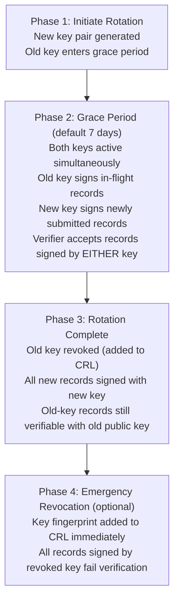

# DoLogger Operations & Security Guide

> **Version**: v0.1.0 | **Last Updated**: 2026-08-12 | **Target Audience**: SRE, Operations Engineers, Security Engineers, Compliance Officers
>
> **Purpose**: Production deployment, monitoring, key management, audit verification, incident response, and compliance configuration for DoLogger. This is the operations manual for running DoLogger in production environments.
>
> 🌐 **语言 / Language**: [English](OperationsAndSecurity.md) | [中文：运维手册 + 安全白皮书](../zh_CN/guides/)
>
> **Reading Path**: SREs should start with [Deployment Modes](#deployment-modes) and [Monitoring](#monitoring). Security engineers should focus on [Key Management](#key-management) and [Audit Verification](#audit-verification). For the underlying architecture, see the [Architecture Reference](ArchitectureReference.md).

---

## Table of Contents

1. [Before You Start](#before-you-start)
2. [Deployment Modes](#deployment-modes)
3. [Monitoring](#monitoring)
4. [Key Management](#key-management)
5. [Audit Verification](#audit-verification)
6. [Incident Response Runbooks](#incident-response-runbooks)
7. [Compliance Configuration](#compliance-configuration)
8. [Sandbox Configuration Per Trust Level](#sandbox-configuration-per-trust-level)
9. [Performance Regression Detection](#performance-regression-detection)

---

## Before You Start

### Prerequisites

- DoLogger engine built and installed (see [Quick Start Guide](QuickStart.md))
- The `dologctl` CLI tool available on your PATH
- Root or sudo access for system-wide installation
- Understanding of the [Architecture Reference](ArchitectureReference.md) for internals
- For compliance deployments: access to the `compliance/` template directory

### Filesystem Layout

**Linux:**

(illustrative layout):

```
/etc/dologger/
  default.toml                       # System-wide configuration
  conf.d/                            # Drop-in fragments (merged alphabetically)
    10-sinks.toml
    20-plugins.toml

/usr/lib/dologger/
  plugins/                           # System plugin directory
  libdologger_core.so                # Core engine shared library

/var/log/dologger/                   # Log output
  app.log                            # Current file
  app.2026-08-12.log.zst             # Rotated and compressed

/var/lib/dologger/
  audit/                             # WORM audit logs
    audit-000001.worm
    audit-000002.worm
  state/                             # Engine state (LSN cursor, etc.)

/dev/shm/
  dologger_<name>.shm                # Shared memory (sidecar mode)

/run/dologger/
  dologger.pid                       # PID file (daemon mode)
  control.sock                       # Unix domain socket (daemon mode)
```

**Windows:**

(illustrative layout):

```
%PROGRAMDATA%\dologger\
  default.toml
  conf.d\

%PROGRAMFILES%\dologger\
  plugins\
  dologger_core.dll

%LOCALAPPDATA%\dologger\
  logs\
  audit\
```

---

## Deployment Modes

### Mode Comparison

| Mode | Description | Latency | Isolation | Use Case |
|:-:|:-:|:-:|:-:|:-:|
| **Embedded** | `libdologger_core` linked directly into host process | Lowest (102 ns P50) | Shared address space | Single-process services, Rust/C applications |
| **Sidecar** | Independent process, logs received via `sink_shm` shared memory | Low (~1 us) | Process isolation | Polyglot microservices, fault isolation |
| **Daemon** | System-level service, local socket or shared memory | Moderate | Process isolation | Legacy applications, system-wide collection |

### Embedded Deployment

```bash
# Build the engine
cargo build --release

# Link into your application
cc -o myapp myapp.c -ldologger_core -L./target/release

# Run with project-local config
DO_LOG_CONFIG_FILE=./dologger.toml ./myapp
```

### Sidecar Deployment

```bash
# Start the sidecar process (illustrative — the long-running sidecar mode lands
# in M3; today dologctl run supports --dry-run and --trace only)
dologctl run --config /etc/dologger/sidecar.toml --mode sidecar &

# Configure host applications to use sink_shm
```

Sidecar configuration (field names follow `ShmSinkConfig` in `core/src/sink/shm.rs`):

```toml
[dologger]
performance_profile = "prod-performance"

[sinks.shm]
type = "sink_shm"
enabled = true
path = "dologger_app"
input_format = "sif"
buffer_size_mb = 100        # 100 MB
slot_size_kb = 256
full_policy = "drop_oldest" # What to do when SHM is full
```

### Daemon Deployment

Install as a system service:

**Linux (systemd):**

(illustrative unit file — engine daemon mode lands in M3; `dologctl run` currently supports `--dry-run` and `--trace` only):

```ini
# /etc/systemd/system/dologger.service
[Unit]
Description=DoLogger Logging Engine
After=network.target

[Service]
Type=simple
ExecStart=/usr/local/bin/dologctl run --config /etc/dologger/default.toml
Restart=on-failure
RestartSec=5
User=dologger
Group=dologger
LimitNOFILE=65536
LimitMEMLOCK=268435456
CPUAffinity=2-3

[Install]
WantedBy=multi-user.target
```

```bash
sudo systemctl enable dologger
sudo systemctl start dologger
sudo systemctl status dologger
```

---

## Monitoring

### Sysmon Event Stream

The System Monitor emits structured JSON events to `stderr` (or configurable output):

```json
{"sysmon_version":"1.0","error_code":0,"category":"engine","description":"Engine initialized: ring_size=65536, coop_helping=false","timestamp_ms":1786561656221,"severity":1}
```

### Sysmon Event Types

| Event | Level | Meaning | Action Required |
|:-:|:-:|:-:|:-:|
| `PIPELINE_BACKLOG` | WARN | Ring buffer >50% full | Monitor trend; consider increasing `ring_buffer_size` |
| `PIPELINE_DROP` | WARN | Records dropped (buffer full) | Investigate sink health; increase capacity |
| `SHM_DROP` | WARN | Shared memory sink dropped records | Verify consumer process is alive |
| `SINK_CIRCUIT_OPEN` | ERROR | Remote sink unavailable | Check downstream service; auto-resets after 30s |
| `SINK_CIRCUIT_CLOSED` | INFO | Remote sink recovered | Confirm in monitoring dashboard |
| `EMERGENCY_BUFFER` | WARN | Spill buffer activated (>=95% full) | Ring buffer overflow; records on disk |
| `EMERGENCY_RECOVERED` | INFO | Spill buffer drained | System recovered |
| `SANDBOX_VIOLATION` | CRITICAL | Plugin attempted disallowed syscall | Plugin terminated; investigate immediately |
| `SIGNATURE_FAILURE` | CRITICAL | Ed25519 verification failed | Possible log tampering; initiate incident response |
| `LSN_GAP_DETECTED` | ERROR | Missing records in audit chain | Run `dologctl verify-log` |
| `CONFIG_RELOAD` | INFO | Configuration reloaded | Verify expected changes took effect |
| `CONFIG_RELOAD_DENIED` | WARN | Reload rejected (non-downgradable item) | Check for security policy violation |
| `LICENSE_POLICY_VIOLATION` | ERROR | Plugin rejected (incompatible license) | Review plugin SPDX |

### Control Plane API

The control plane provides a lightweight HTTP API for runtime management:

| Method | Path | Auth | Description |
|:-:|:-:|:-:|:-:|
| GET | `/status` | None | Engine status and metrics |
| GET | `/health` | None | Liveness check (200 = alive) *(planned)* |
| POST | `/level` | None | Set log level dynamically |
| POST | `/reload` | None | Trigger configuration reload |

### Health Check

```bash
# (illustrative — /health endpoint is planned; /status exists today)
curl -s http://127.0.0.1:9090/health
# HTTP 200 OK
```

### Status Endpoint

```bash
curl -s http://127.0.0.1:9090/status | jq .
```

```json
{"status":"ok","level":"INFO","profile":"prod-performance","plugins":0,"signature_enabled":false}
```

The response is deliberately minimal today; richer metrics (uptime, ring buffer statistics, per-sink health, pipeline counters) are planned for M4.

### Alerting Thresholds

| Metric | Warning | Critical | Alert Channel |
|:-:|:-:|:-:|:-:|
| Ring buffer utilization | > 80% | > 90% | Slack #sre |
| Drop rate | > 0.01% | > 0.1% | PagerDuty warning |
| Sink write latency | > 10 ms | > 100 ms | Slack #sre |
| Circuit breaker trips/hour | > 1 | > 3 | PagerDuty warning |
| Signature failures | > 0 (any) | > 0 (any) | **PagerDuty critical** |
| Sandbox violations | > 0 (any) | > 0 (any) | **PagerDuty critical** |
| LSN gaps | > 0 (any) | > 0 (any) | **PagerDuty critical** |

### Dynamic Log Level Adjustment

```bash
# Increase verbosity for debugging (temporary)
curl -X POST http://127.0.0.1:9090/level \
  -H "Content-Type: application/json" \
  -d '{"level": "DEBUG"}'

# Restore production level
curl -X POST http://127.0.0.1:9090/level \
  -H "Content-Type: application/json" \
  -d '{"level": "INFO"}'

# Lock the level (disable runtime changes)
export DO_LOG_CONFIG_LOCK=1
```

### Hot Reload

```bash
# Edit the config file
vim /etc/dologger/default.toml

# Trigger immediate reload
curl -X POST http://127.0.0.1:9090/reload

# Dry-run first (planned — the reload endpoint ignores the request body today)
curl -X POST http://127.0.0.1:9090/reload \
  -H "Content-Type: application/json" \
  -d '{"dry_run": true}'
```

### Control Plane Security

- Binds to `127.0.0.1:9090` by default (localhost only)
- M4 will add mTLS + JWT authentication for remote access
- Production: use host firewall to restrict access

```bash
# iptables: restrict control plane to localhost
sudo iptables -A INPUT -p tcp --dport 9090 -s 127.0.0.1 -j ACCEPT
sudo iptables -A INPUT -p tcp --dport 9090 -j DROP
```

---

## Key Management

### Key Types

| Key Type | Description | Managed By |
|:-:|:-:|:-:|
| Signing key | Ed25519 private key for log record signing | `KeyProvider` plugin |
| Verification key | Ed25519 public key for signature verification | Distributed with logs |
| Root key | DoLogger team key for Blue plugin signing | Compiled into engine |

### Default (Ephemeral) Keys

In the default configuration without a `KeyProvider` plugin:
- A random Ed25519 key pair is generated in memory at startup
- Keys are **never written to disk**
- Restarting the engine generates a new key, invalidating all previous signatures
- Suitable for development only

### Production Key Management

For production, deploy a `KeyProvider` plugin that provides persistent key storage:

```toml
[plugins.key-file]
type = "key_provider"
path = "/usr/lib/dologger/plugins/libkey_file.so"

[plugins.key-file.config]
path = "/etc/dologger/signing_key"       # 0600 permissions required
require_owner = true
```

### Key Rotation Lifecycle

(illustrative diagram):



### Certificate Revocation List (CRL)

```rust
// CRL entry (core/src/security/key_rotation.rs)
struct CrlEntry {
    fingerprint: [u8; 32],     // SHA-256 of public key
    revoked_at: u64,           // Unix timestamp (seconds)
    reason: CrlReason,         // compromised, superseded, deactivated
}

enum CrlReason {
    Compromised,
    Superseded,
    Deactivated,
}
```

### Key Rotation Commands

```bash
# (illustrative — the dologctl key subcommand is planned, not yet available)
# Initiate key rotation (when KeyProvider supports it)
dologctl key rotate --grace-period-days 7

# Check rotation status
dologctl key status

# Emergency revocation
dologctl key revoke --fingerprint "a3f8b2c1..." --reason compromised

# List all active keys
dologctl key list
```

---

## Audit Verification

### `dologctl verify-log`

Verify the integrity of a WORM audit log (PATH is positional):

```bash
dologctl verify-log /var/lib/dologger/audit/
```

Output:

```
Log File Verification
  File: /var/lib/dologger/audit/
  Records parsed: 4
Verification Results
  Total records:     4
  Chain links:       3 valid, 0 broken (100.0% ok)
  LSN continuity:    PASS - no gaps detected
VERIFICATION PASSED - all checks OK
```

When a problem is found, per-record details are printed on stderr, e.g. `CHAIN BROKEN LSN 3 -> 4: ...`, `LSN GAP Expected 3, found 5 (missing 2)`, or `TAMPERED LSN 5 - signature invalid`, and the command exits non-zero with `VERIFICATION FAILED`.

### What It Verifies

| Check | What It Means |
|:-:|:-:|
| Ed25519 signature | The record content has not been modified since signing |
| prev_hash chain | The record is in its original position in the sequence |
| LSN monotonicity | Records are in correct chronological order |
| Gap detection | Missing records are identified and reported |

### `dologctl verify-anchor`

Verify external anchoring hashes (M4):

```bash
# PATH is positional; download the anchor JSON file locally first
dologctl verify-anchor s3://audit-anchors/2026-08.json

# Compares locally computed Merkle roots with
# externally published anchor hashes
```

### Automated Verification

Set up a daily cron job:

```bash
# /etc/cron.daily/dologger-audit-verify
#!/bin/bash
# `-o json` is the global output-format flag; PATH is positional
REPORT=$(dologctl verify-log /var/lib/dologger/audit/ -o json)
if echo "$REPORT" | jq -e '.status == "failed"' > /dev/null; then
    echo "AUDIT INTEGRITY FAILURE: $REPORT" | \
        mail -s "CRITICAL: DoLogger audit chain broken" security@example.com
fi
```

### WORM File Handling

| Operation | Command |
|:-:|:-:|
| List WORM segments | `ls -la /var/lib/dologger/audit/` |
| Verify chain | `dologctl verify-log /var/lib/dologger/audit/` |
| Export audit records | `dologctl audit export --from 2026-08-01 --to 2026-08-12 --format json` *(planned)* |
| Check latest LSN | `dologctl verify-log /var/lib/dologger/audit/ --latest-lsn-only` *(planned)* |

### Tamper Detection

The LSN + prev_hash chain provides self-verifying tamper evidence:

- **Record modification**: The Ed25519 signature will not verify -- the record content changed since signing.
- **Record deletion**: The prev_hash of the next record will not match the expected value -- the chain is broken.
- **Record insertion**: The prev_hash will not match, and the LSN will not be monotonic.
- **Record reordering**: Both prev_hash and LSN checks will fail.

---

## Incident Response Runbooks

### Incident: Audit Signature Failure

**Severity**: CRITICAL

**Symptoms**:
- `SIGNATURE_FAILURE` sysmon event
- `dologctl verify-log` reports `FAIL` on one or more records

**Response Procedure**:

1. **Identify affected records:**
   ```bash
   dologctl verify-log /var/lib/dologger/audit/ 2>&1 | grep FAIL
   ```

2. **Assess scope:**
   - Single-record failure: likely disk corruption or bit flip
   - Multiple sequential failures: possible tampering
   - All records failing: key mismatch or key compromise

3. **Investigate root cause:**
   - Check system logs for disk I/O errors around affected timestamps
   - Verify file permissions: was the WORM file writable?
   - Check for root/sudo activity matching the affected time window

4. **Contain (if tampering suspected):**
   - Isolate the host from the network
   - Preserve forensic image of the affected files
   - Rotate signing keys immediately: `dologctl key rotate --emergency` *(planned — key subcommand not yet available)*

5. **Report:**
   - File a security incident report
   - Preserve WORM files as forensic evidence
   - The cryptographic chain provides tamper evidence for investigation

### Incident: Sandbox Violation

**Severity**: CRITICAL

**Symptoms**:
- `SANDBOX_VIOLATION` sysmon event
- Plugin thread terminated with SIGSYS

**Response Procedure**:

1. **Identify the violating plugin:**

   (illustrative example — sandbox enforcement lands in M4; real sysmon events use the `sysmon_version`/`error_code`/`category`/`description`/`timestamp_ms`/`severity` shape shown in the Monitoring section):

   ```json
   {"event":"SANDBOX_VIOLATION","plugin":"untrusted-plugin","syscall":"fork","action":"KILL","tid":12345}
   ```

2. **Assess:**
   - Is this a known plugin behaving unexpectedly? (misclassification)
   - Is this an unknown plugin? (possible compromise)

3. **Decision tree:**
   - Misclassified Yellow/Blue plugin: upgrade trust color after code review and re-signing
   - Malicious or compromised plugin: remove immediately, rotate all keys
   - Unknown plugin: quarantine binary for analysis

4. **Prevent recurrence:**
   - Audit all installed plugins: `dologctl plugin list`
   - Review plugin vetting process
   - Consider disabling Red plugins entirely (`allow_red_plugins = false`)

### Incident: Log Loss

**Severity**: HIGH

**Symptoms**:
- `PIPELINE_DROP` or `EMERGENCY_BUFFER` events
- LSN gaps in audit chain
- Records missing from output files

**Response Procedure**:

1. **Triage:**
   ```bash
   curl http://127.0.0.1:9090/status | jq .
   # Today /status reports status, level, profile, plugins, signature_enabled
   ```

2. **Identify bottleneck:**
   ```bash
   curl http://127.0.0.1:9090/status | jq .
   # Per-sink health metrics are planned (M4)
   ```

3. **Mitigate:**
   ```bash
   # Disable a failing non-critical sink (illustrative — endpoint planned)
   curl -X POST http://127.0.0.1:9090/sink/disable -d '{"sink": "kafka"}'
   ```

4. **Increase capacity:**
   ```bash
   # Double ring buffer size (requires restart)
   sed -i 's/ring_buffer_size = 262144/ring_buffer_size = 524288/' dologger.toml
   sudo systemctl restart dologger
   ```

5. **Recover:**
   - Emergency buffer files auto-replay on recovery
   - Verify integrity post-recovery: `dologctl verify-log /var/lib/dologger/audit/`

### Incident: Performance Degradation

**Severity**: MEDIUM

**Symptoms**:
- Application latency increasing (blocking on AUDIT records)
- Ring buffer utilization trending upward over hours
- `PIPELINE_BACKLOG` event frequency increasing

**Response Procedure**:

1. **Check current profile:**
   ```bash
   curl http://127.0.0.1:9090/status | jq .profile
   ```

2. **Check sink health:**
   ```bash
   curl http://127.0.0.1:9090/status | jq .
   # Per-sink health metrics are planned (M4)
   ```

3. **Check if signing is unexpectedly enabled:**
   ```bash
   curl http://127.0.0.1:9090/status | jq .signature_enabled
   # Ed25519 signing adds ~17 us per record
   ```

4. **Check disk I/O:**
   ```bash
   iostat -x 1
   # High await times indicate storage bottleneck
   ```

5. **Mitigation:**
   ```bash
   # Temporarily reduce verbosity
   curl -X POST http://127.0.0.1:9090/level -d '{"level": "ERROR"}'
   ```

### Post-Incident Diagnostic Collection

After any incident, capture a diagnostic snapshot:

```bash
# (illustrative — the diag command is a planned CLI feature, not yet available)
dologctl diag collect --output post-incident-$(date +%Y%m%d-%H%M%S).tar.gz
```

This archive contains:
- `dologger_internal.log` (full diagnostic log)
- Active configuration (sensitive values redacted)
- Plugin load manifest with versions
- Ring buffer statistics snapshot
- OS resource limits (`ulimit -a` equivalent)

---

## Compliance Configuration

### Available Templates

| Template | File | Activates | Framework |
|:-:|:-:|:-:|:-:|
| GDPR | `compliance/gdpr.toml` | All 6 non-downgradable items | EU General Data Protection Regulation |
| HIPAA | `compliance/hipaa.toml` | All 6 non-downgradable items | US Health Insurance Portability and Accountability Act |
| PCI DSS | `compliance/pci-dss.toml` | All 6 non-downgradable items | Payment Card Industry Data Security Standard |

### Compliance Template Contents

Every compliance template activates all six non-downgradable security items:

| Item | Value | Rationale |
|:-:|:-:|:-:|
| `enable_signature` | `true` | Non-repudiation -- cryptographically verifiable log records |
| `escape_html` | `true` | Log injection prevention -- CRLF and ANSI escape neutralization |
| `worm_enabled` | `true` | Immutability -- log records cannot be deleted or modified |
| `fsync_on_write` | `true` | Durability -- records committed to media before acknowledgment |
| `require_tls` | `true` | Transport security -- all network sinks use TLS 1.2+ |
| `sign_ring2` | `true` | Verified extension integrity -- plugin-provided fields are cryptographically bound |

### Applying a Compliance Template

```bash
# Validate the compliance template itself
dologctl config validate --config compliance/gdpr.toml --strict

# Validate your production config (merged with the template by hand, or use
# the template as a starting point)
dologctl config validate --config /etc/dologger/gdpr-production.toml --strict

# (illustrative — a dedicated merge command is planned, not yet available)
dologctl config merge \
    --base /etc/dologger/default.toml \
    --overlay compliance/gdpr.toml \
    --output /etc/dologger/gdpr-production.toml
```

### GDPR Configuration Summary

(illustrative summary of the values in `compliance/gdpr.toml`):

```
performance_profile = "prod-audit"
level               = "AUDIT"
enable_signature    = true    (non-downgradable)
worm_enabled        = true    (non-downgradable)
sign_ring2          = true    (non-downgradable)
escape_html         = true    (non-downgradable)
fsync_on_write      = true    (non-downgradable)
require_tls         = true    (non-downgradable)
shutdown_policy     = "graceful"
shutdown_timeout_ms = 10000
```

| GDPR Article | DoLogger Feature |
|:-:|:-:|
| Art. 5(1)(f) | Ed25519 signatures + CRC32C integrity check |
| Art. 15 | Ring 2 field signing (user.id, session.id) for data subject access records |
| Art. 30 | WORM audit log as records of processing activities |
| Art. 32 | Encryption in transit (TLS), integrity protection (signatures), resilience (ring buffer + emergency spill) |
| Art. 33-34 | Signed audit trail as evidence for breach notifications |
| Art. 35 | Compliance templates as technical basis for DPIA |
| Art. 58 | Verifiable audit chains for supervisory authority inspections |

### HIPAA Configuration Summary

| HIPAA Rule | DoLogger Feature |
|:-:|:-:|
| 164.312(b) Audit controls | WORM + Ed25519 + LSN chain for ePHI access records |
| 164.312(c)(2) Integrity | Ed25519 cryptographic mechanism to verify ePHI audit integrity |
| 164.312(e)(1) Transmission | TLS 1.2+ enforced for all network sinks |

### PCI DSS Configuration Summary

| PCI DSS Requirement | DoLogger Feature |
|:-:|:-:|
| 10.2 Automated audit trails | LSN chain + WORM immutable audit trail |
| 10.5 Secure audit trails | Ed25519 signatures (10.5.1-10.5.2), WORM immutability (10.5.5) |
| 4.1 Strong cryptography | TLS 1.2+ required for all network sinks |

### Legal Disclaimer

**These compliance templates are technical starting points only.** They do NOT guarantee regulatory compliance. You MUST consult your legal counsel and perform a full assessment before deploying to production. The templates:
- Set all security-relevant configuration to their most restrictive values
- Cannot be loosened by lower-priority configuration layers (non-downgradable)
- Must be validated with: `dologctl config validate --config compliance/<framework>.toml --strict`

---

## Sandbox Configuration Per Trust Level

### Trust Level Comparison

| Capability | Blue | Yellow | Red |
|:-:|:-:|:-:|:-:|
| Memory access | Full | Full | Full |
| File I/O | Full read/write | Read + Write | **Denied** |
| Network | Full | **Denied** | **Denied** |
| Process creation | Allowed | **Denied** | **Denied** |
| Signal handling | Allowed | Allowed | **Denied** |
| Field writes | Ring 2 (`verified.*`) | Ring 2 (`verified.*`) | Ring 3 (`ext.*`) |

### Linux Sandbox (seccomp-bpf)

(illustrative allowlist sketch — sandbox enforcement lands in M4):

```
Yellow plugin syscall allowlist:
  Memory:     mmap, munmap, mprotect, brk, madvise
  Threading:  futex, clone, set_robust_list
  Time:       clock_gettime, gettimeofday, nanosleep
  Signal:     rt_sigaction, rt_sigreturn, tgkill
  SystemInfo: uname, getpid, gettid, getrandom
  File I/O:   open, openat, read, write, close, lseek, fstat, fsync
  Network:    (none)
  Process:    (none)

Red plugin syscall allowlist:
  Memory:     mmap, munmap, mprotect, brk
  Threading:  futex, clone
  Time:       clock_gettime, gettimeofday
  SystemInfo: uname, getpid, getrandom
  Signal:     (none)
  File I/O:   (none)
  Network:    (none)
  Process:    (none)
```

Violation: `SECCOMP_RET_KILL_PROCESS` -- thread terminated. Emits `SANDBOX_VIOLATION` sysmon event.

### Windows Sandbox (AppContainer)

- **Yellow**: LowBox token with `WIN://NO_NETWORK` and `WIN://NO_PROCESS_CREATION` capability SIDs withheld
- **Red**: Full AppContainer isolation, only `WIN://LOWBOX` base capability

### macOS Sandbox (App Sandbox)

Sandbox profiles applied via `sandbox_init(3)` with seatbelt/SBPL rules per trust tier.

### Enabling Red Plugins

Red plugins are disabled by default. Enable with (illustrative — red-plugin sandbox enforcement lands in M4):

```toml
[dologger]
allow_red_plugins = true
```

This should only be done in development environments. Production should never enable Red plugins.

### Sandbox Violation Audit

Monitor sandbox violations in real time:

```bash
# Watch sysmon events for sandbox violations (illustrative — sandbox
# enforcement lands in M4; real events use the "category" field)
tail -f dologger_internal.log | jq 'select(.category == "SANDBOX_VIOLATION")'
```

---

## Performance Regression Detection

### Baseline Benchmarks

Establish a baseline on your production hardware (the workspace ships no `cargo bench` targets; use `dologctl perf`):

```bash
# Run the built-in benchmark and save the results
dologctl perf --count 100000 -o json > prod-baseline.json
```

### Regression Detection

After a configuration change or engine update, compare against the baseline:

```bash
dologctl perf --count 100000 -o json > prod-current.json
# Compare prod-current.json against prod-baseline.json
```

A regression is flagged when:
- Hot path latency increases by >20% from baseline
- Throughput decreases by >20% from baseline
- P99 latency increases by >50% from baseline

### Runtime Performance Monitoring

```bash
# Continuous monitoring via control plane
watch -n 5 'curl -s http://127.0.0.1:9090/status | jq .'

# Key metrics today: status, level, profile, plugins, signature_enabled.
# Richer metrics (pipeline counters, ring buffer usage) are planned (M4).
```

### Performance Regression Response

If performance degrades after a change:

1. **Compare profiles**: Has `performance_profile` been changed?
   ```bash
   curl http://127.0.0.1:9090/status | jq .profile
   ```

2. **Check signing overhead**: Is Ed25519 signing unexpectedly enabled?
   ```bash
   curl http://127.0.0.1:9090/status | jq .signature_enabled
   ```

3. **Check sink health**: A slow downstream causes backpressure.
   ```bash
   curl http://127.0.0.1:9090/status | jq .
   # Per-sink health metrics are planned (M4)
   ```

4. **Check disk I/O**: File/WORM sinks are I/O bound.
   ```bash
   iostat -x 1
   ```

5. **Rollback if needed**: Restore previous configuration and restart.

### Performance Profile Override

Individual profile values can be overridden without changing profiles:

```toml
[dologger]
performance_profile = "prod-performance"
ring_buffer_size = 524288            # Override default 262144
batch_size = 512                     # Override default 256
```

Non-downgradable items cannot be relaxed via overrides.

### Performance Baseline Reference

| Profile | Expected P50 Latency | Expected Throughput | Max Ring Buffer Usage |
|:-:|:-:|:-:|:-:|
| `dev` | < 200 ns | > 500K rec/s | < 90% |
| `balanced` | < 150 ns | > 1M rec/s | < 70% |
| `prod-performance` | < 120 ns | > 5M rec/s | < 50% |
| `prod-audit` | < 20 us | > 50K rec/s | < 50% |

These are targets, not guarantees. Actual performance depends on hardware, record size, sink configuration, and plugin overhead.

---

## Complete Specification

For the authoritative design document covering every architecture decision, API, and security property, see the [Architecture Reference](ArchitectureReference.md).

For detailed deployment, monitoring, and recovery procedures: [Operations Manual](guides/OperationsManual.md).

For the complete threat model and cryptographic design: [Security Whitepaper](guides/SecurityWhitepaper.md).
