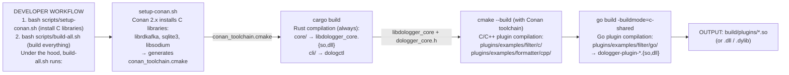
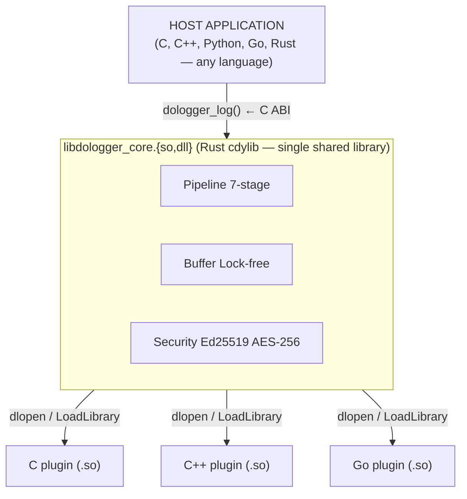
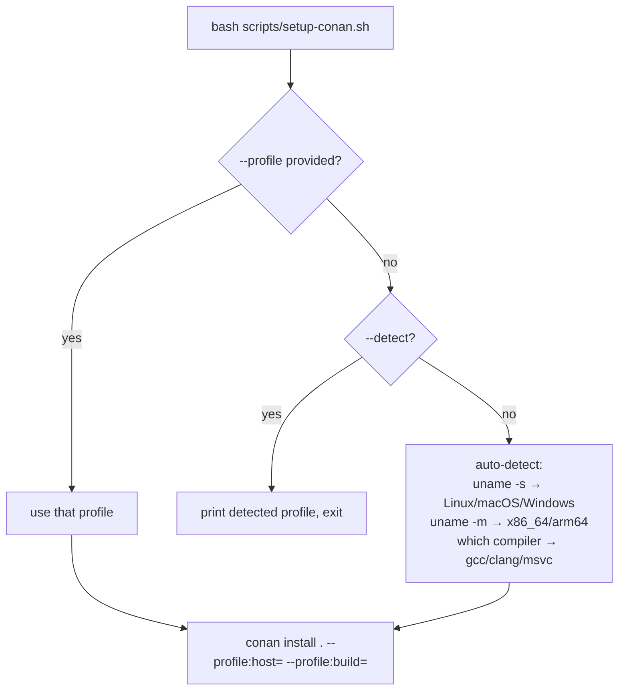

# DoLogger Plugin Development QuickStart

> 🌐 **语言 / Language**: [English](PluginDevelopmentQuickStart.md) | [中文：插件开发快速入门](../zh_CN/PluginDevelopmentQuickStart.md)
>
> **Version**: v0.1.0 | **Target Audience**: Non-Rust plugin developers (C, C++, Go)
>
> **Purpose**: Get from zero to a working DoLogger plugin in your language of choice.
> Covers the complete build chain — Conan → CMake → Rust core → your plugin.

---

## Table of Contents

1. [How the Build Chain Works](#how-the-build-chain-works)
2. [Prerequisites](#prerequisites)
3. [Choosing Your Language](#choosing-your-language)
4. [C Plugin Walkthrough](#c-plugin-walkthrough)
5. [C++ Plugin Walkthrough](#c-plugin-walkthrough)
6. [Go Plugin Walkthrough](#go-plugin-walkthrough)
7. [Cross-Platform Compilation](#cross-platform-compilation)
8. [Linking Against the Rust Core](#linking-against-the-rust-core)
9. [Conan Profile Reference](#conan-profile-reference)
10. [Troubleshooting](#troubleshooting)

---

## How the Build Chain Works

Understanding the full compilation chain is essential for debugging build issues:

(illustrative diagram):



### What Does Conan Actually Do?

Conan is a **C/C++ package manager** (like npm for Node.js or pip for Python). In DoLogger:

| Without Conan | With Conan |
|:-:|:-:|
| You must manually install `librdkafka`, `sqlite3`, `libsodium` via system package manager (`apt`, `brew`, vcpkg) | Conan downloads and builds them automatically from a locked recipe |
| Each developer has different library versions → "works on my machine" bugs | All developers get the same versions declared in `conanfile.py` |
| Cross-compilation requires manual sysroot setup | Conan profiles handle cross-compilation (`--profile:host=...`) |
| CMake `find_package()` may or may not find libraries | `conan_toolchain.cmake` ensures `find_package()` always resolves |

**Conan is NOT used for the Rust core.** The Rust core (`dologger-core`) is pure Rust and compiled by Cargo. Conan only manages C libraries that non-Rust plugins might link against.

---

## Prerequisites

| Tool | Version | Check | Install |
|:-:|:-:|:-:|:-:|
| Rust | ≥ 1.70 | `rustc --version` | `curl --proto '=https' --tlsv1.2 -sSf https://sh.rustup.rs \| sh` |
| CMake | ≥ 3.20 | `cmake --version` | `apt install cmake` / `brew install cmake` |
| Conan | ≥ 2.0 | `conan --version` | `pipx install conan` (recommended) |
| Go | ≥ 1.21 | `go version` | Only needed for Go plugins |

One-command setup:

```bash
# Linux / macOS
bash scripts/dologger-setup-dev

# Windows (the env check is a bash script — run it from Git Bash)
bash scripts/dologger-env-check
```

---

## Choosing Your Language

| Language | Plugin Type | Build System | C Deps via Conan | Compile Output |
|:-:|:-:|:-:|:-:|:-:|
| **C** | Filter, Formatter, IOSink, Processor | CMake | Yes | `.so` / `.dll` / `.dylib` |
| **C++** | Filter, Formatter, IOSink, Processor | CMake | Yes | `.so` / `.dll` / `.dylib` |
| **Go** | Filter, Formatter, Processor | `go build -buildmode=c-shared` | No (pure Go) | `.so` / `.dll` / `.dylib` |
| **Rust** | All 10 VTable types | Cargo | Via `-sys` crates | `.so` / `.dll` / `.dylib` |

**Quick decision guide:**
- You need maximum portability → **C** (C11, no extensions)
- You need the C++ ecosystem (Protobuf, gRPC, Kafka client) → **C++** (C++17)
- You want fast iteration, memory safety → **Go** (cgo, C ABI via `import "C"`)
- You are extending the engine itself → **Rust** (native Cargo workspace member)

---

## C Plugin Walkthrough

We will create a Filter plugin that drops messages below a minimum severity level.

### Step 1: Directory Structure

(illustrative layout):

```text
plugins/examples/filter/c/my_filter/
├── CMakeLists.txt
├── my_filter.c
└── PluginManifest.toml
```

### Step 2: Write the Plugin

**my_filter.c** — implements the DoLogger Filter VTable (this is the pattern used by the verified example at `plugins/examples/filter/c/example_filter/`):

```c
#include "dologger_core.h"   /* C ABI header from core/include/ */

#include <stdlib.h>          /* strtol */
#include <string.h>          /* strlen */

/* Plugin state */
static int g_min_level = DO_LOG_WARN;

/* VTable filter function
 * Returns 0 to keep the record, non-zero to drop it. */
static int my_filter_fn(const dologger_record_handle_t *rec, void *config)
{
    (void)rec;   /* level is passed via config in this example */

    if (config == NULL) {
        return 0;   /* no level info -- drop */
    }

    int record_level = *(const int *)config;
    return (record_level < g_min_level) ? 1 : 0;
}

/* ── C ABI exports ────────────────────────────────────────── */

static dologger_filter_vtable_t g_vtable = { .filter = my_filter_fn };

static dologger_plugin_info_t g_plugin_info = {
    .name        = "my-filter",
    .version     = 0x000100,               /* 0.1.0 packed (major.minor.patch) */
    .abi_version = 0x000100,               /* core ABI this plugin targets */
    .phase       = DO_LOG_PHASE_FILTER,    /* 0x0002 */
    .vtable      = &g_vtable,
};

/* Called once at load time. Returns plugin identity + VTable. */
dologger_plugin_info_t *plugin_query(uint32_t core_abi_version)
{
    (void)core_abi_version;   /* production plugins check compatibility here */
    return &g_plugin_info;
}

/* Called after plugin_query, before the first filter call.
 * config: decimal string of the minimum level, e.g. "3" for WARN. */
int plugin_init(const void *config)
{
    if (config == NULL) {
        return DO_LOG_OK;   /* keep default */
    }

    const char *str = (const char *)config;
    char *endptr = NULL;
    long val = strtol(str, &endptr, 10);

    if (endptr == str) {
        return -1;   /* parse error */
    }
    if (val < DO_LOG_TRACE) val = DO_LOG_TRACE;
    if (val > DO_LOG_AUDIT) val = DO_LOG_AUDIT;

    g_min_level = (int)val;
    return DO_LOG_OK;
}

/* Called before library unload. */
int plugin_shutdown(void)
{
    return DO_LOG_OK;
}
```

### Step 3: Write CMakeLists.txt

```cmake
cmake_minimum_required(VERSION 3.16)
project(my-filter LANGUAGES C)

add_library(my_filter SHARED my_filter.c)

target_include_directories(my_filter PRIVATE
    ${CMAKE_CURRENT_SOURCE_DIR}/../../../../../core/include
)

# Platform-specific output
if(WIN32)
    set_target_properties(my_filter PROPERTIES PREFIX "" SUFFIX ".dll")
elseif(APPLE)
    set_target_properties(my_filter PROPERTIES SUFFIX ".dylib")
else()
    set_target_properties(my_filter PROPERTIES SUFFIX ".so")
endif()

set_target_properties(my_filter PROPERTIES
    C_STANDARD 11
    C_STANDARD_REQUIRED ON
    C_EXTENSIONS OFF
)
```

### Step 4: Build

```bash
# From project root:
bash scripts/build-plugins.sh --filter c
```

Output: `build/plugins/my_filter/my_filter.so` (or `.dll` on Windows)

---

## C++ Plugin Walkthrough

Identical structure to C but with `extern "C"` for exported symbols:

(pseudocode — abbreviated sketch, not compiled; see the C walkthrough above and `plugins/examples/formatter/cpp/` for a complete buildable example):

```cpp
#include "dologger_core.h"
#include <string>
#include <regex>

extern "C" {

static int regex_filter_fn(const void *record, void *config) {
    const char *msg = dologger_record_message(record);
    // ... C++ std::regex matching ...
    return 0;
}

DO_LOG_EXPORT const dologger_plugin_info_t *plugin_query(void) {
    static dologger_filter_vtable_t vtable = { .filter = regex_filter_fn };
    static dologger_plugin_info_t info = {
        .name = "regex-filter", /* ... */
        .vtable = &vtable,
    };
    return &info;
}

DO_LOG_EXPORT int plugin_init(const char *config_json) { return DO_LOG_OK; }
DO_LOG_EXPORT int plugin_shutdown(void) { return DO_LOG_OK; }

} // extern "C"
```

CMakeLists.txt uses `CXX_STANDARD 17` instead of `C_STANDARD 11`.

---

## Go Plugin Walkthrough

Go plugins use `cgo` (`import "C"`) to export C ABI symbols. No CMake required.

### Step 1: Write the Plugin

```go
package main

/*
#include <stdint.h>
#include <stdlib.h>

// These structs must match dologger_core.h byte-for-byte:
// field order: name, version, abi_version, phase, vtable.
typedef struct dologger_plugin_info {
	const char *name;
	uint32_t    version;
	uint32_t    abi_version;
	uint32_t    phase;
	void       *vtable;
} dologger_plugin_info_t;

// filter(rec, config): 0 = keep the record, non-zero = drop it.
typedef struct dologger_filter_vtable {
	int (*filter)(const void *rec, void *config);
} dologger_filter_vtable_t;

extern int go_filter_impl(const void *rec, void *config);

static dologger_filter_vtable_t go_filter_vtable = {
	.filter = go_filter_impl
};
*/
import "C"

import (
	"sync/atomic"
	"unsafe"
)

// Constants — must match dologger_core.h
const (
	levelTrace uint32 = 0
	levelWarn  uint32 = 3
	levelAudit uint32 = 6

	phaseFilter    uint32 = 0x0002 // DO_LOG_PHASE_FILTER
	pluginVersion  uint32 = 0x000100
	coreAbiVersion uint32 = 0x000100
)

// minLevel: records with level >= minLevel are kept. Default: WARN.
var minLevel atomic.Uint32

func init() {
	minLevel.Store(levelWarn)
}

var pluginNameC = C.CString("go-my-filter")

func makePluginInfo() *C.dologger_plugin_info_t {
	info := (*C.dologger_plugin_info_t)(C.malloc(C.size_t(unsafe.Sizeof(C.dologger_plugin_info_t{}))))
	info.name = pluginNameC
	info.version = C.uint32_t(pluginVersion)
	info.abi_version = C.uint32_t(coreAbiVersion)
	info.phase = C.uint32_t(phaseFilter)
	info.vtable = unsafe.Pointer(&C.go_filter_vtable)
	return info
}

//export plugin_query
func plugin_query(coreAbiVersion C.uint32_t) *C.dologger_plugin_info_t {
	_ = coreAbiVersion // production plugins check compatibility here
	return makePluginInfo()
}

//export plugin_init
func plugin_init(config unsafe.Pointer) C.int {
	// config: decimal string of the minimum level, e.g. "3" for WARN
	if config != nil {
		// parse the string and minLevel.Store(parsed)
	}
	return C.int(0)
}

//export plugin_shutdown
func plugin_shutdown() C.int {
	minLevel.Store(levelWarn)
	return C.int(0)
}

//export go_filter_impl
func go_filter_impl(rec unsafe.Pointer, config unsafe.Pointer) C.int {
	// config is passed as a pointer to the record's level (uint32)
	if config == nil {
		return 0 // allow all if no level info
	}
	recordLevel := *(*uint32)(config)
	if recordLevel < minLevel.Load() {
		return 1 // drop
	}
	return 0 // pass
}

func main() {}
```

### Step 2: Build

```bash
cd plugins/examples/filter/go/example_filter
CGO_ENABLED=1 go build -buildmode=c-shared -o dologger-plugin-my_filter.so .
```

Or use the unified script from project root:

```bash
bash scripts/build-plugins.sh --filter go
```

---

## Cross-Platform Compilation

### The Problem

(illustrative scenario):

```
Developer A (macOS ARM):  clang + libc++
Developer B (Linux x86):  gcc + libstdc++11
Developer C (Windows):    MSVC + dynamic CRT

Each has different:
  - Compiler flags
  - ABI conventions
  - Library paths
  - Dynamic linker names
```

| Developer | Platform | Compiler | Standard Library |
|:-:|:-:|:-:|:-:|
| Developer A | macOS ARM | clang | libc++ |
| Developer B | Linux x86 | gcc | libstdc++11 |
| Developer C | Windows | MSVC | dynamic CRT |

### The Solution: Conan Profiles

DoLogger ships with **5 pre-configured Conan profiles** in `.conan/profiles/`:

| Profile | OS | Compiler | Arch |
|:-:|:-:|:-:|:-:|
| `linux-gcc-x86_64` | Linux | GCC 12 | x86_64 |
| `linux-clang-x86_64` | Linux | Clang 16 | x86_64 |
| `macos-clang-x86_64` | macOS | Apple Clang 15 | x86_64 |
| `macos-clang-arm64` | macOS | Apple Clang 15 | ARM64 |
| `windows-msvc-x86_64` | Windows | MSVC 194 | x86_64 |

### Using Profiles

```bash
# Auto-detect your platform and install C deps
bash scripts/setup-conan.sh

# Explicit profile for cross-compilation (Linux → Windows)
bash scripts/setup-conan.sh --profile windows-msvc-x86_64

# Preview without installing
bash scripts/setup-conan.sh --dry-run

# Just print which profile would be used
bash scripts/setup-conan.sh --detect
```

The Conan profile ensures that `librdkafka`, `sqlite3`, and `libsodium` are compiled for the **exact same** target as your plugin — same compiler, same arch, same ABI.

### Adding a Custom Profile

```bash
# Create a profile for Raspberry Pi cross-compilation
cp .conan/profiles/linux-gcc-x86_64 .conan/profiles/linux-gcc-arm64
# Edit: change arch=armv8, add toolchain prefix
```

---

## Linking Against the Rust Core

All plugins link against **one header file** (illustrative path):

```
core/include/dologger_core.h
```

This header declares:

| Category | Symbols |
|:-:|:-:|
| **Types** | `dologger_plugin_info_t`, `dologger_filter_vtable_t`, `dologger_formatter_vtable_t`, ... |
| **Error codes** | `DO_LOG_OK`, `DO_LOG_ERR_INVALID_ARG`, `DO_LOG_ERR_NOT_SUPPORTED`, ... |
| **Phase constants** | `DO_LOG_PHASE_FILTER`, `DO_LOG_PHASE_FORMATTING`, `DO_LOG_PHASE_SINK`, ... |
| **Trust levels** | *(planned — sandbox trust levels not yet implemented)* |
| **Log levels** | `DO_LOG_TRACE` through `DO_LOG_AUDIT` |
| **Record accessors** | `dologger_field_get()`, `dologger_field_set()`, ... |
| **ABI version** | Declared per plugin in the `plugin_info.abi_version` field (e.g. `0x000100` = 0.1.0); the header has no global `DO_LOG_ABI_VERSION` / `DO_LOG_CORE_ABI_VERSION` macro |
| **Plugin exports** | `plugin_query(uint32_t core_abi_version)`, `plugin_init(const void *config)`, `plugin_shutdown(void)` |

### Plugin ABI Contract

Every plugin MUST export exactly these three symbols:

```c
// 1. Identity + VTable — called once at load
dologger_plugin_info_t *plugin_query(uint32_t core_abi_version);

// 2. Configuration — called after plugin_query, before first use
int plugin_init(const void *config);

// 3. Cleanup — called before library unload
int plugin_shutdown(void);
```

The engine discovers all plugin functions through the VTable pointer returned by `plugin_query()`. There is no dynamic symbol lookup at runtime — only the three entry points are `dlsym`'d / `GetProcAddress`'d.

### Memory Model

(illustrative diagram):



Plugins live in separate shared libraries. They never link against the core at build time — the VTable pointer indirection means zero build-time coupling. At runtime, the engine loads plugins via `dlopen` and calls through the VTable.

---

## Conan Profile Reference

### Profile File Format

Each profile in `.conan/profiles/` follows Conan's standard format:

```ini
[settings]
os=Linux
arch=x86_64
compiler=gcc
compiler.version=12
compiler.libcxx=libstdc++11
build_type=Release

[options]
librdkafka/*:shared=False
sqlite3/*:shared=False
libsodium/*:shared=False

[conf]
tools.cmake.cmaketoolchain:generator=Ninja

[buildenv]
PKG_CONFIG_PATH=$PKG_CONFIG_PATH
```

### How Profiles Are Selected

(illustrative diagram):



---

## Troubleshooting

| Symptom | Cause | Solution |
|:-:|:-:|:-:|
| `cmake: include could not find load file: conan_toolchain.cmake` | Conan hasn't been run | `bash scripts/setup-conan.sh` |
| `fatal error: dologger_core.h: No such file` | Include path wrong | Check `target_include_directories` in CMakeLists.txt |
| `undefined reference to dologger_field_get` | Trying to link (don't!) | Plugins never link against core — use VTable only |
| `go build: import "C" requires cgo` | CGO_ENABLED not set | `export CGO_ENABLED=1` or `$env:CGO_ENABLED=1` |
| `plugin_query symbol not found` (runtime) | Missing export declaration (`//export` in Go) or hidden symbols | Ensure symbol visibility (GCC: `-fvisibility=default`, Go: `//export`) |
| `conan: command not found` | Conan not installed | `pipx install conan` (isolated) or `pip install conan` |
| `librdkafka/2.8.0: not found in remote` | Conan center not configured | `conan remote add conancenter https://center.conan.io` |

### Quick Diagnostic

```bash
# What's my platform?
bash scripts/dologger-env-check

# Is Conan ready?
bash scripts/setup-conan.sh --detect
bash scripts/setup-conan.sh --dry-run

# What did the build produce?
find build/plugins -name "*.so" -o -name "*.dll" -o -name "*.dylib"
```

---

## Next Steps

| You want to... | Read this |
|:-:|:-:|
| Understand the full VTable API | [Plugin Development Guide](guides/PluginDevelopmentGuide.md) |
| See working examples | `plugins/examples/` — C, C++, Go, Rust |
| Deploy your plugin | [Operations & Security Guide](OperationsAndSecurity.md) |
| Get your plugin signed (Blue trust) | [Security Whitepaper](guides/SecurityWhitepaper.md) |

---

*For the complete architecture specification, see the [Architecture Reference](ArchitectureReference.md).*
