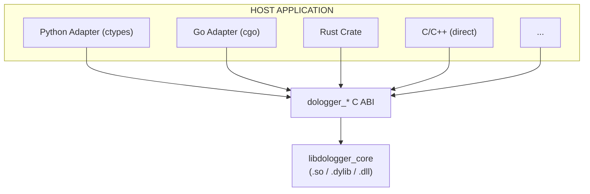

# DoLogger Adapter Development Guide

> 🌐 **语言 / Language**: [English](AdapterDevelopmentGuide.md) | [中文：适配器开发指南](../../zh_CN/guides/AdapterDevelopmentGuide.md)

> **Version**: v0.1.0 | **Last Updated**: 2026-08-12 | **Target Audience**: Language Adapter Developers, SDK Maintainers, Integrators
>
> **Purpose**: This document describes how to create language adapters (Python, Go, C/C++, and others) for the DoLogger C ABI. It covers the thin wrapper pattern, language-specific binding approaches, error handling conventions, thread safety guarantees, and cross-platform testing strategies.
>
> **Reading Path**: First-time adapter authors should read [The C ABI as the Universal Interface](#the-c-abi-as-the-universal-interface) and [Thin Wrapper Pattern](#thin-wrapper-pattern). Language-specific developers should jump to their language's section: [Python Adapter](#python-adapter), [Go Adapter](#go-adapter), or [C/C++ Adapter](#cc-adapter).

## Table of Contents

1. [The C ABI as the Universal Interface](#the-c-abi-as-the-universal-interface)
2. [Thin Wrapper Pattern](#thin-wrapper-pattern)
3. [Python Adapter](#python-adapter)
4. [Go Adapter](#go-adapter)
5. [C/C++ Adapter](#cc-adapter)
6. [Error Handling Conventions](#error-handling-conventions)
7. [Thread Safety Guarantees](#thread-safety-guarantees)
8. [Testing Adapters Across Platforms](#testing-adapters-across-platforms)
9. [Adapter Distribution and Packaging](#adapter-distribution-and-packaging)

---

## The C ABI as the Universal Interface

### Architecture

All language adapters share a common foundation: they load `libdologger_core` (`.so` / `.dylib` / `.dll`) and call the C ABI functions. No reimplementation of the engine is needed.



### The C ABI Surface

The public C ABI consists of these function families:

| Function Family | Purpose | Signature Count |
|:-:|:-:|:-:|
| `dologger_init` / `dologger_shutdown` | Engine lifecycle | 2 |
| `dologger_log` / `dologger_logv` | Log submission | 2 |
| `dologger_get_abi_version` | ABI version check | 1 |
| `dologger_get_last_error` | Error retrieval | 1 |
| `dologger_register_callback_sink` | Callback registration | 1 |
| `dologger_config_*` | Configuration management | 4 |
| `dologger_record_*` | Record field manipulation | 3 |
| `dologger_would_log` | Conditional logging guard | 1 |

For the complete reference, see the [Host Integration Guide](HostIntegrationGuide.md#c-abi-initialization-and-shutdown).

### ABI Stability

The C ABI is the stability anchor for the DoLogger project. See the [Versioning & Deprecation Policy](VersioningAndDeprecation.md) for the full compatibility guarantee. In summary:

- Same MAJOR version: Host binary and plugins interoperate regardless of MINOR.PATCH differences
- Cross-MAJOR: Not supported. Adapters validate `dologger_get_abi_version()` at load time.

---

## Thin Wrapper Pattern

### Principle

The thin wrapper pattern is the recommended approach for all language adapters:

1. **Load** the native library (`dlopen` / `ctypes.CDLL` / `cgo` / direct link)
2. **Declare** function signatures matching the C ABI exactly
3. **Wrap** each C function in an idiomatic function for the target language
4. **Manage** resource lifetimes (engine handle, callback registrations)
5. **Translate** error codes into language-native error types (exceptions, `Result`, `error`)

### What NOT to Do

- **Do NOT reimplement** the engine, pipeline, or any plugin logic in the adapter layer
- **Do NOT add buffering** -- the engine already has a lock-free ring buffer. Adding another layer of buffering adds latency without benefit.
- **Do NOT wrap records in language objects on the hot path** -- create records directly as C structs to avoid allocation overhead.
- **Do NOT call** `dologger_log` from a finalizer/destructor/garbage collector thread -- the engine may already be shut down.

### Common Adapter Structure

```
my-dologger-adapter/
  src/
    ffi.py / ffi.go / ffi.rs     -- Raw C ABI declarations (dlsym/cgo/bindgen)
    engine.py / engine.go / ...   -- Idiomatic wrapper: RAII, context managers
    records.py / ...              -- Record builder with language-native types
    errors.py / ...               -- Error code -> exception/error mapping
    __init__.py                    -- Public API surface
  tests/
    test_engine.py / ...           -- Integration tests against libdologger_core
    test_concurrency.py / ...      -- Thread safety tests
  README.md                        -- Quick start for language users
```

### Lifecycle Management Pattern

Every adapter must ensure proper cleanup. The pattern varies by language:

| Language | Initialization | Cleanup | Guarantee |
|:-:|:-:|:-:|:-:|
| **Python** | `__init__` / `__enter__` | `__exit__` / `__del__` + `atexit` | Context manager or atexit fallback |
| **Go** | Constructor returns `(*Engine, error)` | `defer engine.Shutdown()` | Explicit shutdown; `runtime.SetFinalizer` as fallback |
| **Rust** | `Engine::init()` returns `Result<Engine>` | `Drop` implementation | RAII guarantee |
| **C/C++** | `dologger_init()` | `dologger_shutdown()` | Manual; recommend `atexit()` as safety net |

---

## Python Adapter

### ctypes Approach (Recommended)

`ctypes` is the standard-library approach. It requires no compilation and works on all platforms where Python and the DoLogger shared library are installed.

```python
# dologger/ffi.py -- Raw C ABI bindings via ctypes

import ctypes
import platform
import os

# ── Library loading ──────────────────────────────────────────────────

def _load_library():
    """Load libdologger_core for the current platform."""
    system = platform.system()
    if system == "Linux":
        libname = "libdologger_core.so"
    elif system == "Darwin":
        libname = "libdologger_core.dylib"
    elif system == "Windows":
        libname = "dologger_core.dll"
    else:
        raise OSError(f"Unsupported platform: {system}")

    # Search standard paths + env override
    search_paths = [
        os.environ.get("DOLOGGER_LIB_PATH", ""),
        "/usr/lib/dologger",
        "/usr/local/lib",
        "/opt/dologger/lib",
    ]
    for path in search_paths:
        if path:
            full = os.path.join(path, libname)
            if os.path.exists(full):
                return ctypes.CDLL(full)

    # Fallback: try system loader
    return ctypes.CDLL(libname)

_lib = _load_library()

# ── Type definitions ──────────────────────────────────────────────────

# Log levels
(DO_LOG_TRACE, DO_LOG_DEBUG, DO_LOG_INFO,
 DO_LOG_WARN, DO_LOG_ERROR, DO_LOG_FATAL, DO_LOG_AUDIT) = range(7)

# Error codes
DO_LOG_OK = 0

# dologger_record_params_t
class RecordParams(ctypes.Structure):
    _fields_ = [
        ("level",          ctypes.c_uint8),
        ("message",        ctypes.c_char_p),
        ("source_file",    ctypes.c_char_p),
        ("source_function", ctypes.c_char_p),
        ("source_line",    ctypes.c_uint32),
        ("source_column",  ctypes.c_uint32),
        ("request_id",     ctypes.c_char_p),
    ]

# ── Function signatures ───────────────────────────────────────────────

_lib.dologger_init.argtypes = [ctypes.c_void_p, ctypes.POINTER(ctypes.c_void_p)]
_lib.dologger_init.restype = ctypes.c_int

_lib.dologger_shutdown.argtypes = [ctypes.POINTER(ctypes.c_void_p)]
_lib.dologger_shutdown.restype = ctypes.c_int

_lib.dologger_log.argtypes = [ctypes.c_void_p, ctypes.POINTER(RecordParams)]
_lib.dologger_log.restype = ctypes.c_int

_lib.dologger_get_abi_version.restype = ctypes.c_uint32

_lib.dologger_get_last_error.argtypes = [ctypes.c_void_p, ctypes.c_void_p]
_lib.dologger_get_last_error.restype = ctypes.c_int
```

### Idiomatic Python Wrapper

```python
# dologger/engine.py -- Idiomatic Python interface

from contextlib import contextmanager
from typing import Optional, Dict, Any
import atexit

from .ffi import (
    _lib, RecordParams, DO_LOG_INFO, DO_LOG_OK
)
from .errors import DoLoggerError, check_error


class Engine:
    """A DoLogger engine instance.

    Use as a context manager to guarantee shutdown:

        with Engine() as logger:
            logger.info("Hello from Python")
    """

    def __init__(self, config_path: Optional[str] = None):
        self._handle = ctypes.c_void_p()
        self._closed = False

        # ABI version check
        abi = _lib.dologger_get_abi_version()
        if abi < 1:
            raise DoLoggerError(f"Unsupported ABI version: {abi}")

        # Initialize with optional config path
        config_ptr = config_path.encode("utf-8") if config_path else None
        rc = _lib.dologger_init(config_ptr, ctypes.byref(self._handle))
        check_error(rc, "dologger_init")

        # Register atexit fallback for shutdown
        atexit.register(self._atexit_shutdown)

    def _atexit_shutdown(self):
        """Fallback shutdown if the user forgot to call shutdown()."""
        if not self._closed:
            try:
                self.shutdown()
            except Exception:
                pass

    def shutdown(self):
        """Gracefully shut down the engine. Safe to call multiple times."""
        if self._closed:
            return
        self._closed = True
        rc = _lib.dologger_shutdown(ctypes.byref(self._handle))
        check_error(rc, "dologger_shutdown")

    def log(self, level: int, message: str, *,
            source_file: str = "",
            source_function: str = "",
            source_line: int = 0,
            request_id: str = "") -> None:
        """Submit a log record."""
        if self._closed:
            raise DoLoggerError("Engine is closed")

        params = RecordParams(
            level=level,
            message=message.encode("utf-8"),
            source_file=source_file.encode("utf-8") if source_file else None,
            source_function=source_function.encode("utf-8") if source_function else None,
            source_line=source_line,
            source_column=0,
            request_id=request_id.encode("utf-8") if request_id else None,
        )
        rc = _lib.dologger_log(self._handle, ctypes.byref(params))
        check_error(rc, "dologger_log")

    # ── Convenience methods ───────────────────────────────────────

    def trace(self, msg, **kwargs):    self.log(0, msg, **kwargs)
    def debug(self, msg, **kwargs):    self.log(1, msg, **kwargs)
    def info(self, msg, **kwargs):     self.log(2, msg, **kwargs)
    def warn(self, msg, **kwargs):     self.log(3, msg, **kwargs)
    def error(self, msg, **kwargs):    self.log(4, msg, **kwargs)
    def fatal(self, msg, **kwargs):    self.log(5, msg, **kwargs)
    def audit(self, msg, **kwargs):    self.log(6, msg, **kwargs)

    # ── Context manager support ────────────────────────────────────

    def __enter__(self):
        return self

    def __exit__(self, exc_type, exc_val, exc_tb):
        self.shutdown()
        return False
```

### Error Handling (Python)

```python
# dologger/errors.py

class DoLoggerError(Exception):
    """Base exception for all DoLogger errors."""
    def __init__(self, code: int, message: str):
        self.code = code
        self.message = message
        super().__init__(f"[{code:04x}] {message}")


class DoLoggerInitError(DoLoggerError):
    """Engine initialization failed."""


class DoLoggerConfigError(DoLoggerError):
    """Configuration error."""


class DoLoggerIOError(DoLoggerError):
    """I/O error during log submission."""


# Error code -> exception mapping
_ERROR_MAP = {
    -1: DoLoggerInitError,
    -2: DoLoggerConfigError,
    -3: DoLoggerIOError,
    # ... additional codes ...
}


def check_error(rc: int, context: str):
    """Raise an appropriate exception if rc is non-zero."""
    if rc == 0:  # DO_LOG_OK
        return
    exc_cls = _ERROR_MAP.get(rc, DoLoggerError)
    raise exc_cls(rc, f"{context} failed with code {rc}")
```

### Python logging.Handler Integration

```python
# dologger/handler.py -- stdlib logging integration

import logging
from .engine import Engine

LEVEL_MAP = {
    logging.DEBUG:    1,   # DO_LOG_DEBUG
    logging.INFO:     2,   # DO_LOG_INFO
    logging.WARNING:  3,   # DO_LOG_WARN
    logging.ERROR:    4,   # DO_LOG_ERROR
    logging.CRITICAL: 5,   # DO_LOG_FATAL
}


class DoLoggerHandler(logging.Handler):
    """Standard library logging Handler that forwards to DoLogger."""

    def __init__(self, config_path: str = None):
        super().__init__()
        self.engine = Engine(config_path)

    def emit(self, record: logging.LogRecord):
        level = LEVEL_MAP.get(record.levelno, 2)  # Default: INFO
        msg = self.format(record)
        self.engine.log(
            level=level,
            message=msg,
            source_file=record.pathname,
            source_function=record.funcName,
            source_line=record.lineno,
        )

    def close(self):
        self.engine.shutdown()
        super().close()
```

### cffi Alternative

```python
# dologger/ffi_cffi.py -- Alternative using cffi (requires cffi package)

from cffi import FFI

ffi = FFI()

ffi.cdef("""
    typedef struct { ... } dologger_record_params_t;
    int dologger_init(const void *params, void **handle);
    int dologger_shutdown(void **handle);
    int dologger_log(void *handle, const dologger_record_params_t *params);
    uint32_t dologger_get_abi_version(void);
""")

_lib = ffi.dlopen("libdologger_core.so")
```

`cffi` provides:
- Better C parsing (understands headers directly)
- PyPy compatibility
- Slightly faster calls than `ctypes` for some patterns

The tradeoff is an added dependency. Use `ctypes` for zero-dependency adapters; use `cffi` for adapters that already depend on it.

---

## Go Adapter

### cgo Approach (Recommended)

cgo is the standard mechanism for calling C from Go. It links directly against `libdologger_core`.

```go
// dologger/ffi.go -- Raw C ABI bindings via cgo

package dologger

/*
#cgo LDFLAGS: -ldologger_core
#include <dologger_core.h>
*/
import "C"
import (
    "fmt"
    "unsafe"
)

// ── Log levels ─────────────────────────────────────────────────────

const (
    LevelTrace uint8 = 0
    LevelDebug uint8 = 1
    LevelInfo  uint8 = 2
    LevelWarn  uint8 = 3
    LevelError uint8 = 4
    LevelFatal uint8 = 5
    LevelAudit uint8 = 6
)

// ── Error type ──────────────────────────────────────────────────────

type Error struct {
    Code    int
    Message string
}

func (e *Error) Error() string {
    return fmt.Sprintf("DoLogger error [0x%04x]: %s", e.Code, e.Message)
}
```

### Idiomatic Go Wrapper

```go
// dologger/engine.go -- Idiomatic Go interface

package dologger

/*
#include <dologger_core.h>
*/
import "C"
import (
    "runtime"
    "sync"
    "unsafe"
)

// Engine is a DoLogger engine instance.
// Always call Shutdown() when done, or use defer.
type Engine struct {
    handle unsafe.Pointer
    mu     sync.Mutex
    closed bool
}

// Config holds engine initialization parameters.
type Config struct {
    ConfigPath     string
    Profile        string // dev, balanced, prod-performance, prod-audit
    EnableSignature bool
    RingBufferSize int
}

// New creates and initializes a DoLogger engine.
func New(cfg Config) (*Engine, error) {
    e := &Engine{}

    // ABI version check
    abi := C.dologger_get_abi_version()
    if abi < 1 {
        return nil, &Error{Code: -1, Message: "unsupported ABI version"}
    }

    // Initialize
    var handle unsafe.Pointer
    rc := C.dologger_init(nil, &handle)
    if rc != 0 {
        return nil, engineError(int(rc))
    }
    e.handle = handle

    // Set finalizer as safety net
    runtime.SetFinalizer(e, func(e *Engine) {
        if !e.closed {
            e.Shutdown()
        }
    })

    return e, nil
}

// Shutdown gracefully shuts down the engine.
func (e *Engine) Shutdown() error {
    e.mu.Lock()
    defer e.mu.Unlock()
    if e.closed {
        return nil
    }
    e.closed = true

    rc := C.dologger_shutdown(&e.handle)
    if rc != 0 {
        return engineError(int(rc))
    }
    return nil
}

// Log submits a log record.
func (e *Engine) Log(level uint8, msg string) error {
    e.mu.Lock()
    if e.closed {
        e.mu.Unlock()
        return &Error{Code: -1, Message: "engine is closed"}
    }
    e.mu.Unlock()

    cMsg := C.CString(msg)
    defer C.free(unsafe.Pointer(cMsg))

    params := C.dologger_record_params_t{
        level:   C.uint8_t(level),
        message: cMsg,
    }
    rc := C.dologger_log(e.handle, &params)
    if rc != 0 {
        return engineError(int(rc))
    }
    return nil
}

// ── Convenience methods ──────────────────────────────────────────

func (e *Engine) Trace(msg string) error { return e.Log(LevelTrace, msg) }
func (e *Engine) Debug(msg string) error { return e.Log(LevelDebug, msg) }
func (e *Engine) Info(msg string) error  { return e.Log(LevelInfo, msg) }
func (e *Engine) Warn(msg string) error  { return e.Log(LevelWarn, msg) }
func (e *Engine) Error(msg string) error { return e.Log(LevelError, msg) }
func (e *Engine) Fatal(msg string) error { return e.Log(LevelFatal, msg) }
func (e *Engine) Audit(msg string) error { return e.Log(LevelAudit, msg) }
```

### Go Concurrency Notes

- **The `Engine` is safe for concurrent use.** The C ABI is thread-safe (lock-free ring buffer on the hot path).
- **The `Shutdown()` method must not be called concurrently with `Log()`.** Use `defer` or a `sync.WaitGroup` to ensure all in-flight logs complete before shutdown.
- **Do not call `Log()` from a finalizer.** The Go runtime may invoke finalizers after the C library is unloaded.

### Go build tags

```go
//go:build linux || darwin
// +build linux darwin

// Unix-specific loading
```

---

## C/C++ Adapter

### Direct Header Inclusion

C and C++ applications have the simplest integration: include the header and link against the library.

```c
// minimal_c_host.c -- Direct C integration

#include <dologger_core.h>
#include <stdio.h>

int main(void) {
    dologger_handle_t *logger = NULL;
    int rc;

    // Initialize with defaults
    rc = dologger_init(NULL, &logger);
    if (rc != DO_LOG_OK) {
        fprintf(stderr, "init failed: %d\n", rc);
        return 1;
    }

    // Submit a log
    DO_LOG_INFO(logger, "Hello from C host application");

    // Graceful shutdown
    rc = dologger_shutdown(&logger);
    if (rc != DO_LOG_OK) {
        fprintf(stderr, "shutdown failed: %d\n", rc);
        return 1;
    }
    return 0;
}
```

### C++ RAII Wrapper

```cpp
// dologger.hpp -- C++ RAII wrapper

#pragma once

#include <dologger_core.h>
#include <stdexcept>
#include <string>
#include <memory>

namespace dologger {

class EngineError : public std::runtime_error {
public:
    EngineError(int code, const std::string& ctx)
        : std::runtime_error(ctx + " failed with code " + std::to_string(code))
        , error_code_(code) {}
    int code() const { return error_code_; }
private:
    int error_code_;
};

class Engine {
public:
    Engine(const char* config_path = nullptr) {
        int rc = dologger_init(config_path ? &config_path : nullptr, &handle_);
        if (rc != DO_LOG_OK) {
            throw EngineError(rc, "dologger_init");
        }
    }

    ~Engine() {
        if (handle_) {
            dologger_shutdown(&handle_);
        }
    }

    // Non-copyable, movable
    Engine(const Engine&) = delete;
    Engine& operator=(const Engine&) = delete;
    Engine(Engine&& other) noexcept : handle_(other.handle_) {
        other.handle_ = nullptr;
    }

    void log(uint8_t level, const char* message,
             const char* file = nullptr,
             const char* function = nullptr,
             uint32_t line = 0) {
        dologger_record_params_t params = {};
        params.level = level;
        params.message = message;
        params.source_file = file;
        params.source_function = function;
        params.source_line = line;

        int rc = dologger_log(handle_, &params);
        if (rc != DO_LOG_OK) {
            throw EngineError(rc, "dologger_log");
        }
    }

    // Convenience methods
    void trace(const char* msg, const char* file = __FILE__,
               const char* func = __FUNCTION__, uint32_t line = __LINE__) {
        log(DO_LOG_TRACE, msg, file, func, line);
    }
    void debug(const char* msg, const char* file = __FILE__,
               const char* func = __FUNCTION__, uint32_t line = __LINE__) {
        log(DO_LOG_DEBUG, msg, file, func, line);
    }
    void info(const char* msg, const char* file = __FILE__,
              const char* func = __FUNCTION__, uint32_t line = __LINE__) {
        log(DO_LOG_INFO, msg, file, func, line);
    }

    // ... warn, error, fatal, audit ...

    [[nodiscard]] uint32_t abi_version() const {
        return dologger_get_abi_version();
    }

private:
    dologger_handle_t* handle_ = nullptr;
};

} // namespace dologger
```

### Linking

**Linux / macOS:**
```bash
cc -o myapp myapp.c -ldologger_core -L/usr/lib/dologger
c++ -std=c++17 -o myapp myapp.cpp -ldologger_core -L/usr/lib/dologger
```

**Windows (MSVC):**
```powershell
cl /Fe:myapp.exe myapp.c dologger_core.lib
cl /Fe:myapp.exe /std:c++17 myapp.cpp dologger_core.lib
```

**CMake:**
```cmake
find_library(DOLOGGER_CORE_LIB dologger_core PATHS /usr/lib/dologger)
target_link_libraries(myapp PRIVATE ${DOLOGGER_CORE_LIB})
```

---

## Error Handling Conventions

### Mapping C Error Codes to Language Idioms

**Table 1: Error Code Mapping by Language**

| C Return Value | Python | Go | Rust | C++ |
|:-:|:-:|:-:|:-:|:-:|
| `DO_LOG_OK` (0) | Return `None` | Return `nil` error | Return `Ok(())` | Return normally |
| `DO_LOG_ERR_INIT` (-1) | `DoLoggerInitError` | `&Error{Code: -1}` | `Err(DoLogError::Init)` | `EngineError(-1, ...)` |
| `DO_LOG_ERR_CFG` (-2) | `DoLoggerConfigError` | `&Error{Code: -2}` | `Err(DoLogError::Config)` | `EngineError(-2, ...)` |
| `DO_LOG_ERR_INVALID_ARG` | `ValueError(DoLoggerError)` | `&Error{Code: ...}` | `Err(DoLogError::InvalidArg)` | `std::invalid_argument` |
| `DO_LOG_ERR_NOMEM` | `MemoryError(DoLoggerError)` | `&Error{Code: ...}` | `Err(DoLogError::NoMem)` | `std::bad_alloc` |
| I/O errors (0x03xx) | `DoLoggerIOError` | `&Error{Code: ...}` | `Err(DoLogError::IO)` | `EngineError(..., ...)` |
| Plugin errors (0x05xx) | `DoLoggerPluginError` | `&Error{Code: ...}` | `Err(DoLogError::Plugin)` | `EngineError(..., ...)` |

### Error Retrieval Pattern

```python
# Python: map error codes to exception hierarchy
def check_error(rc, context):
    if rc == 0:
        return
    err_cls = _ERROR_MAP.get(rc, DoLoggerError)
    raise err_cls(rc, f"{context} failed (code {rc})")
```

```go
// Go: return error values
func engineError(code int) error {
    return &Error{Code: code, Message: fmt.Sprintf("error code 0x%04x", code)}
}
```

### Never Ignore Errors

Adapters **must** translate every non-zero return code from the C ABI into a language-native error. Silently swallowing errors (e.g., a dropped AUDIT record) defeats the purpose of the audit chain.

---

## Thread Safety Guarantees

### What Adapters Must Communicate to Users

The C ABI is thread-safe for concurrent `dologger_log()` calls. Adapters must document this clearly for their language's users.

**Table 2: Thread Safety Guarantees**

| Operation | Thread-Safe? | Notes |
|:-:|:-:|:-:|
| `dologger_init()` | No | Call once from one thread |
| `dologger_log()` | **Yes** | Lock-free CAS push. Safe from any thread, including signal handlers. |
| `dologger_shutdown()` | No | Call once. Blocks until in-flight records drain. Do not call `log()` concurrently with `shutdown()`. |
| `dologger_get_abi_version()` | Yes | Returns a compile-time constant. |
| `dologger_get_last_error()` | Thread-local | Each thread sees its own last error. No locking needed. |

### Adapter-Specific Thread Safety Notes

**Python (GIL):**
- `ctypes` calls release the GIL automatically. `dologger_log()` will not block other Python threads.
- Callbacks registered via `dologger_register_callback_sink` execute on the engine's pipeline thread -- Python code in callbacks must re-acquire the GIL.

**Go (goroutines):**
- cgo calls do not block the Go scheduler for short C calls. `dologger_log()` (CAS push, ~100 ns) is an acceptable cgo call from goroutines.
- Use `runtime.LockOSThread()` only if the adapter needs thread-local storage for error retrieval.

**Rust:**
- The `dologger-core` crate uses `Send + Sync` markers. The `Engine` handle is safe to share across `std::thread` boundaries.

### Shutdown Synchronization

```go
// Go example: safe concurrent shutdown
func (e *Engine) Shutdown() error {
    e.mu.Lock()
    defer e.mu.Unlock()
    if e.closed {
        return nil
    }
    e.closed = true  // Prevent new Log() calls
    // At this point, in-flight Log() calls may still be in progress.
    // dologger_shutdown() blocks until the ring buffer is drained.
    rc := C.dologger_shutdown(&e.handle)
    return engineError(int(rc))
}
```

---

## Testing Adapters Across Platforms

### Test Matrix

Adapters must be validated on every supported platform before release.

**Table 3: Adapter Test Matrix**

| Platform | Architecture | Library Format | Test Environment |
|:-:|:-:|:-:|:-:|
| Linux | x86_64 | `.so` | GitHub Actions `ubuntu-latest` |
| Linux | aarch64 | `.so` | AWS Graviton or QEMU emulation |
| macOS | x86_64 | `.dylib` | GitHub Actions `macos-13` |
| macOS | aarch64 | `.dylib` | GitHub Actions `macos-latest` (M1/M2) |
| Windows | x86_64 | `.dll` | GitHub Actions `windows-latest` |

### Test Checklist

For each language adapter, verify:

- [ ] **Library load**: Can find and load `libdologger_core` on each platform
- [ ] **ABI version check**: `dologger_get_abi_version()` returns expected value
- [ ] **Init/Shutdown**: Engine starts and shuts down cleanly (no leaks under Valgrind)
- [ ] **Log submission**: `dologger_log()` with each log level (TRACE through AUDIT)
- [ ] **Error handling**: Invalid arguments produce expected language-native errors
- [ ] **Concurrent log submission**: 8 threads submitting simultaneously for 10 seconds, zero lost records
- [ ] **Shutdown safety**: Calling `shutdown()` while `log()` is in-flight does not crash
- [ ] **Callback integration**: Registered callback sink receives formatted records
- [ ] **Context manager / RAII**: Engine shuts down when scope exits (Python `with`, Go `defer`, Rust `Drop`)
- [ ] **ABI mismatch detection**: Adapter rejects an incompatible library version

### Example Integration Test (Python)

```python
# tests/test_engine.py
import threading
import time
import pytest
from dologger import Engine, DoLoggerError


class TestEngine:
    def test_init_shutdown(self):
        with Engine() as logger:
            assert logger._handle is not None

    def test_log_all_levels(self):
        with Engine() as logger:
            logger.trace("trace msg")
            logger.debug("debug msg")
            logger.info("info msg")
            logger.warn("warn msg")
            logger.error("error msg")

    def test_concurrent_log_submission(self):
        errors = []
        with Engine() as logger:
            def worker():
                try:
                    for _ in range(10000):
                        logger.info("concurrent msg")
                except Exception as e:
                    errors.append(e)

            threads = [threading.Thread(target=worker) for _ in range(8)]
            for t in threads:
                t.start()
            for t in threads:
                t.join()

        assert len(errors) == 0, f"Errors in concurrent test: {errors}"

    def test_double_shutdown_is_safe(self):
        logger = Engine()
        logger.shutdown()
        logger.shutdown()  # Should not raise

    def test_log_after_shutdown_raises(self):
        logger = Engine()
        logger.shutdown()
        with pytest.raises(DoLoggerError):
            logger.info("should fail")

    def test_context_manager(self):
        with Engine() as logger:
            logger.info("inside context manager")
        # Shutdown should have been called by __exit__
        with pytest.raises(DoLoggerError):
            logger.info("should fail -- engine is shut down")
```

### Cross-Platform CI Configuration

```yaml
# .github/workflows/adapter-tests.yml
name: Adapter Tests

on: [push, pull_request]

jobs:
  python-adapter:
    strategy:
      matrix:
        os: [ubuntu-latest, macos-latest, macos-13, windows-latest]
    runs-on: ${{ matrix.os }}
    steps:
      - uses: actions/checkout@v4
      - uses: actions/setup-python@v5
        with:
          python-version: "3.11"
      - run: pip install -e adapters/python/
      - run: pytest adapters/python/tests/ -v

  go-adapter:
    strategy:
      matrix:
        os: [ubuntu-latest, macos-latest, windows-latest]
    runs-on: ${{ matrix.os }}
    steps:
      - uses: actions/checkout@v4
      - uses: actions/setup-go@v5
        with:
          go-version: "1.22"
      - run: go test ./adapters/go/...
```

---

## Adapter Distribution and Packaging

### Python (PyPI)

```toml
# pyproject.toml
[project]
name = "dologger"
version = "0.1.0"
description = "Python adapter for the DoLogger logging engine"
requires-python = ">=3.8"

[project.optional-dependencies]
cffi = ["cffi>=1.15"]

[tool.setuptools.packages.find]
include = ["dologger*"]
```

The Python adapter should be a pure-Python package (no native compilation). Users install `libdologger_core` via their system package manager separately.

### Go (Module)

```go
// go.mod
module github.com/Nekolio/DoLogger-go

go 1.22
```

Users install via `go get github.com/Nekolio/DoLogger-go`. The `libdologger_core` shared library must be installed system-wide or discoverable via `CGO_LDFLAGS`.

### Rust (Crate)

```toml
# Cargo.toml
[package]
name = "dologger-core"
version = "0.1.0"
edition = "2021"

[dependencies]
libloading = "0.8"
```

### Documentation Requirements

Every adapter must ship with:
1. **README** with a 5-line quick start example
2. **API reference** documenting every public function, class, and error type
3. **Platform support matrix** (which OS/arch combinations are tested)
4. **Known limitations** (e.g., "callback sink not supported in Python ctypes adapter v0.1")
5. Link to the [Host Integration Guide](HostIntegrationGuide.md) for users who need the raw C ABI
