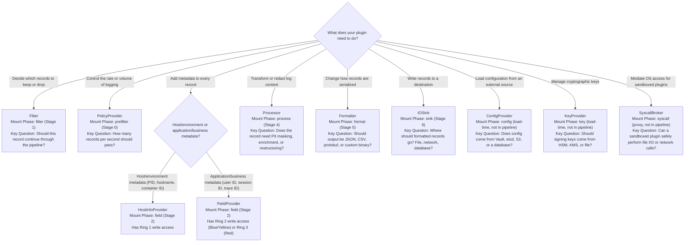
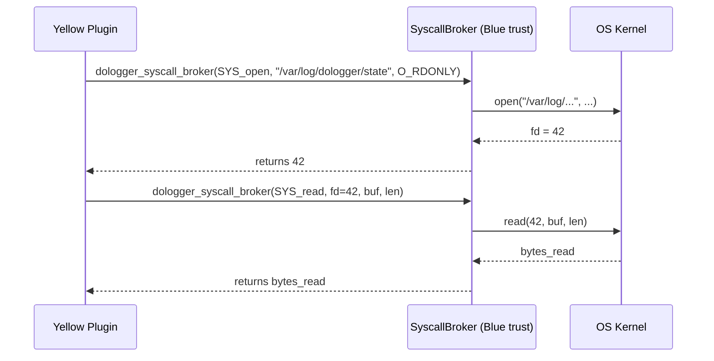
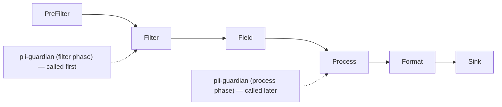

# DoLogger Extended Plugin Type Development Guide

> 🌐 **语言 / Language**: [English](ExtendedPluginTypeGuide.md) | [中文：高级插件类型开发指南](../../zh_CN/guides/ExtendedPluginTypeGuide.md)

> **Version**: v0.1.0 | **Last Updated**: 2026-08-12 | **Target Audience**: Advanced Plugin Developers, Core Contributors
>
> **Purpose**: This document provides advanced guidance for implementing all 10 VTable plugin types in DoLogger. It covers design decisions for selecting plugin types, sandbox-aware SyscallBroker implementation, custom PolicyProvider patterns, plugin dependency management, state serialization for hot reload, and multi-phase plugin registration.
>
> **Reading Path**: Plugin developers who have completed the [Plugin Development Guide](PluginDevelopmentGuide.md) should start with [Choosing the Right Plugin Type](#choosing-the-right-plugin-type). Developers implementing security-critical plugins should read [SyscallBroker Implementation](#syscallbroker-implementation) and [Multi-Phase Plugins](#multi-phase-plugins). Plugin ecosystem maintainers should review [Plugin Dependency Management](#plugin-dependency-management).

> [!NOTE]
> All C, TOML, and text blocks in this guide are **illustrative pseudocode for the planned v1.0 plugin ABI** (not compiled / not run against v0.1.0). The shipped v0.1.0 ABI lives in `core/include/dologger_core.h` (e.g. `dologger_config_provider_vtable_t`, `dologger_key_provider_vtable_t`, and a single-callback Filter VTable); see the note in the [Plugin Development Guide](PluginDevelopmentGuide.md#c-abi-interface-specification).

## Table of Contents

1. [Choosing the Right Plugin Type](#choosing-the-right-plugin-type)
2. [ConfigProvider vs KeyProvider: When to Use Each](#configprovider-vs-keyprovider-when-to-use-each)
3. [SyscallBroker Implementation](#syscallbroker-implementation)
4. [Custom PolicyProvider Patterns](#custom-policyprovider-patterns)
5. [Plugin Dependency Management](#plugin-dependency-management)
6. [Plugin State Serialization for Hot Reload](#plugin-state-serialization-for-hot-reload)
7. [Multi-Phase Plugins](#multi-phase-plugins)
8. [Advanced Plugin Architecture Patterns](#advanced-plugin-architecture-patterns)

---

## Choosing the Right Plugin Type

### Decision Matrix

When you have a logging extension in mind, use this decision tree to select the appropriate VTable plugin type.



### Plugin Type Capabilities

**Table 1: Plugin Type Capability Matrix**

| Plugin Type | Can Drop Records? | Can Modify Records? | Ring Access (Write) | Pipeline Stage |
|:-:|:-:|:-:|:-:|:-:|
| `Filter` | **Yes** | No | None (read-only) | 1 |
| `PolicyProvider` | **Yes** (rate limit) | No | None (read-only) | 0 |
| `FieldProvider` | No | **Yes** | Ring 2 (Blue/Yellow) or Ring 3 (Red) | 2 |
| `HostInfoProvider` | No | **Yes** (Ring 1 only) | Ring 1 | 2 |
| `Processor` | **Yes** | **Yes** | Ring 2 (Blue/Yellow) or Ring 3 (Red) | 4 |
| `Formatter` | No | No | None (read-only) | 5 |
| `IOSink` | No | No | None (read-only) | 6 |
| `ConfigProvider` | N/A | N/A | N/A | Load-time |
| `KeyProvider` | N/A | N/A | N/A | Load-time |
| `SyscallBroker` | N/A | N/A | N/A | Proxy |

---

## ConfigProvider vs KeyProvider: When to Use Each

### ConfigProvider

A `ConfigProvider` extends where the engine loads its configuration from. The engine has a built-in ConfigProvider that reads from TOML files and environment variables. A custom `ConfigProvider` adds additional sources.

**Use a ConfigProvider when:**
- Configuration is stored in HashiCorp Vault, AWS Secrets Manager, or Azure Key Vault
- Configuration is managed by etcd or Consul (for dynamic, distributed configuration)
- Configuration is stored in a database and changes require live reload
- Configuration needs transformation before it reaches the engine (e.g., decrypting encrypted values)

**Do NOT use a ConfigProvider when:**
- You just need to set a few values -- use environment variables or a `dologger.toml` file
- You need signing keys -- use a `KeyProvider` instead
- You need to read from a file on disk -- the built-in ConfigProvider already does this

### ConfigProvider VTable

(pseudocode — illustrative VTable sketch; the v0.1.0 actual definition is in `core/include/dologger_core.h` (`dologger_config_provider_vtable_t`: `open`/`read_config`/`close`)):

```c
typedef struct {
    // Required: Load configuration and return a TOML string
    dologger_config_load_fn_t  load_config;

    // Optional: Watch for changes and notify the engine
    dologger_config_watch_fn_t watch_config;

    // Optional: Validate configuration before applying
    dologger_config_validate_fn_t validate;
} dologger_configprovider_vtable_t;

typedef dologger_error_t (*dologger_config_load_fn_t)(
    void                  *state,
    dologger_config_buf_t *out           // Engine reads TOML from this buffer
);

typedef dologger_error_t (*dologger_config_watch_fn_t)(
    void                          *state,
    dologger_config_change_cb_t    callback,  // Call this on change
    void                          *user_data
);
```

### Example: Minimal ConfigProvider (reads from etcd)

```c
// Pseudocode -- real implementation requires an etcd client library
dologger_error_t etcd_config_load(void *state, dologger_config_buf_t *out) {
    EtcdState *s = (EtcdState *)state;
    char *etcd_value = etcd_get(s->etcd_client, "/dologger/config");
    if (!etcd_value) {
        return DO_LOG_ERR_CFG_MISSING;
    }
    strncpy(out->data, etcd_value, out->capacity);
    out->length = strlen(out->data);
    free(etcd_value);
    return DO_LOG_OK;
}
```

### KeyProvider

A `KeyProvider` manages the Ed25519 key pair used for signing audit records. By default, the engine generates an ephemeral key at startup. A custom `KeyProvider` replaces this with a persistent, secure key source.

**Use a KeyProvider when:**
- Signing keys must persist across engine restarts (you need to verify old log records)
- Keys are stored in an HSM (Hardware Security Module) via PKCS#11
- Keys are managed by AWS KMS, GCP KMS, or Azure Key Vault
- You need key rotation with a grace period for verification of old signatures
- Regulatory compliance requires hardware-backed key protection (FIPS 140-2/3)

**Do NOT use a KeyProvider when:**
- You are in development mode -- the built-in ephemeral key generator is fine
- You are in production but do not use Ed25519 signing -- no keys are needed
- You just need to store a password -- use a ConfigProvider or environment variable

### KeyProvider VTable

(pseudocode — illustrative VTable sketch; the v0.1.0 actual definition is in `core/include/dologger_core.h` (`dologger_key_provider_vtable_t`: `open`/`get_public_key`/`sign_detached`/`close`)):

```c
typedef struct {
    dologger_key_sign_fn_t       sign;           // Required: sign a message
    dologger_key_public_key_fn_t public_key;     // Required: return public key
    dologger_key_rotate_fn_t     rotate;         // Optional: rotate the key
} dologger_keyprovider_vtable_t;

typedef dologger_error_t (*dologger_key_sign_fn_t)(
    void             *key_state,
    const uint8_t    *message,
    size_t            message_len,
    dologger_sig_t   *signature_out
);

typedef dologger_error_t (*dologger_key_public_key_fn_t)(
    void             *key_state,
    uint8_t          *public_key_out,     // 32 bytes
    size_t           *public_key_len
);

typedef dologger_error_t (*dologger_key_rotate_fn_t)(
    void             *key_state,
    uint8_t          *new_public_key_out, // 32 bytes
    uint64_t         *rotation_timestamp
);
```

### ConfigProvider + KeyProvider: The Combination

Some backends serve both purposes. For example, HashiCorp Vault can store both configuration and signing keys:

```toml
# (illustrative — the v0.1.0 engine does not read a [plugins] section from
# dologger.toml)
[plugins.vault-config]
type = "config_provider"
path = "/usr/lib/dologger/plugins/libvault_config.so"
# Fetches dologger.toml content from Vault KV v2

[plugins.vault-keys]
type = "key_provider"
path = "/usr/lib/dologger/plugins/libvault_keys.so"
# Fetches Ed25519 signing key from Vault Transit engine
```

**Key distinction**: The ConfigProvider gives the engine its *settings* (log level, buffer size, sink configs). The KeyProvider gives the engine its *cryptographic identity* (signing key). These are separate concerns and separate VTable types.

---

## SyscallBroker Implementation

### Purpose

A `SyscallBroker` is the mechanism by which sandboxed (Yellow/Red) plugins perform privileged operations they cannot do directly. Instead of calling `open()` themselves (which seccomp-bpf would block with `SECCOMP_RET_KILL_PROCESS`), they call the `SyscallBroker`, which performs the operation on their behalf within the engine's Blue-trust context.

### Architecture



### SyscallBroker VTable

(pseudocode — illustrative VTable sketch; the v0.1.0 actual definition is in `core/include/dologger_core.h` (`dologger_syscall_broker_vtable_t`: `syscall_io`)):

```c
typedef struct {
    dologger_broker_dispatch_fn_t dispatch;
} dologger_syscallbroker_vtable_t;

typedef dologger_error_t (*dologger_broker_dispatch_fn_t)(
    void            *broker_state,
    uint32_t         syscall_number,      // e.g., SYS_open, SYS_read
    const void      *args,                // Platform-specific arg block
    size_t           args_len,
    dologger_broker_result_t *result      // Return value + errno
);
```

### Implementing a SyscallBroker

A production `SyscallBroker` must enforce policy. The broker is Blue-trust -- it can do anything. Its job is to decide what the calling Yellow/Red plugin is allowed to do.

(pseudocode — only illustrates the policy enforcement flow; `DO_LOG_TRUST_*`, `dologger_emit_sysmon` and similar symbols do not exist in v0.1.0):

```c
dologger_error_t my_broker_dispatch(
    void *state, uint32_t sysno, const void *args,
    size_t args_len, dologger_broker_result_t *result)
{
    BrokerPolicy *policy = (BrokerPolicy *)state;

    // 1. Identify the calling plugin
    const char *caller = dologger_get_calling_plugin_name();
    PluginTrustColor color = dologger_get_plugin_trust_color(caller);

    // 2. Check policy: what is this plugin allowed to do?
    switch (sysno) {
    case SYS_open:
    case SYS_openat:
        if (color == DO_LOG_TRUST_RED) {
            // Red plugins: no file access, period
            result->ret = -1;
            result->errno_val = EACCES;
            dologger_emit_sysmon("SANDBOX_BROKER_DENIED",
                "plugin=%s syscall=open denied: Red trust", caller);
            return DO_LOG_OK;
        }
        // Yellow plugins: allow read-only, check the path against allowlist
        if (color == DO_LOG_TRUST_YELLOW) {
            const char *path = extract_open_path(args);
            if (!is_path_allowed(policy->yellow_path_allowlist, path)) {
                result->ret = -1;
                result->errno_val = EACCES;
                return DO_LOG_OK;
            }
        }
        break;

    case SYS_socket:
    case SYS_connect:
        // Yellow and Red: never allow network
        if (color != DO_LOG_TRUST_BLUE) {
            result->ret = -1;
            result->errno_val = EACCES;
            return DO_LOG_OK;
        }
        break;

    case SYS_fork:
    case SYS_execve:
        // Red: never allow process creation
        if (color == DO_LOG_TRUST_RED) {
            result->ret = -1;
            result->errno_val = EACCES;
            return DO_LOG_OK;
        }
        break;
    }

    // 3. Execute the actual syscall on behalf of the plugin
    long sys_ret = syscall(sysno, /* unpack args */);
    result->ret = sys_ret;
    result->errno_val = (sys_ret < 0) ? errno : 0;

    // 4. Audit: log every brokered syscall
    dologger_audit_syscall_brokered(caller, sysno, result);

    return DO_LOG_OK;
}
```

### Security Requirements for SyscallBroker

1. **Never blindly forward**. If the broker receives a syscall it does not understand, it must deny it (default-deny).
2. **Log all brokered calls**. Every syscall brokered for a Yellow or Red plugin must be audited.
3. **Path allow-listing for Yellow plugins**. Yellow plugins should only access paths they declared in `manifest.toml`.
4. **Rate limiting**. A malicious Red plugin should not be able to use the broker for a denial-of-service attack. Limit the rate of brokered syscalls to 1000/second per plugin.
5. **Timeouts**. A brokered syscall should time out after 30 seconds to prevent the broker thread from blocking indefinitely.

---

## Custom PolicyProvider Patterns

### Built-in Policies

The engine includes built-in rate limiting and level-gating in the PreFilter stage. A custom `PolicyProvider` replaces or extends these.

### PolicyProvider VTable

(pseudocode — illustrative VTable sketch; the v0.1.0 actual definition is in `core/include/dologger_core.h` (`dologger_policy_provider_vtable_t`: only `evaluate`)):

```c
typedef struct {
    dologger_policy_evaluate_fn_t  evaluate;
    dologger_policy_update_fn_t    update;          // Optional
} dologger_policyprovider_vtable_t;

typedef dologger_error_t (*dologger_policy_evaluate_fn_t)(
    void                       *state,
    const dologger_record_t    *record,
    dologger_policy_result_t   *result
);

// result.action:
//   DO_LOG_POLICY_ALLOW   -- Record passes the prefilter
//   DO_LOG_POLICY_DROP    -- Record is dropped before filter stage
//   DO_LOG_POLICY_DELAY   -- Record is held and re-evaluated later (backpressure)
//   DO_LOG_POLICY_THROTTLE -- Record passes but at reduced rate
```

### Pattern 1: Token Bucket Rate Limiter

The classic rate limiting pattern. Maintains a token bucket per logging level.

(pseudocode — token bucket rate limiter example, illustrative only; `dologger_policy_result_t` and similar types do not exist in v0.1.0):

```c
typedef struct {
    // One bucket per log level (TRACE through AUDIT)
    TokenBucket buckets[7];
    uint64_t     last_refill_ns;
} RateLimiterState;

typedef struct {
    double   tokens;              // Current tokens in the bucket
    double   max_tokens;          // Maximum tokens (burst capacity)
    double   refill_rate;         // Tokens added per second
} TokenBucket;

dologger_error_t rate_limit_evaluate(
    void *state, const dologger_record_t *record,
    dologger_policy_result_t *result)
{
    RateLimiterState *s = (RateLimiterState *)state;
    uint8_t level = record->level;

    // Refill tokens
    refill_bucket(&s->buckets[level], s);

    // Check if a token is available
    if (s->buckets[level].tokens >= 1.0) {
        s->buckets[level].tokens -= 1.0;
        result->action = DO_LOG_POLICY_ALLOW;
    } else {
        result->action = DO_LOG_POLICY_DROP;
    }

    return DO_LOG_OK;
}
```

### Pattern 2: Circuit Breaker by Error Rate

Triggers when the rate of ERROR+FATAL records exceeds a threshold, indicating an application fault storm.

(pseudocode — error-rate circuit breaker example, illustrative only):

```c
typedef struct {
    uint64_t error_count;        // Errors in current window
    uint64_t total_count;        // Total records in current window
    uint64_t window_start_ns;
    bool     circuit_open;
    double   error_rate_threshold; // e.g., 0.5 = 50% error rate opens circuit
} CircuitBreakerState;

dologger_error_t circuit_breaker_evaluate(
    void *state, const dologger_record_t *record,
    dologger_policy_result_t *result)
{
    CircuitBreakerState *s = (CircuitBreakerState *)state;

    // If circuit is open, drop everything (except AUDIT)
    if (s->circuit_open && record->level != DO_LOG_AUDIT) {
        result->action = DO_LOG_POLICY_DROP;
        return DO_LOG_OK;
    }

    // Track error rate in a sliding window
    s->total_count++;
    if (record->level >= DO_LOG_ERROR) {
        s->error_count++;
    }

    // Check if error rate exceeds threshold
    if (s->total_count > 100) {
        double error_rate = (double)s->error_count / s->total_count;
        if (error_rate > s->error_rate_threshold) {
            s->circuit_open = true;
            dologger_emit_sysmon("POLICY_CIRCUIT_OPEN",
                "error_rate=%.2f threshold=%.2f", error_rate, s->error_rate_threshold);
        }
    }

    result->action = DO_LOG_POLICY_ALLOW;
    return DO_LOG_OK;
}
```

### Pattern 3: Quota Management (Per-Tenant)

For multi-tenant deployments, limit logging per tenant to prevent one noisy tenant from consuming all resources.

(pseudocode — per-tenant quota example, illustrative only):

```c
typedef struct {
    // Map: tenant_id -> quota
    QuotaMap quotas;
    uint64_t  default_quota_per_sec;
    uint64_t  window_duration_ns;
} QuotaManagerState;

dologger_error_t quota_evaluate(
    void *state, const dologger_record_t *record,
    dologger_policy_result_t *result)
{
    QuotaManagerState *s = (QuotaManagerState *)state;

    // Extract tenant ID from the record (set by FieldProvider)
    const char *tenant_id = dologger_record_get_field(record, "verified.tenant_id");
    if (!tenant_id) {
        tenant_id = "__default__";
    }

    QuotaEntry *quota = get_or_create_quota(s, tenant_id);
    if (quota->records_in_window >= quota->limit) {
        result->action = DO_LOG_POLICY_DROP;
        dologger_emit_sysmon("POLICY_QUOTA_EXCEEDED",
            "tenant=%s limit=%lu", tenant_id, quota->limit);
    } else {
        quota->records_in_window++;
        result->action = DO_LOG_POLICY_ALLOW;
    }

    return DO_LOG_OK;
}
```

---

## Plugin Dependency Management

### Declaring Dependencies

Plugins that depend on other plugins declare this in `manifest.toml`:

```toml
# (illustrative — planned schema; v0.1.0 parses [plugin]/[plugin.trust]/[capabilities]/[licenses] only)
[dependencies]
requires_fields = ["verified.user_id", "host.name"]
requires_plugins = [
    { name = "field-container", version = ">=1.0, <2.0" },
    { name = "json-formatter", version = ">=2.0, <3.0", optional = true }
]
```

### Dependency Resolution

The engine resolves dependencies as a Directed Acyclic Graph (DAG) at startup (pseudocode/illustrative — dependency resolution steps overview, not a command):

```
1. Parse all [dependencies] sections from loaded plugins
2. Build a dependency graph: node = plugin, edge A->B = "A requires B"
3. Topological sort to determine load order
4. Detect cycles -- REJECT if found (circular dependency attack, see Security Whitepaper)
5. Load plugins in topological order (dependencies first)
6. Init in topological order
7. Shutdown in reverse topological order (dependents first)
```

### Load Order Guarantees

**Table 2: Plugin Load Order Rules**

| Rule | Description |
|:-:|:-:|
| **Dependencies loaded first** | If Plugin A depends on Plugin B, B is loaded and initialized before A. |
| **Pipeline phase order** | Within a phase, plugins load in declaration order (config file order, then alphabetical). |
| **Inter-phase dependencies** | A `Sink` (phase 6) may depend on a `Formatter` (phase 5). The Formatter loads first. |
| **Cross-type dependencies** | A `Sink` may depend on a `KeyProvider`. The KeyProvider loads first. |
| **Shutdown is reverse** | Plugins shut down in reverse dependency order. Dependents shut down before their dependencies. |

### Circular Dependency Detection

(pseudocode — dependency validator sketch (`for each` is pseudo-syntax, not compilable C); the v0.1.0 actual implementation is in `core/src/plugin/dependency.rs`):

```c
// Engine's dependency validator (simplified)
dologger_error_t validate_plugin_dag(PluginRegistry *registry) {
    for each plugin P in registry:
        if detect_cycle_from(P, visited_set):
            dologger_emit_sysmon("LICENSE_POLICY_VIOLATION",
                "circular dependency detected starting at plugin '%s'", P->name);
            return DO_LOG_ERR_PLUGIN_LOAD;
    return DO_LOG_OK;
}
```

Circular dependencies are treated as a security concern -- they could be used to create infinite recursion in the pipeline. The engine rejects the entire configuration if a cycle is detected.

### Optional Dependencies

Optional dependencies allow a plugin to function with or without another plugin:

```toml
# (illustrative — planned schema)
[dependencies]
requires_plugins = [
    { name = "json-formatter", version = ">=2.0, <3.0", optional = true }
]
```

When an optional dependency is not present:
- The engine loads the plugin normally
- The plugin can check availability at runtime: `dologger_is_plugin_loaded("json-formatter")`
- The plugin must handle the case where the dependency is absent gracefully

### Dependency Version Conflicts

When two plugins require conflicting versions of a third (illustrative — dependency conflict scenario description, not command output):

```
Plugin A requires json-formatter >= 1.0, < 2.0
Plugin B requires json-formatter >= 2.0, < 3.0

Result: CONFLICT
```

The engine **rejects the configuration** with a clear error message (illustrative — planned error message format, not actual output):

```
[ERROR] Dependency conflict:
        Plugin 'http-sink' requires json-formatter >= 1.0, < 2.0
        Plugin 'audit-exporter' requires json-formatter >= 2.0, < 3.0
        Only one version of each plugin can be loaded.
```

---

## Plugin State Serialization for Hot Reload

### When to Support Hot Reload

Not every plugin needs state serialization. Consider supporting it if:
- Your plugin accumulates state that would be expensive to rebuild (e.g., a trained ML model in a Processor)
- Your plugin is a `KeyProvider` with key material that must persist across reloads
- Your plugin is a `FieldProvider` that caches expensive lookups
- Your plugin is a `PolicyProvider` with a running rate limiter state

Skip it if:
- Your plugin is stateless (a simple Filter that checks `record.level`)
- Rebuilding state on `plugin_init()` costs less than 1 ms
- Your plugin state contains secrets that should not be serialized to plaintext

### State Serialization VTable Functions

(pseudocode — planned optional exports; v0.1.0 has no `dologger_state_buf_t` and hot-reload serialization is not implemented):

```c
// Optional exports -- if not present, the plugin reinitializes on hot reload

dologger_error_t plugin_state_serialize(dologger_state_buf_t *out) {
    // Serialize your state into out->data
    // out->capacity is the max buffer size
    // Set out->length to the actual bytes written
    // Return DO_LOG_ERR_BUFFER_TOO_SMALL if capacity is insufficient
}

dologger_error_t plugin_state_deserialize(const dologger_state_buf_t *in) {
    // Restore your state from in->data
    // in->length bytes of serialized state
}
```

### Serialization Format

You control the serialization format. Recommended approaches:

| Approach | Pros | Cons | Example |
|:-:|:-:|:-:|:-:|
| **MessagePack** | Fast, compact, schema-less | C-only; requires library | `msgpack_pack(&pk, state)` |
| **FlatBuffers** | Zero-copy deserialization | Schema definition overhead | SIF-compatible format |
| **Custom binary** | Minimal overhead, exactly what you need | Maintenance burden; no tooling | `memcpy(out, &state, sizeof(state))` -- only for POD state |
| **JSON** | Human-readable, debuggable | Slow, large output | Only for small state (< 1 KB) |

### Example: Serializing a Rate Limiter State

(pseudocode — serialization example, illustrative only; `dologger_state_buf_t` does not exist):

```c
// State structure
typedef struct {
    double tokens[7];           // Token buckets for each log level
    uint64_t last_refill_ns;
    uint64_t total_allowed;
    uint64_t total_dropped;
} RateLimiterState;

// Serialize
dologger_error_t plugin_state_serialize(dologger_state_buf_t *out) {
    size_t needed = sizeof(RateLimiterState);
    if (out->capacity < needed) {
        return DO_LOG_ERR_BUFFER_TOO_SMALL;
    }
    memcpy(out->data, &g_state, needed);
    out->length = needed;
    return DO_LOG_OK;
}

// Deserialize
dologger_error_t plugin_state_deserialize(const dologger_state_buf_t *in) {
    if (in->length != sizeof(RateLimiterState)) {
        return DO_LOG_ERR_INVALID_ARG;  // State format mismatch
    }
    memcpy(&g_state, in->data, sizeof(RateLimiterState));
    return DO_LOG_OK;
}
```

### State Versioning

If your state format changes between plugin versions, include a version header:

(pseudocode — state versioning example, illustrative only):

```c
typedef struct {
    uint32_t state_version;       // Bump when state layout changes
    uint32_t state_size;          // Total size of the state blob
    // ... state fields ...
} VersionedState;

dologger_error_t plugin_state_deserialize(const dologger_state_buf_t *in) {
    VersionedState header;
    memcpy(&header, in->data, sizeof(header));

    if (header.state_version != MY_PLUGIN_STATE_VERSION) {
        // Version mismatch -- discard old state, reinitialize fresh
        dologger_emit_sysmon("PLUGIN_STATE_MIGRATION",
            "plugin=%s old_version=%u new_version=%u -- reinitializing",
            g_info.name, header.state_version, MY_PLUGIN_STATE_VERSION);
        return DO_LOG_OK;  // Reinit from scratch
    }

    memcpy(&g_state, in->data + sizeof(header), header.state_size);
    return DO_LOG_OK;
}
```

### Hot Reload Lifecycle

(pseudocode/illustrative — hot reload lifecycle steps, planned):

```text
1. Engine detects new plugin binary (config change or SIGHUP)
2. Calls plugin_state_serialize() on the OLD plugin
3. Calls plugin_shutdown() on the OLD plugin
4. dlclose(OLD plugin)
5. dlopen(NEW plugin)
6. Calls plugin_init() on the NEW plugin
7. Calls plugin_state_deserialize(old_state_buf) on the NEW plugin
8. Engine frees old_state_buf
```

During this process, the pipeline is **paused** for that plugin's phase. Records queue in the ring buffer and are processed once the new plugin is active. The pause duration is typically < 10 ms for a well-implemented plugin.

---

## Multi-Phase Plugins

### Concept

A single plugin binary can register in multiple pipeline phases by exporting multiple VTables. This is an advanced pattern for plugins that need to both transform records AND format output, or both filter AND provide fields.

### Declaring Multi-Phase in manifest.toml

```toml
# (illustrative — the manifest keys are real, but multi-phase mounting is not
# yet supported by the v0.1.0 engine)
[plugin]
name = "pii-guardian"
version = "1.0.0"
plugin_type = "processor"        # Primary type
mount_phase = ["process", "filter"]  # Multiple phases
```

### Exporting Multiple VTables

(pseudocode — multi-phase plugin export sketch; the v0.1.0 actual VTable definitions are in `core/include/dologger_core.h` (no `process_batch`/`filter_batch` members, and no `dologger_vtable` symbol convention)):

```c
// The plugin exports one VTable per phase:

// For the "process" phase:
const dologger_processor_vtable_t dologger_processor_vtable = {
    .process       = pii_mask_process,
    .process_batch = pii_mask_process_batch,
};

// For the "filter" phase:
const dologger_filter_vtable_t dologger_filter_vtable = {
    .filter       = pii_detect_filter,
    .filter_batch = NULL,
};
```

The engine discovers additional VTables by symbol lookup. The primary VTable (matching `plugin_type`) is found via the standard `dologger_vtable` symbol. Additional VTables are found via type-specific symbols like `dologger_processor_vtable`, `dologger_filter_vtable`.

### When to Use Multi-Phase Plugins

**Good use cases:**
- A PII processor that also filters records containing unredacted secrets in the filter phase (defense in depth)
- A JSON formatter that also provides JSON-specific fields (FieldProvider + Formatter)
- An audit plugin that both signs records (Processor) and exports to a WORM sink (IOSink)

**Bad use cases:**
- Unrelated functionality crammed into one plugin (violates single responsibility)
- A filter that also writes to a file (Filter should filter, IOSink should write)
- A ConfigProvider that also signs records (ConfigProvider should load config, KeyProvider should sign)

### Multi-Phase Execution Order

When a plugin registers in multiple phases, each phase instance is called independently in its respective pipeline position:



The plugin's `plugin_init()` is called **once** before the pipeline starts. The same plugin state is shared across all phases. This means:

- **Shared state**: All phases share the same `void *state` pointer. Be careful with concurrent access if phases execute in parallel.
- **Shared lifetime**: The plugin is loaded/unloaded once, regardless of how many phases it registers in.
- **Shared sandbox**: The trust color applies to all phases equally.

### Thread Safety for Multi-Phase State

If your multi-phase plugin's state is accessed from different pipeline stages (which may execute on different threads), you must synchronize access:

(pseudocode — multi-phase thread-safety example, illustrative only; `dologger_filter_result_t` does not exist):

```c
typedef struct {
    pthread_mutex_t lock;
    SharedConfig    config;      // Read-write: updated by filter, read by process
} MultiPhaseState;

dologger_error_t pii_detect_filter(dologger_record_t *record,
                                    dologger_filter_result_t *result) {
    pthread_mutex_lock(&g_state->lock);
    // Check if PII detection is enabled (config may be updated)
    bool enabled = g_state->config.pii_detection_enabled;
    pthread_mutex_unlock(&g_state->lock);

    if (!enabled) {
        result->action = DO_LOG_FILTER_PASS;
        return DO_LOG_OK;
    }
    // ... PII detection logic ...
}
```

---

## Advanced Plugin Architecture Patterns

### Pattern 1: Plugin Chaining (Cooperative Processing)

Plugins in the same pipeline phase can cooperate by reading each other's output:

(pseudocode — field cooperation example; the v0.1.0 actual field API is `dologger_field_set(record, field, value, &err)` / `dologger_field_get(...)`, returning `dologger_error_t` (int32_t)):

```c
// Plugin A (FieldProvider) writes a field
dologger_record_set_field(record, "verified.user_id", user_id);

// Plugin B (Processor) reads Plugin A's field and enriches it
const char *user_id = dologger_record_get_field(record, "verified.user_id");
if (user_id) {
    UserProfile *profile = lookup_profile(user_id);
    dologger_record_set_field(record, "verified.user_email", profile->email);
}
```

Cooperative plugins should declare their inter-dependency:

```toml
# (illustrative — planned schema)
# plugin-b/manifest.toml
[dependencies]
requires_fields = ["verified.user_id"]    # Plugin A provides this
```

### Pattern 2: Plugin Delegation (Proxy Pattern)

A plugin delegates work to another plugin via the plugin registry:

(pseudocode — plugin delegation pattern example; `dologger_get_plugin()` and the registry lookup API do not exist in v0.1.0):

```c
// A Formatter that delegates to another Formatter for specific record types
dologger_error_t delegating_format(const dologger_record_t *record,
                                    dologger_buf_t *output) {
    if (dologger_record_get_field(record, "ext.output_format") == "csv") {
        // Delegate to the CSV formatter
        dologger_plugin_handle_t *csv_fmt = dologger_get_plugin("csv-formatter");
        return dologger_delegate_format(csv_fmt, record, output);
    }
    // Default: format as JSON
    return json_format(record, output);
}
```

### Pattern 3: Plugin State as a Cache

Plugins can use their persistent state as a cache to avoid repeated expensive operations:

(pseudocode — plugin state cache pattern example; the `dologger_field_set_t` field type does not exist):

```c
// A FieldProvider that resolves user IDs to display names
typedef struct {
    CacheEntry entries[MAX_CACHE_SIZE];
    size_t     entry_count;
    uint64_t   hits;
    uint64_t   misses;
} UserCacheState;

dologger_error_t user_resolver_provide_fields(
    void *state, dologger_record_t *record,
    dologger_field_set_t *fields)
{
    UserCacheState *cache = (UserCacheState *)state;
    const char *user_id = dologger_record_get_field(record, "verified.user_id");
    if (!user_id) return DO_LOG_OK;

    // Check cache first
    for (size_t i = 0; i < cache->entry_count; i++) {
        if (strcmp(cache->entries[i].user_id, user_id) == 0) {
            cache->hits++;
            dologger_record_set_field(record,
                "verified.user_display_name", cache->entries[i].display_name);
            return DO_LOG_OK;
        }
    }

    // Cache miss -- resolve from database
    cache->misses++;
    char *display_name = db_lookup_display_name(user_id);
    if (display_name) {
        dologger_record_set_field(record,
            "verified.user_display_name", display_name);
        add_to_cache(cache, user_id, display_name);
    }
    return DO_LOG_OK;
}
```

The cache persists across hot reload via state serialization, avoiding a cold-start performance hit.

### Pattern 4: Observability Plugin (Sysmon Integration)

Plugins can emit their own diagnostics into the sysmon event stream:

(pseudocode — custom sysmon event example; `dologger_emit_sysmon` does not exist in v0.1.0):

```c
// Emit a custom metric from within a plugin
dologger_emit_sysmon("PLUGIN_METRIC",
    "plugin=%s cache_hits=%lu cache_misses=%lu hit_rate=%.2f",
    g_info.name, cache->hits, cache->misses,
    (double)cache->hits / (cache->hits + cache->misses));
```

Custom sysmon events must follow the naming convention `PLUGIN_<EVENT_NAME>` (for community plugins) or use the plugin's own namespace. The event format is a single JSON line (see [Operations Manual](OperationsManual.md#sysmon-event-stream)).

### Pattern 5: Graceful Degradation

Plugins should degrade gracefully when their dependencies or external resources are unavailable:

(pseudocode — graceful degradation example; the v0.1.0 actual signature is `int plugin_init(const void *config)`, and `dologger_plugin_config_t` does not exist):

```c
dologger_error_t my_plugin_init(const dologger_plugin_config_t *config) {
    // Try to connect to the external service
    g_state->db_conn = db_connect(config->db_url);
    if (!g_state->db_conn) {
        // Degrade: operate without database enrichment
        g_state->degraded = true;
        dologger_emit_sysmon("PLUGIN_DEGRADED",
            "plugin=%s reason=database_unavailable -- running in degraded mode",
            g_info.name);
        return DO_LOG_OK;  // Init succeeds, even in degraded mode
    }
    g_state->degraded = false;
    return DO_LOG_OK;
}

dologger_error_t my_plugin_process(dologger_record_t *record) {
    if (g_state->degraded) {
        // Skip enrichment, pass record through unchanged
        return DO_LOG_OK;
    }
    // Normal processing with database enrichment
    return enrich_from_database(g_state->db_conn, record);
}
```

A degraded plugin must:
1. Log a `PLUGIN_DEGRADED` sysmon event on entering degraded mode
2. Continue passing records through unchanged (not dropping them)
3. Attempt periodic reconnection (every 60 seconds) and log `PLUGIN_RECOVERED` on success
4. Never crash or panic due to missing external resources
