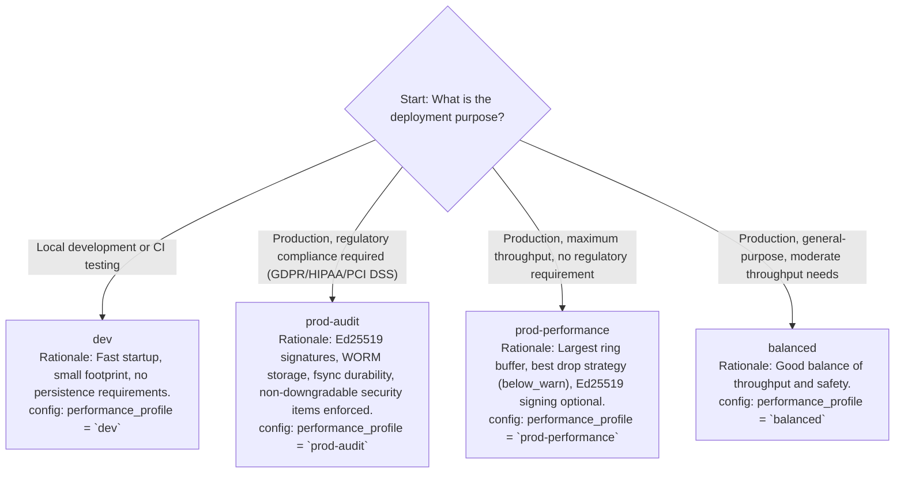

# DoLogger Performance Tuning Guide

> 🌐 **语言 / Language**: [English](PerformanceTuningGuide.md) | [中文：性能调优指南](../../zh_CN/guides/PerformanceTuningGuide.md)

> **Version**: v0.1.0 | **Last Updated**: 2026-08-12 | **Target Audience**: SRE / Operations Engineers, Performance Engineers, System Administrators
>
> **Purpose**: This document provides system-level performance tuning guidance for DoLogger deployments. It covers OS kernel parameters, CPU and NUMA affinity, ring buffer sizing formulas, performance profile selection, sink throughput characteristics, memory budgeting, and real-world deployment examples.
>
> **Reading Path**: New operators should start with [Performance Profile Selection](#performance-profile-selection) and [Ring Buffer Sizing](#ring-buffer-sizing). High-throughput deployments should read [OS Kernel Tuning](#os-kernel-tuning) and [CPU Affinity and NUMA Pinning](#cpu-affinity-and-numa-pinning). Capacity planners should focus on [Memory Budgeting](#memory-budgeting).

## Table of Contents

1. [Performance Profile Selection](#performance-profile-selection)
2. [OS Kernel Tuning](#os-kernel-tuning)
3. [CPU Affinity and NUMA Pinning](#cpu-affinity-and-numa-pinning)
4. [Ring Buffer Sizing](#ring-buffer-sizing)
5. [Sink Throughput Characteristics](#sink-throughput-characteristics)
6. [Memory Budgeting](#memory-budgeting)
7. [Deployment Tuning Examples](#deployment-tuning-examples)
8. [Troubleshooting Performance Issues](#troubleshooting-performance-issues)

---

## Performance Profile Selection

### Profile Overview

DoLogger provides four pre-configured performance profiles. Selecting the right profile is the single most impactful tuning decision.

**Table 1: Performance Profile Comparison**

| Parameter | `dev` | `balanced` | `prod-performance` | `prod-audit` |
|:-:|:-:|:-:|:-:|:-:|
| Block timeout | 100 ms | 2000 ms | 3000 ms | 3000 ms |
| Drop strategy | `drop_newest` | `oldest` | `below_warn` | `below_warn` |
| Ring buffer size | 65536 | 131072 | 262144 | 262144 |
| Batch size | 32 | 128 | 256 | 128 |
| Ed25519 signing | Off | Optional | Optional | **Required** |
| WORM enforcement | Off | Optional | Optional | **Required** |
| `escape_html` | Optional | On | On | **On** |
| `fsync_on_write` | Off | Off | Optional | **On** |
| `require_tls` | Off | Warn-only | On | **On** |
| Expected throughput | ~200K rec/s | ~600K rec/s | ~900K rec/s | ~50K rec/s |

### Profile Selection Decision Tree



### Profile Overrides

Individual profile parameters can be overridden without switching profiles entirely:

```toml
[dologger]
performance_profile = "prod-performance"

# Override specific settings on top of the profile defaults
ring_buffer_size = 524288       # Double the default buffer
batch_size = 512                # Larger batches for higher throughput
enable_signature = true         # Add signing to performance profile
```

Overrides are merged on top of the profile defaults. Non-downgradable security items cannot be relaxed via overrides (see [Operations Manual](OperationsManual.md#non-downgradable-items)).

### When to Switch Profiles

| Symptom | Current Profile | Recommended Profile | Rationale |
|:-:|:-:|:-:|:-:|
| Ring buffer overflowing, emergency spills | `balanced` | `prod-performance` | Larger buffer, better drop strategy |
| Compliance audit upcoming | `prod-performance` | `prod-audit` | Ed25519 + WORM + fsync required |
| Development machine, engine starts slowly | `prod-performance` | `dev` | Smaller buffer, faster init |
| Submitting over 500K records/s | `balanced` | `prod-performance` | Higher ceiling needed |

---

## OS Kernel Tuning

### Linux Kernel Parameters

**Table 2: Recommended Kernel Parameter Tuning**

| Parameter | Default | Recommended | Purpose |
|:-:|:-:|:-:|:-:|
| `vm.max_map_count` | 65530 | **262144** or higher | Allows the ring buffer to use many memory mappings. Required for large ring buffers and emergency spill mmap files. |
| `vm.swappiness` | 60 | **10** | Discourages swapping. The ring buffer must remain in physical memory. Swapping causes catastrophic latency spikes. |
| `kernel.sched_rt_runtime_us` | 950000 | **-1** (disable RT throttling) | If using `SCHED_FIFO` for pipeline threads, prevents the kernel from throttling them. |
| `vm.nr_hugepages` | 0 | **See formula below** | Huge pages reduce TLB misses on the ring buffer. Recommended for buffers > 1M slots. |
| `vm.hugetlb_shm_group` | 0 | GID of `dologger` group | Allows the engine to use huge pages for shared memory segments. |
| `fs.aio-max-nr` | 65536 | **262144** | If using AIO for file sink writes (planned). |

### Applying Kernel Parameters

```bash
# Apply immediately (non-persistent):
sudo sysctl -w vm.max_map_count=262144
sudo sysctl -w vm.swappiness=10

# Make persistent across reboots:
cat << EOF | sudo tee /etc/sysctl.d/99-dologger.conf
# DoLogger performance tuning
vm.max_map_count = 262144
vm.swappiness = 10
# kernel.sched_rt_runtime_us = -1   # Uncomment if using SCHED_FIFO
EOF

sudo sysctl --system
```

### Huge Pages

Huge pages (2 MB or 1 GB) reduce TLB (Translation Lookaside Buffer) misses by mapping larger chunks of virtual memory with a single TLB entry. This is beneficial when the ring buffer exceeds 1 million slots.

**Huge page sizing formula (illustrative formula — not a command):**

```
Number of 2MB huge pages needed = CEIL(buffer_size_bytes / 2097152) + 16 (margin)

Example: 4M slots x 128 bytes/slot = 512 MB buffer
         512 MB / 2 MB per huge page = 256 pages + 16 margin = 272 pages
```

```bash
# Allocate 272 huge pages (2 MB each)
sudo sysctl -w vm.nr_hugepages=272

# Verify allocation
cat /proc/meminfo | grep Huge
# HugePages_Total:     272
# HugePages_Free:      272
# Hugepagesize:       2048 kB
```

### Transparent Huge Pages (THP)

THP can introduce unpredictable latency spikes during page compaction. For latency-sensitive deployments:

```bash
# Disable THP if measuring P99.9 latency
echo never | sudo tee /sys/kernel/mm/transparent_hugepage/enabled
echo never | sudo tee /sys/kernel/mm/transparent_hugepage/defrag
```

Only disable THP if your workload is latency-sensitive. For throughput-oriented deployments, the page fault reduction from THP is beneficial.

### I/O Scheduler

For file and WORM sinks on NVMe/SSD storage:

```bash
# Check current scheduler
cat /sys/block/nvme0n1/queue/scheduler
# [none] mq-deadline kyber bfq

# For NVMe: "none" (no-op) is optimal -- the device handles scheduling internally
echo none | sudo tee /sys/block/nvme0n1/queue/scheduler

# For SATA SSD: "mq-deadline" or "kyber" are good choices
echo mq-deadline | sudo tee /sys/block/sda/queue/scheduler
```

### File System Mount Options

For the WORM audit log partition:

```bash
# /etc/fstab entry for WORM storage (ext4 example)
/dev/nvme0n1p2  /var/lib/dologger/audit  ext4  defaults,noatime,nodiratime,barrier=1  0  2
```

- `noatime`: Eliminates access-time metadata updates on every read -- important for `dologctl verify-log`
- `nodiratime`: Same for directory inodes
- `barrier=1`: Ensures write ordering (critical for WORM fsync durability)

---

## CPU Affinity and NUMA Pinning

### Why Affinity Matters

DoLogger's pipeline threads and ring buffer consumer benefit from dedicated CPU cores. When the OS scheduler migrates a pipeline thread to a different core, it loses L1/L2 cache warmth and may access memory on a different NUMA node.

### Isolating CPU Cores (cset)

```bash
# Method 1: cset (recommended for systemd-based systems)
# Reserve cores 2-7 for DoLogger pipeline threads
sudo cset shield --cpu 2-7 --kthread=on

# Run the application inside the shielded set
sudo cset shield --exec -- my_application

# Method 2: systemd CPUAffinity
# In the application's systemd service file:
[Service]
CPUAffinity=2-7
```

### DoLogger Thread Pinning

DoLogger threads can be pinned to specific cores:

```toml
# (planned — illustrative schema; v0.1.0 has no threading/affinity config keys)
[dologger.threading]
# Pin each thread pool to specific CPUs
cpu_pool_affinity = [2, 3, 4, 5]    # Pipeline processing threads
io_pool_affinity = [6, 7]            # Sink I/O threads
audit_thread_affinity = [8]           # Dedicated audit pipeline thread
```

**CPU assignment strategy:**

```text
(illustrative CPU layout)
CPU 0:     OS, interrupts, system daemons (unpinned)
CPU 1:     Host application main thread
CPUs 2-5:  dologger-cpu_pool (Filter, Field, Process, Format) -- compute-bound
CPUs 6-7:  dologger-io_pool (Sink writes) -- I/O-bound, lower utilization
CPU 8:     dologger-audit-pipeline (dedicated audit) -- never shared
CPUs 9+:   Other application threads
```

### NUMA Awareness

On multi-socket systems, pin threads to cores local to the NUMA node where the ring buffer memory is allocated:

```bash
# Check NUMA topology
numactl --hardware

# Example: 2-socket system with 2 NUMA nodes
# Node 0: CPUs 0-15, Node 1: CPUs 16-31

# Allocate ring buffer on Node 0, run engine on Node 0
numactl --cpunodebind=0 --membind=0 ./my_application
```

**NUMA best practices:**

| Scenario | Recommendation |
|:-:|:-:|
| Single-socket (consumer hardware) | No NUMA concerns. Affinity alone is sufficient. |
| Dual-socket, single engine instance | Pin all engine threads + ring buffer to one NUMA node. Leave the other node for the host application. |
| Dual-socket, multiple engine instances | Run one engine instance per NUMA node. Each gets its own ring buffer and thread pools on local cores. |

### Verifying CPU Affinity

```bash
# Check thread placement during runtime
ps -eLo pid,tid,comm,psr | grep dologger

# Expected output (with CPUAffinity=2-7):
# 12345 12346 dologger-cpu_pool-0  2
# 12345 12347 dologger-cpu_pool-1  3
# 12345 12348 dologger-io_pool-0   6
# 12345 12349 dologger-audit-pipe  8
```

---

## Ring Buffer Sizing

### The Sizing Formula

The ring buffer is the primary defense against backpressure. Size it correctly.

(illustrative formula — not a command):

```
Ring Buffer Size (slots) = Peak Records/Second x Max Tolerable Drain Time (seconds)
                           / Safety Factor

Safety Factor: 1.5 to 2.0 (accounts for bursty workloads)
```

**Worked examples:**

| Scenario | Peak Rate | Max Drain | Safety Factor | Calculated Size | Rounded (power of 2) |
|:-:|:-:|:-:|:-:|:-:|:-:|
| REST API (bursty) | 500,000 rec/s | 2 seconds | 2.0 | 1,000,000 | **1,048,576** |
| Streaming pipeline (steady) | 200,000 rec/s | 1 second | 1.5 | 300,000 | **524,288** |
| Batch job (massive burst) | 2,000,000 rec/s | 5 seconds | 2.0 | 20,000,000 | **16,777,216** |
| Audit-only (low rate) | 5,000 rec/s | 3 seconds | 2.0 | 30,000 | **65,536** |

### Power-of-Two Requirement

The ring buffer size **MUST** be a power of two. The engine uses bitmask modulo (`index = seq & (size - 1)`) for O(1) slot lookup without division. Non-power-of-two sizes will be rejected by the configuration validator.

**Table 3: Common Power-of-Two Ring Buffer Sizes**

| Slots | Approx. Memory (128 B/record) | Suitable For |
|:-:|:-:|:-:|
| 65536 (64K) | ~8 MB | Development, audit-only (5K rec/s) |
| 131072 (128K) | ~17 MB | Light production (50K rec/s) |
| 262144 (256K) | ~34 MB | Moderate production (100K-250K rec/s) -- **default** |
| 524288 (512K) | ~67 MB | Heavy production (250K-500K rec/s) |
| 1048576 (1M) | ~134 MB | High-throughput (500K-1M rec/s) |
| 4194304 (4M) | ~537 MB | Burst-heavy batch jobs (1M-2M rec/s bursts) |
| 16777216 (16M) | ~2.1 GB | Extreme burst workloads |

### Memory Per Slot

The memory consumed per ring buffer slot depends on the record template size:

(illustrative formula — not a command):

```
Memory per slot = sizeof(dologger_record_t) + average message length + field overhead

Typical values:
  - Minimal (64 B message, no extra fields): ~96 bytes/slot
  - Average (256 B message, 3 extra fields): ~128 bytes/slot  <-- use for planning
  - Large (1 KB message, 10 extra fields): ~256 bytes/slot
```

### Configuring Ring Buffer Size

```toml
[dologger]
ring_buffer_size = 262144       # 256K slots
```

```bash
# Environment variable override
export DO_LOG_BUF_SIZE=524288
```

### Monitoring Buffer Utilization

```bash
# pseudocode/illustrative — the control plane is not started in v0.1.0;
# the planned /status response has no ring_buffer object yet — the output
# below is illustrative of the planned metrics
# curl -s http://127.0.0.1:9090/status | jq .ring_buffer

# Output:
# {
#   "capacity": 262144,
#   "used": 8192,
#   "pct_used": 3.1,
#   "drops_total": 0,
#   "emergency_spills": 0
# }
```

**When to increase the ring buffer:**

- `pct_used` consistently exceeds 50% for more than 60 seconds
- `emergency_spills` counter is non-zero
- `drops_total` is increasing faster than 0.01% of total records

---

## Sink Throughput Characteristics

### Sink Performance Ranking

Sinks are not created equal. The slowest enabled sink determines your effective throughput when using fan-out (all sinks receive all records).

**Table 4: Sink Throughput Characteristics (Reference Hardware)**

| Sink | Throughput (rec/s) | Latency Per Write | Bottleneck | Async? |
|:-:|:-:|:-:|:-:|:-:|
| Console (`sink_console`) | ~1,200,000 | ~0.8 us | Terminal emulator speed | Yes |
| File, no fsync (`sink_file`) | ~950,000 | ~1.0 us | Filesystem page cache | Yes |
| Callback (`sink_callback`) | ~2,000,000 | ~0.5 us | Callback function speed | No (sync) |
| Shared Memory (`sink_shm`) | ~3,000,000 | ~0.3 us | Consumer read speed | Yes |
| File + fsync (`sink_file`) | ~8,000 | ~125 us | Disk I/O latency | Yes |
| Kafka + TLS (`sink_kafka`) | ~80,000 | ~12.5 us | Network I/O + TLS overhead | Yes |
| Syslog + TLS (`sink_syslog`) | ~60,000 | ~16.7 us | Network I/O | Yes |
| Webhook + HTTPS (`sink_webhook`) | ~5,000 | ~200 us | HTTP round-trip | Yes |
| OTel OTLP/HTTP (`sink_otel`) | ~50,000 | ~20 us | HTTP/2 multiplexing | Yes |
| SQLite (`sink_sqlite`) | ~40,000 | ~25 us | Write-ahead log + B-tree | Yes |
| WORM (`sink_worm`) | ~12,000 | ~83 us | fsync + Ed25519 sign | No (sync) |

### Fast Sinks (Throughput > 500K rec/s)

**Console, File (no fsync), Callback, Shared Memory:**

These sinks write to local resources (terminal, page cache, callback function, shared memory segment). Throughput is bounded by memory bandwidth and the pipeline's own processing speed, not I/O.

### Medium Sinks (50K - 500K rec/s)

**Kafka + TLS, Syslog + TLS, OTel:**

Network I/O dominates. Latency depends on:
- Round-trip time to the broker/server
- TLS handshake cost (amortized over connection lifetime)
- Batching effectiveness (larger batches improve throughput)

### Slow Sinks (< 50K rec/s)

**File + fsync, WORM, Webhook, SQLite:**

These sinks force at least one I/O synchronization per write (or per batch). This is the physical limit of the storage medium:

- NVMe fsync: ~10-30 us per call
- SATA SSD fsync: ~50-150 us per call
- HDD fsync: ~2-10 ms per call (avoid for logging)

### Sink Fan-Out Impact

When multiple sinks are enabled, the pipeline dispatches to all sinks in parallel. The effective throughput is:

```text
(illustrative example)
Effective throughput = MIN(throughput of slowest enabled sink)

Example:
  sink_file (950K) + sink_kafka (80K) -> Effective: 80K rec/s
  sink_console (1.2M) + sink_shm (3M) -> Effective: 1.2M rec/s
  sink_worm (12K) + sink_file (950K)  -> Effective: 12K rec/s
```

This is because all sinks share the pipeline output stage. The slowest sink creates backpressure.

### Mitigating Slow Sinks

If you need both fast and slow sinks:

1. **Use separate domains**: Route only AUDIT records to the slow WORM sink; route INFO/WARN to the fast file sink.
2. **Batch more aggressively**: Increase `batch_size` for the slow sink to amortize per-write overhead.
3. **Use the callback sink as a bridge**: Write a fast callback that asynchronously forwards to a slow backend.
4. **Accept drops**: Some sink types (Console, Webhook) can tolerate occasional drops. Configure them with `drop_on_backpressure = true`.

---

## Memory Budgeting

### Total Memory Footprint

The total memory used by a DoLogger engine instance is the sum of:

(illustrative formula — not a command):

```
Total RAM = Ring Buffer + Object Pool + Plugin State + Pipeline Buffers + Engine Overhead
```

**Table 5: Memory Budgeting Formula**

| Component | Formula | Example (262K buffer, avg record) |
|:-:|:-:|:-:|
| Ring buffer slots | `ring_buffer_size * sizeof(record)` | 262144 x 128 B = **34 MB** |
| Object pool | `ring_buffer_size * sizeof(record)` | 262144 x 128 B = **34 MB** |
| Plugin state | `SUM(plugin_state_size)` per loaded plugin | 10 plugins x 1 MB = **10 MB** |
| Pipeline format buffers | `thread_pool_size * max_output_size` | 4 x 1 MB = **4 MB** |
| Engine overhead | Fixed: structs, config, metadata | **~10 MB** |
| **Total** | | **~92 MB** |

### Memory Budget for Throughput Targets

**Table 6: RAM Required for Given Throughput Targets**

| Target Throughput | Buffer Size | Object Pool | Total RAM (approx.) | Recommended System RAM |
|:-:|:-:|:-:|:-:|:-:|
| 50K rec/s (light) | 65536 | 65536 | ~25 MB | 512 MB |
| 100K rec/s (moderate) | 131072 | 131072 | ~48 MB | 1 GB |
| 250K rec/s (production) | 262144 | 262144 | ~92 MB | 2 GB |
| 500K rec/s (high) | 524288 | 524288 | ~184 MB | 4 GB |
| 1M rec/s (intensive) | 1048576 | 1048576 | ~360 MB | 8 GB |
| 2M+ rec/s (extreme) | 4194304 | 4194304 | ~1.4 GB | 16 GB |

### Memory Constraints by Platform

| Platform | Max Buffer Size (practical) | Limiting Factor |
|:-:|:-:|:-:|
| Container (512 MB limit) | 524288 | Container memory limit - buffer + object pool + application must fit |
| Kubernetes pod (2 GB limit) | 2097152 | Pod resource quota; leave headroom for application |
| Bare metal (64 GB) | 16777216 | Diminishing returns beyond ~8M slots on current hardware |
| Embedded / IoT (128 MB) | 65536 | Total system memory |

### Monitoring Memory Usage

```bash
# Check process RSS
ps -o pid,rss,comm -p $(pgrep -f dologger)

# (pseudocode/illustrative — the control plane is not started in v0.1.0;
# the planned /status response has no .memory object)
# curl -s http://127.0.0.1:9090/status | jq .memory
```

---

## Deployment Tuning Examples

### Example 1: High-Throughput REST API Service

**Scenario:** Go microservice handling 100K requests/s. Each request logs 3-5 records. Peak burst: 500K rec/s. Production, no compliance requirements.

**Configuration:**

```toml
[dologger]
performance_profile = "prod-performance"
ring_buffer_size = 1048576      # 1M slots for burst headroom
batch_size = 512                 # Large batches for throughput
enable_signature = false         # No audit requirement

# (illustrative — sink sections are not parsed from dologger.toml in v0.1.0)
[sinks.kafka]
type = "sink_kafka"
enabled = true
brokers = ["kafka1:9092", "kafka2:9092", "kafka3:9092"]
topic = "api-logs"
tls = true
sasl_mechanism = "SCRAM-SHA-256"
```

**OS tuning:**

```bash
sudo sysctl -w vm.max_map_count=262144
sudo sysctl -w vm.swappiness=10
sudo cset shield --cpu 4-11 --kthread=on
```

**Expected performance:** ~80K rec/s sustained (Kafka-bound), P50 latency ~105 ns, P99 ~380 ns.

### Example 2: Compliance Audit (PCI DSS)

**Scenario:** Java payment processing service. 5K rec/s steady, all AUDIT level. PCI DSS compliance required.

**Configuration:**

```toml
[dologger]
performance_profile = "prod-audit"
ring_buffer_size = 65536         # 64K -- low rate, focus on durability
batch_size = 128
enable_signature = true           # Non-downgradable
# worm_enabled / fsync_on_write are domain-level items (DomainManager),
# not [dologger] keys in v0.1.0 — listed for completeness:
worm_enabled = true               # Non-downgradable
fsync_on_write = true             # Non-downgradable
shutdown_policy = "graceful"
shutdown_timeout_ms = 10000

# (illustrative — sink sections are not parsed from dologger.toml in v0.1.0)
[sinks.worm_file]
type = "sink_worm"
enabled = true
path = "/var/lib/dologger/audit/audit.worm"
```

**OS tuning:**

```bash
# Mount WORM partition with durability flags
# /etc/fstab:
# /dev/nvme1n1  /var/lib/dologger/audit  ext4  noatime,barrier=1,data=ordered  0  2
```

**Expected performance:** ~12K rec/s (WORM fsync-bound), P50 latency ~83 us, P99 ~140 us.

### Example 3: Development Workstation

**Scenario:** Local development. Console output only. Fast startup, small footprint.

**Configuration:**

```toml
[dologger]
performance_profile = "dev"
level = "DEBUG"
ring_buffer_size = 65536

# (illustrative — sink sections are not parsed from dologger.toml in v0.1.0)
[sinks.console]
type = "sink_console"
enabled = true
colored = true
```

No OS tuning required. Works out of the box.

### Example 4: Multi-Tenant Sidecar (Kubernetes)

**Scenario:** Kubernetes pod with 2 GB limit. Application + DoLogger sidecar. Go adapter. Moderate throughput: 50K rec/s.

**Configuration:**

```toml
[dologger]
performance_profile = "balanced"
ring_buffer_size = 131072        # Conservative: 17 MB buffer + 17 MB pool
batch_size = 128

# (illustrative — sink sections are not parsed from dologger.toml in v0.1.0)
[sinks.file]
type = "sink_file"
enabled = true
path = "/var/log/dologger/app.log"
max_size = "50MB"
rotation_interval = "1h"
compression = "zstd"
retention_days = 7

[sinks.otel]
type = "sink_otel"
enabled = true
endpoint = "http://otel-collector:4318/v1/logs"
```

**Kubernetes resource limits:**

```yaml
resources:
  limits:
    memory: "250Mi"
  requests:
    memory: "128Mi"
```

**Expected performance:** ~50K-60K rec/s (OTel-bound), P50 ~120 ns.

### Example 5: Batch Job with Massive Burst

**Scenario:** ETL pipeline that generates 2M records in a 5-second burst once per hour. Steady-state rate is near zero. Data loss is unacceptable.

**Configuration:**

```toml
[dologger]
performance_profile = "prod-performance"
ring_buffer_size = 4194304       # 4M slots -- large enough for the entire burst
batch_size = 512
shutdown_policy = "graceful"
shutdown_timeout_ms = 30000      # 30s -- enough to drain 4M records

# (illustrative — sink sections are not parsed from dologger.toml in v0.1.0)
[sinks.file]
type = "sink_file"
enabled = true
path = "/data/etl/logs/pipeline.log"
compression = "zstd"
```

**OS tuning:**

```bash
# Huge pages for the 4M-slot buffer (512 MB)
# 512 MB / 2 MB per huge page = 256 + 16 margin = 272 pages
sudo sysctl -w vm.nr_hugepages=272
```

**Expected performance:** Buffer absorbs the entire burst in ~2 seconds, drains over ~30 seconds at ~130K rec/s (file sink, no fsync). Zero records dropped.

---

## Troubleshooting Performance Issues

### Diagnostic Workflow

```text
(pseudocode/illustrative — diagnostic workflow; the control plane is not
started in v0.1.0; the .ring_buffer/.memory fields are planned metrics
and the /status handler's response is
{"status","level","profile","plugins","signature_enabled"})
1. Check overall health
   # curl http://127.0.0.1:9090/status | jq .

2. Check ring buffer utilization
   -> pct_used > 50%: consumer is falling behind
   -> pct_used > 90%: emergency imminent
   -> emergency_spills > 0: buffer was too small

3. Check sink health
   -> sink status = "circuit_open": downstream is unreachable
   -> sink status = "degraded": downstream is slow

4. Check pipeline metrics
   -> drops_total / records_processed > 0.01%: buffer overflow
   -> avg_latency_us > 500: pipeline stage is slow

5. Check system metrics
   -> CPU utilization: any core at 100%?
   -> Disk I/O: iostat -x 1 (high await or %util?)
   -> Memory: any swap usage?
```

### Common Issues and Resolutions

**Table 7: Performance Troubleshooting Guide**

| Symptom | Likely Cause | Resolution |
|:-:|:-:|:-:|
| Ring buffer consistently > 50% | Consumer cannot keep up with producer | Increase `ring_buffer_size`; check sink health; consider `prod-performance` profile |
| Emergency spill files appearing | Buffer overflow | Double `ring_buffer_size`; check for slow sink creating backpressure |
| P99 latency spikes > 10x P50 | OS scheduling jitter, TLB misses, or page faults | Enable huge pages; pin threads with CPU affinity; disable THP |
| Throughput below expected for profile | Wrong profile selected or sink bottleneck | Verify `performance_profile` in config; check slowest sink throughput |
| Gradual performance degradation | Memory leak or thermal throttling | Monitor process RSS over time; check CPU temperature |
| `pct_used` fluctuates wildly (5% to 90%) | Bursty workload exceeding buffer capacity | Increase `ring_buffer_size` to accommodate bursts; smooth producer rate |
| High CPU but low throughput | Lock contention or excessive syscalls | Profile with `perf top`; check for mutex contention on CAS cursor |
| WORM throughput < 5K rec/s | Slow storage medium (HDD) | Move WORM files to NVMe; batch multiple records per fsync |

### Quick Diagnostic Commands

```bash
# Engine status (pseudocode/illustrative — the control plane is not started
# in v0.1.0)
# curl -s http://127.0.0.1:9090/status | jq .

# CPU profile (60-second sample)
perf top -p $(pgrep -f dologger)   # Linux

# Disk latency histogram
sudo iostat -x 1 10

# Thread placement
ps -eLo pid,tid,comm,psr | grep dologger

# Memory usage
pmap -x $(pgrep -f dologger) | tail -1

# Sysmon events (last 100 lines)
journalctl -u dologger --since "5 minutes ago" | grep -E "PIPELINE|SINK_CIRCUIT|EMERGENCY"
```
