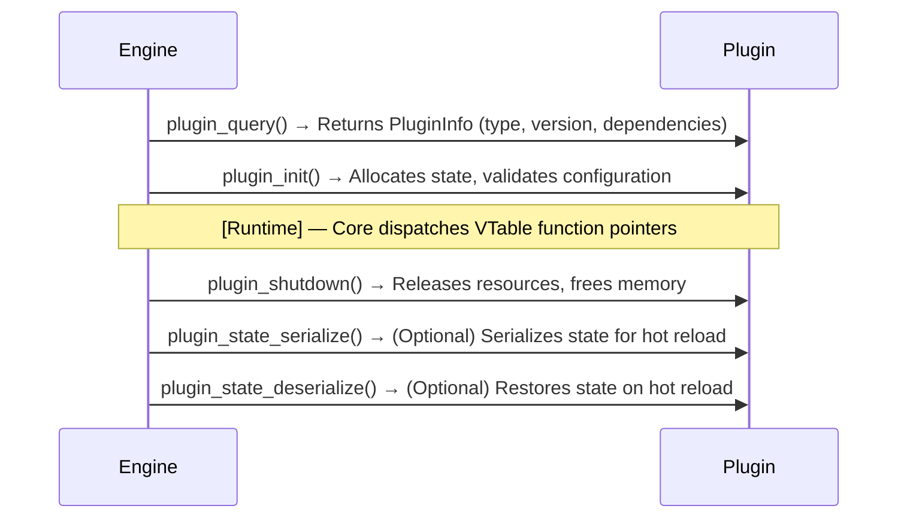
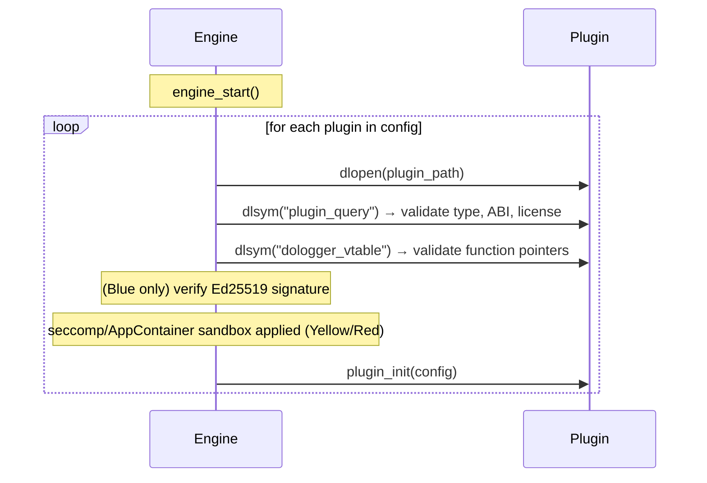
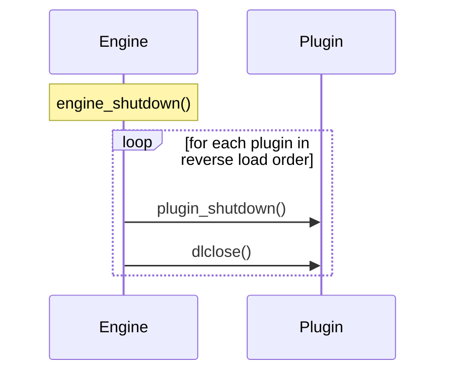

# DoLogger Plugin Development Guide

> 🌐 **语言 / Language**: [English](PluginDevelopmentGuide.md) | [中文：插件开发指南](../../zh_CN/guides/PluginDevelopmentGuide.md)

> **Version**: v0.1.0 | **Last Updated**: 2026-08-12 | **Target Audience**: Plugin Developers
>
> **Purpose**: This document describes the end-to-end process of developing, testing, signing, and distributing a DoLogger plugin. It covers the plugin lifecycle, all 10 VTable types, the manifest format, sandbox constraints, and license compliance requirements.
>
> **Reading Path**: New plugin authors should start with [Overview](#overview) and [Quick Start](#quick-start), then consult the VTable section for their specific plugin type. Security-conscious developers should read the [Three-Color Trust Model](#three-color-trust-model) and [Sandbox Constraints](#sandbox-constraints) sections in full.

## Table of Contents

1. [Overview](#overview)
2. [Quick Start](#quick-start)
3. [Plugin Types](#plugin-types)
4. [Plugin Manifest](#plugin-manifest)
5. [C ABI Interface Specification](#c-abi-interface-specification)
6. [VTable Implementation Guide](#vtable-implementation-guide)
7. [Three-Color Trust Model](#three-color-trust-model)
8. [Sandbox Constraints](#sandbox-constraints)
9. [License Compliance](#license-compliance)
10. [Testing and Debugging](#testing-and-debugging)
11. [Packaging and Distribution](#packaging-and-distribution)
12. [Lifecycle and State Management](#lifecycle-and-state-management)

---

## Overview

A DoLogger plugin is a shared library (`.so` / `.dylib` / `.dll`) that exports a standard set of C ABI symbols. The core engine discovers, loads, verifies, and calls these symbols through statically defined virtual method tables (VTables).

### Plugin Lifecycle



### Design Philosophy

Plugins follow the **VTable + ABI gate** pattern:

- Each plugin type has a fixed VTable struct of function pointers.
- The engine calls through the VTable — never directly.
- Missing optional functions are represented by `NULL` pointers.
- The ABI version gate prevents loading mismatched plugins.

---

## Quick Start

### Minimal Filter Plugin (C)

(based on the real definitions in `core/include/dologger_core.h`, verified by
compiling with MSVC on Windows; for a complete buildable version see
`plugins/examples/filter/c/example_filter/example_filter.c`):

```c
#include "dologger_core.h"

static int g_min_level = DO_LOG_WARN;

// Forward declaration: the filter function is referenced by the VTable.
static int my_filter(const dologger_record_handle_t *rec, void *config);

static dologger_filter_vtable_t g_vtable = {
    .filter = my_filter,
};

static dologger_plugin_info_t g_info = {
    .name        = "example-filter",
    .version     = 0x000100,    // 0.1.0
    .abi_version = 0x000100,    // core ABI 0.1.0
    .phase       = DO_LOG_PHASE_FILTER,
    .vtable      = &g_vtable,
};

dologger_plugin_info_t *plugin_query(uint32_t core_abi_version) {
    (void)core_abi_version;   // production plugins should validate
                              // compatibility and return NULL on mismatch
    return &g_info;
}

int plugin_init(const void *config) {
    // Allocate state, validate config; `config` is an opaque configuration
    // passed in by the engine.
    (void)config;
    return 0;
}

// VTable filter function: return non-zero to drop the record.
static int my_filter(const dologger_record_handle_t *rec, void *config) {
    // `config` carries the record level (int); drop records below g_min_level.
    int level = config ? *(const int *)config : DO_LOG_TRACE;
    return (level < g_min_level) ? 1 : 0;
}

int plugin_shutdown(void) {
    // Free state.
    return 0;
}
```

### Build Commands

```bash
# Linux
cc -shared -fPIC -o dologger-plugin-filter-c.so example_filter.c -I/path/to/dologger/include

# macOS
cc -dynamiclib -o dologger-plugin-filter-c.dylib example_filter.c -I/path/to/dologger/include

# Windows (MSVC)
cl /LD /Fe:example_filter.dll example_filter.c /I C:\path\to\dologger\include
```

### Loading the Plugin

```toml
# (illustrative — the v0.1.0 engine does not read a [plugins] section from
# dologger.toml; plugins are discovered in ./plugins and /usr/lib/dologger/plugins)
# dologger.toml
[plugins.drop-debug]
type = "filter"
path = "./plugins/drop_debug.so"
```

---

## Plugin Types

DoLogger defines 10 plugin types, each with its own VTable. Plugins are dispatched by phase in the pipeline.

**Table 1: Plugin Types and Pipeline Phases**

| # | Type                | Phase      | Stage | Responsibility |
|:-:|:-:|:-:|:-:|:-:|
| 1 | `Filter`            | `filter`   | 1     | Drop or retain records based on criteria (level, field, rate). |
| 2 | `PolicyProvider`    | `prefilter`| Pre-1 | Rate limiting, drop strategy, circuit breaker policy. |
| 3 | `FieldProvider`     | `field`    | 2     | Inject custom fields into the record before processing. |
| 4 | `HostInfoProvider`  | `field`    | 2     | Inject host, process, and environment metadata. |
| 5 | `Processor`         | `process`  | 4     | Transform, redact, or enrich log content. |
| 6 | `Formatter`         | `format`   | 5     | Serialize records (JSON, CSV, plain text, custom binary). |
| 7 | `IOSink`            | `sink`     | 6     | Write formatted output to an external destination. |
| 8 | `ConfigProvider`    | `config`   | —     | Load configuration from external sources (Vault, etcd, S3). |
| 9 | `KeyProvider`       | `key`      | —     | Manage Ed25519 key material for log signing. |
| 10| `SyscallBroker`     | `syscall`  | —     | Proxy platform syscalls for sandboxed plugins. |

### Pipeline Phase Ordering

```text
(illustrative pipeline ordering — the shipped v0.1.0 phases are defined in
core/include/dologger_core.h as DO_LOG_PHASE_* bit flags)
PreFilter → Filter → Field → Process → Format → Sink
   (2)       (1)     (3,4)    (5)      (6)      (7)
```

Plugins within the same phase execute in the order they were loaded (declaration order in the configuration file, then alphabetical by plugin name).

---

## Plugin Manifest

Every plugin **MUST** ship a `manifest.toml` file. The engine validates manifests at load time and rejects plugins that fail validation.

### Complete Manifest Example

```toml
# (structure verified against plugins/official/*/PluginManifest.toml;
# sections marked "planned" are not yet parsed by the v0.1.0 engine)
[plugin]
name = "json-formatter"
version = "2.1.0"
plugin_type = "formatter"
mount_phase = ["format"]
abi_version = 1
min_core_abi = "0.1.0"     # Minimum core version required
description = "Formats log records as newline-delimited JSON"

[plugin.trust]
color = "blue"

[plugin.author]
name = "DoLogger Core Team"
email = "nekoliowork+DoLogger@gmail.com"
url = "https://github.com/dologger/json-formatter"

[dependencies]
# (planned — not yet parsed by the v0.1.0 engine; field-level validation
# is prepared in core/src/plugin/dependency.rs)
requires_fields = ["record.id", "record.timestamp", "host.name"]

[capabilities]
file_read = false
file_write = false
network = false
process_create = false

[licenses]
spdx = "MIT"
third_party = [  # (planned)
    { name = "serde_json", spdx = "MIT", url = "https://github.com/serde-rs/json" }
]

[compatibility]
# (planned — v0.1.0 enforces `abi_version` equality instead)
min_engine_version = "0.1.0"
max_engine_version = "0.2.0"
```

### Manifest Field Reference

**Table 2: `[plugin]` Section**

| Field            | Required | Type     | Description |
|:-:|:-:|:-:|:-:|
| `name`           | Yes      | string   | Unique plugin identifier. Lowercase kebab-case recommended. |
| `version`        | Yes      | string   | Semantic version (semver 2.0). |
| `plugin_type`    | Yes      | string   | One of the 10 types listed in [Plugin Types](#plugin-types). |
| `mount_phase`    | Yes      | string[] | Pipeline phase(s) the plugin attaches to. |
| `abi_version`    | Yes      | integer  | ABI version this plugin was compiled against. |
| `description`    | No       | string   | Short human-readable description (max 200 chars). |

**Table 3: `[plugin.trust]` Section**

| Field   | Required | Values              | Description |
|:-:|:-:|:-:|:-:|
| `color` | Yes      | `blue`, `yellow`, `red` | Trust tier. See [Three-Color Trust Model](#three-color-trust-model). |

**Table 4: `[capabilities]` Section**

| Field            | Default | Description |
|:-:|:-:|:-:|
| `file_read`      | false   | Whether the plugin needs filesystem read access. |
| `file_write`     | false   | Whether the plugin needs filesystem write access. |
| `network`        | false   | Whether the plugin needs network access. |
| `process_create` | false   | Whether the plugin may spawn child processes. |

Capabilities declared `true` are only granted if the trust color permits them. A Red plugin declaring `file_read = true` will have the request silently denied, and a `SANDBOX_VIOLATION` event will be emitted if the plugin attempts the operation anyway.

**Table 5: `[licenses]` Section**

| Field         | Required | Description |
|:-:|:-:|:-:|
| `spdx`        | Yes      | SPDX license identifier for the plugin itself. |
| `third_party` | No       | Array of `{name, spdx, url}` objects for bundled dependencies. |

---

## C ABI Interface Specification

> [!NOTE]
> The shipped v0.1.0 header (`core/include/dologger_core.h`) defines the ABI shown first in each block below: `plugin_query(uint32_t core_abi_version)` returning a `dologger_plugin_info_t` with `{name, version, abi_version, phase, vtable}`, plus `int plugin_init(const void *config)` / `int plugin_shutdown(void)`, and VTable layouts with only the required callbacks (e.g. Filter = a single `filter` function that returns non-zero to drop). Everything marked pseudocode describes the planned v1.0 ABI (not compiled). Always code against the shipped header; this guide tracks the intended direction.

### Required Exports

Every plugin **MUST** export the following symbols:

```c
// (v0.1.0 actual signatures — see core/include/dologger_core.h)
// Query plugin information (must export).
dologger_plugin_info_t *plugin_query(uint32_t core_abi_version);

// Initialize the plugin (must export). `config` is an opaque configuration
// passed in by the engine.
int plugin_init(const void *config);

// Shut down the plugin and release all resources (must export).
int plugin_shutdown(void);
```

### Optional Exports

```c
// (pseudocode — planned optional exports for hot reload; v0.1.0 has no
// dologger_state_buf_t)
// dologger_error_t plugin_state_serialize(dologger_state_buf_t *out);
// dologger_error_t plugin_state_deserialize(const dologger_state_buf_t *in);
```

If `plugin_state_serialize` or `plugin_state_deserialize` is not exported, the engine skips state transfer during hot reload and the plugin reinitializes from scratch.

### VTable Export Convention

In v0.1.0 the VTable is **not** a separate exported symbol: the loader resolves
only `plugin_query`, and the VTable is carried by the returned
`dologger_plugin_info_t` (`vtable` field). Exporting a standalone
`dologger_vtable` symbol is part of the planned v1.0 ABI:

```c
// (pseudocode — illustrative of the planned v1.0 ABI, not compiled)
// For Filter plugins:
const dologger_filter_vtable_t dologger_vtable;

// For Formatter plugins:
const dologger_formatter_vtable_t dologger_vtable;

// ... and so on for each type.
```

In the planned design the engine looks up the symbol `dologger_vtable` via `dlsym` / `GetProcAddress`. The symbol name is the same for all plugin types; the engine dispatches based on `plugin_query()->plugin_type`.

### ABI Compatibility

The ABI version is bumped on breaking changes to:

- VTable struct layout (field addition, removal, or reordering)
- `dologger_plugin_info_t` struct changes
- Callback function signature changes

In v0.1.0 the header has **no global `DO_LOG_ABI_VERSION` macro**: the engine passes its `core_abi_version` to `plugin_query()`, and the plugin declares the ABI it was built against in `dologger_plugin_info_t::abi_version` (e.g. `0x000100` = 0.1.0). A production plugin should validate the passed-in version and return `NULL` on mismatch; the engine refuses to load a plugin whose declared `abi_version` does not match.

---

## VTable Implementation Guide

### Filter Plugin

```c
// (v0.1.0 actual definition — see core/include/dologger_core.h)
typedef struct {
    /** Return non-zero to drop the record. MUST NOT perform I/O. */
    int (*filter)(const dologger_record_handle_t *rec, void *config);
} dologger_filter_vtable_t;
```

```c
// (pseudocode — planned v1.0 ABI extension, not compiled)
typedef struct {
    dologger_filter_fn_t       filter;        // Required: evaluate a single record
    dologger_filter_batch_fn_t filter_batch;  // Optional: evaluate a batch
} dologger_filter_vtable_t;

typedef dologger_error_t (*dologger_filter_fn_t)(
    dologger_record_t        *record,
    dologger_filter_result_t *result
);

typedef dologger_error_t (*dologger_filter_batch_fn_t)(
    dologger_record_t        *records,
    size_t                    count,
    dologger_filter_result_t *results    // Array of `count` results
);
```

**Filter Actions (planned v1.0 ABI — v0.1.0 filters simply return non-zero to drop):**

| Action                | Meaning |
|:-:|:-:|
| `DO_LOG_FILTER_PASS`  | Record proceeds to the next phase. |
| `DO_LOG_FILTER_DROP`  | Record is discarded silently. |
| `DO_LOG_FILTER_MARK`  | Record passes but is tagged for sysmon monitoring. |

If `filter_batch` is provided (non-NULL), the engine uses it for batch evaluation. Otherwise it calls `filter` once per record.

### Formatter Plugin

```c
// (pseudocode — illustrative of the planned v1.0 ABI, not compiled)
typedef struct {
    dologger_format_fn_t       format;
    dologger_format_flush_fn_t flush;        // Optional
} dologger_formatter_vtable_t;

typedef dologger_error_t (*dologger_format_fn_t)(
    const dologger_record_t *record,
    dologger_buf_t          *output           // Caller-provided buffer
);
```

The `output` buffer is allocated by the engine. The formatter writes serialized bytes into it. If the buffer is too small, return `DO_LOG_ERR_BUFFER_TOO_SMALL` and the engine reallocates.

### IOSink Plugin

```c
// (pseudocode — illustrative of the planned v1.0 ABI, not compiled)
typedef struct {
    dologger_sink_open_fn_t   open;
    dologger_sink_write_fn_t  write;
    dologger_sink_flush_fn_t  flush;
    dologger_sink_close_fn_t  close;
    dologger_sink_health_fn_t health;          // Optional: returns sink status
} dologger_sink_vtable_t;

typedef dologger_error_t (*dologger_sink_write_fn_t)(
    void        *sink_state,
    const uint8_t *data,
    size_t        length
);

typedef dologger_sink_health_t (*dologger_sink_health_fn_t)(
    void *sink_state
);
```

**Sink Health States:**

| State                     | Description |
|:-:|:-:|
| `DO_LOG_SINK_HEALTHY`     | Sink is accepting writes normally. |
| `DO_LOG_SINK_DEGRADED`    | Sink is slow but functioning. |
| `DO_LOG_SINK_CIRCUIT_OPEN`| Circuit breaker tripped; writes are rejected. |

### KeyProvider Plugin

```c
// (pseudocode — illustrative of the planned v1.0 ABI, not compiled)
typedef struct {
    dologger_key_sign_fn_t       sign;
    dologger_key_public_key_fn_t public_key;
    dologger_key_rotate_fn_t     rotate;        // Optional
} dologger_keyprovider_vtable_t;

typedef dologger_error_t (*dologger_key_sign_fn_t)(
    void             *key_state,
    const uint8_t    *message,
    size_t            message_len,
    dologger_sig_t   *signature_out
);
```

A `KeyProvider` is the primary extension point for production deployments that require HSM-backed or cloud KMS-backed signing keys. When a `KeyProvider` is loaded, the built-in ephemeral key generator is disabled.

### Error Handling in VTable Functions

All VTable functions return `dologger_error_t`. The engine handles errors as follows:

| Return Value        | Engine Behavior |
|:-:|:-:|
| `DO_LOG_OK`         | Normal; record proceeds. |
| Non-fatal error     | Record is dropped; error is logged to sysmon. |
| `DO_LOG_ERR_FATAL`  | Plugin is unloaded; `SINK_CIRCUIT_OPEN` for Sinks. |

Never call `exit()`, `abort()`, or `panic!()` from within a VTable function. Return an error code instead.

---

## Three-Color Trust Model

DoLogger classifies every plugin into one of three trust tiers. The tier determines sandbox restrictions, field permission ring access, and signing requirements. See the [Security Whitepaper](SecurityWhitepaper.md#plugin-trust-model-and-sandbox-isolation) for the threat model and security rationale.

**Table 6: Trust Tier Comparison**

| Property               | Blue (Full Trust)         | Yellow (Partial Trust)   | Red (Zero Trust)          |
|:-:|:-:|:-:|:-:|
| **Signer**             | DoLogger team Ed25519     | Third-party developer    | Community / unsigned      |
| **Signature required** | Yes (verified at load)    | Recommended              | Not required              |
| **Sandbox**            | None                      | Restricted (seccomp/AppContainer) | Maximum isolation   |
| **File I/O**           | Full access               | Read + write allowed     | Denied                    |
| **Network**            | Full access               | Denied                   | Denied                    |
| **Process creation**   | Allowed                   | Denied                   | Denied                    |
| **Field write access** | Ring 2 (`verified.*`)     | Ring 2 (`verified.*`)    | Ring 3 (`ext.*`)          |
| **Field read access**  | All rings (0–3)           | Rings 0–3                | Rings 0–3                 |

### Blue Plugin Requirements

1. Build must be signed with the DoLogger team Ed25519 key.
2. Public key distributed via the official plugin repository.
3. Signature verified at engine startup. If verification fails, the plugin is **not loaded**.
4. Source repository must be under `github.com/dologger/`.

### Yellow Plugin Requirements

1. Plugin author must provide a valid `manifest.toml`.
2. Recommended but not required: PGP or Ed25519 detached signature.
3. Capability declarations are enforced — declaring `network = true` in a Yellow plugin will trigger a load-time rejection.

### Red Plugin

1. No signing requirement.
2. Maximum sandbox isolation is enforced unconditionally.
3. Red plugins may be loaded only if `allow_red_plugins = true` in the engine configuration. Default: `false`.

---

## Sandbox Constraints

### Linux (seccomp-bpf)

**Table 7: Allowed syscall groups by trust color**

| Group        | Example syscalls                     | Blue | Yellow | Red  |
|:-:|:-:|:-:|:-:|:-:|
| Memory       | `mmap`, `munmap`, `mprotect`, `brk`  | Yes  | Yes    | Yes  |
| Threading    | `futex`, `clone`, `set_robust_list`  | Yes  | Yes    | Yes  |
| Time         | `clock_gettime`, `gettimeofday`      | Yes  | Yes    | Yes  |
| Signal       | `sigaction`, `sigreturn`, `tgkill`   | Yes  | Yes    | No   |
| SystemInfo   | `uname`, `getpid`, `getrandom`       | Yes  | Yes    | Yes  |
| FileIO       | `open`, `read`, `write`, `close`    | Yes  | Yes    | No   |
| Network      | `socket`, `connect`, `sendto`        | Yes  | No     | No   |
| Process      | `fork`, `execve`, `wait4`            | Yes  | No     | No   |

**Violation behavior**: When a Yellow or Red plugin invokes a disallowed syscall, seccomp-bpf returns `SECCOMP_RET_KILL_PROCESS`. The plugin thread is terminated, and a `SANDBOX_VIOLATION` sysmon event is emitted with the plugin name and syscall number.

### Windows (AppContainer)

Windows sandboxing uses LowBox Token + Restricted SID:

- Yellow plugins: LowBox token with `WIN://NO_NETWORK` and `WIN://NO_PROCESS_CREATION` capability SIDs removed.
- Red plugins: Full AppContainer isolation with no capability SIDs.

Full process-level isolation is planned for M4.

### macOS (App Sandbox)

Sandbox profiles are applied via `sandbox_init(3)` with seatbelt/SBPL rules. M4 will implement complete sandbox profiles per trust tier.

### Capability Declaration Enforcement

The engine cross-references `[capabilities]` in the manifest against the trust color. If a plugin requests a capability its trust tier does not allow, the engine logs a warning and denies the capability. Example:

```text
(illustrative example output)
[WARN ] plugin 'my-plugin' (yellow) requested capability 'network' which is denied
        by the yellow trust tier. The declaration is ignored.
```

---

## License Compliance

### SPDX Compatibility Matrix

DoLogger enforces a license policy: plugins are classified by their SPDX identifier.

**Table 8: License Categories and Allowability**

| Category | SPDX Identifiers                          | Blue | Yellow | Red  |
|:-:|:-:|:-:|:-:|:-:|
| A        | MIT, Apache-2.0, BSD-2-Clause, BSD-3-Clause, ISC, Zlib, Unlicense | Yes | Yes | Yes |
| B        | MPL-2.0, LGPL-3.0-or-later                | Yes  | Yes    | No*  |
| C        | GPL-2.0-only, GPL-3.0-only                | No   | No     | No   |
| D        | BSL, SSPL, AGPL-3.0                       | No   | No     | No   |
| E        | Proprietary, no license specified         | No   | No     | No   |

\* LGPL-3.0 is permitted only with dynamic linking. Static linking into the engine is prohibited.

### Automated License Checking

```bash
# Scan all workspace dependencies
cargo deny check licenses

# Scan a specific plugin's dependencies
cargo deny check licenses --manifest-path plugins/my-plugin/Cargo.toml

# Check for security advisories
cargo deny check advisories
cargo audit
```

The project `deny.toml` (repository root) configures the allow/deny lists. CI enforces these checks on every pull request.

(Note: the repository's current `deny.toml` uses the `[licenses.allow]` v2 mapping format, which is incompatible with the array format expected by cargo-deny 0.x — use cargo-deny 1.x+ or adjust `deny.toml` for this command to pass.)

### Writing Compliant Plugins

1. Always specify an SPDX identifier in your `manifest.toml` `[licenses]` section.
2. List all third-party dependencies with their SPDX identifiers.
3. Category C, D, and E licenses will be rejected at load time by the engine's license policy checker.
4. If you cannot comply with the license policy, the engine will refuse to load your plugin and emit a `LICENSE_POLICY_VIOLATION` sysmon event.

---

## Testing and Debugging

### Unit Testing

```bash
# Build and test a single plugin
cargo test -p my-plugin

# Run with backtrace on failure
RUST_BACKTRACE=1 cargo test -p my-plugin

# Run a specific test
cargo test -p my-plugin -- test_filter_drop_debug
```

### Integration Testing

```bash
# Start DoLogger and load the plugin — v0.1.0 auto-scans ./plugins and
# /usr/lib/dologger/plugins (a [plugins] section in the config is not read)
cp ./target/debug/libmy_filter.so ./plugins/
dologctl run --trace

# Alternative: run the simple logger example (uses
# DologgerConfig::dev_profile() — it does not read a config path argument
# in v0.1.0)
cargo run --example simple_logger
```

### Diagnostic Log

The engine writes diagnostics to `dologger_internal.log` (permissions 0600). Plugin authors should watch this file during development:

```bash
tail -f dologger_internal.log | grep "\[PLUGIN\]"
```

Relevant diagnostic entries include:

```text
(illustrative example output)
[PLUGIN] loaded 'drop-debug' (filter, yellow) from ./plugins/drop_debug.so
[PLUGIN] vtable 'filter' registered — 1 function pointers (filter, filter_batch=NULL)
[PLUGIN] unloaded 'drop-debug' — 0 leaked allocations
```

### Debugging Checklist

1. **Load failure**: Check the ABI version — `plugin_query()->abi_version` must match `DO_LOG_ABI_VERSION` from the target engine.
2. **Symbol not found**: Use `nm -D` (Linux) or `dumpbin /EXPORTS` (Windows) to verify symbol exports.
3. **Sandbox violation**: Review `[capabilities]` in the manifest. Ensure declared capabilities match the trust tier.
4. **Segfault in VTable**: Check for NULL VTable function pointers. Optional functions should be `NULL`, not uninitialized.
5. **License rejected**: Verify the SPDX identifier in `manifest.toml` against [Table 8](#license-compliance).

---

## Packaging and Distribution

### Artifact Layout

```text
(illustrative artifact layout)
my-plugin-1.0.0/
├── manifest.toml
├── libmy_plugin.so           # Linux x86_64
├── libmy_plugin.aarch64.so   # Linux aarch64
├── libmy_plugin.dylib        # macOS x86_64
├── libmy_plugin.arm64.dylib  # macOS aarch64
├── my_plugin.dll             # Windows x86_64
├── LICENSE
└── README.md
```

### Naming Convention

- Directory: `<plugin-name>-<version>` (e.g., `json-formatter-2.1.0`)
- Shared library: `lib<plugin_name>.<ext>` with underscores replacing hyphens.

### Signing Blue Plugins

```bash
# (planned — no `dologctl sign` command ships in v0.1.0)
# Generate a detached Ed25519 signature
dologctl sign plugin \
    --plugin ./my-plugin-1.0.0/libmy_plugin.so \
    --key    /secure/dologger-signing.key \
    --output ./my-plugin-1.0.0/libmy_plugin.so.sig

# The .sig file must accompany the .so file in the distribution
```

### Official Plugin Repository (M4)

```bash
# (planned — v0.1.0 ships only: plugin install <path>, plugin list, plugin
# remove <name>, plugin verify [name], plugin scan)
# Search the registry
dologctl plugin search kafka

# Install a plugin from the registry
dologctl plugin install kafka-sink

# List installed plugins
dologctl plugin list

# Verify plugin integrity
dologctl plugin verify my-plugin

# Update all plugins
dologctl plugin update --all
```

### Distribution Checklist

- [ ] `manifest.toml` is complete and valid
- [ ] All required C ABI symbols are exported
- [ ] VTable function pointers are populated (NULL for unsupported optional functions)
- [ ] License is Category A or B (C, D, E will be rejected)
- [ ] Blue plugins: `.sig` file accompanies the shared library
- [ ] Shared library is stripped (`strip --strip-all`) for production
- [ ] `README.md` explains configuration keys and provides a usage example

---

## Lifecycle and State Management

### Initialization Sequence



### Shutdown Sequence



### Hot Reload

Plugins that export `plugin_state_serialize` and `plugin_state_deserialize` support hot reload without data loss:

```text
(pseudocode — illustrative)
hot_reload:
  old_plugin_state = plugin_state_serialize()
  dlclose(old_plugin)
  dlopen(new_plugin)
  plugin_init(config)
  plugin_state_deserialize(old_plugin_state)
  free(old_plugin_state)
```

If state serialization is not supported, hot reload reinitializes the plugin from scratch, and any in-memory state is lost.

### Memory Ownership Rules

| Allocation | Owner | Free Responsibility |
|:-:|:-:|:-:|
| State allocated in `plugin_init()` | Plugin | Free in `plugin_shutdown()` |
| `dologger_state_buf_t` from `plugin_state_serialize()` | Engine | Engine frees after deserialization |
| VTable function parameters (`record`, `result`) | Engine | Engine owns; plugin must not free |
| `dologger_plugin_info_t` returned by `plugin_query()` | Plugin | Static; persists until `dlclose()` |

Plugins **MUST NOT** free memory they did not allocate. The engine will detect double-frees via allocation tracking in debug builds.
