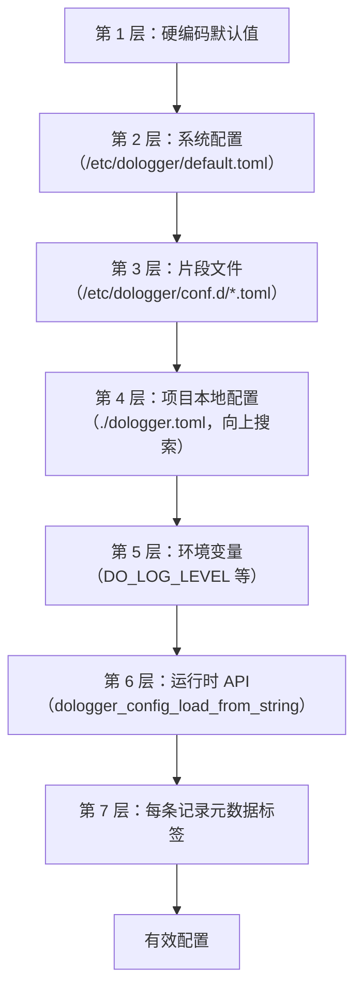
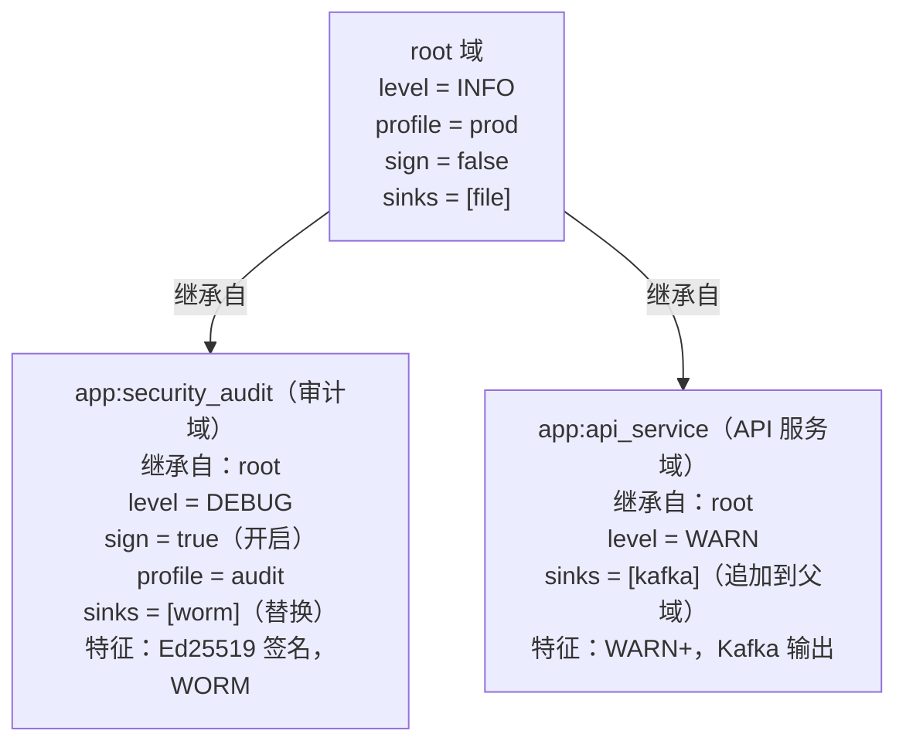
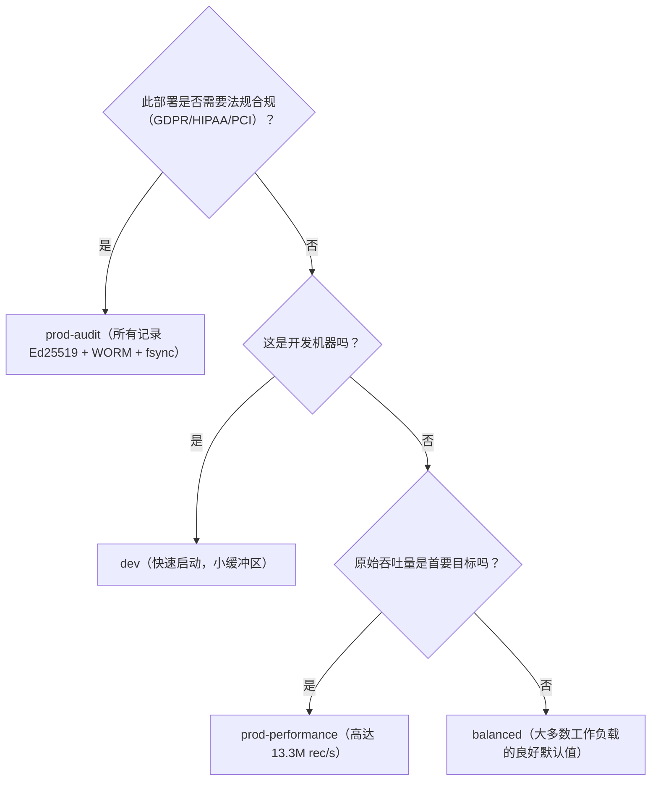
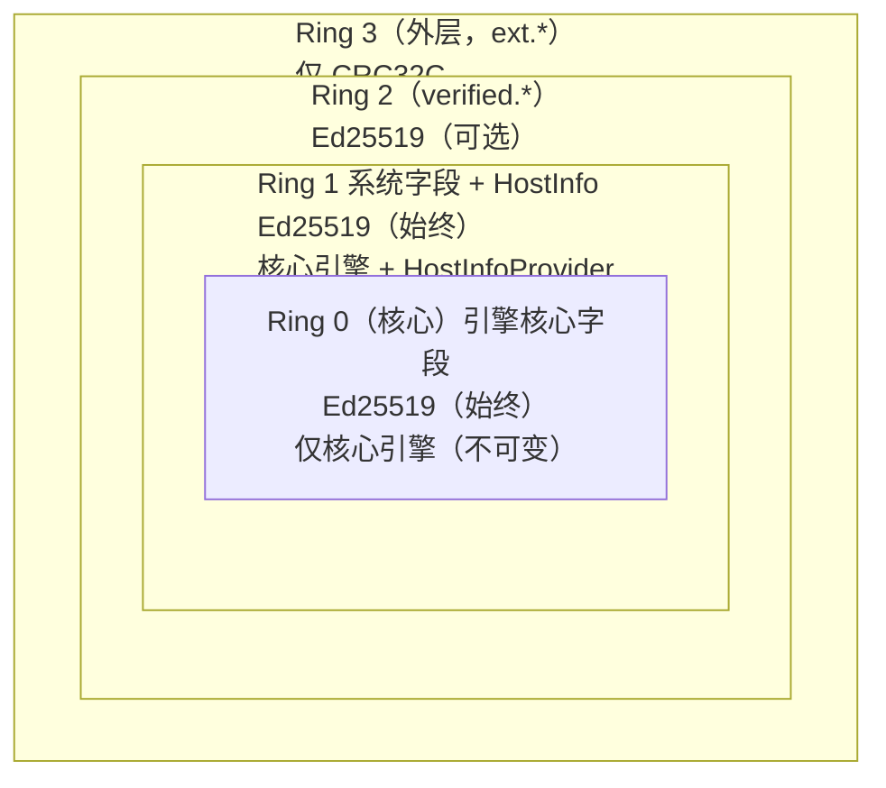

# DoLogger 集成指南

> **版本**: v0.1.0 | **最后更新**: 2026-08-12 | **目标受众**: 应用程序开发者
>
> **用途**: 了解如何将 DoLogger 嵌入到您的应用程序中。涵盖 C API、配置、域继承、插件选择和语言适配器。如果您是全新用户，请先阅读[快速开始指南](QuickStart.md)。
>
> 🌐 **语言 / Language**: [中文](IntegrationGuide.md) | [English: DoLogger Integration Guide](../en_US/IntegrationGuide.md)
>
> **阅读路径**: C 开发者应阅读 [C API 基础](#c-api-基础)和[配置详解](#配置详解)。Rust 开发者可跳至[语言适配器](#语言适配器)。完整的 C ABI 参考（包含每个函数签名和错误码）请参见[宿主集成指南](guides/HostIntegrationGuide.md)。

---

## 目录

1. [开始之前](#开始之前)
2. [C API 基础](#c-api-基础)
3. [配置详解](#配置详解)
4. [域继承](#域继承)
5. [性能配置文件选择指南](#性能配置文件选择指南)
6. [记录字段系统](#记录字段系统)
7. [插件选择指南](#插件选择指南)
8. [语言适配器](#语言适配器)
9. [常用模式与示例](#常用模式与示例)
10. [故障排查 FAQ](#故障排查-faq)

---

## 开始之前

### 前提条件

- DoLogger 引擎库已构建并在您的系统上可用。构建说明参见[快速开始指南](QuickStart.md)。
- 用于 C API 集成的 C 编译器（GCC、Clang 或 MSVC）。Rust/Python/Go 适配器不需要。
- 基本了解 TOML 配置语法。

### 您将获得什么

集成后，您的应用程序可以：
- 以 102 ns 中位延迟提交日志记录
- 同时输出到 11 种不同的接收器类型
- 维护加密可验证的审计追踪（Ed25519 + LSN 链）
- 使用不会危及您应用程序的沙箱插件扩展日志记录

### 集成方式

| 方式 | 何时使用 | 延迟 | 隔离性 |
|:-:|:-:|:-:|:-:|
| **嵌入式**（动态链接） | 您控制二进制文件，需要最低延迟 | 最低（102 ns P50） | 共享进程 |
| **Sidecar**（sink_shm） | 多语言服务，故障隔离 | 低（约 1 us） | 独立进程 |
| **Daemon**（本地套接字） | 遗留应用程序，系统级日志记录 | 中等 | 独立进程 |

---

## C API 基础

### 初始化、记录、关闭

最简集成只需三个函数调用。完整函数签名和错误处理请参见[宿主集成指南](guides/HostIntegrationGuide.md)。

```c
#include "dologger_core.h"
#include <stdio.h>

int main(void) {
    dologger_error_t err = {0};

    // 1. 使用默认配置初始化（NULL = 自动发现配置）
    dologger_handle_t *logger = dologger_init(NULL, &err);
    if (logger == NULL) {
        fprintf(stderr, "init failed (code=%d): %s\n", err.code, err.message);
        return 1;
    }

    // 2. 提交一条日志记录
    dologger_record_params_t params = {
        .level   = DO_LOG_INFO,
        .message = "Application started successfully",
    };
    dologger_log(logger, &params);

    // 3. 关闭（排空进行中的记录）
    dologger_shutdown(logger);
    return 0;
}
```

### 便捷宏

(伪代码 — 规划中的便捷宏，v0.1.0 的 `dologger_core.h` 尚未提供。当前需手动填充 `dologger_record_params_t` 的 `source_file`/`source_function`/`source_line` 字段)：

```c
DO_LOG_TRACE(h, "Frame-level detail: variable x = %d", x);
DO_LOG_DEBUG(h, "Diagnostic: connection pool size = %d", pool_size);
DO_LOG_INFO(h,  "User %s logged in from %s", username, ip);
DO_LOG_WARN(h,  "Retry %d/3 for upstream service %s", attempt, svc);
DO_LOG_ERROR(h, "Database query failed: %s", db_error);
DO_LOG_FATAL(h, "Unrecoverable error in module %s -- shutting down", module);
DO_LOG_AUDIT(h, "User %s deleted record id=%s -- non-repudiable", user, rec_id);
```

### 日志级别

| 级别 | 常量 | 用途 |
|:-:|:-:|:-:|
| TRACE | `DO_LOG_TRACE` | 帧级细节。生产中谨慎使用。 |
| DEBUG | `DO_LOG_DEBUG` | 开发者诊断信息。 |
| INFO | `DO_LOG_INFO` | 正常运行事件。 |
| WARN | `DO_LOG_WARN` | 可能有危害的情况。 |
| ERROR | `DO_LOG_ERROR` | 不会停止应用程序的错误。 |
| FATAL | `DO_LOG_FATAL` | 导致终止的严重错误。 |
| AUDIT | `DO_LOG_AUDIT` | 不可否认的审计记录。在背压下可能阻塞。 |

### 链接

**Linux / macOS：**
```bash
cc -o myapp myapp.c -ldologger_core -L/usr/lib/dologger
```

**Windows（MSVC）：**
```bash
cl /Fe:myapp.exe myapp.c dologger_core.lib
```

### 验证 ABI

```c
// v0.1.0 没有 dologger_get_abi_version()；
// 通过 dologger_version() 查询引擎版本
printf("DoLogger core: %s\n", dologger_version());
```

---

## 配置详解

### 配置如何解析

DoLogger 使用 7 层优先级系统。编号越低的层优先级越低：



不可降级项：各层只能收紧安全，绝不能放松。

### 核心配置键

```toml
[dologger]
# -- 必需 --
level = "INFO"                          # 最低日志级别
performance_profile = "prod-performance" # 性能预设

# -- 性能 --
ring_buffer_size = 262144               # 必须是 2 的幂
batch_size = 256                        # 每管道批次的记录数
enable_signature = false                # Ed25519 签名（AUDIT 必需）
ring_buffer_coop_helping = true         # 90% 满时生产者帮助排空

# -- 关闭 --
shutdown_policy = "graceful"            # "graceful" 或 "immediate"
shutdown_timeout_ms = 5000              # 等待排空的最长时间

# -- 密钥管理 --
key_rotation_grace_period_days = 7      # 轮换后旧密钥有效天数
```

### 环境变量

| 变量 | 覆盖项 | 示例 |
|:-:|:-:|:-:|
| `DO_LOG_LEVEL` | `level` | `DO_LOG_LEVEL=DEBUG` |
| `DO_LOG_BUF_SIZE` | `ring_buffer_size` | `DO_LOG_BUF_SIZE=524288` |
| `DO_LOG_PERF_PROFILE` | `performance_profile` | `DO_LOG_PERF_PROFILE=balanced` |
| `DO_LOG_CONFIG_FILE` | 配置文件路径 | `DO_LOG_CONFIG_FILE=/opt/app/dologger.toml` |
| `DO_LOG_PLUGIN_DIR` | 插件目录 | `DO_LOG_PLUGIN_DIR=/opt/app/plugins` |
| `DO_LOG_CONFIG_LOCK` | 禁止回退配置搜索（要求 `DO_LOG_CONFIG_FILE` 存在） | `DO_LOG_CONFIG_LOCK=1` |
| `DO_LOG_SIGN_KEY` | 签名密钥路径（计划中） | `DO_LOG_SIGN_KEY=/secure/signing.key` |
| `DO_LOG_VERIFY_KEY` | 验证密钥（计划中） | `DO_LOG_VERIFY_KEY=/secure/verify.pub` |

### 接收器配置

启用任意组合的接收器。所有启用的接收器接收每条记录：

```toml
# （示意 — v0.1.0 的 FileSinkConfig 仅含：path、max_size（字节）、fsync_on_write、
# durability_level、buffer_size；按时间滚动、压缩与保留均为规划中）
[sinks.console]
type = "sink_console"
enabled = false                         # 生产环境禁用

[sinks.file]
type = "sink_file"
enabled = true
path = "/var/log/dologger/app.log"
max_size = "100MB"
rotation_interval = "24h"
compression = "zstd"                    # gzip | zstd | none
retention_days = 90
retention_total_size = "10GB"

[sinks.kafka]
type = "sink_kafka"
enabled = false
brokers = ["kafka1:9092", "kafka2:9092", "kafka3:9092"]
topic = "app-logs"
tls = true
sasl_mechanism = "SCRAM-SHA-256"

[sinks.syslog]
type = "sink_syslog"
enabled = false
server = "syslog.internal:6514"
protocol = "tcp"
tls = true

[sinks.webhook]
type = "sink_webhook"
enabled = false
url = "https://logs.internal/api/v1/ingest"
bearer_token = "tok_abc123"
```

### 验证

部署前始终验证配置：

```bash
# 严格验证
dologctl config validate --config dologger.toml --strict

# 伪代码 — 规划中的功能，v0.1.0 尚无 --compliance 选项与 config show 子命令
# dologctl config validate --config dologger.toml --compliance gdpr
# dologctl config show --effective
```

---

## 域继承

### 概念

域允许您为应用程序的不同子系统定义独立的日志配置。子域从父域继承，且只能收紧安全设置。

### 图示



### 配置示例

```toml
# Root 域——为所有子域提供默认值
[dologger]
level = "INFO"
performance_profile = "prod-performance"
ring_buffer_size = 262144

[domains]

# 安全审计——独立审计追踪
[domains.security_audit]
inherits = "root"
level = "DEBUG"
enable_signature = true                 # 不可降级：不能放松
worm_enabled = true                     # 不可降级
performance_profile = "prod-audit"
sinks = ["worm_file", "security_file"]
array_merge_policy = "replace"          # 完全替换父域的接收器

# API 服务——Kafka 输出
[domains.api_service]
inherits = "root"
level = "WARN"                          # 仅 WARN 及以上
sinks = ["kafka_prod"]
array_merge_policy = "unique_append"    # 添加到父域接收器（无重复）
```

### 数组合并策略

| 策略 | 行为 |
|:-:|:-:|
| `replace` | 子域数组完全替换父域的 |
| `append` | 子域项目追加（可能重复） |
| `unique_append` | 仅当父域中不存在时才添加子域项目（默认） |

### 不可降级强制执行

六项安全项目只能被子域收紧。尝试放松它们会触发 `CONFIG_RELOAD_DENIED` 事件：

| 项目 | 收紧 | 放松（被拒绝） |
|:-:|:-:|:-:|
| `enable_signature` | `false` 到 `true` | `true` 到 `false` |
| `escape_html` | `false` 到 `true` | `true` 到 `false` |
| `worm_enabled` | `false` 到 `true` | `true` 到 `false` |
| `fsync_on_write` | `false` 到 `true` | `true` 到 `false` |
| `require_tls` | `false` 到 `true` | `true` 到 `false` |
| `sign_ring2` | `false` 到 `true` | `true` 到 `false` |

---

## 性能配置文件选择指南

### 配置文件对比

| 属性 | `dev` | `balanced` | `prod-performance` | `prod-audit` |
|:-:|:-:|:-:|:-:|:-:|
| Block timeout | 100 ms | 2000 ms | 3000 ms | 3000 ms |
| Drop 策略 | `drop_newest` | `oldest` | `below_warn` | `below_warn` |
| Ed25519 签名 | 关闭 | 可选 | 可选 | **必需** |
| WORM | 关闭 | 可选 | 可选 | **必需** |
| 批量大小 | 32 | 128 | 256 | 128 |
| 环形缓冲区大小 | 65536 | 131072 | 262144 | 262144 |
| `escape_html` | 可选 | 开启 | 开启 | **开启** |
| `fsync_on_write` | 关闭 | 关闭 | 可选 | **开启** |
| `require_tls` | 关闭 | 仅警告 | 开启 | **开启** |



### 性能数据

在 AMD Ryzen 9 7950X、DDR5-6000、Samsung 990 Pro NVMe 上测量：

| 场景 | 吞吐量 | P50 延迟 | P99 延迟 |
|:-:|:-:|:-:|:-:|
| Console 接收器，无签名 | 1,200,000 rec/s | 82 ns | 210 ns |
| File 接收器，无签名 | 950,000 rec/s | 105 ns | 380 ns |
| File 接收器，Ed25519 签名 | 58,000 rec/s | 17.1 us | 22.3 us |
| WORM 接收器，签名 + fsync | 12,000 rec/s | 83.4 us | 140 us |

---

## 记录字段系统

### 四个权限环

每条日志记录包含组织为四个权限环的字段，仿照 CPU 特权级别：



### Ring 0 -- 不可变核心字段

由引擎一次性设置。无插件可修改。

| 字段 | 类型 | 描述 |
|:-:|:-:|:-:|
| `record.id` | uint64 | 唯一雪花 ID |
| `record.timestamp` | uint64 | 纳秒精度的 UTC 时间戳 |
| `record.signature` | bytes[64] | 对 Ring 0+1 字段的 Ed25519 签名 |
| `record.origin_lsn` | uint64 | 日志序列号 |

### Ring 1 -- 系统上下文

由引擎和 `HostInfoProvider` 插件写入。所有其他插件只读。

| 字段 | 来源 |
|:-:|:-:|
| `level`、`message` | 应用程序通过 C API |
| `source_file`、`source_function`、`source_line` | 应用程序通过宏 |
| `thread_id`、`thread_name`、`process_id`、`process_name` | 引擎 |
| `host_name`、`container_id` | HostInfoProvider |
| `app_name`、`app_version` | 应用程序通过初始化参数 |
| `environment` | 配置或环境变量（`production`/`staging`/`development`） |

### Ring 2 -- 已验证的扩展

Blue 和 Yellow 插件写入 `verified.*` 命名空间。每次写入追加一条 `audit_tags` 条目，记录 `{plugin_id, plugin_version, timestamp, field}`。这创建了字段修改的防篡改历史。

（伪代码 — 仅示意 Ring 2 字段结构，非引擎实际输出）：

```json
{
  "verified.user_id": "u-12345",
  "verified.session_id": "sess-abcdef",
  "audit_tags": [
    {
      "plugin_id": "auth-field-provider",
      "plugin_version": "2.1.0",
      "timestamp": "2026-08-12T14:30:00.123Z",
      "action": "write",
      "field": "verified.user_id"
    }
  ]
}
```

### Ring 3 -- 不可信扩展

Red 插件写入 `ext.*`。这些字段仅具有 CRC32C（硬件加速完整性检查，非加密）。它们不受 Ed25519 签名覆盖。

### 从您的应用程序使用字段

```c
// 写入 Ring 1 字段（通过 HostInfoProvider 或环境变量）
// 自动填充——无需代码

// 写入 Ring 2 字段（通过 FieldProvider 插件）
// 在配置中加载 field_container 插件并配置其键

// 写入 Ring 3 字段（通过 dologger_field_set）
dologger_error_t err = {0};
dologger_field_set(record, "ext.my_key", "my_value", &err);
```

---

## 插件选择指南

### 插件类型和管道位置


### 您需要哪些插件？

| 如果您需要... | 使用此插件类型 | 官方插件 |
|:-:|:-:|:-:|
| 控制保留哪些记录 | `Filter` | `filter_level`、`filter_sampling`（计划中） |
| 为每条记录添加元数据 | `FieldProvider` | `field_container`、`field_cloud`（计划中） |
| 转换或脱敏内容 | `Processor` | `proc_pii_mask`（计划中） |
| 更改输出格式 | `Formatter` | `fmt_json`、`fmt_text` |
| 写入不同目标 | `IOSink` | 11 个内置接收器 |
| 使用外部签名密钥 | `KeyProvider` | `key_file`、`key_hsm`（计划中） |
| 强制速率限制 | `PolicyProvider` | 内置速率限制器 |

### 按用例推荐的插件集

**开发环境：**
```
（伪代码 — 插件组合示意，非命令）
fmt_text（人类可读的彩色输出）+ filter_level（在嘈杂模块中丢弃 DEBUG/TRACE）
```

**生产环境（吞吐量优先）：**
```
（伪代码 — 插件组合示意，非命令）
fmt_json（机器可解析）+ field_container（容器元数据）
```

**生产环境（合规）：**
```
（伪代码 — 插件组合示意，非命令）
fmt_json + field_container + proc_pii_mask（落盘前掩码 PII）
```

**审计/合规：**
```
（伪代码 — 插件组合示意，非命令）
key_file（持久签名密钥）+ fmt_json + proc_pii_mask
```

### 插件信任颜色

| 颜色 | 签名 | 系统调用访问 | 文件 I/O | 网络 | 进程创建 |
|:-:|:-:|:-:|:-:|:-:|:-:|
| **Blue** | Ed25519 必需 | 完全 | 完全 | 完全 | 允许 |
| **Yellow** | 推荐 | 受限 | 读+写 | 拒绝 | 拒绝 |
| **Red** | 不需要 | 最大隔离 | 拒绝 | 拒绝 | 拒绝 |

Red 插件默认禁用。使用 `allow_red_plugins = true` 启用。

---

## 语言适配器

### Rust

```toml
# Cargo.toml（本仓库内）
[dependencies]
dologger-sdk = { path = "adapters/rust" }
```

```rust
use dologger_sdk::Logger;

fn main() -> Result<(), Box<dyn std::error::Error>> {
    let mut logger = Logger::init(Some("dologger.toml"))?;

    logger.info("Hello from Rust host");

    logger.shutdown();
    Ok(())
}
```

Rust SDK 提供 RAII 句柄管理、所有错误码的 `Display` + `Error` 以及 `trace`/`debug`/`info`/`warn`/`error`/`fatal`/`audit` 便捷方法。

### Python

```python
import ctypes
import os
import platform

# 加载 DoLogger 核心库（与 tests/release-smoke/cabi_smoke.py 相同的 ctypes 模式）
# Windows 建议设置 DO_LOGGER_LIB_PATH 指向 dologger_core.dll 的完整路径；
# Linux/macOS 通常可直接按库名加载。
def _find_library():
    env_path = os.environ.get("DO_LOGGER_LIB_PATH")
    if env_path:
        return env_path
    if platform.system() == "Windows":
        return "dologger_core.dll"
    if platform.system() == "Darwin":
        return "libdologger_core.dylib"
    return "libdologger_core.so"

lib = ctypes.CDLL(_find_library())

class Err(ctypes.Structure):
    _fields_ = [("code", ctypes.c_int32), ("message", ctypes.c_char * 256),
                ("source_file", ctypes.c_char * 128), ("source_line", ctypes.c_uint32),
                ("_reserved", ctypes.c_uint8 * 12)]

class Params(ctypes.Structure):
    _fields_ = [("level", ctypes.c_int32), ("message", ctypes.c_char_p),
                ("source_file", ctypes.c_char_p), ("source_function", ctypes.c_char_p),
                ("source_line", ctypes.c_uint32), ("source_column", ctypes.c_uint32),
                ("domain", ctypes.c_char_p), ("user_id", ctypes.c_char_p),
                ("session_id", ctypes.c_char_p), ("request_id", ctypes.c_char_p),
                ("_reserved", ctypes.c_uint8 * 16)]

lib.dologger_init.argtypes = [ctypes.c_char_p, ctypes.POINTER(Err)]
lib.dologger_init.restype = ctypes.c_void_p
lib.dologger_log.argtypes = [ctypes.c_void_p, ctypes.POINTER(Params)]
lib.dologger_log.restype = ctypes.c_int32
lib.dologger_shutdown.argtypes = [ctypes.c_void_p]

err = Err()
h = lib.dologger_init(None, ctypes.byref(err))          # None = 自动发现配置
if not h:
    raise RuntimeError(f"dologger_init failed (code={err.code})")

p = Params(level=2, message=b"Hello from Python")
lib.dologger_log(h, ctypes.byref(p))
lib.dologger_shutdown(h)
```

（上面的包装模式已通过 `tests/release-smoke/cabi_smoke.py` 验证；仓库自带更友好的封装见 `adapters/python/dologger.py`——其中的 `DoLogger` 类可直接 `from dologger import DoLogger` 使用，已随 v0.1.0 实测运行）

### Go

```go
package main

import "github.com/dologger/adapters/go"

func main() {
    logger, err := dologger.NewLogger("dologger.toml")
    if err != nil {
        panic(err)
    }
    defer logger.Shutdown()

    logger.Info("Hello from Go")
}
```

使用 cgo 链接到 `libdologger_core`（参考实现见 `adapters/go/dologger.go`）。

### C（直接 ABI）

完整 C ABI 参考（包括每个函数签名、错误码和回调类型）请参见[宿主集成指南](guides/HostIntegrationGuide.md)。

---

## 常用模式与示例

### 模式 1：开发 vs 生产配置

使用环境变量覆盖进行开发/生产切换：

```bash
# 开发环境
DO_LOG_LEVEL=DEBUG DO_LOG_PERF_PROFILE=dev ./myapp

# 生产环境
DO_LOG_LEVEL=INFO DO_LOG_PERF_PROFILE=prod-performance ./myapp
```

### 模式 2：关联 ID

通过 `request_id` 字段传递请求/追踪 ID，用于分布式追踪：

```c
const char *trace_id = "abc-123";   // 来自 OpenTelemetry / W3C trace context

dologger_record_params_t params = {
    .level      = DO_LOG_INFO,
    .message    = "Order processed",
    .request_id = trace_id,
};
dologger_log(logger, &params);
```

（注：v0.1.0 的 FFI 实现尚未把 `request_id` 等扩展字段透传到输出记录）

### 模式 3：条件日志

（伪代码 — v0.1.0 尚无 `dologger_would_log()` 守卫 API，此模式为规划中的接口）：

```c
if (dologger_would_log(logger, DO_LOG_DEBUG)) {
    char *expensive = compute_diagnostic_state();
    DO_LOG_DEBUG(logger, "Diagnostic: %s", expensive);
    free(expensive);
}
```

### 模式 4：带信号处理的优雅关闭

```c
#include <signal.h>
#include <stdlib.h>
#include "dologger_core.h"

static dologger_handle_t *g_logger = NULL;

static void handle_signal(int sig) {
    if (sig == SIGTERM || sig == SIGINT) {
        dologger_record_params_t params = {
            .level   = DO_LOG_INFO,
            .message = "Received signal, shutting down",
        };
        dologger_log(g_logger, &params);
        dologger_shutdown(g_logger);
        exit(0);
    }
}

int main(void) {
    dologger_error_t err = {0};
    g_logger = dologger_init(NULL, &err);
    signal(SIGTERM, handle_signal);
    signal(SIGINT, handle_signal);

    // ... 应用程序循环 ...

    dologger_shutdown(g_logger);
    return 0;
}
```

### 模式 5：回调接收器用于进程内处理

（伪代码 — v0.1.0 的 C ABI 尚未提供 `dologger_register_callback_sink()` 回调注册接口，规划中）：

```c
static void my_callback(const uint8_t *data, size_t len, void *user) {
    // data 指向格式化输出（JSON、文本等）
    // len 是字节数
    // user 是您的透明指针
    send_to_my_monitoring_system(data, len);
}

int main(void) {
    dologger_error_t err = {0};
    dologger_handle_t *logger = dologger_init(NULL, &err);

    dologger_register_callback_sink(logger, my_callback, NULL);

    // ... 应用程序逻辑 ...
    dologger_shutdown(logger);
}
```

保持回调快速——它们在管道线程上执行。不要进行阻塞 I/O。

### 模式 6：无需重启的热重载

在运行时更改日志级别以调试生产中的问题：

```bash
# 伪代码/示意 — 控制平面端点（POST /level）在 v0.1.0 尚未随引擎启动（M3+）
# curl -X POST http://127.0.0.1:9090/level \
#   -H "Content-Type: application/json" \
#   -d '{"level": "DEBUG"}'
#
# curl -X POST http://127.0.0.1:9090/level \
#   -H "Content-Type: application/json" \
#   -d '{"level": "INFO"}'
```

---

## 故障排查 FAQ

### 引擎初始化失败

**症状：** `dologger_init()` 返回非零。

**检查清单：**
1. 验证 `dologger.toml` 语法：`dologctl config validate --config dologger.toml --strict`
2. 检查 `dologger_internal.log` 中的解析错误
3. 验证插件目录存在且包含有效的 `.so`/`.dylib`/`.dll` 文件
4. 确保 `ring_buffer_size` 是 2 的幂

### 日志未出现在输出中

**症状：** 引擎启动但无日志输出出现。

**检查清单：**
1. 验证至少有一个接收器 `enabled = true`
2. 检查日志级别是否没有过滤所有内容：`DO_LOG_LEVEL=TRACE`
3. 在 sysmon 事件中查找 `SINK_CIRCUIT_OPEN` 或 `SHM_DROP`
4. 验证输出路径的文件权限
5. 检查是否没有 Filter 插件静默丢弃记录

### 性能低于预期

**症状：** 吞吐量低于基准测试数据。

**检查清单：**
1. 验证 `performance_profile`——`dev` 配置文件使用小缓冲区和批次
2. 检查 `enable_signature = true`——Ed25519 签名每条记录增加约 17 us
3. 运行 `curl http://127.0.0.1:9090/status | jq .pipeline` 检查丢弃率（伪代码/示意 — 控制面在 v0.1.0 尚未随引擎启动（M3+））
4. 运行 `cargo bench` 在您的硬件上建立引擎基准
5. 检查 `fsync_on_write = true`——强制每条记录 I/O 刷新

### 环形缓冲区溢出

**症状：** 出现紧急溢出文件（`dologger_emergency_*.buf`）。

**原因和修复：**
- 消费者线程跟不上——增加 `ring_buffer_size`
- 慢速下游接收器导致背压——检查接收器健康状态
- 磁盘 I/O 饱和——将文件接收器移至更快的设备
- 切换到 `prod-performance` 配置文件以获得更大缓冲区和更好的丢弃策略

### 插件加载失败

**症状：** 诊断日志显示 `[PLUGIN] load failed`。

**检查清单：**
1. ABI 版本不匹配：比较 `plugin_query()` 返回的 `abi_version` 字段与核心 ABI 版本（v0.1.0 头文件中没有全局 `DO_LOG_ABI_VERSION` 宏——引擎将 `core_abi_version` 传给 `plugin_query()`）
2. 缺少依赖：检查 `manifest.toml` `[dependencies]` 节
3. Blue 插件签名：验证 `.sig` 文件存在且有效
4. 许可证不兼容：插件的 SPDX 标识符可能在拒绝类别中
5. Red 插件但配置中未设置 `allow_red_plugins = true`

### 无法在 Windows 上删除日志文件

Windows 在轮换后持有文件句柄。配置文件接收器使用 `FILE_SHARE_DELETE` 并在轮换前关闭句柄。如果文件被锁定，短暂停止引擎：

```bash
# 伪代码 — v0.1.0 的 dologctl 尚无 stop/start 子命令
# dologctl stop
# 删除或轮换文件
# dologctl start
```

### 收集调试报告

```bash
# 伪代码 — v0.1.0 尚无 diag 子命令
# dologctl diag collect --output diag-report.tar.gz
```

这创建包含内部日志、活动配置（已脱敏）、插件 manifest、环形缓冲区统计信息和操作系统资源限制的存档。提交 Bug 报告时附加此存档。

---

## 完整规范

关于每个架构决策、API 和安全属性的权威设计文档，请参阅 [架构参考](ArchitectureReference.md)。

完整 C ABI 参考（包括每个函数签名、结构体定义和错误码）：[宿主集成指南](guides/HostIntegrationGuide.md)。
