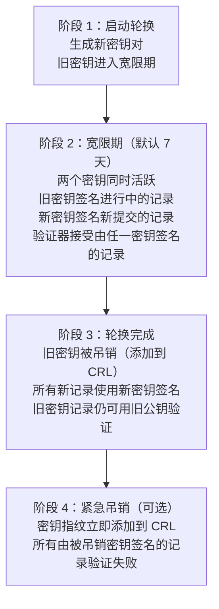

# DoLogger 运维与安全指南

> **版本**: v0.1.0 | **最后更新**: 2026-08-12 | **目标受众**: SRE、运维工程师、安全工程师、合规官
>
> **用途**: DoLogger 的生产部署、监控、密钥管理、审计验证、事件响应和合规配置。本文档是在生产环境中运行 DoLogger 的运维手册。
>
> 🌐 **语言 / Language**: [中文](OperationsAndSecurity.md) | [English: DoLogger Operations & Security Guide](../en_US/OperationsAndSecurity.md)
>
> **阅读路径**: SRE 应从[部署模式](#部署模式)和[监控](#监控)开始。安全工程师应重点关注[密钥管理](#密钥管理)和[审计验证](#审计验证)。底层架构请参见[架构参考](ArchitectureReference.md)。

---

## 目录

1. [开始之前](#开始之前)
2. [部署模式](#部署模式)
3. [监控](#监控)
4. [密钥管理](#密钥管理)
5. [审计验证](#审计验证)
6. [事件响应 Runbook](#事件响应-runbook)
7. [合规配置](#合规配置)
8. [按信任级别的沙箱配置](#按信任级别的沙箱配置)
9. [性能回归检测](#性能回归检测)

---

## 开始之前

### 前提条件

- DoLogger 引擎已构建并安装（参见[快速开始指南](QuickStart.md)）
- `dologctl` CLI 工具在您的 PATH 中可用
- 系统级安装需要 root 或 sudo 权限
- 了解内部原理的[架构参考](ArchitectureReference.md)
- 合规部署：访问 `compliance/` 模板目录

### 文件系统布局

**Linux：**

（目录结构示意 — 非命令输出）：

```
/etc/dologger/
  default.toml                       # 系统级配置
  conf.d/                            # 片段文件（按字母顺序合并）
    10-sinks.toml
    20-plugins.toml

/usr/lib/dologger/
  plugins/                           # 系统插件目录
  libdologger_core.so                # 核心引擎共享库

/var/log/dologger/                   # 日志输出
  app.log                            # 当前文件
  app.2026-08-12.log.zst             # 已轮换和压缩

/var/lib/dologger/
  audit/                             # WORM 审计日志
    audit-000001.worm
    audit-000002.worm
  state/                             # 引擎状态（LSN 游标等）

/dev/shm/
  dologger_<name>.shm                # 共享内存（sidecar 模式）

/run/dologger/
  dologger.pid                       # PID 文件（daemon 模式）
  control.sock                       # Unix 域套接字（daemon 模式）
```

**Windows：**

（目录结构示意 — 非命令输出）：

```
%PROGRAMDATA%\dologger\
  default.toml
  conf.d\

%PROGRAMFILES%\dologger\
  plugins\
  dologger_core.dll

%LOCALAPPDATA%\dologger\
  logs\
  audit\
```

---

## 部署模式

### 模式对比

| 模式 | 描述 | 延迟 | 隔离性 | 用例 |
|:-:|:-:|:-:|:-:|:-:|
| **嵌入式** | `libdologger_core` 直接链接到宿主进程 | 最低（102 ns P50） | 共享地址空间 | 单进程服务、Rust/C 应用程序 |
| **Sidecar** | 独立进程，通过 `sink_shm` 共享内存接收日志 | 低（约 1 us） | 进程隔离 | 多语言微服务、故障隔离 |
| **Daemon** | 系统级服务，本地套接字或共享内存 | 中等 | 进程隔离 | 遗留应用程序、系统级收集 |

### 嵌入式部署

```bash
# 构建引擎
cargo build --release

# 链接到您的应用程序
cc -o myapp myapp.c -ldologger_core -L./target/release

# 使用项目本地配置运行
DO_LOG_CONFIG_FILE=./dologger.toml ./myapp
```

### Sidecar 部署

```bash
# 伪代码 — v0.1.0 的 dologctl run 无 --mode 选项（长驻 sidecar 模式尚未实现）
# dologctl run --config /etc/dologger/sidecar.toml --mode sidecar &
```

Sidecar 配置（字段名与 `core/src/sink/shm.rs` 中的 `ShmSinkConfig` 一致）：

```toml
[dologger]
performance_profile = "prod-performance"

[sinks.shm]
type = "sink_shm"
enabled = true
path = "dologger_app"
input_format = "sif"
buffer_size_mb = 100        # 100 MB
slot_size_kb = 256
full_policy = "drop_oldest" # SHM 满时的行为
```

### Daemon 部署

安装为系统服务：

**Linux（systemd）：**

（伪代码/示意 — daemon 模式与长驻 `dologctl run` 尚未实现；v0.1.0 的 `dologctl run` 仅支持 `--dry-run`/`--trace` 后即退出）：

```ini
# /etc/systemd/system/dologger.service
[Unit]
Description=DoLogger Logging Engine
After=network.target

[Service]
Type=simple
ExecStart=/usr/local/bin/dologctl run --config /etc/dologger/default.toml
Restart=on-failure
RestartSec=5
User=dologger
Group=dologger
LimitNOFILE=65536
LimitMEMLOCK=268435456
CPUAffinity=2-3

[Install]
WantedBy=multi-user.target
```

```bash
sudo systemctl enable dologger
sudo systemctl start dologger
sudo systemctl status dologger
```

---

## 监控

### Sysmon 事件流

系统监控器发出结构化的 JSON 事件到 `stderr`（或可配置输出）：

（伪代码/示意 — v0.1.0 实际 sysmon 事件格式为 `{"sysmon_version":"1.0","error_code":...,"category":...,"description":...,"timestamp_ms":...,"severity":...}`，以下为规划的字段）：

```json
{"ts":"2026-08-12T14:30:00.123Z","level":"WARN","event":"PIPELINE_BACKLOG","pct":72,"buf_name":"main"}
```

### Sysmon 事件类型

| 事件 | 级别 | 含义 | 需要采取的行动 |
|:-:|:-:|:-:|:-:|
| `PIPELINE_BACKLOG` | WARN | 环形缓冲区 >50% 满 | 监控趋势；考虑增加 `ring_buffer_size` |
| `PIPELINE_DROP` | WARN | 记录被丢弃（缓冲区满） | 调查接收器健康状态；增加容量 |
| `SHM_DROP` | WARN | 共享内存接收器丢弃记录 | 验证消费者进程是否存活 |
| `SINK_CIRCUIT_OPEN` | ERROR | 远程接收器不可用 | 检查下游服务；30 秒后自动重置 |
| `SINK_CIRCUIT_CLOSED` | INFO | 远程接收器已恢复 | 在监控仪表盘中确认 |
| `EMERGENCY_BUFFER` | WARN | 溢出缓冲区激活（>=95% 满） | 环形缓冲区溢出；记录落在磁盘上 |
| `EMERGENCY_RECOVERED` | INFO | 溢出缓冲区已排空 | 系统已恢复 |
| `SANDBOX_VIOLATION` | CRITICAL | 插件尝试被禁止的系统调用 | 插件已终止；立即调查 |
| `SIGNATURE_FAILURE` | CRITICAL | Ed25519 验证失败 | 可能存在日志篡改；启动事件响应 |
| `LSN_GAP_DETECTED` | ERROR | 审计链中缺失记录 | 运行 `dologctl verify-log` |
| `CONFIG_RELOAD` | INFO | 配置已重载 | 验证预期变更已生效 |
| `CONFIG_RELOAD_DENIED` | WARN | 重载被拒绝（不可降级项） | 检查安全策略违规 |
| `LICENSE_POLICY_VIOLATION` | ERROR | 插件被拒绝（许可证不兼容） | 审查插件 SPDX |

### 控制面 API

控制面提供用于运行时管理的轻量级 HTTP API：

| 方法 | 路径 | 认证 | 描述 |
|:-:|:-:|:-:|:-:|
| GET | `/status` | 无 | 引擎状态和指标 |
| GET | `/health` | 无 | 存活检查（200 = 存活）（规划中） |
| POST | `/level` | 无 | 动态设置日志级别 |
| POST | `/reload` | 无 | 触发配置重载 |

### 健康检查

```bash
# 伪代码/示意 — v0.1.0 控制面尚未随引擎启动；当前控制面实现（core/src/sys/control_plane.rs）
# 只有 GET /status、POST /level、POST /reload，没有 /health 端点
# curl -s http://127.0.0.1:9090/health
```

### 状态端点

```bash
# 伪代码/示意 — 控制面（GET /status）在 v0.1.0 尚未随引擎启动
# curl -s http://127.0.0.1:9090/status | jq .
```

（伪代码/示意 — 规划的 /status 响应；v0.1.0 的实际响应为 `{"status":"ok","level":"...","profile":"prod-performance","plugins":0,"signature_enabled":false}`）：

```json
{
  "status": "ok",
  "uptime_seconds": 86412,
  "level": "INFO",
  "profile": "prod-performance",
  "plugins_loaded": 3,
  "plugins_failed": 0,
  "signature_enabled": false,
  "worm_enabled": false,
  "ring_buffer": {
    "capacity": 262144,
    "used": 8192,
    "pct_used": 3.1,
    "drops_total": 0,
    "emergency_spills": 0
  },
  "sinks": {
    "file": {"status": "healthy", "bytes_written": 1073741824},
    "kafka": {"status": "healthy", "messages_sent": 5000000}
  },
  "pipeline": {
    "records_processed": 10000000,
    "records_dropped": 0,
    "avg_latency_us": 82
  }
}
```

### 告警阈值

| 指标 | 警告 | 严重 | 告警渠道 |
|:-:|:-:|:-:|:-:|
| 环形缓冲区利用率 | > 80% | > 90% | Slack #sre |
| 丢弃率 | > 0.01% | > 0.1% | PagerDuty warning |
| 接收器写入延迟 | > 10 ms | > 100 ms | Slack #sre |
| 断路器跳闸次数/小时 | > 1 | > 3 | PagerDuty warning |
| 签名失败 | > 0（任何） | > 0（任何） | **PagerDuty critical** |
| 沙箱违规 | > 0（任何） | > 0（任何） | **PagerDuty critical** |
| LSN 间隙 | > 0（任何） | > 0（任何） | **PagerDuty critical** |

### 动态日志级别调整

```bash
# 伪代码/示意 — POST /level 在 v0.1.0 尚未随引擎启动
# curl -X POST http://127.0.0.1:9090/level \
#   -H "Content-Type: application/json" \
#   -d '{"level": "DEBUG"}'

# 锁定级别（禁用运行时更改）——环境变量真实有效
export DO_LOG_CONFIG_LOCK=1
```

### 热重载

```bash
# 编辑配置文件
vim /etc/dologger/default.toml

# 伪代码/示意 — POST /reload 在 v0.1.0 尚未随引擎启动
# curl -X POST http://127.0.0.1:9090/reload
```

### 控制面安全

- 默认绑定到 `127.0.0.1:9090`（仅本地主机；规划中 — v0.1.0 未随引擎启动）
- mTLS + JWT 认证（远程访问）为规划中
- 生产环境：使用主机防火墙限制访问

```bash
# iptables：限制控制面到本地主机
sudo iptables -A INPUT -p tcp --dport 9090 -s 127.0.0.1 -j ACCEPT
sudo iptables -A INPUT -p tcp --dport 9090 -j DROP
```

---

## 密钥管理

### 密钥类型

| 密钥类型 | 描述 | 管理方 |
|:-:|:-:|:-:|
| 签名密钥 | 用于日志记录签名的 Ed25519 私钥 | 内置 `DefaultKeyProvider`（临时、内存中） |
| 验证密钥 | 用于签名验证的 Ed25519 公钥 | 随日志分发 |
| 根密钥 | 用于 Blue 插件签名的 DoLogger 团队密钥 | 编译进引擎 |

### 默认（临时）密钥

在没有 `KeyProvider` 插件的默认配置中：
- 启动时在内存中生成随机 Ed25519 密钥对
- 密钥**永不写入磁盘**
- 重启引擎生成新密钥，使用之前所有签名失效
- 仅适用于开发环境

### 生产密钥管理

引擎使用内置的 `DefaultKeyProvider` 对记录签名：启动时在内存中生成随机 Ed25519 密钥对。
私钥永不落盘，公钥通过 API 提供以便离线验证。持久化密钥存储（文件或 HSM 后端）在
v0.1.0 中尚未实现：`KeyProvider` 插件接口已定义，但本次发布未随附任何实现。

### 密钥轮换生命周期



### 证书吊销列表（CRL）

```rust
// 与 core/src/security/key_rotation.rs 一致（v0.1.0 实际定义）
pub struct CrlEntry {
    pub fingerprint: KeyFingerprint,   // 被吊销密钥的 SHA-256（[u8; 32]）
    pub revoked_at: u64,               // 吊销时间（Unix 秒）
    pub reason: CrlReason,
}

pub enum CrlReason {
    Compromised,   // 密钥已泄露（紧急 — sysmon CRITICAL）
    Superseded,    // 轮换后被新密钥替代
    Deactivated,   // 管理员停用（未泄露）
}
```

### 密钥轮换命令

```bash
# 伪代码 — v0.1.0 的 dologctl 尚无 key 子命令（规划中）
# dologctl key rotate --grace-period-days 7
# dologctl key status
# dologctl key revoke --fingerprint "a3f8b2c1..." --reason compromised
# dologctl key list
```

---

## 审计验证

### `dologctl verify-log`

验证 WORM 审计日志的完整性：

```bash
# verify-log 接受单个 SIF/WORM 文件路径（无 --path/--verbose 选项）
dologctl verify-log /var/lib/dologger/audit/audit-000001.worm
```

输出（伪代码/示意 — v0.1.0 实际输出为 "Verification Results" 摘要格式，见下文 [dologctl 命令参考](guides/DologctlCommandReference.md)）：

```
[OK]     LSN 000001 — signature valid, prev_hash=genesis
[OK]     LSN 000002 — signature valid, prev_hash matches
[GAP]    LSN 000003 — missing (expected, found LSN 000004)
[OK]     LSN 000004 — signature valid, prev_hash matches
[FAIL]   LSN 000005 — signature INVALID (record may be tampered)

Summary: 9995 OK, 1 GAP, 1 FAIL — INTEGRITY CHECK FAILED
```

### 验证的内容

| 检查 | 含义 |
|:-:|:-:|
| Ed25519 签名 | 自签名以来记录内容未被修改 |
| prev_hash 链 | 记录在序列中处于其原始位置 |
| LSN 单调性 | 记录按正确的时序顺序排列 |
| 间隙检测 | 识别并报告缺失的记录 |

### `dologctl verify-anchor`

验证外部锚定哈希（规划中）：

```bash
# verify-anchor 接受锚定 JSON 文件路径 + --pubkey；v0.1.0 无 --anchor-file/--worm-path 选项
dologctl verify-anchor anchors/2026-08.json --pubkey "$(cat pubkey.hex)"

# 将本地计算的 Merkle 根与外部发布的锚定哈希进行比较
```

### 自动验证

设置每日 cron 作业：

```bash
# /etc/cron.daily/dologger-audit-verify
#!/bin/bash
REPORT=$(dologctl verify-log /var/lib/dologger/audit/audit-000001.worm --output json)
if echo "$REPORT" | jq -e '.status == "failed"' > /dev/null; then
    echo "AUDIT INTEGRITY FAILURE: $REPORT" | \
        mail -s "CRITICAL: DoLogger audit chain broken" security@example.com
fi
```

（注：`verify-log` 的 JSON 输出包含 `status: "passed"/"failed"`、`total_records`、`broken_chain_links`、`lsn_gaps`、`signatures` 字段）

### WORM 文件处理

| 操作 | 命令 |
|:-:|:-:|
| 列出 WORM 段 | `ls -la /var/lib/dologger/audit/` |
| 验证链 | `dologctl verify-log /var/lib/dologger/audit/audit-000001.worm` |
| 导出审计记录 | （伪代码 — `dologctl audit export` 为规划中功能） |
| 检查最新 LSN | `dologctl verify-log /var/lib/dologger/audit/audit-000001.worm -o json` |

### 篡改检测

LSN + prev_hash 链提供自验证的篡改证据：

- **记录修改**：Ed25519 签名无法验证——自签名以来记录内容已更改。
- **记录删除**：下一条记录的 prev_hash 与预期值不匹配——链已断裂。
- **记录插入**：prev_hash 不匹配，且 LSN 不会是单调的。
- **记录重排**：prev_hash 和 LSN 检查均失败。

---

## 事件响应 Runbook

### 事件：审计签名失败

**严重性**：CRITICAL

**症状**：
- `SIGNATURE_FAILURE` sysmon 事件
- `dologctl verify-log` 报告一条或多条记录 `FAIL`

**响应流程**：

1. **识别受影响的记录：**
   ```bash
   dologctl verify-log /var/lib/dologger/audit/audit-000001.worm 2>&1 | grep -E "TAMPERED|CHAIN BROKEN|LSN GAP"
   ```

2. **评估范围：**
   - 单条记录失败：可能是磁盘损坏或比特翻转
   - 多条连续失败：可能存在篡改
   - 所有记录失败：密钥不匹配或密钥泄露

3. **调查根本原因：**
   - 检查受影响时间戳周围的系统日志是否有磁盘 I/O 错误
   - 验证文件权限：WORM 文件是否可写？
   - 检查受影响时间窗口内匹配的 root/sudo 活动

4. **遏制（如果怀疑篡改）：**
   - 将主机从网络隔离
   - 保留受影响文件的取证镜像
   - 立即轮换签名密钥：`dologctl key rotate --emergency`（伪代码 — key 子命令规划中，尚未提供）

5. **报告：**
   - 提交安全事件报告
   - 将 WORM 文件作为取证证据保存
   - 加密链为调查提供篡改证据

### 事件：沙箱违规

**严重性**：CRITICAL

**症状**：
- `SANDBOX_VIOLATION` sysmon 事件
- 插件线程被 SIGSYS 终止

**响应流程**：

1. **识别违规插件：**

   （伪代码/示意 — 沙箱违规事件的规划格式）：

   ```json
   {"event":"SANDBOX_VIOLATION","plugin":"untrusted-plugin","syscall":"fork","action":"KILL","tid":12345}
   ```

2. **评估：**
   - 这是已知插件行为吗？（误分类）
   - 这是未知插件吗？（可能存在入侵）

3. **决策树：**
   - 误分类的 Yellow/Blue 插件：代码审查和重新签名后升级信任颜色
   - 恶意或被入侵插件：立即移除，轮换所有密钥
   - 未知插件：隔离二进制文件进行分析

4. **防止复发：**
   - 审计所有已安装插件：`dologctl plugin list`
   - 审查插件审查流程
   - 考虑完全禁用 Red 插件（`allow_red_plugins = false`）

### 事件：日志丢失

**严重性**：HIGH

**症状**：
- `PIPELINE_DROP` 或 `EMERGENCY_BUFFER` 事件
- 审计链中的 LSN 间隙
- 输出文件中缺失记录

**响应流程**：

1. **分类：**
   ```bash
   # 伪代码/示意 — 控制面在 v0.1.0 尚未随引擎启动
   # curl http://127.0.0.1:9090/status | jq .ring_buffer
   # 检查 pct_used、drops_total、emergency_spills
   ```

2. **识别瓶颈：**
   ```bash
   # 伪代码/示意 — 控制面在 v0.1.0 尚未随引擎启动
   # curl http://127.0.0.1:9090/status | jq .sinks
   ```

3. **缓解：**
   ```bash
   # 伪代码/示意 — /sink/disable 端点规划中；v0.1.0 控制面仅有 /status、/level、/reload
   # curl -X POST http://127.0.0.1:9090/sink/disable -d '{"sink": "kafka"}'
   ```

4. **增加容量：**
   ```bash
   # 将环形缓冲区翻倍（需要重启）
   sed -i 's/ring_buffer_size = 262144/ring_buffer_size = 524288/' dologger.toml
   sudo systemctl restart dologger
   ```

5. **恢复：**
   - 紧急缓冲区文件在恢复时自动重放
   - 恢复后验证完整性：`dologctl verify-log /var/lib/dologger/audit/audit-000001.worm`

### 事件：性能下降

**严重性**：MEDIUM

**症状**：
- 应用程序延迟增加（AUDIT 记录阻塞）
- 环形缓冲区利用率随时间上升
- `PIPELINE_BACKLOG` 事件频率增加

**响应流程**：

1. **检查当前配置文件：**
   ```bash
   # 伪代码/示意 — 控制面在 v0.1.0 尚未随引擎启动
   # curl http://127.0.0.1:9090/status | jq .profile
   ```

2. **检查接收器健康状态：**
   ```bash
   # 伪代码/示意 — 控制面在 v0.1.0 尚未随引擎启动
   # curl http://127.0.0.1:9090/status | jq .sinks
   ```

3. **检查签名是否意外启用：**
   ```bash
   # 伪代码/示意 — 控制面在 v0.1.0 尚未随引擎启动
   # curl http://127.0.0.1:9090/status | jq .signature_enabled
   # Ed25519 签名每条记录增加约 17 us
   ```

4. **检查磁盘 I/O：**
   ```bash
   iostat -x 1
   # 高 await 时间表明存储瓶颈
   ```

5. **缓解：**
   ```bash
   # 伪代码/示意 — 控制面在 v0.1.0 尚未随引擎启动
   # curl -X POST http://127.0.0.1:9090/level -d '{"level": "ERROR"}'
   ```

### 事件后诊断收集

任何事件后，捕获诊断快照：

```bash
# 伪代码 — v0.1.0 尚无 diag 子命令
# dologctl diag collect --output post-incident-$(date +%Y%m%d-%H%M%S).tar.gz
```

此存档包含：
- `dologger_internal.log`（完整诊断日志）
- 活动配置（敏感值已脱敏）
- 带版本的插件加载清单
- 环形缓冲区统计快照
- 操作系统资源限制（相当于 `ulimit -a`）

---

## 合规配置

### 可用模板

| 模板 | 文件 | 激活项 | 框架 |
|:-:|:-:|:-:|:-:|
| GDPR | `compliance/gdpr.toml` | 全部 6 项不可降级 | 欧盟通用数据保护条例 |
| HIPAA | `compliance/hipaa.toml` | 全部 6 项不可降级 | 美国健康保险可携带性和责任法案 |
| PCI DSS | `compliance/pci-dss.toml` | 全部 6 项不可降级 | 支付卡行业数据安全标准 |

### 合规模板内容

每个合规模板激活全部六项不可降级安全项：

| 项目 | 值 | 理由 |
|:-:|:-:|:-:|
| `enable_signature` | `true` | 不可否认性——加密可验证的日志记录 |
| `escape_html` | `true` | 日志注入防护——CRLF 和 ANSI 转义中和 |
| `worm_enabled` | `true` | 不可变性——日志记录不可删除或修改 |
| `fsync_on_write` | `true` | 持久性——记录在被确认前提交到介质 |
| `require_tls` | `true` | 传输安全——所有网络接收器使用 TLS 1.2+ |
| `sign_ring2` | `true` | 已验证扩展的完整性——插件提供字段被加密绑定 |

### 应用合规模板

```bash
# 伪代码 — config merge 子命令与 --compliance 选项为规划中功能（v0.1.0 未提供）
# dologctl config merge \
#     --base /etc/dologger/default.toml \
#     --overlay compliance/gdpr.toml \
#     --output /etc/dologger/gdpr-production.toml

# 验证合并后的结果（现有命令）
dologctl config validate \
    --config /etc/dologger/gdpr-production.toml \
    --strict
```

### GDPR 配置摘要

（伪代码/示意 — 合规模板激活的安全项摘要，非可直接运行的配置文件）：

```
performance_profile = "prod-audit"
level               = "AUDIT"
enable_signature    = true    (不可降级)
worm_enabled        = true    (不可降级)
sign_ring2          = true    (不可降级)
escape_html         = true    (不可降级)
fsync_on_write      = true    (不可降级)
require_tls         = true    (不可降级)
shutdown_policy     = "graceful"
shutdown_timeout_ms = 10000
```

| GDPR 条款 | DoLogger 功能 |
|:-:|:-:|
| Art. 5(1)(f) | Ed25519 签名 + CRC32C 完整性检查 |
| Art. 15 | Ring 2 字段签名（user.id、session.id）用于数据主体访问记录 |
| Art. 30 | WORM 审计日志作为处理活动记录 |
| Art. 32 | 传输加密（TLS）、完整性保护（签名）、弹性（环形缓冲区 + 紧急溢出） |
| Art. 33-34 | 签名审计追踪作为泄露通知的证据 |
| Art. 35 | 合规模板作为 DPIA 的技术基础 |
| Art. 58 | 可验证审计链供监管机构检查 |

### HIPAA 配置摘要

| HIPAA 规则 | DoLogger 功能 |
|:-:|:-:|
| 164.312(b) 审计控制 | WORM + Ed25519 + LSN 链用于 ePHI 访问记录 |
| 164.312(c)(2) 完整性 | Ed25519 加密机制验证 ePHI 审计完整性 |
| 164.312(e)(1) 传输 | 所有网络接收器强制 TLS 1.2+ |

### PCI DSS 配置摘要

| PCI DSS 要求 | DoLogger 功能 |
|:-:|:-:|
| 10.2 自动审计追踪 | LSN 链 + WORM 不可变审计追踪 |
| 10.5 安全审计追踪 | Ed25519 签名（10.5.1-10.5.2）、WORM 不可变性（10.5.5） |
| 4.1 强加密 | 所有网络接收器需要 TLS 1.2+ |

### 法律免责声明

**这些合规模板仅是技术起点。** 它们不保证法规合规。您必须在部署到生产环境前咨询您的法律顾问并进行完整评估。模板：
- 将所有安全相关配置设置为其最严格的值
- 不能被较低优先级配置层放松（不可降级）
- 必须使用以下命令验证：`dologctl config validate --config compliance/<framework>.toml --strict`（v0.1.0 无 `--compliance` 选项）

---

## 按信任级别的沙箱配置

### 信任级别对比

| 能力 | Blue | Yellow | Red |
|:-:|:-:|:-:|:-:|
| 内存访问 | 完全 | 完全 | 完全 |
| 文件 I/O | 完全读写 | 读+写 | **拒绝** |
| 网络 | 完全 | **拒绝** | **拒绝** |
| 进程创建 | 允许 | **拒绝** | **拒绝** |
| 信号处理 | 允许 | 允许 | **拒绝** |
| 字段写入 | Ring 2（`verified.*`） | Ring 2（`verified.*`） | Ring 3（`ext.*`） |

### Linux 沙箱（seccomp-bpf）

（伪代码/示意 — 规划的系统调用白名单，非可执行代码）：

```
Yellow 插件系统调用白名单：
  内存：      mmap、munmap、mprotect、brk、madvise
  线程：      futex、clone、set_robust_list
  时间：      clock_gettime、gettimeofday、nanosleep
  信号：      rt_sigaction、rt_sigreturn、tgkill
  系统信息：  uname、getpid、gettid、getrandom
  文件 I/O：  open、openat、read、write、close、lseek、fstat、fsync
  网络：      （无）
  进程：      （无）

Red 插件系统调用白名单：
  内存：      mmap、munmap、mprotect、brk
  线程：      futex、clone
  时间：      clock_gettime、gettimeofday
  系统信息：  uname、getpid、getrandom
  信号：      （无）
  文件 I/O：  （无）
  网络：      （无）
  进程：      （无）
```

违规：`SECCOMP_RET_KILL_PROCESS`——线程终止。发出 `SANDBOX_VIOLATION` sysmon 事件。

### Windows 沙箱（AppContainer）

- **Yellow**：LowBox 令牌，扣留 `WIN://NO_NETWORK` 和 `WIN://NO_PROCESS_CREATION` 能力 SID
- **Red**：完全 AppContainer 隔离，仅 `WIN://LOWBOX` 基础能力

### macOS 沙箱（App Sandbox）

通过 `sandbox_init(3)` 应用沙箱配置文件，每信任级别使用 seatbelt/SBPL 规则。

### 启用 Red 插件

Red 插件默认禁用。使用以下配置启用：

```toml
[dologger]
allow_red_plugins = true
```

这应仅在开发环境中进行。生产环境绝不应启用 Red 插件。

### 沙箱违规审计

实时监控沙箱违规：

```bash
# 伪代码/示意 — v0.1.0 诊断日志行不含 .event 字段，此 jq 过滤依赖规划中的事件格式
# tail -f dologger_internal.log | jq 'select(.event == "SANDBOX_VIOLATION")'
```

---

## 性能回归检测

### 基线基准测试

在您的生产硬件上建立基线：

```bash
# 运行所有基准测试并保存结果（v0.1.0 仓库实际提供 latency、throughput、latency_percentiles）
cargo bench --bench latency -- --save-baseline prod-baseline
cargo bench --bench throughput -- --save-baseline prod-baseline
cargo bench --bench latency_percentiles -- --save-baseline prod-baseline
```

### 回归检测

配置更改或引擎更新后，与基线比较：

```bash
cargo bench --bench latency -- --baseline prod-baseline
```

以下情况标记为回归：
- 热路径延迟较基线增加 >20%
- 吞吐量较基线降低 >20%
- P99 延迟较基线增加 >50%

### 运行时性能监控

```bash
# 伪代码/示意 — 控制面在 v0.1.0 尚未随引擎启动
# watch -n 5 'curl -s http://127.0.0.1:9090/status | jq .pipeline'
```

### 性能回归响应

如果更改后性能下降：

1. **比较配置文件**：`performance_profile` 是否已更改？
   ```bash
   # 伪代码/示意 — 控制面在 v0.1.0 尚未随引擎启动
   # curl http://127.0.0.1:9090/status | jq .profile
   ```

2. **检查签名开销**：Ed25519 签名是否意外启用？
   ```bash
   # 伪代码/示意 — 控制面在 v0.1.0 尚未随引擎启动
   # curl http://127.0.0.1:9090/status | jq .signature_enabled
   ```

3. **检查接收器健康状态**：慢速下游导致背压。
   ```bash
   # 伪代码/示意 — 控制面在 v0.1.0 尚未随引擎启动
   # curl http://127.0.0.1:9090/status | jq .sinks
   ```

4. **检查磁盘 I/O**：文件/WORM 接收器受 I/O 限制。
   ```bash
   iostat -x 1
   ```

5. **如需回滚**：恢复之前的配置并重启。

### 性能配置文件覆盖

可在不更改配置文件的情况下覆盖个别配置文件值：

```toml
[dologger]
performance_profile = "prod-performance"
ring_buffer_size = 524288            # 覆盖默认 262144
batch_size = 512                     # 覆盖默认 256
```

不可降级项目不能通过覆盖放松。

### 性能基线参考

| 配置文件 | 预期 P50 延迟 | 预期吞吐量 | 最大环形缓冲区使用 |
|:-:|:-:|:-:|:-:|
| `dev` | < 200 ns | > 500K rec/s | < 90% |
| `balanced` | < 150 ns | > 1M rec/s | < 70% |
| `prod-performance` | < 120 ns | > 5M rec/s | < 50% |
| `prod-audit` | < 20 us | > 50K rec/s | < 50% |

这些是目标值，而非保证值。实际性能取决于硬件、记录大小、接收器配置和插件开销。

---

## 完整规范

关于每个架构决策、API 和安全属性的权威设计文档，请参阅 [架构参考](ArchitectureReference.md)。

详细的部署、监控和恢复流程：[运维手册](guides/OperationsManual.md)。

完整的威胁模型和加密设计：[安全白皮书](guides/SecurityWhitepaper.md)。
