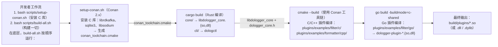
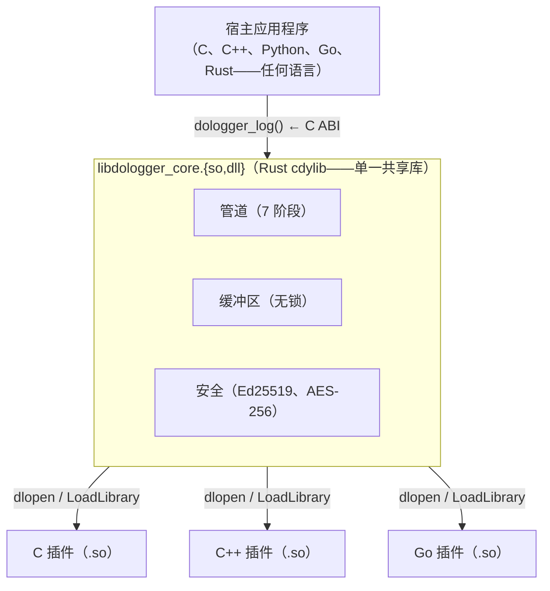
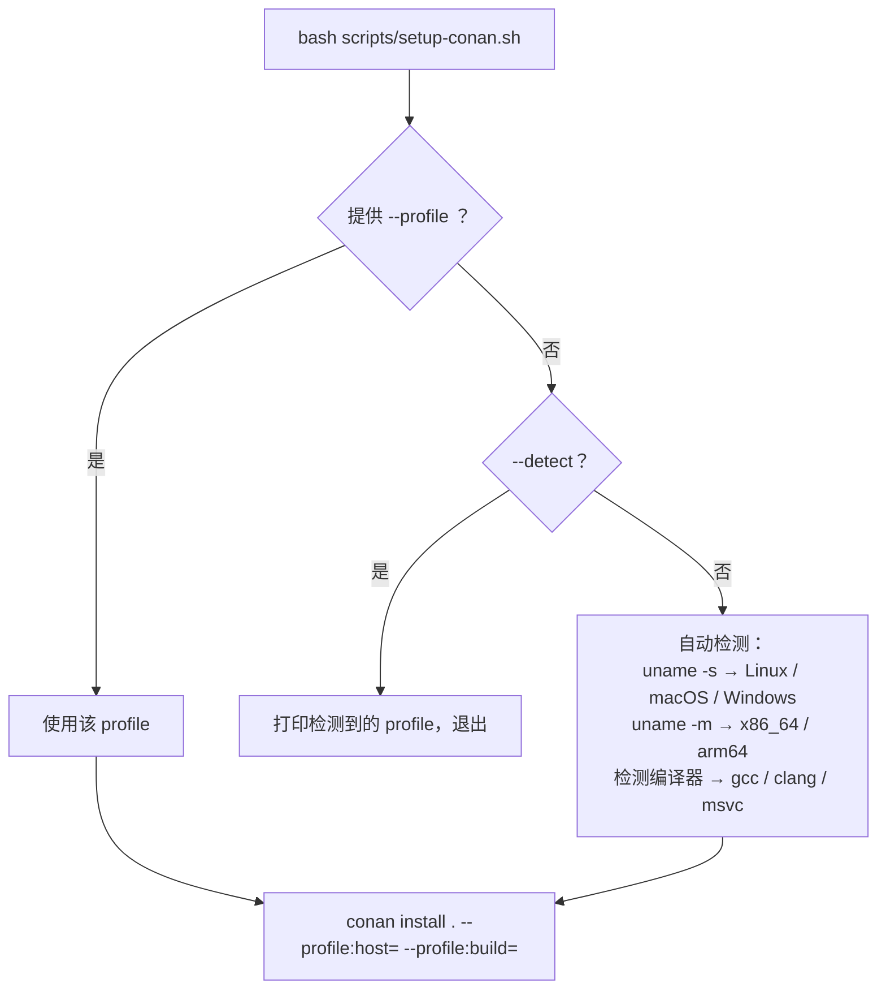

# DoLogger 插件开发快速入门

> 🌐 **语言 / Language**: [中文](PluginDevelopmentQuickStart.md) | [English: DoLogger Plugin Development QuickStart](../en_US/PluginDevelopmentQuickStart.md)

> **版本**: v0.1.0 | **目标受众**: 非 Rust 插件开发者（C、C++、Go）
>
> **用途**: 从零开始用您选择的语言创建一个可工作的 DoLogger 插件。涵盖完整的构建链——Conan → CMake → Rust 核心 → 您的插件。

---

## 目录

1. [构建链如何工作](#构建链如何工作)
2. [前提条件](#前提条件)
3. [选择您的语言](#选择您的语言)
4. [C 插件演练](#c-插件演练)
5. [C++ 插件演练](#c-插件演练)
6. [Go 插件演练](#go-插件演练)
7. [跨平台编译](#跨平台编译)
8. [链接 Rust 核心](#链接-rust-核心)
9. [Conan Profile 参考](#conan-profile-参考)
10. [故障排查](#故障排查)

---

## 构建链如何工作

理解完整的编译链对于调试构建问题至关重要：



### Conan 实际做什么？

Conan 是一个 **C/C++ 包管理器**（类似于 Node.js 的 npm 或 Python 的 pip）。在 DoLogger 中：

| 没有 Conan | 使用 Conan |
|:-:|:-:|
| 您必须通过系统包管理器（`apt`、`brew`、vcpkg）手动安装 `librdkafka`、`sqlite3`、`libsodium` | Conan 从锁定的配方自动下载和构建它们 |
| 每个开发者有不同的库版本 → "在我机器上没问题" 的 bug | 所有开发者获得 `conanfile.py` 中声明的相同版本 |
| 交叉编译需要手动 sysroot 设置 | Conan profiles 处理交叉编译（`--profile:host=...`） |
| CMake `find_package()` 可能找不到库 | `conan_toolchain.cmake` 确保 `find_package()` 始终解析 |

**Conan 不用于 Rust 核心。** Rust 核心（`dologger-core`）是纯 Rust 并由 Cargo 编译。Conan 仅管理非 Rust 插件可能链接的 C 库。

---

## 前提条件

| 工具 | 版本 | 检查 | 安装 |
|:-:|:-:|:-:|:-:|
| Rust | >= 1.70 | `rustc --version` | `curl --proto '=https' --tlsv1.2 -sSf https://sh.rustup.rs \| sh` |
| CMake | >= 3.20 | `cmake --version` | `apt install cmake` / `brew install cmake` |
| Conan | >= 2.0 | `conan --version` | `pipx install conan`（推荐） |
| Go | >= 1.21 | `go version` | 仅 Go 插件需要 |

一条命令完成设置：

```bash
# Linux / macOS
bash scripts/dologger-setup-dev

# Windows（Git Bash；仓库中该脚本为 bash 脚本，无 .ps1 版本）
bash scripts/dologger-env-check
```

---

## 选择您的语言

| 语言 | 插件类型 | 构建系统 | 通过 Conan 的 C 依赖 | 编译输出 |
|:-:|:-:|:-:|:-:|:-:|
| **C** | Filter、Formatter、Processor | CMake | 是 | `.so` / `.dll` / `.dylib` |
| **C++** | Filter、Formatter、Processor | CMake | 是 | `.so` / `.dll` / `.dylib` |
| **Go** | Filter、Formatter、Processor | `go build -buildmode=c-shared` | 否（纯 Go） | `.so` / `.dll` / `.dylib` |
| **Rust** | 全部 9 种 VTable 类型 | Cargo | 通过 `-sys` crates | `.so` / `.dll` / `.dylib` |

**快速决策指南：**
- 您需要最大可移植性 → **C**（C11，无扩展）
- 您需要 C++ 生态（Protobuf、gRPC、Kafka 客户端） → **C++**（C++17）
- 您想要快速迭代、内存安全 → **Go**（cgo，通过 `import "C"` 的 C ABI）
- 您正在扩展引擎本身 → **Rust**（原生 Cargo workspace 成员）

---

## C 插件演练

我们将创建一个 Filter 插件，丢弃低于最低严重级别的消息。

### 步骤 1：目录结构

```text
plugins/examples/filter/c/my_filter/
├── CMakeLists.txt
├── my_filter.c
└── PluginManifest.toml
```

### 步骤 2：编写插件

**my_filter.c** — 实现 DoLogger Filter VTable（本示例已在 Windows 上以 MSVC 编译验证，符号签名与 `core/include/dologger_core.h` 一致）：

```c
#include "dologger_core.h"   // 来自 core/include/ 的 C ABI 头文件
#include <stdlib.h>          // strtol

// 插件状态
static int g_min_level = DO_LOG_WARN;   // 最低通过级别，默认 WARN(3)

// VTable filter 函数
// 返回 0 保留记录，非零丢弃记录。
static int my_filter_fn(const dologger_record_handle_t *record, void *config) {
    (void)record;             // 本示例不读取记录内容
    int level = config ? *(const int *)config : DO_LOG_TRACE;
    return (level < g_min_level) ? 1 : 0;
}

// -- C ABI 导出（引擎通过 plugin_query 的 vtable 指针发现全部插件函数）--

dologger_plugin_info_t *plugin_query(uint32_t core_abi_version) {
    static dologger_filter_vtable_t vtable = { .filter = my_filter_fn };
    static dologger_plugin_info_t info = {
        .name        = "my-filter",
        .version     = 0x000100,    // 0.1.0（major.minor.patch 压缩编码）
        .abi_version = 0x000100,    // 本插件面向的核心 ABI 版本
        .phase       = DO_LOG_PHASE_FILTER,
        .vtable      = &vtable,
    };
    (void)core_abi_version;   // 生产插件应在此校验兼容性，不兼容时返回 NULL
    return &info;
}

// 在 plugin_query 之后、首次 filter 调用之前调用。
int plugin_init(const void *config) {
    // config 为以 NUL 结尾的字符串，内容为最小级别整数，例如 "3"（WARN）
    if (config == NULL) return 0;
    long val = strtol((const char *)config, NULL, 10);
    if (val < DO_LOG_TRACE) val = DO_LOG_TRACE;
    if (val > DO_LOG_AUDIT)  val = DO_LOG_AUDIT;
    g_min_level = (int)val;
    return 0;
}

// 库卸载之前调用。
int plugin_shutdown(void) {
    g_min_level = DO_LOG_WARN;   // 重置状态，以备重新加载
    return 0;
}
```

### 步骤 3：编写 CMakeLists.txt

```cmake
cmake_minimum_required(VERSION 3.16)
project(my-filter LANGUAGES C)

add_library(my_filter SHARED my_filter.c)

target_include_directories(my_filter PRIVATE
    ${CMAKE_CURRENT_SOURCE_DIR}/../../../../../core/include
)

# 平台特定输出
if(WIN32)
    set_target_properties(my_filter PROPERTIES PREFIX "" SUFFIX ".dll")
elseif(APPLE)
    set_target_properties(my_filter PROPERTIES SUFFIX ".dylib")
else()
    set_target_properties(my_filter PROPERTIES SUFFIX ".so")
endif()

set_target_properties(my_filter PROPERTIES
    C_STANDARD 11
    C_STANDARD_REQUIRED ON
    C_EXTENSIONS OFF
)
```

### 步骤 4：构建

```bash
# 从项目根目录：
bash scripts/build-plugins.sh --filter c
```

输出：`build/plugins/my_filter/my_filter.so`（或 Windows 上 `.dll`）

---

## C++ 插件演练

结构同 C 相同，但导出符号需使用 `extern "C"`：

```cpp
#include "dologger_core.h"
#include <string>
#include <regex>

extern "C" {

static int regex_filter_fn(const dologger_record_handle_t *record, void *config) {
    (void)record;
    (void)config;
    // ... C++ std::regex 匹配 ...
    return 0;   // 0 = 保留记录
}

dologger_plugin_info_t *plugin_query(uint32_t core_abi_version) {
    static dologger_filter_vtable_t vtable = { regex_filter_fn };
    // 按头文件中字段顺序聚合初始化（C++17 无指定初始化器）
    static dologger_plugin_info_t info = {
        "regex-filter",            // name
        0x000100,                  // version
        0x000100,                  // abi_version
        DO_LOG_PHASE_FILTER,       // phase
        &vtable,                   // vtable
    };
    (void)core_abi_version;
    return &info;
}

int plugin_init(const void *config) { (void)config; return 0; }
int plugin_shutdown(void) { return 0; }

} // extern "C"
```

CMakeLists.txt 使用 `CXX_STANDARD 17` 而非 `C_STANDARD 11`。

---

## Go 插件演练

Go 插件使用 `cgo`（`import "C"`）导出 C ABI 符号。不需要 CMake。

### 步骤 1：编写插件

```go
package main

/*
#include "dologger_core.h"
#include <stdlib.h>

typedef struct { int (*filter)(const void*, void*); } my_filter_vtable_t;
extern int goFilter(const void*, void*);

static my_filter_vtable_t vtable = { .filter = goFilter };
*/
import "C"
import "unsafe"

//export plugin_query
func plugin_query(coreAbiVersion C.uint32_t) *C.dologger_plugin_info_t {
    _ = coreAbiVersion   // 生产插件应在此校验兼容性
    info := (*C.dologger_plugin_info_t)(C.malloc(C.size_t(unsafe.Sizeof(C.dologger_plugin_info_t{}))))
    info.name = C.CString("go-filter")
    info.version = 0x000100
    info.abi_version = 0x000100
    info.phase = C.DO_LOG_PHASE_FILTER
    info.vtable = unsafe.Pointer(&C.vtable)
    return info
}

//export plugin_init
func plugin_init(config unsafe.Pointer) C.int {
    return C.int(0)
}

//export plugin_shutdown
func plugin_shutdown() C.int {
    return C.int(0)
}

//export goFilter
func goFilter(rec unsafe.Pointer, cfg unsafe.Pointer) C.int {
    // 本示例通过 config 指针接收最小级别（int），不读取记录内容
    level := C.int(0)
    if cfg != nil {
        level = *(*C.int)(cfg)
    }
    if level < C.DO_LOG_WARN {
        return 1 // 丢弃
    }
    return 0 // 通过
}

func main() {}
```

### 步骤 2：构建

```bash
cd plugins/examples/filter/go/example_filter
CGO_ENABLED=1 go build -buildmode=c-shared -o dologger-plugin-my_filter.so .
```

或从项目根目录使用统一脚本：

```bash
bash scripts/build-plugins.sh --filter go
```

---

## 跨平台编译

### 问题

（示意场景）：

```
开发者 A（macOS ARM）：clang + libc++
开发者 B（Linux x86）：gcc + libstdc++11
开发者 C（Windows）：MSVC + dynamic CRT

每个平台都有不同的：
  - 编译器标志
  - ABI 约定
  - 库路径
  - 动态链接器名称
```

不同开发平台的差异：

| 开发者 | 平台 | 编译器 | 标准库 |
|:-:|:-:|:-:|:-:|
| 开发者 A | macOS ARM | clang | libc++ |
| 开发者 B | Linux x86 | gcc | libstdc++11 |
| 开发者 C | Windows | MSVC | dynamic CRT |

每个平台都有不同的：编译器标志、ABI 约定、库路径、动态链接器名称

### 解决方案：Conan Profiles

DoLogger 在 `.conan/profiles/` 中附带**5 个预配置的 Conan profile**：

| Profile | OS | 编译器 | 架构 |
|:-:|:-:|:-:|:-:|
| `linux-gcc-x86_64` | Linux | GCC 12 | x86_64 |
| `linux-clang-x86_64` | Linux | Clang 16 | x86_64 |
| `macos-clang-x86_64` | macOS | Apple Clang 15 | x86_64 |
| `macos-clang-arm64` | macOS | Apple Clang 15 | ARM64 |
| `windows-msvc-x86_64` | Windows | MSVC 194 | x86_64 |

### 使用 Profiles

```bash
# 自动检测您的平台并安装 C 依赖
bash scripts/setup-conan.sh

# 为交叉编译显式指定 profile（Linux → Windows）
bash scripts/setup-conan.sh --profile windows-msvc-x86_64

# 预览但不安装
bash scripts/setup-conan.sh --dry-run

# 仅打印将使用哪个 profile
bash scripts/setup-conan.sh --detect
```

Conan profile 确保 `librdkafka`、`sqlite3` 和 `libsodium` 针对与您的插件**完全相同**的目标编译——相同的编译器、相同的架构、相同的 ABI。

### 添加自定义 Profile

```bash
# 为 Raspberry Pi 交叉编译创建 profile
cp .conan/profiles/linux-gcc-x86_64 .conan/profiles/linux-gcc-arm64
# 编辑：更改 arch=armv8，添加工具链前缀
```

---

## 链接 Rust 核心

所有插件链接到**一个头文件**：

```
core/include/dologger_core.h
```

此头文件声明：

| 类别 | 符号 |
|:-:|:-:|
| **类型** | `dologger_plugin_info_t`、`dologger_filter_vtable_t`、`dologger_formatter_vtable_t`、... |
| **错误码** | `DO_LOG_OK`、`DO_LOG_ERR_INVALID_ARG`、`DO_LOG_ERR_NOT_SUPPORTED`、... |
| **阶段常量** | `DO_LOG_PHASE_FILTER`、`DO_LOG_PHASE_FORMATTING`、... |
| **信任级别** | *（规划中 — 沙箱信任级别尚未实现）* |
| **日志级别** | `DO_LOG_TRACE` 到 `DO_LOG_AUDIT`（`dologger_level_t` 枚举） |
| **记录访问器** | `dologger_field_get()`、`dologger_field_set()`、... |
| **ABI 版本** | 由每个插件在 `plugin_info.abi_version` 字段声明（如 `0x000100` = 0.1.0）；头文件中无全局 `DO_LOG_ABI_VERSION`/`DO_LOG_CORE_ABI_VERSION` 宏 |
| **插件导出** | `plugin_query(uint32_t core_abi_version)`、`plugin_init(const void *config)`、`plugin_shutdown(void)` |

（注：v0.1.0 头文件不含 `DO_LOG_TRUST_*` 信任常量或 `dologger_record_level()` 等记录访问器函数）

### 插件 ABI 契约

每个插件必须恰好导出这三个符号（v0.1.0 实际签名）：

```c
// 1. 身份 + VTable —— 加载时调用一次
dologger_plugin_info_t *plugin_query(uint32_t core_abi_version);

// 2. 配置 —— 在 plugin_query 之后、首次使用之前调用
int plugin_init(const void *config);

// 3. 清理 —— 库卸载之前调用
int plugin_shutdown(void);
```

引擎通过 `plugin_query()` 返回的 VTable 指针发现所有插件函数。运行时没有动态符号查找——只有三个入口点通过 `dlsym` / `GetProcAddress` 查找。

### 内存模型



插件位于独立的共享库中。它们在构建时从不链接到核心——VTable 指针间接意味着零构建时耦合。在运行时，引擎通过 `dlopen` 加载插件并通过 VTable 调用。

---

## Conan Profile 参考

### Profile 文件格式

`.conan/profiles/` 中的每个 profile 遵循 Conan 的标准格式：

```ini
[settings]
os=Linux
arch=x86_64
compiler=gcc
compiler.version=12
compiler.libcxx=libstdc++11
build_type=Release

[options]
librdkafka/*:shared=False
sqlite3/*:shared=False
libsodium/*:shared=False

[conf]
tools.cmake.cmaketoolchain:generator=Ninja

[buildenv]
PKG_CONFIG_PATH=$PKG_CONFIG_PATH
```

### Profile 如何被选择



---

## 故障排查

| 症状 | 原因 | 解决方案 |
|:-:|:-:|:-:|
| `cmake: include could not find load file: conan_toolchain.cmake` | 尚未运行 Conan | `bash scripts/setup-conan.sh` |
| `fatal error: dologger_core.h: No such file` | include 路径错误 | 检查 CMakeLists.txt 中的 `target_include_directories` |
| `undefined reference to dologger_field_get` | 尝试链接（不要！） | 插件绝不链接核心——仅使用 VTable |
| `go build: import "C" requires cgo` | 未设置 CGO_ENABLED | `export CGO_ENABLED=1` 或 `$env:CGO_ENABLED=1` |
| `plugin_query symbol not found`（运行时） | 缺少导出声明（Go 中 `//export`）或符号被隐藏 | 确保符号可见性（GCC：`-fvisibility=default`，Go：`//export`） |
| `conan: command not found` | Conan 未安装 | `pipx install conan`（隔离）或 `pip install conan` |
| `librdkafka/2.8.0: not found in remote` | 未配置 Conan center | `conan remote add conancenter https://center.conan.io` |

### 快速诊断

```bash
# 我的平台是什么？
bash scripts/dologger-env-check

# Conan 就绪了吗？
bash scripts/setup-conan.sh --detect
bash scripts/setup-conan.sh --dry-run

# 构建产出了什么？
find build/plugins -name "*.so" -o -name "*.dll" -o -name "*.dylib"
```

---

## 下一步

| 您想要... | 阅读 |
|:-:|:-:|
| 了解完整的 VTable API | [插件开发指南](guides/PluginDevelopmentGuide.md) |
| 查看可工作的示例 | `plugins/examples/` — C、C++、Go、Rust |
| 部署您的插件 | [运维与安全指南](OperationsAndSecurity.md) |
| 让您的插件获得签名（Blue 信任） | [安全白皮书](guides/SecurityWhitepaper.md) |

---

*完整的架构规范请参见 [架构参考](ArchitectureReference.md)。*
