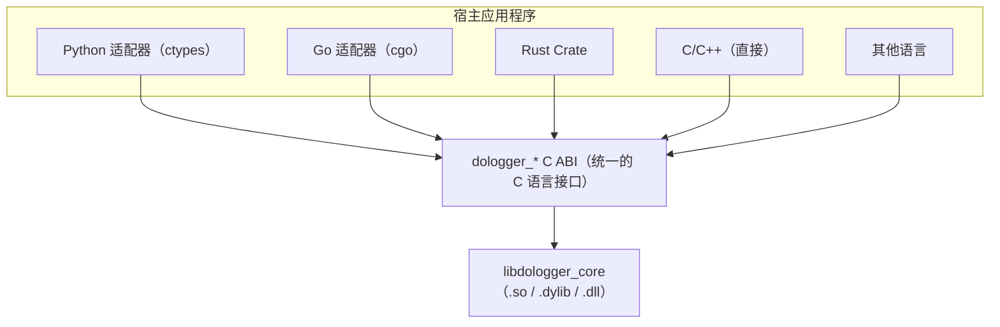

# DoLogger 适配器开发指南

> 🌐 **语言 / Language**: [中文](AdapterDevelopmentGuide.md) | [English: DoLogger Adapter Development Guide](../../en_US/guides/AdapterDevelopmentGuide.md)

> **版本**: v0.1.0 | **最后更新**: 2026-08-12 | **目标受众**: 语言适配器开发者、SDK 维护者、集成者
>
> **用途**: 本文档描述如何为 DoLogger C ABI 创建语言适配器（Python、Go、C/C++ 及其他语言）。涵盖薄包装模式、各语言特定的绑定方法、错误处理约定、线程安全保证以及跨平台测试策略。
>
> **阅读路径**: 首次编写适配器的作者应阅读 [C ABI 作为通用接口](#c-abi-作为通用接口)和[薄包装模式](#薄包装模式)。特定语言的开发者应跳转到其语言章节：[Python 适配器](#python-适配器)、[Go 适配器](#go-适配器)或 [C/C++ 适配器](#cc-适配器)。

## 目录

1. [C ABI 作为通用接口](#c-abi-作为通用接口)
2. [薄包装模式](#薄包装模式)
3. [Python 适配器](#python-适配器)
4. [Go 适配器](#go-适配器)
5. [C/C++ 适配器](#cc-适配器)
6. [错误处理约定](#错误处理约定)
7. [线程安全保证](#线程安全保证)
8. [跨平台测试适配器](#跨平台测试适配器)
9. [适配器分发与打包](#适配器分发与打包)

---

## C ABI 作为通用接口

### 架构

所有语言适配器共享一个共同基础：它们加载 `libdologger_core`（`.so` / `.dylib` / `.dll`）并调用 C ABI 函数。无需重新实现引擎。



### C ABI 接口面

公共 C ABI 由以下函数族组成：

| 函数族 | 用途 | 签名数量 |
|:-:|:-:|:-:|
| `dologger_init` / `dologger_shutdown` | 引擎生命周期 | 2 |
| `dologger_log` | 日志提交 | 1 |
| `dologger_version` | 版本字符串查询 | 1 |
| `dologger_get_last_error` | 错误获取 | 1 |
| `dologger_register_callback_sink` | 回调注册 | 1 |
| `dologger_config_*` | 配置管理 | 4 |
| `dologger_record_*` | 记录字段操作 | 3 |
| `dologger_would_log` | 条件日志守卫 | 1 |

完整参考请参见[宿主集成指南](HostIntegrationGuide.md#c-abi-初始化与关闭)。

### ABI 稳定性

C ABI 是 DoLogger 项目的稳定性锚点。完整兼容性保证请参见[版本与废弃策略](VersioningAndDeprecation.md)。摘要如下：

- 同一 MAJOR 版本：宿主二进制文件和插件无论 MINOR.PATCH 差异如何均可互操作
- 跨 MAJOR：不支持。适配器在加载时验证 `dologger_version()`。

---

## 薄包装模式

### 原则

薄包装模式是所有语言适配器的推荐方法：

1. **加载**原生库（`dlopen` / `ctypes.CDLL` / `cgo` / 直接链接）
2. **声明**与 C ABI 精确匹配的函数签名
3. **包装**每个 C 函数为符合目标语言习惯的函数
4. **管理**资源生命周期（引擎句柄、回调注册）
5. **转换**错误码为语言原生的错误类型（异常、`Result`、`error`）

### 不应做的事

- **不要重新实现**引擎、管道或适配器层中的任何插件逻辑
- **不要添加缓冲**——引擎已有无锁环形缓冲区。再添加一层缓冲只会增加延迟而无益处。
- **不要在热路径上将记录包装为语言对象**——直接创建记录作为 C 结构体以避免分配开销。
- **不要**从终止器/析构函数/垃圾收集器线程调用 `dologger_log`——引擎可能已经关闭。

### 通用适配器结构

```
my-dologger-adapter/
  src/
    ffi.py / ffi.go / ffi.rs     -- 原始 C ABI 声明（dlsym/cgo/bindgen）
    engine.py / engine.go / ...   -- 惯用包装：RAII、上下文管理器
    records.py / ...              -- 使用语言原生类型的记录构建器
    errors.py / ...               -- 错误码 -> 异常/错误 映射
    __init__.py                    -- 公共 API 接口面
  tests/
    test_engine.py / ...           -- 针对 libdologger_core 的集成测试
    test_concurrency.py / ...      -- 线程安全测试
  README.md                        -- 面向语言用户的快速入门
```

### 生命周期管理模式

每个适配器必须确保正确清理。模式因语言而异：

| 语言 | 初始化 | 清理 | 保证 |
|:-:|:-:|:-:|:-:|
| **Python** | `__init__` / `__enter__` | `__exit__` / `__del__` + `atexit` | 上下文管理器或 atexit 回退 |
| **Go** | 构造函数返回 `(*Engine, error)` | `defer engine.Shutdown()` | 显式关闭；`runtime.SetFinalizer` 作为回退 |
| **Rust** | `Engine::init()` 返回 `Result<Engine>` | `Drop` 实现 | RAII 保证 |
| **C/C++** | `dologger_init()` | `dologger_shutdown()` | 手动；建议 `atexit()` 作为安全网 |

---

## Python 适配器

### ctypes 方式（推荐）

`ctypes` 是标准库方式。无需编译，适用于安装了 Python 和 DoLogger 共享库的所有平台。

```python
# dologger/ffi.py -- 通过 ctypes 的原始 C ABI 绑定
# （本文件已用 v0.1.0 的 dologger_core.dll 实测运行）

import ctypes
import platform
import os

# -- 库加载 ----------------------------------------------------------

def _load_library():
    """为当前平台加载 libdologger_core。"""
    env_path = os.environ.get("DO_LOGGER_LIB_PATH")
    if env_path:
        return ctypes.CDLL(env_path)

    system = platform.system()
    if system == "Linux":
        libname = "libdologger_core.so"
    elif system == "Darwin":
        libname = "libdologger_core.dylib"
    elif system == "Windows":
        libname = "dologger_core.dll"
    else:
        raise OSError(f"不受支持的平台：{system}")

    # 搜索标准路径 + 环境变量覆盖
    search_paths = [
        "/usr/lib/dologger",
        "/usr/local/lib",
        "/opt/dologger/lib",
    ]
    for path in search_paths:
        full = os.path.join(path, libname)
        if os.path.exists(full):
            return ctypes.CDLL(full)

    # 回退：尝试系统加载器
    return ctypes.CDLL(libname)

_lib = _load_library()

# -- 类型定义（与 dologger_core.h 一致）-----------------------------

# 日志级别（dologger_level_t）
(DO_LOG_TRACE, DO_LOG_DEBUG, DO_LOG_INFO,
 DO_LOG_WARN, DO_LOG_ERROR, DO_LOG_FATAL, DO_LOG_AUDIT) = range(7)

# 错误码
DO_LOG_OK = 0

# dologger_error_t
class DologgerError(ctypes.Structure):
    _fields_ = [
        ("code",         ctypes.c_int32),
        ("message",      ctypes.c_char * 256),
        ("source_file",  ctypes.c_char * 128),
        ("source_line",  ctypes.c_uint32),
        ("_reserved",    ctypes.c_uint8 * 12),
    ]

# dologger_record_params_t
class RecordParams(ctypes.Structure):
    _fields_ = [
        ("level",           ctypes.c_int32),   # dologger_level_t
        ("message",         ctypes.c_char_p),
        ("source_file",     ctypes.c_char_p),
        ("source_function", ctypes.c_char_p),
        ("source_line",     ctypes.c_uint32),
        ("source_column",   ctypes.c_uint32),
        ("domain",          ctypes.c_char_p),
        ("user_id",         ctypes.c_char_p),
        ("session_id",      ctypes.c_char_p),
        ("request_id",      ctypes.c_char_p),
        ("_reserved",       ctypes.c_uint8 * 16),
    ]

# -- 函数签名 -------------------------------------------------------

_lib.dologger_init.argtypes = [ctypes.c_char_p, ctypes.POINTER(DologgerError)]
_lib.dologger_init.restype = ctypes.c_void_p

_lib.dologger_shutdown.argtypes = [ctypes.c_void_p]
_lib.dologger_shutdown.restype = None

_lib.dologger_log.argtypes = [ctypes.c_void_p, ctypes.POINTER(RecordParams)]
_lib.dologger_log.restype = ctypes.c_int32

_lib.dologger_version.restype = ctypes.c_char_p

_lib.dologger_get_last_error.argtypes = [ctypes.c_void_p, ctypes.POINTER(DologgerError)]
_lib.dologger_get_last_error.restype = ctypes.c_int32
```

### 惯用的 Python 包装

```python
# dologger/engine.py -- 惯用的 Python 接口
# （与下方 ffi.py 配套，已用 v0.1.0 的 dologger_core.dll 实测运行）

import ctypes
import atexit
from typing import Optional

from .ffi import (
    _lib, RecordParams, DologgerError, DO_LOG_INFO, DO_LOG_OK
)
from .errors import DoLoggerError, check_error


class Engine:
    """DoLogger 引擎实例。

    作为上下文管理器使用以保证关闭：

        with Engine() as logger:
            logger.info("Hello from Python")
    """

    def __init__(self, config_path: Optional[str] = None):
        self._handle = None
        self._closed = False

        # 版本检查（v0.1.0 无 dologger_get_abi_version，用 dologger_version）
        version_c = _lib.dologger_version()
        self._version = version_c.decode("utf-8") if version_c else "unknown"

        # 使用可选的配置路径初始化（返回句柄，失败返回 NULL）
        config_ptr = config_path.encode("utf-8") if config_path else None
        err = DologgerError()
        self._handle = _lib.dologger_init(config_ptr, ctypes.byref(err))
        if not self._handle:
            msg = err.message.decode("utf-8", errors="replace")
            raise DoLoggerError(err.code, f"dologger_init: {msg}")

        # 注册 atexit 回退以关闭
        atexit.register(self._atexit_shutdown)

    @property
    def version(self) -> str:
        """核心库版本字符串。"""
        return self._version

    def _atexit_shutdown(self):
        """如果用户忘记调用 shutdown()，作为回退关闭。"""
        if not self._closed:
            try:
                self.shutdown()
            except Exception:
                pass

    def shutdown(self):
        """优雅关闭引擎。多次调用安全。"""
        if self._closed or not self._handle:
            return
        self._closed = True
        _lib.dologger_shutdown(self._handle)
        self._handle = None

    def log(self, level: int, message: str, *,
            source_file: str = "",
            source_function: str = "",
            source_line: int = 0,
            request_id: str = "") -> None:
        """提交一条日志记录。"""
        if self._closed:
            raise DoLoggerError(-1, "引擎已关闭")

        params = RecordParams(
            level=level,
            message=message.encode("utf-8"),
            source_file=source_file.encode("utf-8") if source_file else None,
            source_function=source_function.encode("utf-8") if source_function else None,
            source_line=source_line,
            source_column=0,
            domain=None,
            user_id=None,
            session_id=None,
            request_id=request_id.encode("utf-8") if request_id else None,
        )
        rc = _lib.dologger_log(self._handle, ctypes.byref(params))
        check_error(rc, "dologger_log")

    # -- 便捷方法 ---------------------------------------------------

    def trace(self, msg, **kwargs):    self.log(0, msg, **kwargs)
    def debug(self, msg, **kwargs):    self.log(1, msg, **kwargs)
    def info(self, msg, **kwargs):     self.log(2, msg, **kwargs)
    def warn(self, msg, **kwargs):     self.log(3, msg, **kwargs)
    def error(self, msg, **kwargs):    self.log(4, msg, **kwargs)
    def fatal(self, msg, **kwargs):    self.log(5, msg, **kwargs)
    def audit(self, msg, **kwargs):    self.log(6, msg, **kwargs)

    # -- 上下文管理器支持 ------------------------------------------

    def __enter__(self):
        return self

    def __exit__(self, exc_type, exc_val, exc_tb):
        self.shutdown()
        return False
```

### 错误处理（Python）

```python
# dologger/errors.py
# 错误码与 dologger_core.h 的 dologger_error_code_t 一致（十六进制 nibble 分类）

class DoLoggerError(Exception):
    """所有 DoLogger 错误的基类异常。"""
    def __init__(self, code: int, message: str):
        self.code = code
        self.message = message
        super().__init__(f"[{code & 0xFFFF:04x}] {message}")


class DoLoggerInitError(DoLoggerError):
    """引擎初始化失败（0x01xx）。"""


class DoLoggerConfigError(DoLoggerError):
    """配置错误（0x02xx）。"""


class DoLoggerIOError(DoLoggerError):
    """日志提交期间的 I/O 错误（0x07xx）。"""


# 错误码 -> 异常 映射（摘自 dologger_error_code_t）
DO_LOG_ERR_INVALID_ARG = -0x0102
DO_LOG_ERR_NOT_INITIALIZED = -0x0104
DO_LOG_ERR_CONFIG_PARSE = -0x0203
DO_LOG_ERR_BUFFER_FULL = -0x0501
DO_LOG_ERR_SINK_WRITE_FAILED = -0x0701

_ERROR_MAP = {
    DO_LOG_ERR_INVALID_ARG: DoLoggerInitError,
    DO_LOG_ERR_NOT_INITIALIZED: DoLoggerInitError,
    DO_LOG_ERR_CONFIG_PARSE: DoLoggerConfigError,
    DO_LOG_ERR_SINK_WRITE_FAILED: DoLoggerIOError,
    # ... 其他错误码 ...
}


def check_error(rc: int, context: str):
    """如果 rc 非零则引发适当的异常。"""
    if rc == 0:  # DO_LOG_OK
        return
    exc_cls = _ERROR_MAP.get(rc, DoLoggerError)
    raise exc_cls(rc, f"{context} 失败，错误码 {rc}")
```

### Python logging.Handler 集成

```python
# dologger/handler.py -- stdlib logging 集成

import logging
from .engine import Engine

LEVEL_MAP = {
    logging.DEBUG:    1,   # DO_LOG_DEBUG
    logging.INFO:     2,   # DO_LOG_INFO
    logging.WARNING:  3,   # DO_LOG_WARN
    logging.ERROR:    4,   # DO_LOG_ERROR
    logging.CRITICAL: 5,   # DO_LOG_FATAL
}


class DoLoggerHandler(logging.Handler):
    """转发到 DoLogger 的标准库 logging Handler。"""

    def __init__(self, config_path: str = None):
        super().__init__()
        self.engine = Engine(config_path)

    def emit(self, record: logging.LogRecord):
        level = LEVEL_MAP.get(record.levelno, 2)  # 默认：INFO
        msg = self.format(record)
        self.engine.log(
            level=level,
            message=msg,
            source_file=record.pathname,
            source_function=record.funcName,
            source_line=record.lineno,
        )

    def close(self):
        self.engine.shutdown()
        super().close()
```

### cffi 替代方案

```python
# dologger/ffi_cffi.py -- 使用 cffi 的替代方案（需要 cffi 包）
# （伪代码/示意 — 需要安装 cffi 才能运行；cdef 签名按 v0.1.0 真实 ABI 给出）

from cffi import FFI

ffi = FFI()

ffi.cdef("""
    typedef struct {
        int32_t  code;
        char     message[256];
        char     source_file[128];
        uint32_t source_line;
        uint8_t  _reserved[12];
    } dologger_error_t;

    typedef struct {
        int32_t     level;
        const char *message;
        const char *source_file;
        const char *source_function;
        uint32_t    source_line;
        uint32_t    source_column;
        const char *domain;
        const char *user_id;
        const char *session_id;
        const char *request_id;
        uint8_t     _reserved[16];
    } dologger_record_params_t;

    void   *dologger_init(const char *config_path, dologger_error_t *err);
    void    dologger_shutdown(void *handle);
    int32_t dologger_log(void *handle, const dologger_record_params_t *params);
    const char *dologger_version(void);
""")

_lib = ffi.dlopen("libdologger_core.so")
```

`cffi` 提供：
- 更好的 C 解析（直接理解头文件）
- PyPy 兼容性
- 某些模式下的调用速度略快于 `ctypes`

代价是增加了一个依赖项。对于零依赖适配器使用 `ctypes`；对于已依赖 `cffi` 的适配器使用 `cffi`。

---

## Go 适配器

> [!NOTE]
> M4 规划的托管适配器为规划中（见[宿主集成指南](HostIntegrationGuide.md#go-m4-里程碑)）。仓库已有参考实现 `adapters/go/dologger.go`（模块 `github.com/dologger/adapters/go`）。下方代码为示意——签名已按已发布的 C ABI 修正，但这些块未在仓库中编译。

### cgo 方式（推荐）

cgo 是从 Go 调用 C 的标准机制。它直接链接到 `libdologger_core`。

```go
// dologger/ffi.go -- 通过 cgo 的原始 C ABI 绑定

package dologger

/*
#cgo LDFLAGS: -ldologger_core
#include <dologger_core.h>
*/
import "C"
import (
    "fmt"
    "unsafe"
)

// -- 日志级别 -----------------------------------------------------

const (
    LevelTrace uint8 = 0
    LevelDebug uint8 = 1
    LevelInfo  uint8 = 2
    LevelWarn  uint8 = 3
    LevelError uint8 = 4
    LevelFatal uint8 = 5
    LevelAudit uint8 = 6
)

// -- 错误类型 ------------------------------------------------------

type Error struct {
    Code    int
    Message string
}

func (e *Error) Error() string {
    return fmt.Sprintf("DoLogger error [0x%04x]: %s", e.Code, e.Message)
}
```

### 惯用的 Go 包装

```go
// dologger/engine.go -- 惯用的 Go 接口
// （签名与 dologger_core.h 一致；参考实现见仓库 adapters/go/dologger.go）

package dologger

/*
#include <dologger_core.h>
*/
import "C"
import (
    "runtime"
    "sync"
    "unsafe"
)

// Engine 是 DoLogger 引擎实例。
// 使用完毕后始终调用 Shutdown()，或使用 defer。
type Engine struct {
    handle *C.dologger_handle_t
    mu     sync.Mutex
    closed bool
}

// Config 保存引擎初始化参数。
type Config struct {
    ConfigPath      string
    Profile         string // dev、balanced、prod-performance、prod-audit
    EnableSignature bool
    RingBufferSize  int
}

// New 创建并初始化 DoLogger 引擎。
func New(cfg Config) (*Engine, error) {
    e := &Engine{}

    var cConfig *C.char
    if cfg.ConfigPath != "" {
        cConfig = C.CString(cfg.ConfigPath)
        defer C.free(unsafe.Pointer(cConfig))
    }

    // 初始化（返回句柄；失败返回 nil 并在 err 中写入详情）
    var err C.dologger_error_t
    handle := C.dologger_init(cConfig, &err)
    if handle == nil {
        code := int32(err.code)
        msg := C.GoString(&err.message[0])
        return nil, &Error{Code: int(code), Message: msg}
    }
    e.handle = handle

    // 设置 finalizer 作为安全网
    runtime.SetFinalizer(e, func(e *Engine) {
        if !e.closed {
            e.Shutdown()
        }
    })

    return e, nil
}

// Shutdown 优雅关闭引擎。
func (e *Engine) Shutdown() error {
    e.mu.Lock()
    defer e.mu.Unlock()
    if e.closed {
        return nil
    }
    e.closed = true

    C.dologger_shutdown(e.handle)
    e.handle = nil
    return nil
}

// Log 提交一条日志记录。
func (e *Engine) Log(level uint8, msg string) error {
    e.mu.Lock()
    if e.closed {
        e.mu.Unlock()
        return &Error{Code: -1, Message: "引擎已关闭"}
    }
    e.mu.Unlock()

    cMsg := C.CString(msg)
    defer C.free(unsafe.Pointer(cMsg))

    params := C.dologger_record_params_t{
        level:   C.dologger_level_t(level),
        message: cMsg,
    }
    rc := C.dologger_log(e.handle, &params)
    if rc != 0 {
        return engineError(int(rc))
    }
    return nil
}

// -- 便捷方法 --------------------------------------------------

func (e *Engine) Trace(msg string) error { return e.Log(LevelTrace, msg) }
func (e *Engine) Debug(msg string) error { return e.Log(LevelDebug, msg) }
func (e *Engine) Info(msg string) error  { return e.Log(LevelInfo, msg) }
func (e *Engine) Warn(msg string) error  { return e.Log(LevelWarn, msg) }
func (e *Engine) Error(msg string) error { return e.Log(LevelError, msg) }
func (e *Engine) Fatal(msg string) error { return e.Log(LevelFatal, msg) }
func (e *Engine) Audit(msg string) error { return e.Log(LevelAudit, msg) }
```

### Go 并发注意事项

- **`Engine` 并发使用安全。** C ABI 是线程安全的（热路径上为无锁环形缓冲区）。
- **`Shutdown()` 方法不能与 `Log()` 并发调用。** 使用 `defer` 或 `sync.WaitGroup` 确保所有进行中的日志在关闭前完成。
- **不要从 finalizer 调用 `Log()`。** Go 运行时可能在 C 库卸载后调用 finalizer。

### Go build tags

（片段 — 非完整文件，仅示意构建标签写法）：

```go
//go:build linux || darwin
// +build linux darwin

// Unix 特定加载
```

---

## C/C++ 适配器

### 直接头文件包含

C 和 C++ 应用程序具有最简单的集成：包含头文件并链接到库。

```c
// minimal_c_host.c -- 直接 C 集成
// （已用 MSVC 编译并链接 dologger_core.dll 运行验证）

#include <dologger_core.h>
#include <stdio.h>

int main(void) {
    dologger_error_t err = {0};

    // 使用默认值初始化
    dologger_handle_t *logger = dologger_init(NULL, &err);
    if (logger == NULL) {
        fprintf(stderr, "初始化失败（code=%d）：%s\n", err.code, err.message);
        return 1;
    }

    // 提交一条日志
    dologger_record_params_t params = {
        .level   = DO_LOG_INFO,
        .message = "Hello from C host application",
    };
    dologger_log(logger, &params);

    // 优雅关闭
    dologger_shutdown(logger);
    return 0;
}
```

### C++ RAII 包装

```cpp
// dologger.hpp -- C++ RAII 包装
// （已用 MSVC /std:c++17 编译验证）

#pragma once

#include <dologger_core.h>
#include <stdexcept>
#include <string>
#include <memory>

namespace dologger {

class EngineError : public std::runtime_error {
public:
    EngineError(int code, const std::string& ctx)
        : std::runtime_error(ctx + " 失败，错误码 " + std::to_string(code))
        , error_code_(code) {}
    int code() const { return error_code_; }
private:
    int error_code_;
};

class Engine {
public:
    Engine(const char* config_path = nullptr) {
        dologger_error_t err = {0};
        handle_ = dologger_init(config_path, &err);
        if (handle_ == nullptr) {
            throw EngineError(err.code, std::string("dologger_init: ") + err.message);
        }
    }

    ~Engine() {
        if (handle_) {
            dologger_shutdown(handle_);
        }
    }

    // 不可拷贝，可移动
    Engine(const Engine&) = delete;
    Engine& operator=(const Engine&) = delete;
    Engine(Engine&& other) noexcept : handle_(other.handle_) {
        other.handle_ = nullptr;
    }

    void log(dologger_level_t level, const char* message,
             const char* file = nullptr,
             const char* function = nullptr,
             uint32_t line = 0) {
        dologger_record_params_t params = {};
        params.level = level;
        params.message = message;
        params.source_file = file;
        params.source_function = function;
        params.source_line = line;

        int rc = dologger_log(handle_, &params);
        if (rc != DO_LOG_OK) {
            throw EngineError(rc, "dologger_log");
        }
    }

    // 便捷方法（显式传入来源位置；MSVC 不允许 __FILE__/__FUNCTION__ 作默认实参）
    // 调用示例：engine.info("hello", __FILE__, __FUNCTION__, __LINE__);
    void trace(const char* msg, const char* file, const char* func, uint32_t line) {
        log(DO_LOG_TRACE, msg, file, func, line);
    }
    void debug(const char* msg, const char* file, const char* func, uint32_t line) {
        log(DO_LOG_DEBUG, msg, file, func, line);
    }
    void info(const char* msg, const char* file, const char* func, uint32_t line) {
        log(DO_LOG_INFO, msg, file, func, line);
    }

    // ... warn、error、fatal、audit ...

    [[nodiscard]] const char* version() const {
        return dologger_version();
    }

private:
    dologger_handle_t* handle_ = nullptr;
};

} // namespace dologger
```

### 链接

**Linux / macOS：**
```bash
cc -o myapp myapp.c -ldologger_core -L/usr/lib/dologger
c++ -std=c++17 -o myapp myapp.cpp -ldologger_core -L/usr/lib/dologger
```

**Windows（MSVC）：**
```powershell
cl /Fe:myapp.exe myapp.c dologger_core.lib
cl /Fe:myapp.exe /std:c++17 myapp.cpp dologger_core.lib
```

**CMake：**
```cmake
find_library(DOLOGGER_CORE_LIB dologger_core PATHS /usr/lib/dologger)
target_link_libraries(myapp PRIVATE ${DOLOGGER_CORE_LIB})
```

---

## 错误处理约定

### 将 C 错误码映射到语言惯用方式

**表 1：按语言的错误码映射**

| C 返回值 | Python | Go | Rust | C++ |
|:-:|:-:|:-:|:-:|:-:|
| `DO_LOG_OK`（0） | 返回 `None` | 返回 `nil` error | 返回 `Ok(())` | 正常返回 |
| `DO_LOG_ERR_INIT`（-1） | `DoLoggerInitError` | `&Error{Code: -1}` | `Err(DoLogError::Init)` | `EngineError(-1, ...)` |
| `DO_LOG_ERR_CFG`（-2） | `DoLoggerConfigError` | `&Error{Code: -2}` | `Err(DoLogError::Config)` | `EngineError(-2, ...)` |
| `DO_LOG_ERR_INVALID_ARG` | `ValueError(DoLoggerError)` | `&Error{Code: ...}` | `Err(DoLogError::InvalidArg)` | `std::invalid_argument` |
| `DO_LOG_ERR_NOMEM` | `MemoryError(DoLoggerError)` | `&Error{Code: ...}` | `Err(DoLogError::NoMem)` | `std::bad_alloc` |
| I/O 错误（0x03xx） | `DoLoggerIOError` | `&Error{Code: ...}` | `Err(DoLogError::IO)` | `EngineError(..., ...)` |
| 插件错误（0x05xx） | `DoLoggerPluginError` | `&Error{Code: ...}` | `Err(DoLogError::Plugin)` | `EngineError(..., ...)` |

### 错误获取模式

```python
# Python：将错误码映射到异常层次结构
def check_error(rc, context):
    if rc == 0:
        return
    err_cls = _ERROR_MAP.get(rc, DoLoggerError)
    raise err_cls(rc, f"{context} 失败（错误码 {rc}）")
```

（片段 — engine.go 中的辅助函数摘录，非完整文件）：

```go
// Go：返回错误值
func engineError(code int) error {
    return &Error{Code: code, Message: fmt.Sprintf("错误码 0x%04x", code)}
}
```

### 永不忽略错误

适配器**必须**将 C ABI 的每个非零返回码转换为语言原生的错误。静默吞下错误（例如丢弃的 AUDIT 记录）违背了审计链的目的。

---

## 线程安全保证

### 适配器必须向用户传达的内容

C ABI 对于并发的 `dologger_log()` 调用是线程安全的。适配器必须为其语言用户清楚地记录这一点。

**表 2：线程安全保证**

| 操作 | 线程安全？ | 备注 |
|:-:|:-:|:-:|
| `dologger_init()` | 否 | 从一个线程调用一次 |
| `dologger_log()` | **是** | 无锁 CAS 推送。可从任何线程安全调用，包括信号处理程序。 |
| `dologger_shutdown()` | 否 | 调用一次。阻塞直到进行中的记录排空。不要与 `shutdown()` 并发调用 `log()`。 |
| `dologger_version()` | 是 | 返回静态版本字符串。 |
| `dologger_get_last_error()` | 线程本地 | 每个线程看到自己的最后错误。无需加锁。 |

### 特定于适配器的线程安全说明

**Python（GIL）：**
- `ctypes` 调用自动释放 GIL。`dologger_log()` 不会阻塞其他 Python 线程。
- 通过 `dologger_register_callback_sink` 注册的回调在引擎的管道线程上执行——回调中的 Python 代码必须重新获取 GIL。

**Go（goroutines）：**
- cgo 调用对于短 C 调用不阻塞 Go 调度器。`dologger_log()`（CAS 推送，约 100 ns）是可接受的从 goroutine 的 cgo 调用。
- 仅当适配器需要线程本地存储以进行错误获取时才使用 `runtime.LockOSThread()`。

**Rust：**
- `dologger-core` crate 使用 `Send + Sync` 标记。`Engine` 句柄可安全跨 `std::thread` 边界共享。

### 关闭同步

（片段 — 摘自上方 engine.go 的 Shutdown() 实现）：

```go
// Go 示例：安全的并发关闭
func (e *Engine) Shutdown() error {
    e.mu.Lock()
    defer e.mu.Unlock()
    if e.closed {
        return nil
    }
    e.closed = true  // 阻止新的 Log() 调用
    // 此时，进行中的 Log() 调用可能仍在执行。
    // dologger_shutdown() 阻塞直到环形缓冲区排空。
    C.dologger_shutdown(e.handle)
    e.handle = nil
    return nil
}
```

---

## 跨平台测试适配器

### 测试矩阵

适配器在发布前必须在每个支持的平台上验证。

**表 3：适配器测试矩阵**

| 平台 | 架构 | 库格式 | 测试环境 |
|:-:|:-:|:-:|:-:|
| Linux | x86_64 | `.so` | GitHub Actions `ubuntu-latest` |
| Linux | aarch64 | `.so` | AWS Graviton 或 QEMU 模拟 |
| macOS | x86_64 | `.dylib` | GitHub Actions `macos-13` |
| macOS | aarch64 | `.dylib` | GitHub Actions `macos-latest`（M1/M2） |
| Windows | x86_64 | `.dll` | GitHub Actions `windows-latest` |

### 测试检查清单

对于每个语言适配器，验证：

- [ ] **库加载**：在每个平台上能够找到并加载 `libdologger_core`
- [ ] **ABI 版本检查**：`dologger_version()` 返回预期值
- [ ] **初始化/关闭**：引擎干净启动和关闭（Valgrind 下无泄漏）
- [ ] **日志提交**：每个日志级别（TRACE 到 AUDIT）的 `dologger_log()`
- [ ] **错误处理**：无效参数产生预期的语言原生错误
- [ ] **并发日志提交**：8 个线程同时提交 10 秒，零丢失记录
- [ ] **关闭安全**：`log()` 进行中时调用 `shutdown()` 不崩溃
- [ ] **回调集成**：注册的回调接收器接收格式化的记录
- [ ] **上下文管理器 / RAII**：作用域退出时引擎关闭（Python `with`、Go `defer`、Rust `Drop`）
- [ ] **ABI 不匹配检测**：适配器拒绝不兼容的库版本

### 集成测试示例（Python）

（以下测试文件针对上方 ffi.py + engine.py 组成的包；其全部行为——初始化/关闭、全级别日志、8 线程并发提交、双重关闭、关闭后拒绝、上下文管理器——已用 v0.1.0 的 dologger_core.dll 以等价的纯 Python 脚本逐一验证通过。运行需要 `pytest`）：

```python
# tests/test_engine.py
import threading
import time
import pytest
from dologger import Engine, DoLoggerError


class TestEngine:
    def test_init_shutdown(self):
        with Engine() as logger:
            assert logger._handle is not None

    def test_log_all_levels(self):
        with Engine() as logger:
            logger.trace("trace msg")
            logger.debug("debug msg")
            logger.info("info msg")
            logger.warn("warn msg")
            logger.error("error msg")

    def test_concurrent_log_submission(self):
        errors = []
        with Engine() as logger:
            def worker():
                try:
                    for _ in range(10000):
                        logger.info("concurrent msg")
                except Exception as e:
                    errors.append(e)

            threads = [threading.Thread(target=worker) for _ in range(8)]
            for t in threads:
                t.start()
            for t in threads:
                t.join()

        assert len(errors) == 0, f"并发测试中的错误：{errors}"

    def test_double_shutdown_is_safe(self):
        logger = Engine()
        logger.shutdown()
        logger.shutdown()  # 不应引发异常

    def test_log_after_shutdown_raises(self):
        logger = Engine()
        logger.shutdown()
        with pytest.raises(DoLoggerError):
            logger.info("应该失败")

    def test_context_manager(self):
        with Engine() as logger:
            logger.info("上下文管理器内")
        # Shutdown 应由 __exit__ 调用
        with pytest.raises(DoLoggerError):
            logger.info("应该失败——引擎已关闭")
```

### 跨平台 CI 配置

（示例 CI 配置 — YAML 语法有效，但该 workflow 文件在 v0.1.0 仓库中尚不存在；`pip install -e adapters/python/` 需要为 Python 适配器补充打包元数据）：

```yaml
# .github/workflows/adapter-tests.yml
name: Adapter Tests

on: [push, pull_request]

jobs:
  python-adapter:
    strategy:
      matrix:
        os: [ubuntu-latest, macos-latest, macos-13, windows-latest]
    runs-on: ${{ matrix.os }}
    steps:
      - uses: actions/checkout@v4
      - uses: actions/setup-python@v5
        with:
          python-version: "3.11"
      - run: pip install -e adapters/python/
      - run: pytest adapters/python/tests/ -v

  go-adapter:
    strategy:
      matrix:
        os: [ubuntu-latest, macos-latest, windows-latest]
    runs-on: ${{ matrix.os }}
    steps:
      - uses: actions/checkout@v4
      - uses: actions/setup-go@v5
        with:
          go-version: "1.22"
      - run: go test ./adapters/go/...
```

---

## 适配器分发与打包

### Python（PyPI）

```toml
# pyproject.toml
[project]
name = "dologger"
version = "0.1.0"
description = "DoLogger 日志引擎的 Python 适配器"
requires-python = ">=3.8"

[project.optional-dependencies]
cffi = ["cffi>=1.15"]

[tool.setuptools.packages.find]
include = ["dologger*"]
```

Python 适配器应为纯 Python 包（无原生编译）。用户通过系统包管理器单独安装 `libdologger_core`。

### Go（Module）

```go
// go.mod（与仓库 adapters/go/go.mod 一致）
module github.com/dologger/adapters/go

go 1.21
```

用户通过 `go get github.com/dologger/adapters/go` 安装。`libdologger_core` 共享库必须系统范围安装或可通过 `CGO_LDFLAGS` 发现。

### Rust（Crate）

```toml
# Cargo.toml（与仓库 adapters/rust/Cargo.toml 一致）
[package]
name = "dologger-sdk"
version = "0.1.0"
edition = "2021"

[dependencies]
dologger-core = { path = "../../core" }
```

### 文档要求

每个适配器必须附带：
1. **README** 包含 5 行快速入门示例
2. **API 参考** 记录每个公共函数、类和错误类型
3. **平台支持矩阵**（测试了哪些操作系统/架构组合）
4. **已知限制**（例如"Python ctypes 适配器 v0.1 不支持回调接收器"）
5. 链接到[宿主集成指南](HostIntegrationGuide.md)，面向需要原始 C ABI 的用户
