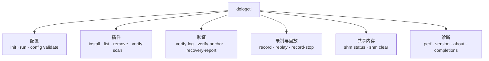

# DoLogger dologctl 命令参考

> 🌐 **语言 / Language**: [中文](DologctlCommandReference.md) | [English: dologctl Command Reference](../../en_US/guides/DologctlCommandReference.md)

> **版本**: v0.1.0 | **最后更新**: 2026-08-13 | **目标受众**: 运维人员、集成者、插件开发者
>
> **用途**: `dologctl` 命令行工具的完整参考。涵盖每个子命令、选项、退出码和代表性示例,并为人工与机器两种消费者说明输出格式。

## 命令总览



## 调用方式

```text
dologctl [全局选项] <命令> [选项] [参数]
```

全局选项可以出现在命令行的**任意位置**(子命令之前或之后):

| 选项 | 取值 | 默认值 | 说明 |
|:-:|:-:|:-:|:-:|
| `-o, --output` | `text`、`json` | `text` | 输出格式。`json` 让所有支持结构化输出的命令在 stdout 输出机器可读 JSON。 |
| `--color` | `auto`、`always`、`never` | `auto` | ANSI 颜色行为。`auto` 仅在 TTY 上启用颜色。 |
| `-q, --quiet` | — | 关闭 | 抑制非错误输出。验证类命令成功时静默退出。 |
| `--licenses` | — | 关闭 | 与 `version` / `about` 连用:输出第三方许可证归属,代替横幅。 |

### 退出码

`dologctl` 遵循 ripgrep / git / cargo 的小而稳定的退出码约定:

| 码 | 名称 | 含义 |
|:-:|:-:|:-:|
| `0` | `EXIT_SUCCESS` | 命令成功完成 |
| `1` | `EXIT_ERR` | 一般错误(IO 失败、参数非法、插件操作失败) |
| `2` | `EXIT_VERIFY_FAILED` | 验证失败 —— 数据**未通过**完整性校验 |
| `3` | `EXIT_CONFIG_ERR` | 配置错误 —— 文件缺失、TOML 非法,或 `--strict` 模式检测到安全不变量被破坏 |

> [!NOTE]
> 脚本应把退出码 `2` 理解为"日志不可信",而不是"命令崩溃"。它是验证结论,不是运行故障。

---

## 配置

### dologctl init

在当前目录从模板生成配置文件。

```text
dologctl init [--template dev|prod|audit]
```

| 选项 | 取值 | 默认值 | 说明 |
|:-:|:-:|:-:|:-:|
| `-t, --template` | `dev`、`prod`、`audit` | `dev` | 要生成的模板 |

| 模板 | 性能预设 | 签名 | 用途 |
|:-:|:-:|:-:|:-:|
| `dev` | `dev` | 关闭 | 本地开发,最高详细度 |
| `prod` | `prod-performance` | 关闭 | 生产吞吐,批量处理 |
| `audit` | `prod-audit` | **开启** | 需要签名审计链的合规负载 |

示例:

```bash
dologctl init                        # dev 模板
dologctl init --template audit       # 启用签名的审计模板
```

命令写入 `dologger.toml`,并且**拒绝覆盖**已存在的文件(退出码 `1`)。

### dologctl config validate

校验配置文件,不启动引擎。

```text
dologctl config validate [--strict] [--config <path>]
```

| 选项 | 说明 |
|:-:|:-:|
| `-c, --config <path>` | 要校验的配置文件(默认查找 `./dologger.toml`) |
| `--strict` | 强制不可降级安全不变量(签名、WORM、fsync、TLS、Ring 2 签名)—— 违规以退出码 `3` 失败 |

示例:

```bash
dologctl config validate                        # 默认文件,宽松模式
dologctl config validate --strict               # 强制安全不变量
dologctl config validate -c /etc/dologger.toml --strict
```

### dologctl run

启动 DoLogger 引擎(前台运行)。

```text
dologctl run [--dry-run] [--config <path>] [--trace]
```

| 选项 | 说明 |
|:-:|:-:|
| `-c, --config <path>` | 要加载的配置文件 |
| `--dry-run` | 只校验配置,不启动引擎 |
| `--trace` | 启用逐条记录的管道阶段计时(有诊断开销 —— 仅用于开发) |

示例:

```bash
dologctl run --config dologger.toml
dologctl run --dry-run                      # 等价于 config validate
dologctl run --trace                        # 逐条记录管道计时
```

---

## 插件

### dologctl plugin install

从路径或 URL 安装插件。

```text
dologctl plugin install <source>
```

```bash
dologctl plugin install ./target/release/fmt_json.dll
dologctl plugin install https://plugins.example.com/fmt_json-v1.2.0.zip
```

安装的插件在可被加载前必须通过验证(ABI 版本、信任颜色、符号解析)。信任模型见[插件开发指南](PluginDevelopmentGuide.md)。

### dologctl plugin list

列出已安装插件,含信任颜色与版本。

```text
dologctl plugin list
```

```bash
dologctl plugin list
dologctl plugin list --output json        # 机器可读清单
```

### dologctl plugin remove

按名称卸载插件。

```text
dologctl plugin remove <name>
```

```bash
dologctl plugin remove fmt_json
```

### dologctl plugin verify

验证插件完整性:ABI 版本匹配、签名/信任颜色、符号解析。

```text
dologctl plugin verify [name]
```

```bash
dologctl plugin verify                     # 验证全部已安装插件
dologctl plugin verify fmt_json            # 验证单个插件
```

退出码 `0` = 全部通过;退出码 `2` = 验证失败(插件被篡改或版本不兼容)。

### dologctl plugin scan

扫描已安装插件中的可疑符号(如原始套接字、`system()`、无边界 `memcpy`),并输出每个插件的风险摘要。

```text
dologctl plugin scan
```

---

## 验证

### dologctl verify-log

离线验证日志文件的审计链:Ed25519 签名、LSN 连续性、`prev_hash` 链式关联。

```text
dologctl verify-log <path> [--pubkey <hex>]
```

| 选项 | 说明 |
|:-:|:-:|
| `--pubkey <hex>` | 用于签名验证的公钥(64 个十六进制字符)。省略则只做结构验证。 |

```bash
dologctl verify-log audit.worm --pubkey "$(cat pubkey.hex)"
dologctl verify-log audit.worm --output json    # 机器可读结论
```

退出码 `0` = 链条完整;退出码 `2` = 检测到篡改或不连续。

### dologctl verify-anchor

验证外部锚定 JSON 文件(周期性根哈希锚定到不可变存储)。

```text
dologctl verify-anchor <path> [--pubkey <hex>]
```

```bash
dologctl verify-anchor anchors/2026-08-13.json --pubkey "$(cat pubkey.hex)"
```

### dologctl recovery-report

扫描目录中的 `*.worm` 文件,报告崩溃重启边界处的 LSN 连续性。

```text
dologctl recovery-report [worm_dir]
```

```bash
dologctl recovery-report ./logs          # 默认:当前目录
```

---

## 录制与回放

### dologctl record

生成合成 SIF 测试记录(用于管道集成测试)。

```text
dologctl record <domain> --output <file> [--duration <secs>]
```

| 选项 | 说明 |
|:-:|:-:|
| `-o, --output <file>` | 输出 SIF 文件路径 |
| `-d, --duration <secs>` | 录制时长(秒,默认 `10`) |

```bash
dologctl record app -o capture.sif -d 30
```

### dologctl replay

将 SIF 文件中的记录重放进管道。

```text
dologctl replay <input> [--speed max|1]
```

| 选项 | 取值 | 默认值 | 说明 |
|:-:|:-:|:-:|:-:|
| `-s, --speed` | `max`、`1` | `max` | `max` = 全速;`1` = 按原始时间戳实时停顿 |

```bash
dologctl replay capture.sif
dologctl replay capture.sif --speed 1
```

### dologctl record-stop

查询(并停止)某个域的录制会话。

```text
dologctl record-stop <domain>
```

```bash
dologctl record-stop app
```

---

## 共享内存

### dologctl shm status

显示共享内存环形缓冲区区域的元数据(头部、槽位、生产者存活标志)。

```text
dologctl shm status <path>
```

```bash
dologctl shm status /dologger_test_full_5271.shm
dologctl shm status /dologger_test_full_5271.shm --output json
```

### dologctl shm clear

清理孤立的共享内存区域。

```text
dologctl shm clear <path> [--force]
```

| 选项 | 说明 |
|:-:|:-:|
| `--force` | 即使生产者仍然存活也强制删除 |

```bash
dologctl shm clear /dologger_test_full_5271.shm
dologctl shm clear /dologger_test_full_5271.shm --force   # 危险 —— 谨慎使用
```

---

## 诊断

### dologctl perf

运行本地性能基准测试(单线程推入延迟)。

```text
dologctl perf [--count <n>] [--message-size <bytes>]
```

| 选项 | 默认值 | 说明 |
|:-:|:-:|:-:|
| `--count <n>` | `100000` | 要推入的记录数 |
| `--message-size <bytes>` | `80` | 消息大小(字节,最大 `255` —— 内联记录容量) |

```bash
dologctl perf
dologctl perf --count 1000000 --message-size 255
```

### dologctl version / about

打印项目横幅与版本、系统详情。

```text
dologctl version
dologctl about
dologctl version --licenses          # 第三方许可证归属
```

### dologctl completions

在 stdout 生成 shell 补全脚本。

```text
dologctl completions <shell>
```

支持的 shell:`bash`、`zsh`、`fish`、`powershell`、`elvish`。

```bash
source <(dologctl completions bash)
source <(dologctl completions zsh)
dologctl completions fish | source
dologctl completions powershell | Out-String | Invoke-Expression
```

> [!TIP]
> 将补全脚本写入 shell 配置文件,让每个新终端自动生效:
> `dologctl completions bash > ~/.dologctl-complete.bash && echo 'source ~/.dologctl-complete.bash' >> ~/.bashrc`

---

## 脚本化建议

- **JSON 输出**:传入 `--output json` 并用 `jq` / `ConvertFrom-Json` 解析。日志场景加 `--color never` 避免 ANSI 转义。
- **CI 中的验证**:利用退出码 `2` 的语义 —— `dologctl verify-log` + `if [ $? -eq 2 ]` 即可在部署前拦截链条完整性问题。
- **配置漂移检测**:在 pre-commit 或 pre-deploy 钩子中运行 `dologctl config validate --strict`,在安全不变量回归上线前捕获。

## 相关文档

- [架构参考](../ArchitectureReference.md) —— 每个命令背后的引擎内部机制
- [运维与安全](../OperationsAndSecurity.md) —— 使用这些命令的运维手册
- [集成指南](../IntegrationGuide.md) —— 在应用程序中嵌入引擎
