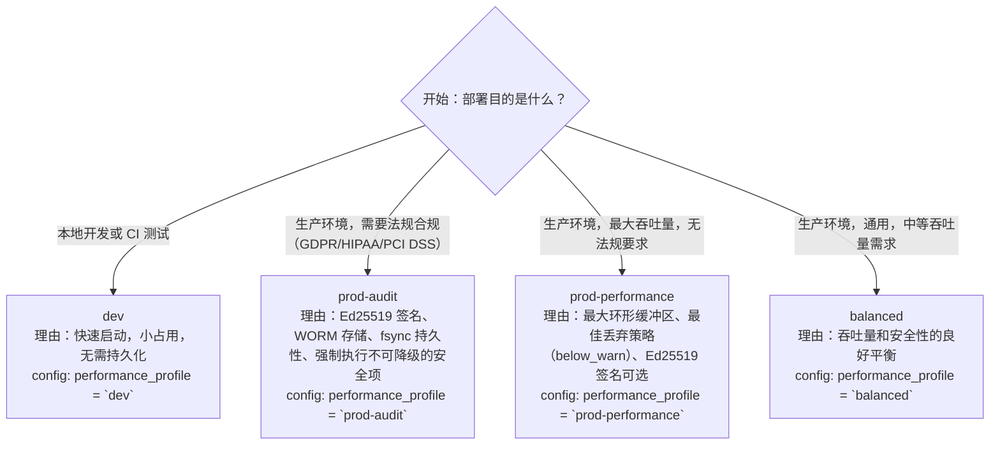

# DoLogger 高性能调优指南

> 🌐 **语言 / Language**: [中文](PerformanceTuningGuide.md) | [English: DoLogger Performance Tuning Guide](../../en_US/guides/PerformanceTuningGuide.md)

> **版本**: v0.1.0 | **最后更新**: 2026-08-12 | **目标受众**: SRE / 运维工程师、性能工程师、系统管理员
>
> **用途**: 本文档为 DoLogger 部署提供系统级性能调优指导。涵盖操作系统内核参数、CPU 和 NUMA 亲和性、环形缓冲区大小计算公式、性能配置文件选择、接收器吞吐量特性、内存预算和实际部署示例。
>
> **阅读路径**: 新运维人员应从[性能配置文件选择](#性能配置文件选择)和[环形缓冲区大小配置](#环形缓冲区大小配置)开始。高吞吐量部署应阅读[操作系统内核调优](#操作系统内核调优)和 [CPU 亲和性与 NUMA 绑定](#cpu-亲和性与-numa-绑定)。容量规划人员应重点关注[内存预算](#内存预算)。

## 目录

1. [性能配置文件选择](#性能配置文件选择)
2. [操作系统内核调优](#操作系统内核调优)
3. [CPU 亲和性与 NUMA 绑定](#cpu-亲和性与-numa-绑定)
4. [环形缓冲区大小配置](#环形缓冲区大小配置)
5. [接收器吞吐量特性](#接收器吞吐量特性)
6. [内存预算](#内存预算)
7. [部署调优示例](#部署调优示例)
8. [性能问题排查](#性能问题排查)

---

## 性能配置文件选择

### 配置文件概览

DoLogger 提供四种预配置的性能配置文件。选择正确的配置文件是最有影响力的调优决策。

**表 1：性能配置文件对比**

| 参数 | `dev` | `balanced` | `prod-performance` | `prod-audit` |
|:-:|:-:|:-:|:-:|:-:|
| Block timeout | 100 ms | 2000 ms | 3000 ms | 3000 ms |
| Drop 策略 | `drop_newest` | `oldest` | `below_warn` | `below_warn` |
| 环形缓冲区大小 | 65536 | 131072 | 262144 | 262144 |
| 批量大小 | 32 | 128 | 256 | 128 |
| Ed25519 签名 | 关闭 | 可选 | 可选 | **必需** |
| WORM 强制 | 关闭 | 可选 | 可选 | **必需** |
| `escape_html` | 可选 | 开启 | 开启 | **开启** |
| `fsync_on_write` | 关闭 | 关闭 | 可选 | **开启** |
| `require_tls` | 关闭 | 仅警告 | 开启 | **开启** |
| 预期吞吐量 | ~200K rec/s | ~600K rec/s | ~900K rec/s | ~50K rec/s |

### 配置文件选择决策树



### 配置文件覆盖

可不完全切换配置文件而覆盖个别参数：

```toml
[dologger]
performance_profile = "prod-performance"

# 在配置文件默认值之上覆盖特定设置
ring_buffer_size = 524288       # 将默认缓冲区翻倍
batch_size = 512                # 更大批量以提高吞吐量
enable_signature = true         # 为性能配置文件添加签名
```

覆盖在配置文件默认值之上合并。不可降级的安全项不能通过覆盖放宽（参见[运维手册](OperationsManual.md#不可降级项)）。

### 何时切换配置文件

| 症状 | 当前配置文件 | 推荐配置文件 | 理由 |
|:-:|:-:|:-:|:-:|
| 环形缓冲区溢出，紧急溢出 | `balanced` | `prod-performance` | 更大缓冲区，更好的丢弃策略 |
| 合规审计即将到来 | `prod-performance` | `prod-audit` | Ed25519 + WORM + fsync 必需 |
| 开发机器，引擎启动较慢 | `prod-performance` | `dev` | 更小缓冲区，更快初始化 |
| 提交超过 500K 条记录/秒 | `balanced` | `prod-performance` | 需要更高上限 |

---

## 操作系统内核调优

### Linux 内核参数

**表 2：推荐的内核参数调优**

| 参数 | 默认值 | 推荐值 | 用途 |
|:-:|:-:|:-:|:-:|
| `vm.max_map_count` | 65530 | **262144** 或更高 | 允许环形缓冲区使用更多内存映射。大环形缓冲区和紧急溢出 mmap 文件必需。 |
| `vm.swappiness` | 60 | **10** | 阻止交换。环形缓冲区必须保持在物理内存中。交换导致灾难性延迟峰值。 |
| `kernel.sched_rt_runtime_us` | 950000 | **-1**（禁用 RT 节流） | 如果对管道线程使用 `SCHED_FIFO`，防止内核节流它们。 |
| `vm.nr_hugepages` | 0 | **见下方公式** | 大页减少环形缓冲区的 TLB 未命中。推荐用于 > 1M 槽的缓冲区。 |
| `vm.hugetlb_shm_group` | 0 | `dologger` 组的 GID | 允许引擎对共享内存段使用大页。 |
| `fs.aio-max-nr` | 65536 | **262144** | 如果对文件接收器写入使用 AIO（计划 M4）。 |

### 应用内核参数

```bash
# 立即应用（非持久化）：
sudo sysctl -w vm.max_map_count=262144
sudo sysctl -w vm.swappiness=10

# 跨重启持久化：
cat << EOF | sudo tee /etc/sysctl.d/99-dologger.conf
# DoLogger 性能调优
vm.max_map_count = 262144
vm.swappiness = 10
# kernel.sched_rt_runtime_us = -1   # 如果使用 SCHED_FIFO 则取消注释
EOF

sudo sysctl --system
```
### 大页

大页（2 MB 或 1 GB）通过单个 TLB 条目映射更大的虚拟内存块，减少 TLB（Translation Lookaside Buffer）未命中。当环形缓冲区超过 100 万槽时有益。

**大页大小计算公式：**

（公式示意 — 非命令）：

```
所需 2MB 大页数 = CEIL(缓冲区大小字节数 / 2097152) + 16（余量）

示例：4M 槽 x 128 字节/槽 = 512 MB 缓冲区
       512 MB / 2 MB 每大页 = 256 页 + 16 余量 = 272 页
```

```bash
# 分配 272 个大页（每个 2 MB）
sudo sysctl -w vm.nr_hugepages=272

# 验证分配
cat /proc/meminfo | grep Huge
# HugePages_Total:     272
# HugePages_Free:      272
# Hugepagesize:       2048 kB
```

### 透明大页（THP）

THP 在页面压缩期间可能引入不可预测的延迟峰值。对于延迟敏感的部署：

```bash
# 如果测量 P99.9 延迟，禁用 THP
echo never | sudo tee /sys/kernel/mm/transparent_hugepage/enabled
echo never | sudo tee /sys/kernel/mm/transparent_hugepage/defrag
```

仅在工作负载对延迟敏感时禁用 THP。对于面向吞吐量的部署，THP 带来的缺页减少是有益的。

### I/O 调度器

对于 NVMe/SSD 存储上的文件和 WORM 接收器：

```bash
# 检查当前调度器
cat /sys/block/nvme0n1/queue/scheduler
# [none] mq-deadline kyber bfq

# 对于 NVMe："none"（no-op）是最优的——设备内部处理调度
echo none | sudo tee /sys/block/nvme0n1/queue/scheduler

# 对于 SATA SSD："mq-deadline" 或 "kyber" 是不错的选择
echo mq-deadline | sudo tee /sys/block/sda/queue/scheduler
```

### 文件系统挂载选项

对于 WORM 审计日志分区：

```bash
# /etc/fstab 中 WORM 存储的条目（ext4 示例）
/dev/nvme0n1p2  /var/lib/dologger/audit  ext4  defaults,noatime,nodiratime,barrier=1  0  2
```

- `noatime`：消除每次读取的访问时间元数据更新——对 `dologctl verify-log` 很重要
- `nodiratime`：对目录 inode 同理
- `barrier=1`：确保写入顺序（对 WORM fsync 持久性至关重要）

---

## CPU 亲和性与 NUMA 绑定

### 为什么亲和性很重要

DoLogger 的管道线程和环形缓冲区消费者受益于专用 CPU 核心。当操作系统调度器将管道线程迁移到不同核心时，它会失去 L1/L2 缓存热度，并可能访问不同 NUMA 节点上的内存。

### 隔离 CPU 核心（cset）

```bash
# 方法 1：cset（推荐用于基于 systemd 的系统）
# 保留核心 2-7 用于 DoLogger 管道线程
sudo cset shield --cpu 2-7 --kthread=on

# 在隔离集内运行应用程序
sudo cset shield --exec -- my_application

# 方法 2：systemd CPUAffinity
# 在应用程序的 systemd service 文件中：
[Service]
CPUAffinity=2-7
```

### DoLogger 线程绑定

DoLogger 线程可以绑定到特定核心：

```toml
[dologger.threading]
# 将每个线程池绑定到特定 CPU
cpu_pool_affinity = [2, 3, 4, 5]    # 管道处理线程
io_pool_affinity = [6, 7]            # 接收器 I/O 线程
audit_thread_affinity = [8]           # 专用审计管道线程
```
**CPU 分配策略：**

（示意 — CPU 分配策略规划，非命令输出）：

```text
CPU 0：     操作系统、中断、系统守护进程（未绑定）
CPU 1：     宿主应用程序主线程
CPU 2-5：   dologger-cpu_pool（Filter、Field、Process、Format）——计算密集型
CPU 6-7：   dologger-io_pool（接收器写入）——I/O 密集型，较低利用率
CPU 8：     dologger-audit-pipeline（专用审计）——永不共享
CPU 9+：   其他应用程序线程
```

### NUMA 感知

在多路系统上，将线程绑定到环形缓冲区内存所在 NUMA 节点本地的核心：

```bash
# 检查 NUMA 拓扑
numactl --hardware

# 示例：2 路系统，2 个 NUMA 节点
# 节点 0：CPU 0-15，节点 1：CPU 16-31

# 在节点 0 上分配环形缓冲区，在节点 0 上运行引擎
numactl --cpunodebind=0 --membind=0 ./my_application
```

**NUMA 最佳实践：**

| 场景 | 建议 |
|:-:|:-:|
| 单路（消费级硬件） | 无需关注 NUMA。仅亲和性就足够。 |
| 双路，单引擎实例 | 将所有引擎线程 + 环形缓冲区绑定到一个 NUMA 节点。将另一个节点留给宿主应用程序。 |
| 双路，多引擎实例 | 每个 NUMA 节点运行一个引擎实例。每个在本地核心上拥有自己的环形缓冲区和线程池。 |

### 验证 CPU 亲和性

```bash
# 在运行时检查线程放置
ps -eLo pid,tid,comm,psr | grep dologger

# 预期输出（CPUAffinity=2-7）：
# 12345 12346 dologger-cpu_pool-0  2
# 12345 12347 dologger-cpu_pool-1  3
# 12345 12348 dologger-io_pool-0   6
# 12345 12349 dologger-audit-pipe  8
```
---

## 环形缓冲区大小配置

### 大小计算公式

环形缓冲区是抵御背压的主要防线。请正确配置其大小。

（公式示意 — 非命令）：

```
环形缓冲区大小（槽） = 每秒峰值记录数 x 最大可容忍排空时间（秒）
                       / 安全系数

安全系数：1.5 到 2.0（考虑突发工作负载）
```
**计算示例：**

| 场景 | 峰值速率 | 最大排空 | 安全系数 | 计算结果 | 取整（2 的幂） |
|:-:|:-:|:-:|:-:|:-:|:-:|
| REST API（突发型） | 500,000 rec/s | 2 秒 | 2.0 | 1,000,000 | **1,048,576** |
| 流式管道（平稳型） | 200,000 rec/s | 1 秒 | 1.5 | 300,000 | **524,288** |
| 批处理作业（大规模突发） | 2,000,000 rec/s | 5 秒 | 2.0 | 20,000,000 | **16,777,216** |
| 仅审计（低速率） | 5,000 rec/s | 3 秒 | 2.0 | 30,000 | **65,536** |

### 2 的幂要求

环形缓冲区大小**必须**是 2 的幂。引擎使用位掩码取模（`index = seq & (size - 1)`）进行 O(1) 槽查找，无需除法。非 2 的幂大小将被配置验证器拒绝。

**表 3：常见 2 的幂环形缓冲区大小**

| 槽数 | 约占用内存（128 B/记录） | 适用场景 |
|:-:|:-:|:-:|
| 65536（64K） | ~8 MB | 开发、仅审计（5K rec/s） |
| 131072（128K） | ~17 MB | 轻度生产（50K rec/s） |
| 262144（256K） | ~34 MB | 中等生产（100K-250K rec/s）——**默认值** |
| 524288（512K） | ~67 MB | 重度生产（250K-500K rec/s） |
| 1048576（1M） | ~134 MB | 高吞吐量（500K-1M rec/s） |
| 4194304（4M） | ~537 MB | 突发型批处理作业（1M-2M rec/s 突发） |
| 16777216（16M） | ~2.1 GB | 极端突发工作负载 |

### 每槽内存

每个环形缓冲区槽消耗的内存取决于记录模板大小：

（公式示意 — 非命令）：

```
每槽内存 = sizeof(dologger_record_t) + 平均消息长度 + 字段开销

典型值：
  - 最小（64 B 消息，无额外字段）：约 96 字节/槽
  - 平均（256 B 消息，3 个额外字段）：约 128 字节/槽  <-- 用于规划
  - 大型（1 KB 消息，10 个额外字段）：约 256 字节/槽
```

### 配置环形缓冲区大小

```toml
[dologger]
ring_buffer_size = 262144       # 256K 槽
```

```bash
# 环境变量覆盖
export DO_LOG_BUF_SIZE=524288
```
### 监控缓冲区利用率

（伪代码/示意 — 控制面在 v0.1.0 尚未随引擎启动（M3+），以下为规划用法）：

```bash
# 检查当前利用率
# curl -s http://127.0.0.1:9090/status | jq .ring_buffer

# 输出：
# {
#   "capacity": 262144,
#   "used": 8192,
#   "pct_used": 3.1,
#   "drops_total": 0,
#   "emergency_spills": 0
# }
```
**何时增加环形缓冲区：**

- `pct_used` 持续超过 50% 超过 60 秒
- `emergency_spills` 计数器非零
- `drops_total` 增长速度快于总记录的 0.01%

---

## 接收器吞吐量特性

### 接收器性能排名

接收器性能各不相同。使用扇出模式（所有接收器接收所有记录）时，最慢的启用接收器决定您的有效吞吐量。

**表 4：接收器吞吐量特性（参考硬件）**

| 接收器 | 吞吐量（rec/s） | 每次写入延迟 | 瓶颈 | 异步？ |
|:-:|:-:|:-:|:-:|:-:|
| Console（`sink_console`） | ~1,200,000 | ~0.8 us | 终端模拟器速度 | 是 |
| File，无 fsync（`sink_file`） | ~950,000 | ~1.0 us | 文件系统页缓存 | 是 |
| Callback（`sink_callback`） | ~2,000,000 | ~0.5 us | 回调函数速度 | 否（同步） |
| Shared Memory（`sink_shm`） | ~3,000,000 | ~0.3 us | 消费者读取速度 | 是 |
| File + fsync（`sink_file`） | ~8,000 | ~125 us | 磁盘 I/O 延迟 | 是 |
| Kafka + TLS（`sink_kafka`） | ~80,000 | ~12.5 us | 网络 I/O + TLS 开销 | 是 |
| Syslog + TLS（`sink_syslog`） | ~60,000 | ~16.7 us | 网络 I/O | 是 |
| Webhook + HTTPS（`sink_webhook`） | ~5,000 | ~200 us | HTTP 往返 | 是 |
| OTel OTLP/HTTP（`sink_otel`） | ~50,000 | ~20 us | HTTP/2 多路复用 | 是 |
| SQLite（`sink_sqlite`） | ~40,000 | ~25 us | Write-ahead log + B-tree | 是 |
| WORM（`sink_worm`） | ~12,000 | ~83 us | fsync + Ed25519 签名 | 否（同步） |

### 快速接收器（吞吐量 > 500K rec/s）

**Console、File（无 fsync）、Callback、Shared Memory：**

这些接收器写入本地资源（终端、页缓存、回调函数、共享内存段）。吞吐量受内存带宽和管道自身处理速度限制，而非 I/O。

### 中等接收器（50K - 500K rec/s）

**Kafka + TLS、Syslog + TLS、OTel：**

网络 I/O 占主导。延迟取决于：
- 到代理/服务器的往返时间
- TLS 握手成本（在连接生命周期内分摊）
- 批量处理效率（更大批量提高吞吐量）

### 慢速接收器（< 50K rec/s）

**File + fsync、WORM、Webhook、SQLite：**

这些接收器每次写入（或每批）强制至少一次 I/O 同步。这是存储介质的物理限制：

- NVMe fsync：每次调用 ~10-30 us
- SATA SSD fsync：每次调用 ~50-150 us
- HDD fsync：每次调用 ~2-10 ms（避免用于日志记录）

### 接收器扇出影响

启用多个接收器时，管道并行分派到所有接收器。有效吞吐量为：

（公式示意 — 非命令）：

```text
有效吞吐量 = MIN（最慢启用接收器的吞吐量）

示例：
  sink_file（950K）+ sink_kafka（80K） -> 有效：80K rec/s
  sink_console（1.2M）+ sink_shm（3M） -> 有效：1.2M rec/s
  sink_worm（12K）+ sink_file（950K）  -> 有效：12K rec/s
```
因为所有接收器共享管道输出阶段。最慢的接收器产生背压。

### 缓解慢速接收器

如果您同时需要快速和慢速接收器：

1. **使用独立域**：仅将 AUDIT 记录路由到慢速 WORM 接收器；将 INFO/WARN 路由到快速文件接收器。
2. **更积极地批量处理**：为慢速接收器增加 `batch_size` 以摊薄每次写入的开销。
3. **使用回调接收器作为桥接**：编写一个快速回调，异步转发到慢速后端。
4. **接受丢弃**：某些接收器类型（Console、Webhook）可以容忍偶尔丢弃。将它们配置为 `drop_on_backpressure = true`。

---

## 内存预算

### 总内存占用

DoLogger 引擎实例使用的总内存为以下各项之和：

（公式示意 — 非命令）：

```
总 RAM = 环形缓冲区 + 对象池 + 插件状态 + 管道缓冲区 + 引擎开销
```

**表 5：内存预算公式**

| 组件 | 公式 | 示例（262K 缓冲区，平均记录） |
|:-:|:-:|:-:|
| 环形缓冲区槽 | `ring_buffer_size * sizeof(record)` | 262144 x 128 B = **34 MB** |
| 对象池 | `ring_buffer_size * sizeof(record)` | 262144 x 128 B = **34 MB** |
| 插件状态 | `SUM(plugin_state_size)` 每个加载的插件 | 10 插件 x 1 MB = **10 MB** |
| 管道格式缓冲区 | `thread_pool_size * max_output_size` | 4 x 1 MB = **4 MB** |
| 引擎开销 | 固定：结构体、配置、元数据 | **~10 MB** |
| **总计** | | **~92 MB** |

### 达到吞吐量目标的内存预算

**表 6：给定吞吐量目标所需的 RAM**

| 目标吞吐量 | 缓冲区大小 | 对象池 | 总 RAM（约） | 推荐系统 RAM |
|:-:|:-:|:-:|:-:|:-:|
| 50K rec/s（轻度） | 65536 | 65536 | ~25 MB | 512 MB |
| 100K rec/s（中等） | 131072 | 131072 | ~48 MB | 1 GB |
| 250K rec/s（生产） | 262144 | 262144 | ~92 MB | 2 GB |
| 500K rec/s（高） | 524288 | 524288 | ~184 MB | 4 GB |
| 1M rec/s（密集） | 1048576 | 1048576 | ~360 MB | 8 GB |
| 2M+ rec/s（极端） | 4194304 | 4194304 | ~1.4 GB | 16 GB |

### 各平台内存限制

| 平台 | 最大缓冲区大小（实用） | 限制因素 |
|:-:|:-:|:-:|
| 容器（512 MB 限制） | 524288 | 容器内存限制 - 缓冲区 + 对象池 + 应用程序必须适配 |
| Kubernetes Pod（2 GB 限制） | 2097152 | Pod 资源配额；为应用程序留出余量 |
| 裸机（64 GB） | 16777216 | 在当前硬件上约 8M 槽后收益递减 |
| 嵌入式/IoT（128 MB） | 65536 | 系统总内存 |

### 监控内存使用

```bash
# 检查进程 RSS
ps -o pid,rss,comm -p $(pgrep -f dologger)

# 或通过状态端点（伪代码/示意 — 控制面在 v0.1.0 尚未随引擎启动，M3+）
# curl -s http://127.0.0.1:9090/status | jq .memory
```

---

## 部署调优示例

### 示例 1：高吞吐量 REST API 服务

**场景：** Go 微服务处理 100K 请求/秒。每个请求记录 3-5 条记录。峰值突发：500K rec/s。生产环境，无合规要求。

**配置：**

```toml
[dologger]
performance_profile = "prod-performance"
ring_buffer_size = 1048576      # 1M 槽用于突发余量
batch_size = 512                 # 大批量以提高吞吐量
enable_signature = false         # 无审计要求

[sinks.kafka]
type = "sink_kafka"
enabled = true
brokers = ["kafka1:9092", "kafka2:9092", "kafka3:9092"]
topic = "api-logs"
tls = true
sasl_mechanism = "SCRAM-SHA-256"
```

**操作系统调优：**

```bash
sudo sysctl -w vm.max_map_count=262144
sudo sysctl -w vm.swappiness=10
sudo cset shield --cpu 4-11 --kthread=on
```

**预期性能：** 约 80K rec/s 持续（受 Kafka 限制），P50 延迟约 105 ns，P99 约 380 ns。

### 示例 2：合规审计（PCI DSS）

**场景：** Java 支付处理服务。稳定 5K rec/s，全部 AUDIT 级别。需要 PCI DSS 合规。

**配置：**

```toml
[dologger]
performance_profile = "prod-audit"
ring_buffer_size = 65536         # 64K——低速率，注重持久性
batch_size = 128
enable_signature = true           # 不可降级
worm_enabled = true               # 不可降级
fsync_on_write = true             # 不可降级
shutdown_policy = "graceful"
shutdown_timeout_ms = 10000

[sinks.worm_file]
type = "sink_worm"
enabled = true
path = "/var/lib/dologger/audit/audit.worm"
```

**操作系统调优：**

```bash
# 以持久性标志挂载 WORM 分区
# /etc/fstab：
# /dev/nvme1n1  /var/lib/dologger/audit  ext4  noatime,barrier=1,data=ordered  0  2
```

**预期性能：** 约 12K rec/s（受 WORM fsync 限制），P50 延迟约 83 us，P99 约 140 us。

### 示例 3：开发工作站

**场景：** 本地开发。仅控制台输出。快速启动，小占用。

**配置：**

```toml
[dologger]
performance_profile = "dev"
level = "DEBUG"
ring_buffer_size = 65536

[sinks.console]
type = "sink_console"
enabled = true
colored = true
```

无需操作系统调优。开箱即用。

### 示例 4：多租户 Sidecar（Kubernetes）

**场景：** Kubernetes Pod 具有 2 GB 限制。应用程序 + DoLogger sidecar。Go 适配器。中等吞吐量：50K rec/s。

**配置：**

```toml
[dologger]
performance_profile = "balanced"
ring_buffer_size = 131072        # 保守：17 MB 缓冲区 + 17 MB 池
batch_size = 128

[sinks.file]
type = "sink_file"
enabled = true
path = "/var/log/dologger/app.log"
max_size = "50MB"
rotation_interval = "1h"
compression = "zstd"
retention_days = 7

[sinks.otel]
type = "sink_otel"
enabled = true
endpoint = "http://otel-collector:4318/v1/logs"
```

**Kubernetes 资源限制：**

```yaml
resources:
  limits:
    memory: "250Mi"
  requests:
    memory: "128Mi"
```

**预期性能：** 约 50K-60K rec/s（受 OTel 限制），P50 约 120 ns。

### 示例 5：带大规模突发的批处理作业

**场景：** ETL 管道，每小时一次，在 5 秒突发中生成 2M 条记录。稳态速率接近零。数据丢失不可接受。

**配置：**

```toml
[dologger]
performance_profile = "prod-performance"
ring_buffer_size = 4194304       # 4M 槽——足够容纳整个突发
batch_size = 512
shutdown_policy = "graceful"
shutdown_timeout_ms = 30000      # 30s——足够排空 4M 条记录

[sinks.file]
type = "sink_file"
enabled = true
path = "/data/etl/logs/pipeline.log"
compression = "zstd"
```

**操作系统调优：**

```bash
# 为 4M 槽缓冲区（512 MB）配置大页
# 512 MB / 2 MB 每大页 = 256 + 16 余量 = 272 页
sudo sysctl -w vm.nr_hugepages=272
```
**预期性能：** 缓冲区在约 2 秒内吸收整个突发，约 30 秒内以约 130K rec/s 排空（文件接收器，无 fsync）。零记录丢弃。

---

## 性能问题排查

### 诊断工作流

（伪代码/示意 — 诊断工作流（控制面在 v0.1.0 尚未启用））：

```text
1. 检查整体健康状态
   curl http://127.0.0.1:9090/status | jq .

2. 检查环形缓冲区利用率
   -> pct_used > 50%：消费者跟不上
   -> pct_used > 90%：紧急情况迫在眉睫
   -> emergency_spills > 0：缓冲区过小

3. 检查接收器健康状态
   -> sink status = "circuit_open"：下游不可达
   -> sink status = "degraded"：下游缓慢

4. 检查管道指标
   -> drops_total / records_processed > 0.01%：缓冲区溢出
   -> avg_latency_us > 500：管道阶段缓慢

5. 检查系统指标
   -> CPU 利用率：是否有核心达到 100%？
   -> 磁盘 I/O：iostat -x 1（await 或 %util 高？）
   -> 内存：是否有交换使用？
```

### 常见问题及解决方案

**表 7：性能排查指南**

| 症状 | 可能原因 | 解决方案 |
|:-:|:-:|:-:|
| 环形缓冲区持续 > 50% | 消费者无法跟上生产者 | 增加 `ring_buffer_size`；检查接收器健康状态；考虑 `prod-performance` 配置文件 |
| 紧急溢出文件出现 | 缓冲区溢出 | 将 `ring_buffer_size` 翻倍；检查产生背压的慢速接收器 |
| P99 延迟峰值 > P50 的 10 倍 | 操作系统调度抖动、TLB 未命中或缺页 | 启用大页；使用 CPU 亲和性绑定线程；禁用 THP |
| 吞吐量低于配置文件预期 | 选择了错误的配置文件或接收器瓶颈 | 验证配置中的 `performance_profile`；检查最慢接收器吞吐量 |
| 渐进式性能下降 | 内存泄漏或热节流 | 随时间监控进程 RSS；检查 CPU 温度 |
| `pct_used` 剧烈波动（5% 到 90%） | 突发工作负载超过缓冲区容量 | 增加 `ring_buffer_size` 以容纳突发；平滑生产者速率 |
| CPU 高但吞吐量低 | 锁竞争或过多系统调用 | 使用 `perf top` 分析；检查 CAS 游标上的互斥锁竞争 |
| WORM 吞吐量 < 5K rec/s | 慢速存储介质（HDD） | 将 WORM 文件移至 NVMe；每次 fsync 批量多条记录 |

### 快速诊断命令

```bash
# 伪代码/示意 — 控制面在 v0.1.0 尚未随引擎启动（M3+）
# curl -s http://127.0.0.1:9090/status | jq .

# CPU 性能分析（60 秒采样）
perf top -p $(pgrep -f dologger)

# 磁盘延迟直方图
sudo iostat -x 1 10

# 线程放置
ps -eLo pid,tid,comm,psr | grep dologger

# 内存使用
pmap -x $(pgrep -f dologger) | tail -1

# Sysmon 事件（最近 100 行）
journalctl -u dologger --since "5 minutes ago" | grep -E "PIPELINE|SINK_CIRCUIT|EMERGENCY"
```
