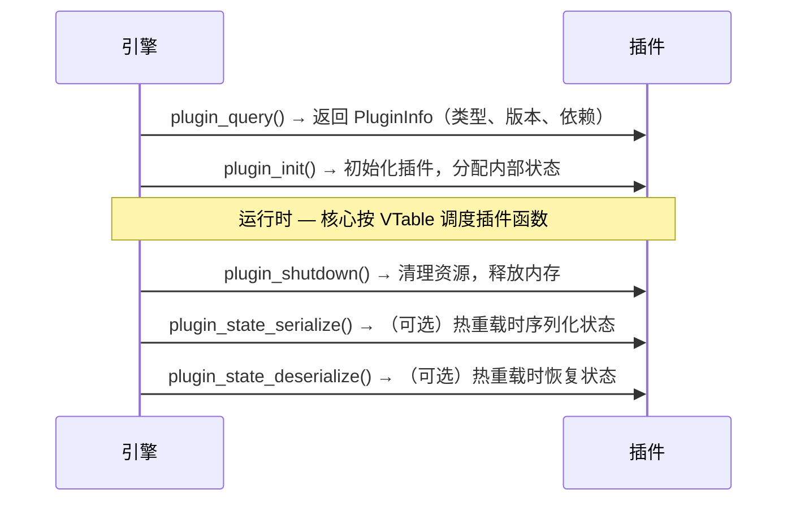

# DoLogger 插件开发指南 (Plugin Development Guide)

> 🌐 **语言 / Language**: [中文](PluginDevelopmentGuide.md) | [English: Plugin Development Guide](../../en_US/guides/PluginDevelopmentGuide.md)

> **版本**: v0.1.0 | **最后更新**: 2026-08-12 | **目标受众**: 插件开发者

## 目录

1. [概述](#概述)
2. [插件类型](#插件类型)
3. [插件 Manifest](#插件-manifest)
4. [C ABI 接口规范](#c-abi-接口规范)
5. [VTable 实现指南](#vtable-实现指南)
6. [三色信任模型](#三色信任模型)
7. [沙箱约束](#沙箱约束)
8. [许可证合规](#许可证合规)
9. [测试与调试](#测试与调试)
10. [发布与分发](#发布与分发)

---

## 概述

DoLogger 插件是编译为共享库（.so/.dylib/.dll）的独立二进制文件，导出一组
标准 C ABI 符号供核心引擎加载和调用。

### 插件生命周期



---

## 插件类型

DoLogger 支持 10 种插件类型，每种有独立的 VTable：

| 类型 | 阶段 | 职责 |
|:-:|:-:|:-:|
| **Filter** | Stage 1 | 按规则丢弃/保留日志 |
| **FieldProvider** | Stage 2 | 注入自定义字段 |
| **Processor** | Stage 4 | 转换/脱敏日志内容 |
| **Formatter** | Stage 5 | 格式化输出（JSON/CSV/自定义） |
| **IOSink** | Stage 6 | 输出到外部目标 |
| **ConfigProvider** | Config | 动态配置加载 |
| **KeyProvider** | Key | Ed25519 密钥管理 |
| **PolicyProvider** | PreFilter | 速率限制/丢弃策略 |
| **HostInfoProvider** | Stage 2 | 主机/进程元数据注入 |
| **SyscallBroker** | Syscall | 平台系统调用代理 |

（管道阶段顺序：PreFilter → Filter → Field → Process → Format → Sink；v0.1.0 的阶段定义为 `core/include/dologger_core.h` 中的 `DO_LOG_PHASE_*` 位标志）

---

## 插件 Manifest

每个插件必须包含 `manifest.toml`：

```toml
[plugin]
name = "my-custom-filter"
version = "1.0.0"
plugin_type = "filter"
mount_phase = ["filter"]
abi_version = 1

[plugin.trust]
color = "yellow"

[dependencies]
# （规划中 — v0.1.0 引擎尚未解析；字段级校验已在 core/src/plugin/dependency.rs 准备）
requires_fields = ["host.name", "process.id"]

[licenses]
spdx = "MIT"
third_party = []  # （规划中）

[capabilities]
file_read = false
network = false
process_create = false
```

### Manifest 字段说明

| 字段 | 必填 | 说明 |
|:-:|:-:|:-:|
| `name` | 是 | 唯一插件标识符 |
| `version` | 是 | 语义化版本号 (semver) |
| `plugin_type` | 是 | 10 种类型之一 |
| `mount_phase` | 是 | 挂载阶段位掩码 (DO_LOG_PHASE_*) |
| `trust.color` | 是 | `blue` / `yellow` / `red` |
| `requires_fields` | 否 | 依赖的 Record 字段列表 |
| `licenses.spdx` | 是 | SPDX 许可证标识符 |

---

## C ABI 接口规范

### 必要导出符号

（v0.1.0 实际签名，见 `core/include/dologger_core.h`）：

```c
// 查询插件信息（必须导出）
dologger_plugin_info_t *plugin_query(uint32_t core_abi_version);

// 初始化（必须导出）
int plugin_init(const void *config);

// 关闭（必须导出）
int plugin_shutdown(void);

// 状态序列化（伪代码 — 规划中的可选导出，v0.1.0 尚无 dologger_state_buf_t）
// dologger_error_t plugin_state_serialize(dologger_state_buf_t *out);

// 状态反序列化（伪代码 — 同上）
// dologger_error_t plugin_state_deserialize(const dologger_state_buf_t *in);
```

### VTable 函数签名

每种插件类型的 VTable 由函数指针组成（以 `dologger_core.h` 中的真实定义为例）：

```c
typedef struct {
    /** Return non-zero to drop the record. MUST NOT perform I/O. */
    int (*filter)(const dologger_record_handle_t *rec, void *config);
} dologger_filter_vtable_t;
```

---

## VTable 实现指南

### Filter 插件示例

（以下示例基于 `core/include/dologger_core.h` 的真实定义，已在 Windows 上以 MSVC 编译验证；完整可编译版见 `plugins/examples/filter/c/example_filter/example_filter.c`）：

```c
#include "dologger_core.h"

static int g_min_level = DO_LOG_WARN;

// 前向声明：filter 函数在 VTable 初始化时引用
static int my_filter(const dologger_record_handle_t *rec, void *config);

static dologger_filter_vtable_t g_vtable = {
    .filter = my_filter,
};

static dologger_plugin_info_t g_info = {
    .name        = "example-filter",
    .version     = 0x000100,    // 0.1.0
    .abi_version = 0x000100,    // 核心 ABI 0.1.0
    .phase       = DO_LOG_PHASE_FILTER,
    .vtable      = &g_vtable,
};

dologger_plugin_info_t *plugin_query(uint32_t core_abi_version) {
    (void)core_abi_version;   // 生产插件应校验兼容性，不兼容时返回 NULL
    return &g_info;
}

int plugin_init(const void *config) {
    // Allocate state, validate config；config 为引擎传入的不透明配置
    (void)config;
    return 0;
}

// VTable 过滤函数：返回非零丢弃记录
static int my_filter(const dologger_record_handle_t *rec, void *config) {
    // 通过 config 指针接收记录级别（int），丢弃低于最小级别的记录
    int level = config ? *(const int *)config : DO_LOG_TRACE;
    return (level < g_min_level) ? 1 : 0;
}

int plugin_shutdown(void) {
    // Free state
    return 0;
}
```

---

## 三色信任模型

### Blue（蓝色）插件
- DoLogger 官方签名发布
- 无沙箱限制，完整系统访问
- 需要 Ed25519 签名验证

### Yellow（黄色）插件
- 经过验证的第三方插件
- 受限系统调用（seccomp/AppContainer）
- 允许文件 I/O，禁止网络和进程创建

### Red（红色）插件
- 社区未验证插件
- 最大隔离（仅内存 + 线程 + 时间）
- 禁止文件 I/O、网络、进程创建

---

## 沙箱约束

### Linux (seccomp-bpf)

黄色插件被限制为：`read, write, mmap, munmap, futex, clock_gettime` 等基础调用。
红色插件额外移除所有文件 I/O 和网络调用。

### Windows (AppContainer)

通过 LowBox Token + 限制 SID 实现隔离。M4 阶段实现完整进程隔离。

### macOS (App Sandbox)

通过 seatbelt/SBPL 配置文件实现。M4 阶段实现完整沙箱隔离。

---

## 许可证合规

### SPDX 兼容性矩阵

| 类别 | SPDX | 允许在 Blue | 允许在 Yellow | 允许在 Red |
|:-:|:-:|:-:|:-:|:-:|
| A | MIT, Apache-2.0, BSD-2/3-Clause | 是 | 是 | 是 |
| B | MPL-2.0, LGPL-3.0 | 是 | 是 | 否* |
| C | GPL-2.0, GPL-3.0 | 否 | 否 | 否 |
| D | BSL, SSPL, AGPL-3.0 | 否 | 否 | 否 |
| E | 专有, 无许可证 | 否 | 否 | 否 |

*LGPL-3.0 仅当动态链接时允许。

### cargo-deny 集成

```bash
cargo deny check licenses  # 扫描所有依赖许可证
```

`deny.toml` 配置位于仓库根目录，自动执行许可证策略。

（注：仓库当前 `deny.toml` 使用 `[licenses.allow]` v2 映射格式，与 cargo-deny 0.x 期望的数组格式不兼容，需 cargo-deny 1.x+ 或调整 deny.toml 后此命令才能通过）

---

## 测试与调试

### 单元测试

```bash
cargo test -p my-plugin
```

### 集成测试

```bash
# 启动 DoLogger 并加载插件（引擎自动扫描 ./plugins 目录，无需在配置中声明）
cp ./target/debug/my_filter.so ./plugins/
dologctl run --trace
```

### 诊断日志

检查 `dologger_internal.log`（0600 权限）获取插件加载/卸载的错误信息。

---

## 发布与分发

### 官方插件仓库

M4 阶段提供 `plugins.dologger.dev` 集中索引仓库：

```bash
# 伪代码/示意 — 按名称从远程仓库安装为 M4 规划（v0.1.0 的 install 仅接受本地文件路径）
# dologctl plugin install kafka
dologctl plugin list
dologctl plugin verify my-plugin
```

### 签名要求

- Blue 插件必须由 DoLogger 团队 Ed25519 密钥签名
- Yellow 插件建议第三方签名
- Red 插件可在签名验证关闭时加载

### 构件格式

```text
my-plugin-1.0.0/
├── manifest.toml
├── libmy_plugin.so           # Linux x86_64
├── libmy_plugin.aarch64.so   # Linux aarch64
├── libmy_plugin.dylib        # macOS x86_64
├── libmy_plugin.arm64.dylib  # macOS aarch64
├── my_plugin.dll             # Windows x86_64
├── LICENSE
└── README.md
```
