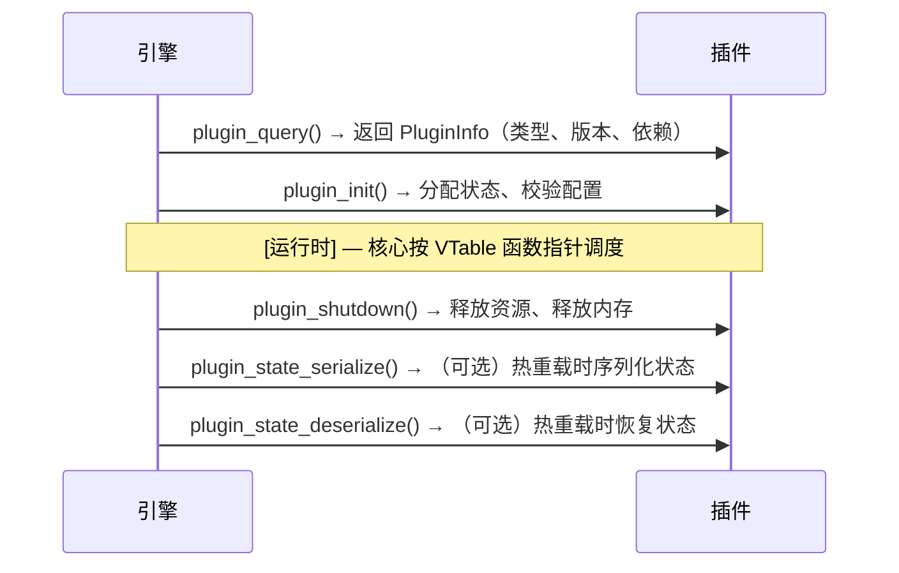
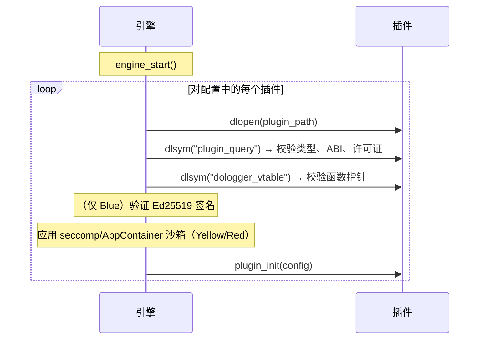
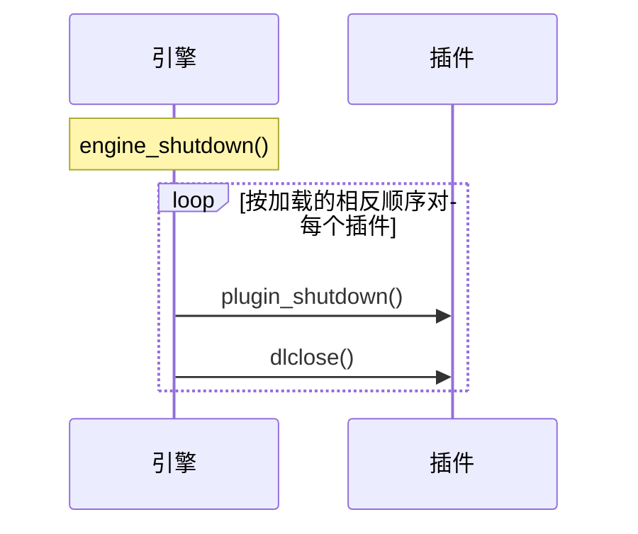

# DoLogger 插件开发指南 (Plugin Development Guide)

> 🌐 **语言 / Language**: [中文](PluginDevelopmentGuide.md) | [English: Plugin Development Guide](../../en_US/guides/PluginDevelopmentGuide.md)

> **版本**: v0.1.0 | **最后更新**: 2026-08-12 | **目标受众**: 插件开发者

## 目录

1. [概述](#概述)
2. [快速开始](#快速开始)
3. [插件类型](#插件类型)
4. [插件 Manifest](#插件-manifest)
5. [C ABI 接口规范](#c-abi-接口规范)
6. [VTable 实现指南](#vtable-实现指南)
7. [三色信任模型](#三色信任模型)
8. [沙箱约束](#沙箱约束)
9. [许可证合规](#许可证合规)
10. [测试与调试](#测试与调试)
11. [发布与分发](#发布与分发)
12. [生命周期与状态管理](#生命周期与状态管理)

---

## 概述

DoLogger 插件是导出标准 C ABI 符号集合的共享库（`.so` / `.dylib` / `.dll`）。核心引擎通过静态定义的虚方法表（VTable）发现、加载、校验并调用这些符号。

### 插件生命周期



### 设计理念

插件遵循 **VTable + ABI 门** 模式：

- 每种插件类型拥有固定的函数指针 VTable 结构体。
- 引擎通过 VTable 调用插件 — 绝不直接调用。
- 缺失的可选函数以 `NULL` 指针表示。
- ABI 版本门防止加载不匹配的插件。

---

## 快速开始

### 最小过滤器插件（C）

（以下示例基于 `core/include/dologger_core.h` 的真实定义，已在 Windows 上以 MSVC 编译验证；完整可编译版见 `plugins/examples/filter/c/example_filter/example_filter.c`）：

```c
#include "dologger_core.h"

static int g_min_level = DO_LOG_WARN;

// 前向声明：filter 函数被 VTable 引用。
static int my_filter(const dologger_record_handle_t *rec, void *config);

static dologger_filter_vtable_t g_vtable = {
    .filter = my_filter,
};

static dologger_plugin_info_t g_info = {
    .name        = "example-filter",
    .version     = 0x000100,    // 0.1.0
    .abi_version = 0x000100,    // 核心 ABI 0.1.0
    .phase       = DO_LOG_PHASE_FILTER,
    .vtable      = &g_vtable,
};

dologger_plugin_info_t *plugin_query(uint32_t core_abi_version) {
    (void)core_abi_version;   // 生产插件应校验兼容性，
                              // 不匹配时返回 NULL
    return &g_info;
}

int plugin_init(const void *config) {
    // 分配状态、校验配置；config 是引擎传入的不透明配置。
    (void)config;
    return 0;
}

// VTable 过滤函数：返回非零以丢弃记录。
static int my_filter(const dologger_record_handle_t *rec, void *config) {
    // config 携带记录级别（int）；丢弃低于 g_min_level 的记录。
    int level = config ? *(const int *)config : DO_LOG_TRACE;
    return (level < g_min_level) ? 1 : 0;
}

int plugin_shutdown(void) {
    // 释放状态。
    return 0;
}
```

### 构建命令

```bash
# Linux
cc -shared -fPIC -o dologger-plugin-filter-c.so example_filter.c -I/path/to/dologger/include

# macOS
cc -dynamiclib -o dologger-plugin-filter-c.dylib example_filter.c -I/path/to/dologger/include

# Windows（MSVC）
cl /LD /Fe:example_filter.dll example_filter.c /I C:\path\to\dologger\include
```

### 加载插件

```toml
# （示意 — v0.1.0 引擎不会从 dologger.toml 读取 [plugins] 段；
# 插件在 ./plugins 和 /usr/lib/dologger/plugins 中被发现）
# dologger.toml
[plugins.drop-debug]
type = "filter"
path = "./plugins/drop_debug.so"
```

---

## 插件类型

DoLogger 定义了 10 种插件类型，每种都有自己的 VTable。插件按管道中的阶段进行调度。

**表 1：插件类型与管道阶段**

| # | 类型 | Phase | Stage | 职责 |
|:-:|:-:|:-:|:-:|:-:|
| 1 | `Filter` | `filter` | 1 | 按条件（级别、字段、速率）丢弃或保留记录。 |
| 2 | `PolicyProvider` | `prefilter` | Pre-1 | 速率限制、丢弃策略、熔断策略。 |
| 3 | `FieldProvider` | `field` | 2 | 在记录处理前注入自定义字段。 |
| 4 | `HostInfoProvider` | `field` | 2 | 注入主机、进程和环境元数据。 |
| 5 | `Processor` | `process` | 4 | 转换、脱敏或丰富日志内容。 |
| 6 | `Formatter` | `format` | 5 | 序列化记录（JSON、CSV、纯文本、自定义二进制）。 |
| 7 | `IOSink` | `sink` | 6 | 将格式化后的输出写入外部目标。 |
| 8 | `ConfigProvider` | `config` | — | 从外部来源加载配置（Vault、etcd、S3）。 |
| 9 | `KeyProvider` | `key` | — | 管理日志签名用的 Ed25519 密钥材料。 |
| 10 | `SyscallBroker` | `syscall` | — | 为沙箱化插件代理平台系统调用。 |

### 管道阶段顺序

```text
（示意性管道顺序 — 随附的 v0.1.0 阶段定义于
core/include/dologger_core.h，为 DO_LOG_PHASE_* 位标志）
PreFilter → Filter → Field → Process → Format → Sink
   (2)       (1)     (3,4)    (5)      (6)      (7)
```

同一阶段内的插件按加载顺序执行（先按配置文件中的声明顺序，再按插件名称的字母序）。

---

## 插件 Manifest

每个插件**必须**随附 `manifest.toml` 文件。引擎在加载时校验 Manifest，校验失败的插件会被拒绝。

### 完整 Manifest 示例

```toml
# （结构已对照 plugins/official/*/PluginManifest.toml 校验；
# 标记“规划中”的段 v0.1.0 引擎尚不解析）
[plugin]
name = "json-formatter"
version = "2.1.0"
plugin_type = "formatter"
mount_phase = ["format"]
abi_version = 1
min_core_abi = "0.1.0"     # 所需的最低核心版本
description = "将日志记录格式化为换行分隔的 JSON"

[plugin.trust]
color = "blue"

[plugin.author]
name = "DoLogger Core Team"
email = "nekoliowork+DoLogger@gmail.com"
url = "https://github.com/dologger/json-formatter"

[dependencies]
# （规划中 — v0.1.0 引擎尚未解析；字段级校验
# 已在 core/src/plugin/dependency.rs 准备）
requires_fields = ["record.id", "record.timestamp", "host.name"]

[capabilities]
file_read = false
file_write = false
network = false
process_create = false

[licenses]
spdx = "MIT"
third_party = [  # （规划中）
    { name = "serde_json", spdx = "MIT", url = "https://github.com/serde-rs/json" }
]

[compatibility]
# （规划中 — v0.1.0 目前只强制校验 `abi_version` 相等）
min_engine_version = "0.1.0"
max_engine_version = "0.1.0"
```

### Manifest 字段参考

**表 2：`[plugin]` 段**

| 字段 | 必填 | 类型 | 说明 |
|:-:|:-:|:-:|:-:|
| `name` | 是 | string | 唯一插件标识符。推荐小写 kebab-case。 |
| `version` | 是 | string | 语义化版本号（semver 2.0）。 |
| `plugin_type` | 是 | string | [插件类型](#插件类型)中列出的 10 种类型之一。 |
| `mount_phase` | 是 | string[] | 插件挂载的管道阶段。 |
| `abi_version` | 是 | integer | 插件编译所针对的 ABI 版本。 |
| `description` | 否 | string | 简短的人类可读描述（最多 200 字符）。 |

**表 3：`[plugin.trust]` 段**

| 字段 | 必填 | 取值 | 说明 |
|:-:|:-:|:-:|:-:|
| `color` | 是 | `blue`、`yellow`、`red` | 信任等级。见[三色信任模型](#三色信任模型)。 |

**表 4：`[capabilities]` 段**

| 字段 | 默认值 | 说明 |
|:-:|:-:|:-:|
| `file_read` | false | 插件是否需要文件系统读取权限。 |
| `file_write` | false | 插件是否需要文件系统写入权限。 |
| `network` | false | 插件是否需要网络访问权限。 |
| `process_create` | false | 插件是否允许创建子进程。 |

声明为 `true` 的能力只有在信任颜色允许时才会被授予。Red 插件声明 `file_read = true` 的请求会被静默拒绝；如果插件仍尝试该操作，会发出 `SANDBOX_VIOLATION` 事件。

**表 5：`[licenses]` 段**

| 字段 | 必填 | 说明 |
|:-:|:-:|:-:|
| `spdx` | 是 | 插件自身的 SPDX 许可证标识符。 |
| `third_party` | 否 | 随附依赖的 `{name, spdx, url}` 对象数组。 |

---

## C ABI 接口规范

> [!NOTE]
> 随附的 v0.1.0 头文件（`core/include/dologger_core.h`）定义了下面各代码块中首先展示的 ABI：`plugin_query(uint32_t core_abi_version)` 返回带有 `{name, version, abi_version, phase, vtable}` 的 `dologger_plugin_info_t`，另有 `int plugin_init(const void *config)` / `int plugin_shutdown(void)`，以及仅含必需回调的 VTable 布局（例如 Filter = 单个返回非零即丢弃的 `filter` 函数）。所有标记为伪代码的内容描述的是规划中的 v1.0 ABI（未编译）。编写代码时始终以随附的头文件为准；本指南跟踪的是既定方向。

### 必要导出符号

每个单插件库**必须**导出以下符号：

```c
// （v0.1.0 实际签名 — 见 core/include/dologger_core.h）
// 查询插件信息（必须导出）。
dologger_plugin_info_t *plugin_query(uint32_t core_abi_version);

// 初始化插件（必须导出）。config 是引擎传入的不透明配置。
int plugin_init(const void *config);

// 关闭插件并释放所有资源（必须导出）。
int plugin_shutdown(void);
```

### 捆绑库（官方插件）

官方插件以**单个**动态库的形式随平台发布 — `dologger-official-plugins`
（`libdologger_official_plugins.so` / `.dylib` / `dologger_official_plugins.dll`），
而非一个插件一个文件。捆绑库导出多插件注册表契约，**取代** `plugin_query`：

```c
// （v0.1.0 实际 — 见 core/include/dologger_core.h）
// 查询捆绑库承载的每个插件（捆绑库必须导出）。
dologger_plugin_info_list_t *plugin_query_multi(uint32_t core_abi_version);

// 初始化/关闭捆绑库的每个成员（必须导出，扇出到所有成员）。
int plugin_init(const void *config);
int plugin_shutdown(void);
```

`dologger_plugin_info_list_t` 携带 `{count, infos}` — 一个
`dologger_plugin_info_t` 条目数组，每个官方插件对应一条（fmt-json、
fmt-text、filter-level、field-container）。宿主
（`PluginManager::load_plugin`）优先解析 `plugin_query_multi`；若存在，
则从同一个库句柄注册**每一个**条目。一个库**恰好**导出一种查询符号：
`plugin_query`（单插件、第三方）或 `plugin_query_multi`（捆绑库、官方）。
每个捆绑库成员 crate 是 rlib，贡献 `static INFO: DologgerPluginInfo`
以及 `init()` / `shutdown()`；捆绑库 crate 把它们静态链接成一个 cdylib。
参见 `plugins/official/bundle` 与 `plugins/README.md` 中的资产命名规则。

### 签名校验与信任锚

宿主在授予 Blue 信任之前，会先校验一个 Ed25519 **签名旁路文件**。旁路文件
以完整文件名追加 `.sig` 命名：

| 库文件 | 旁路文件 |
| :- | :- |
| `libfoo.so` | `libfoo.so.sig` |
| `dologger_official_plugins.dll` | `dologger_official_plugins.dll.sig` |

`PluginManager::register_plugin` 的信任判定：

| 条件 | 结果 |
| :- | :- |
| 未配置信任锚 | `Red`（无可校验对象） |
| 旁路文件通过任意活跃且未吊销的锚点校验 | `Blue` |
| 旁路文件仅通过*已吊销*锚点校验 | 拒绝加载（`SignatureInvalid` — "signature is from a revoked key"） |
| 旁路文件存在但未通过任何锚点校验 | 拒绝加载（`SignatureInvalid`） |
| 已配置信任锚但无旁路文件 | `Red` |

**多锚点信任库** — 加载器持有活跃公钥的*集合*（`trust_anchors`）外加吊销列表
（`revoked`，按 SHA-256 密钥指纹索引）。只要签名通过**任意**活跃且未吊销的锚点
校验即授予 Blue。信任库从已提交的目录加载 — `plugins/official/trust-anchors/` —
包含 `active.pub`（每行一个 64 位十六进制公钥）和 `revoked.txt`（每行一个
`<64-hex 指纹> [原因] [unix-ts]`，`reason ∈ {compromised, superseded, deactivated}`）。
CRL **优先**：列入 `revoked.txt` 的密钥即使公钥仍在 `active.pub` 中也永远无法授予
Blue，即使在开发模式下也是如此。

| 配置键 | 作用 |
| :- | :- |
| `plugin_trust_store = "plugins/official/trust-anchors"` | 加载两个文件（推荐 — 启用吊销） |
| `plugin_trust_anchor = "<64-hex 公钥>"` | 单锚点简写（无吊销） |
| `plugin_allow_red_plugins = false` | 非开发模式拒绝 `Red` 插件 |

**Red 门槛** — 在非开发模式下，未签名（`Red`）插件会被拒绝，除非宿主显式
调用 `PluginManager::set_allow_red_plugins(true)`。

签名密钥为 Ed25519 种子（64 个十六进制字符）。使用 `dologctl` 生成、签名并
校验：

```console
$ dologctl plugin keygen signing-key.txt          # 打印公钥（信任锚）
$ dologctl plugin sign libfoo.so signing-key.txt  # 写入 libfoo.so.sig
$ dologctl plugin verify --trust-store plugins/official/trust-anchors
$ dologctl plugin list   --trust-store plugins/official/trust-anchors
```

发布工作流在配置了 `DOLOGGER_PLUGIN_SIGNING_KEY` secret 时对官方捆绑库
签名，并随资产一同发布 `.sig`。

### 可选导出符号

```c
// （伪代码 — 规划中的热重载可选导出；v0.1.0 尚无
// dologger_state_buf_t）
// dologger_error_t plugin_state_serialize(dologger_state_buf_t *out);
// dologger_error_t plugin_state_deserialize(const dologger_state_buf_t *in);
```

如果未导出 `plugin_state_serialize` 或 `plugin_state_deserialize`，引擎在热重载时会跳过状态转移，插件将从零重新初始化。

### VTable 导出约定

在 v0.1.0 中，VTable **不是**单独导出的符号：加载器只解析
`plugin_query`，VTable 由返回的 `dologger_plugin_info_t`
（`vtable` 字段）携带。导出独立的 `dologger_vtable` 符号属于规划中的
v1.0 ABI：

```c
// （伪代码 — 示意规划中的 v1.0 ABI，未编译）
// Filter 插件：
const dologger_filter_vtable_t dologger_vtable;

// Formatter 插件：
const dologger_formatter_vtable_t dologger_vtable;

// ……每种类型依此类推。
```

在规划的设计中，引擎通过 `dlsym` / `GetProcAddress` 查找 `dologger_vtable` 符号。所有插件类型的符号名相同；引擎根据 `plugin_query()->plugin_type` 进行分发。

### ABI 兼容性

以下破坏性变更会导致 ABI 版本号递增：

- VTable 结构体布局变更（字段增删或重排）
- `dologger_plugin_info_t` 结构体变更
- 回调函数签名变更

v0.1.0 的头文件**没有全局 `DO_LOG_ABI_VERSION` 宏**：引擎将自身的 `core_abi_version` 传给 `plugin_query()`，插件则在 `dologger_plugin_info_t::abi_version` 中声明其构建所针对的 ABI（例如 `0x000100` = 0.1.0）。生产插件应校验传入的版本，不匹配时返回 `NULL`；引擎会拒绝加载声明 `abi_version` 不匹配的插件。

---

## VTable 实现指南

### Filter 插件

```c
// （v0.1.0 实际定义 — 见 core/include/dologger_core.h）
typedef struct {
    /** 返回非零以丢弃记录。不得执行 I/O。 */
    int (*filter)(const dologger_record_handle_t *rec, void *config);
} dologger_filter_vtable_t;
```

```c
// （伪代码 — 规划中的 v1.0 ABI 扩展，未编译）
typedef struct {
    dologger_filter_fn_t       filter;        // 必需：评估单条记录
    dologger_filter_batch_fn_t filter_batch;  // 可选：批量评估
} dologger_filter_vtable_t;

typedef dologger_error_t (*dologger_filter_fn_t)(
    dologger_record_t        *record,
    dologger_filter_result_t *result
);

typedef dologger_error_t (*dologger_filter_batch_fn_t)(
    dologger_record_t        *records,
    size_t                    count,
    dologger_filter_result_t *results    // 长度为 count 的结果数组
);
```

**Filter 动作（规划中的 v1.0 ABI — v0.1.0 的过滤器只需返回非零即丢弃）：**

| 动作 | 含义 |
|:-:|:-:|
| `DO_LOG_FILTER_PASS` | 记录进入下一阶段。 |
| `DO_LOG_FILTER_DROP` | 记录被静默丢弃。 |
| `DO_LOG_FILTER_MARK` | 记录放行，但打上标记供 sysmon 监控。 |

如果提供了 `filter_batch`（非 NULL），引擎会用它进行批量评估；否则对每条记录调用一次 `filter`。

### Formatter 插件

```c
// （伪代码 — 示意规划中的 v1.0 ABI，未编译）
typedef struct {
    dologger_format_fn_t       format;
    dologger_format_flush_fn_t flush;        // 可选
} dologger_formatter_vtable_t;

typedef dologger_error_t (*dologger_format_fn_t)(
    const dologger_record_t *record,
    dologger_buf_t          *output           // 调用方提供的缓冲区
);
```

`output` 缓冲区由引擎分配。Formatter 将序列化后的字节写入其中。如果缓冲区太小，返回 `DO_LOG_ERR_BUFFER_TOO_SMALL`，引擎会重新分配。

### IOSink 插件

```c
// （伪代码 — 示意规划中的 v1.0 ABI，未编译）
typedef struct {
    dologger_sink_open_fn_t   open;
    dologger_sink_write_fn_t  write;
    dologger_sink_flush_fn_t  flush;
    dologger_sink_close_fn_t  close;
    dologger_sink_health_fn_t health;          // 可选：返回 Sink 状态
} dologger_sink_vtable_t;

typedef dologger_error_t (*dologger_sink_write_fn_t)(
    void        *sink_state,
    const uint8_t *data,
    size_t        length
);

typedef dologger_sink_health_t (*dologger_sink_health_fn_t)(
    void *sink_state
);
```

**Sink 健康状态：**

| 状态 | 说明 |
|:-:|:-:|
| `DO_LOG_SINK_HEALTHY` | Sink 正常接受写入。 |
| `DO_LOG_SINK_DEGRADED` | Sink 变慢但仍可工作。 |
| `DO_LOG_SINK_CIRCUIT_OPEN` | 熔断器跳闸；写入被拒绝。 |

### KeyProvider 插件

```c
// （伪代码 — 示意规划中的 v1.0 ABI，未编译）
typedef struct {
    dologger_key_sign_fn_t       sign;
    dologger_key_public_key_fn_t public_key;
    dologger_key_rotate_fn_t     rotate;        // 可选
} dologger_keyprovider_vtable_t;

typedef dologger_error_t (*dologger_key_sign_fn_t)(
    void             *key_state,
    const uint8_t    *message,
    size_t            message_len,
    dologger_sig_t   *signature_out
);
```

`KeyProvider` 是需要 HSM 或云 KMS 支持签名密钥的生产部署的主要扩展点。加载 `KeyProvider` 后，内置的临时密钥生成器将被禁用。

### VTable 函数中的错误处理

所有 VTable 函数都返回 `dologger_error_t`。引擎按如下方式处理错误：

| 返回值 | 引擎行为 |
|:-:|:-:|
| `DO_LOG_OK` | 正常；记录继续处理。 |
| 非致命错误 | 记录被丢弃；错误写入 sysmon 日志。 |
| `DO_LOG_ERR_FATAL` | 插件被卸载；Sink 触发 `SINK_CIRCUIT_OPEN`。 |

绝不要在 VTable 函数内调用 `exit()`、`abort()` 或 `panic!()`，而应返回错误码。

---

## 三色信任模型

DoLogger 将每个插件归入三个信任等级之一。等级决定沙箱限制、字段权限环访问权以及签名要求。威胁模型与安全理由见[安全白皮书](SecurityWhitepaper.md#plugin-trust-model-and-sandbox-isolation)。

**表 6：信任等级对比**

| 属性 | Blue（完全信任） | Yellow（部分信任） | Red（零信任） |
|:-:|:-:|:-:|:-:|
| **签名者** | DoLogger 团队 Ed25519 | 第三方开发者 | 社区 / 未签名 |
| **是否要求签名** | 是（加载时验证） | 建议 | 不要求 |
| **沙箱** | 无 | 受限（seccomp/AppContainer） | 最大隔离 |
| **文件 I/O** | 完全访问 | 允许读 + 写 | 拒绝 |
| **网络** | 完全访问 | 拒绝 | 拒绝 |
| **进程创建** | 允许 | 拒绝 | 拒绝 |
| **字段写入权限** | Ring 2（`verified.*`） | Ring 2（`verified.*`） | Ring 3（`ext.*`） |
| **字段读取权限** | 所有环（0–3） | 环 0–3 | 环 0–3 |

### Blue 插件要求

1. 构建产物必须使用 DoLogger 团队 Ed25519 密钥签名。
2. 公钥通过官方插件仓库分发。
3. 引擎启动时验证签名。如果验证失败，插件**不会被加载**。
4. 源码仓库必须位于 `github.com/dologger/` 之下。

### Yellow 插件要求

1. 插件作者必须提供有效的 `manifest.toml`。
2. 建议（但不强制）提供 PGP 或 Ed25519 分离签名。
3. 能力声明会被强制执行 — Yellow 插件声明 `network = true` 会在加载时触发拒绝。

### Red 插件

1. 无签名要求。
2. 无条件强制执行最大沙箱隔离。
3. 仅当引擎配置中 `allow_red_plugins = true` 时才允许加载 Red 插件。默认值：`false`。

---

## 沙箱约束

### Linux（seccomp-bpf）

**表 7：按信任颜色允许的系统调用组**

| 组 | 示例系统调用 | Blue | Yellow | Red |
|:-:|:-:|:-:|:-:|:-:|
| 内存 | `mmap`、`munmap`、`mprotect`、`brk` | 是 | 是 | 是 |
| 线程 | `futex`、`clone`、`set_robust_list` | 是 | 是 | 是 |
| 时间 | `clock_gettime`、`gettimeofday` | 是 | 是 | 是 |
| 信号 | `sigaction`、`sigreturn`、`tgkill` | 是 | 是 | 否 |
| 系统信息 | `uname`、`getpid`、`getrandom` | 是 | 是 | 是 |
| 文件 I/O | `open`、`read`、`write`、`close` | 是 | 是 | 否 |
| 网络 | `socket`、`connect`、`sendto` | 是 | 否 | 否 |
| 进程 | `fork`、`execve`、`wait4` | 是 | 否 | 否 |

**违规行为**：当 Yellow 或 Red 插件调用被禁止的系统调用时，seccomp-bpf 返回 `SECCOMP_RET_KILL_PROCESS`。插件线程被终止，并发出包含插件名称和系统调用号的 `SANDBOX_VIOLATION` sysmon 事件。

### Windows（AppContainer）

Windows 沙箱使用 LowBox Token + 受限 SID：

- Yellow 插件：移除 `WIN://NO_NETWORK` 和 `WIN://NO_PROCESS_CREATION` 能力 SID 的 LowBox token。
- Red 插件：不含任何能力 SID 的完整 AppContainer 隔离。

完整的进程级隔离尚未实现。

### macOS（App Sandbox）

沙箱配置文件通过带 seatbelt/SBPL 规则的 `sandbox_init(3)` 应用。计划为每个信任等级实现完整的沙箱配置文件。

### 能力声明强制执行

引擎将 Manifest 中的 `[capabilities]` 与信任颜色交叉校验。如果插件请求其信任等级不允许的能力，引擎会记录警告并拒绝该能力。示例：

```text
（示意性示例输出）
[WARN ] 插件 'my-plugin'（yellow）请求的能力 'network'
        被 yellow 信任等级拒绝。该声明被忽略。
```

---

## 许可证合规

### SPDX 兼容性矩阵

DoLogger 强制执行许可证策略：插件按其 SPDX 标识符分类。

**表 8：许可证类别与允许性**

| 类别 | SPDX 标识符 | Blue | Yellow | Red |
|:-:|:-:|:-:|:-:|:-:|
| A | MIT、Apache-2.0、BSD-2-Clause、BSD-3-Clause、ISC、Zlib、Unlicense | 是 | 是 | 是 |
| B | MPL-2.0、LGPL-3.0-or-later | 是 | 是 | 否* |
| C | GPL-2.0-only、GPL-3.0-only | 否 | 否 | 否 |
| D | BSL、SSPL、AGPL-3.0 | 否 | 否 | 否 |
| E | 专有、未指定许可证 | 否 | 否 | 否 |

\* LGPL-3.0 仅允许动态链接。禁止静态链接进引擎。

### 自动化许可证检查

```bash
# 扫描所有工作区依赖
cargo deny check licenses

# 扫描特定插件的依赖
cargo deny check licenses --manifest-path plugins/my-plugin/Cargo.toml

# 检查安全公告
cargo deny check advisories
cargo audit
```

项目根目录的 `deny.toml` 配置允许/拒绝列表。CI 在每个拉取请求上强制执行这些检查。

（注：仓库当前的 `deny.toml` 使用 `[licenses.allow]` v2 映射格式，与 cargo-deny 0.x 期望的数组格式不兼容，需使用 cargo-deny 1.x+ 或调整 `deny.toml` 后此命令才能通过。）

### 编写合规插件

1. 始终在 `manifest.toml` 的 `[licenses]` 段中指定 SPDX 标识符。
2. 列出所有第三方依赖及其 SPDX 标识符。
3. 类别 C、D、E 的许可证会在加载时被引擎的许可证策略检查器拒绝。
4. 如果无法满足许可证策略，引擎将拒绝加载你的插件并发出 `LICENSE_POLICY_VIOLATION` sysmon 事件。

---

## 测试与调试

### 单元测试

```bash
# 构建并测试单个插件
cargo test -p my-plugin

# 失败时携带回溯运行
RUST_BACKTRACE=1 cargo test -p my-plugin

# 运行特定测试
cargo test -p my-plugin -- test_filter_drop_debug
```

### 集成测试

```bash
# 启动 DoLogger 并加载插件 — v0.1.0 会自动扫描 ./plugins 和
# /usr/lib/dologger/plugins（配置中的 [plugins] 段不会被读取）
cp ./target/debug/libmy_filter.so ./plugins/
dologctl run --trace

# 备选：运行 simple logger 示例（使用
# DologgerConfig::dev_profile() — v0.1.0 不读取配置路径参数）
cargo run --example simple_logger
```

### 诊断日志

引擎将诊断信息写入 `dologger_internal.log`（权限 0600）。插件作者在开发期间应关注此文件：

```bash
tail -f dologger_internal.log | grep "\[PLUGIN\]"
```

相关诊断条目包括：

```text
（示意性示例输出）
[PLUGIN] loaded 'drop-debug' (filter, yellow) from ./plugins/drop_debug.so
[PLUGIN] vtable 'filter' registered — 1 function pointers (filter, filter_batch=NULL)
[PLUGIN] unloaded 'drop-debug' — 0 leaked allocations
```

### 调试检查清单

1. **加载失败**：检查 ABI 版本 — `plugin_query()->abi_version` 必须与目标引擎的 `DO_LOG_ABI_VERSION` 匹配。
2. **找不到符号**：使用 `nm -D`（Linux）或 `dumpbin /EXPORTS`（Windows）验证符号导出。
3. **沙箱违规**：检查 Manifest 中的 `[capabilities]`。确保声明的能力与信任等级匹配。
4. **VTable 中段错误**：检查 NULL VTable 函数指针。可选函数应为 `NULL`，而非未初始化。
5. **许可证被拒绝**：对照[表 8](#许可证合规)验证 `manifest.toml` 中的 SPDX 标识符。

---

## 发布与分发

### 构件目录布局

```text
（示意性构件布局）
my-plugin-1.0.0/
    manifest.toml
    libmy_plugin.so           # Linux x86_64
    libmy_plugin.aarch64.so   # Linux aarch64
    libmy_plugin.dylib        # macOS x86_64
    libmy_plugin.arm64.dylib  # macOS aarch64
    my_plugin.dll             # Windows x86_64
    LICENSE
    README.md
```

### 命名约定

- 目录：`<插件名>-<版本>`（例如 `json-formatter-2.1.0`）
- 共享库：`lib<plugin_name>.<ext>`，下划线替代连字符。

### 签名 Blue 插件

```bash
# 生成 Ed25519 签名密钥对；打印公钥（信任锚）
dologctl plugin keygen /secure/dologger-signing.key

# 对插件库签名 — 写入分离的 `<library>.sig` 旁路文件
dologctl plugin sign ./my-plugin-1.0.0/libmy_plugin.so /secure/dologger-signing.key

# .sig 文件必须随 .so 文件一同分发
```

加载器会在加载时用**信任库**（所有活跃且未吊销的锚点）校验旁路文件：只要通过
其中任意一个校验即授予 **Blue** 信任，未签名插件在非开发模式下会被拒绝（见
[签名校验与信任锚](#签名校验与信任锚)）。用 `dologctl plugin wrap-key` 保护你机器上的
种子，并用 `--wrapped-key` 签名；用 `dologctl plugin verify --trust-store
plugins/official/trust-anchors` 对照已提交的信任库校验。

### 插件分发（v0.1.0）

v0.1.0 仅提供本地插件管理——没有远程注册表。签名、加载时校验以及 Red 门槛
（非开发模式拒绝未签名插件）均已实现；Blue 信任级插件在本地签名后随 `.sig`
旁路文件一同分发。

当前可用的命令：

```bash
# 将插件库安装到 ./plugins/
dologctl plugin install ./my-plugin-1.0.0/libmy_plugin.so

# 列出已安装插件（遵循 DO_LOG_PLUGIN_TRUST_ANCHOR）
dologctl plugin list

# 删除插件
dologctl plugin remove my-plugin

# 校验 ABI 版本、信任级别与符号解析
dologctl plugin verify my-plugin

# 扫描可疑的导出符号（fork、exec、system、dlopen）
dologctl plugin scan

# 生成签名密钥对 / 对插件库签名
dologctl plugin keygen signing.key
dologctl plugin sign ./libmy_plugin.so signing.key
```

### 分发检查清单

- [ ] `manifest.toml` 完整且有效
- [ ] 所有必需的 C ABI 符号均已导出
- [ ] VTable 函数指针已填充（不支持的可选函数为 NULL）
- [ ] 许可证为类别 A 或 B（C、D、E 将被拒绝）
- [ ] Blue 插件：`.sig` 文件随共享库一同分发
- [ ] 生产环境共享库已剥离符号（`strip --strip-all`）
- [ ] `README.md` 说明配置键并提供用法示例

---

## 生命周期与状态管理

### 初始化序列



### 关闭序列



### 热重载

导出 `plugin_state_serialize` 和 `plugin_state_deserialize` 的插件支持无数据丢失的热重载：

```text
（伪代码 — 示意）
hot_reload:
  old_plugin_state = plugin_state_serialize()
  dlclose(old_plugin)
  dlopen(new_plugin)
  plugin_init(config)
  plugin_state_deserialize(old_plugin_state)
  free(old_plugin_state)
```

如果不支持状态序列化，热重载会让插件从零重新初始化，所有内存中的状态都会丢失。

### 内存所有权规则

| 分配 | 所有者 | 释放责任 |
|:-:|:-:|:-:|
| `plugin_init()` 中分配的状态 | 插件 | 在 `plugin_shutdown()` 中释放 |
| `plugin_state_serialize()` 返回的 `dologger_state_buf_t` | 引擎 | 引擎在反序列化后释放 |
| VTable 函数参数（`record`、`result`） | 引擎 | 引擎所有；插件不得释放 |
| `plugin_query()` 返回的 `dologger_plugin_info_t` | 插件 | 静态；持续到 `dlclose()` |

插件**不得**释放自己未分配的内存。调试构建中引擎会通过分配跟踪检测双重释放。
