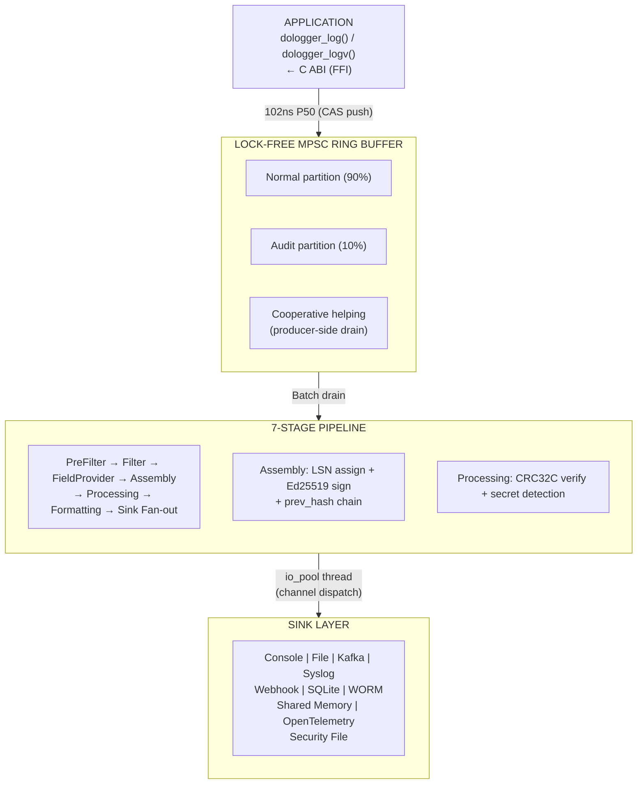

# 🔐 DoLogger

> *Cross-platform, high-security logging engine — Ed25519 audit chains, lock-free pipelines, plugin sandbox isolation.*

[English](README.md) | [中文](README.zh_CN.md)

<p align="center">
  <a href="https://github.com/Nekolio/DoLogger/actions/workflows/ci.yml"></a>
  <a href="https://github.com/Nekolio/DoLogger/stargazers"></a>
  <a href="https://github.com/Nekolio/DoLogger/blob/main/LICENSE-APACHE"></a>
  
  
  <a href="https://github.com/Nekolio/DoLogger/commits/main"></a>
</p>

---

## Overview

DoLogger is a production-grade logging engine designed for applications that demand
**both performance and security**. It combines nanosecond-latency lock-free record
submission with Ed25519-signed audit chains, plugin sandboxing, and 11 built-in output
sinks — all driven by a TOML configuration with domain inheritance and non-downgradable
security guarantees.

### Why DoLogger?

| Feature | DoLogger | Traditional Loggers |
|:-:|:-:|:-:|
| **Submit latency (P50)** | 102 ns | 500–2000 ns |
| **Batch throughput** | 13.3M rec/s | 1–5M rec/s |
| **Audit chain** | Ed25519 + LSN + prev_hash blockchain | Rare / bolt-on |
| **Plugin sandbox** | seccomp-bpf / AppContainer / Sandbox | None |
| **Performance profiles** | 4 profiles (Dev/Prod/ProdAudit/Balanced) | Manual tuning |
| **Output sinks** | 11 built-in (Console, File, Callback, Kafka, Syslog, Webhook, SQLite, WORM, Security, Shared Memory, OTel) | 1–3 typical |
| **Configuration** | TOML + domain inheritance + 7-level priority | Flat config |

---

## Quick Start

```bash
# Install from source (requires Rust ≥ 1.70)
git clone https://github.com/Nekolio/DoLogger.git
cd dologger
cargo build --release

# Generate a config template
./target/release/dologctl init --template dev

# Start logging
./target/release/dologctl run --config dologger.toml
```

> [!NOTE]
> Prebuilt binaries are attached to every [GitHub Release](https://github.com/Nekolio/DoLogger/releases) and follow the naming pattern `dologctl-<os>-<arch>` (`.exe` on Windows). Verify each download against the attached `checksums-sha256.txt`.

### Shell Completions

```bash
source <(dologctl completions bash)                              # bash
source <(dologctl completions zsh)                               # zsh
dologctl completions fish | source                               # fish
dologctl completions powershell | Out-String | Invoke-Expression # PowerShell
```

> [!TIP]
> Persist the completion script in your shell profile so every new terminal has it, e.g. `dologctl completions bash > ~/.dologctl-complete.bash && echo 'source ~/.dologctl-complete.bash' >> ~/.bashrc`.

---

## Architecture

> [!IMPORTANT]
> DoLogger is **pre-1.0**. MINOR releases may include breaking changes and the ABI may change — pin to an exact version in production. See the [Versioning & Deprecation Policy](Docs/en_US/guides/VersioningAndDeprecation.md).

<details open>
<summary>Architecture overview</summary>



</details>

### Key Design Decisions

- **Lock-free hot path**: CAS-based ring buffer + Treiber stack object pool — zero malloc on record submission
- **Ring 0–3 field permissions**: CPU-style privilege rings for log fields; Ring 2 modifications auto-appended to audit trail
- **AUDIT iron law**: `block_timeout_ms=0`, `drop_strategy=Never` — audit records are never dropped
- **Backpressure**: 90% alert + cooperative helping, 95% emergency + optional drop
- **6 non-downgradable items**: `enable_signature`, `escape_html`, `worm_enabled`, `fsync_on_write`, `require_tls`, `sign_ring2`
- **4 performance profiles**: Dev / ProdPerformance / ProdAudit / Balanced — each binding to concrete timeouts and strategies

---

## dologctl CLI

```
dologctl init                    Generate config template
dologctl run --trace             Run engine with per-record timing
dologctl plugin list             List installed plugins with trust colors
dologctl plugin install <path>   Install a plugin
dologctl plugin verify [name]    Verify plugin signature and ABI
dologctl plugin scan             Security scan for suspicious symbols
dologctl config validate         Validate config with --strict compliance
dologctl verify-log <file>       Offline audit log verification
dologctl verify-anchor           External anchoring verification
dologctl recovery-report         Crash recovery report
dologctl record / replay         SIF recording and replay
dologctl shm status              Shared memory channel inspection
dologctl perf                    Performance benchmarks
dologctl completions <shell>     Shell completion script
dologctl version                 Project banner with system info
dologctl version --licenses      Third-party license attributions
```

Global flags: `--output json|text`, `--color auto|always|never`, `--quiet`, `--config <path>`

---

## Plugin System (10 VTable Types)

| Plugin Type | Phase | Description |
|:-:|:-:|:-:|
| **Filter** | 1 | Drop or pass records based on rules |
| **FieldProvider** | 2 | Inject fields (HostInfoProvider is a restricted subtype) |
| **Processor** | 4 | Transform / enrich / detect secrets |
| **Formatter** | 5 | Serialize records to output format |
| **IOSink** | 6 | Final output destination |
| **ConfigProvider** | — | External config source (remote config center) |
| **KeyProvider** | — | Ed25519 key service (externalize to HSM) |
| **PolicyProvider** | 0 | Pre-submit policy (rate limiting, level filtering) |
| **HostInfoProvider** | 2 | System info injection (ring1_only=true) |
| **SyscallBroker** | — | System call proxy for sandboxed plugins |

### Trust Levels

| Level | Color | Signature Required | Syscall Access | Plugin Types |
|:-:|:-:|:-:|:-:|:-:|
| **Blue** | 🔵 | Ed25519 signed | Full | All |
| **Yellow** | 🟡 | Self-signed | Restricted | Limited |
| **Red** | 🔴 | None (dev mode) | Minimal allowlist | Filter, Formatter, Processor only |

---

## Performance

Measured on Windows 11 LTSC, Rust stable, Intel i5-12400F, release + LTO:

| Benchmark | P50 | Throughput |
|:-:|:-:|:-:|
| Single record submit | **102 ns** | ~9.78M rec/s |
| Ring buffer push (1K) | **121 μs** | ~8.26M rec/s |
| Batch push (256) | **19.2 μs** | ~13.3M rec/s |
| Signed submit (Ed25519) | **16.96 μs** | ~59K rec/s |

CRC32C: hardware-accelerated via SSE 4.2 (`_mm_crc32_u64`) with Slicing-by-8 software fallback.

---

## Security

- **Ed25519 audit chain**: Every audit record is signed; LSN + prev_hash forms a blockchain-like tamper-proof chain
- **WORM storage**: Write-Once-Read-Many with fsync + read-only permission enforcement
- **Plugin sandbox**: seccomp-bpf (Linux), AppContainer (Windows), Sandbox (macOS) with trust-colored capability matrices
- **Secret detection**: 14 prefix-matching rules across Critical/High/Medium severity (AWS, GCP, GitHub tokens, private keys)
- **Key rotation + CRL**: Multi-key parallel verification, rotation lifecycle, emergency revocation
- **External anchoring**: Periodic root hash anchoring to immutable storage (S3/HTTP)
- **Circuit breaker**: 3-state (CLOSED→OPEN→HALF_OPEN→CLOSED) for remote sink fault isolation
- **Emergency mmap buffer**: AES-256-GCM encrypted spill buffer for ring buffer overflow

---

## Compliance Templates

Pre-built TOML templates for common regulatory frameworks:

```bash
dologctl init --template gdpr    # EU GDPR
dologctl init --template hipaa   # US HIPAA
dologctl init --template pci     # PCI-DSS
```

Templates automatically activate non-downgradable security items and enforce audit requirements.

---

## Language Adapters

| Language | Location | Status |
|:-:|:-:|:-:|
| **Rust** | `adapters/rust/` | ✅ SDK crate (dologger-sdk) |
| **Python** | `adapters/python/` | ✅ ctypes wrapper |
| **Go** | `adapters/go/` | ✅ cgo wrapper |

---

## Project Structure

<details>
<summary>Repository layout</summary>

```
DoLogger/
├── core/                       # Core engine (Rust cdylib)
│   ├── src/                    # 40+ modules
│   ├── include/                # C ABI public headers
│   └── benches/                # Criterion benchmarks
├── cli/                        # dologctl CLI tool
│   └── src/commands/           # Subcommand implementations
├── plugins/                    # Plugin ecosystem
│   ├── official/               # Official plugins (fmt_json, filter_level, fmt_text, field_container)
│   └── examples/               # Multi-language examples (Rust, C, C++, Go)
├── adapters/                   # Language SDKs (Rust, Python, Go)
├── compliance/                 # GDPR/HIPAA/PCI-DSS compliance templates
├── Docs/                       # Technical documentation
│   ├── zh_CN/                  # Chinese docs
│   └── en_US/                  # English docs (auto-synced to the GitHub wiki)
├── tests/                      # Integration and security tests
└── scripts/                    # Dev environment setup scripts
```

</details>

---

## Building

```bash
# Prerequisites: Rust ≥ 1.70, CMake ≥ 3.20
cargo build --release

# With Kafka support (requires librdkafka)
cargo build --release --features sink-kafka

# Cross-platform targets
cargo check --target x86_64-unknown-linux-gnu
cargo check --target x86_64-apple-darwin
cargo check --target aarch64-apple-darwin
```

> [!WARNING]
> `sink-kafka` requires librdkafka (via Conan or the system package manager). CI and release builds include it on Linux x86_64 only; macOS, Windows and Linux aarch64 builds exclude it.

---

## Some Documentations

| Guide | Content |
|:-:|:-:|
| [Architecture Reference](Docs/en_US/ArchitectureReference.md) | Pipeline, ring buffer, audit chain, security model |
| [dologctl Command Reference](Docs/en_US/guides/DologctlCommandReference.md) | Every CLI subcommand, option, and exit code |
| [Plugin Development QuickStart](Docs/en_US/PluginDevelopmentQuickStart.md) | C/C++/Go plugin development |
| [Plugin Development Guide](Docs/en_US/guides/PluginDevelopmentGuide.md) | Rust plugin development |
| [Security Whitepaper](Docs/en_US/guides/SecurityWhitepaper.md) | Threat model & cryptographic design |
| [Documentation Index](Docs/README.md) | All guides, English + 中文 |

---

## Contributing

Contributions are welcome! Bug reports and feature requests use the [issue templates](https://github.com/Nekolio/DoLogger/issues/new/choose); pull requests must satisfy the [PR checklist](.github/pull_request_template.md). Security vulnerabilities are handled privately — see [SECURITY.md](SECURITY.md), do not file them as public issues.

### Contributors

<a href="https://github.com/Nekolio">
  
</a>

[@Nekolio](https://github.com/Nekolio) — project author & maintainer

---

## License

Licensed under either of [Apache License 2.0](LICENSE-APACHE) or [MIT license](LICENSE-MIT) at your option.

---

## Star History

<a href="https://star-history.com/#Nekolio/DoLogger&Date">
  <picture>
    <source media="(prefers-color-scheme: dark)" srcset="https://api.star-history.com/svg?repos=Nekolio/DoLogger&type=Date&theme=dark" />
    <source media="(prefers-color-scheme: light)" srcset="https://api.star-history.com/svg?repos=Nekolio/DoLogger&type=Date" />
    
  </picture>
</a>

---

*Built with ❤️ by [@Nekolio](https://github.com/Nekolio) | nekoliowork+DoLogger@gmail.com*
