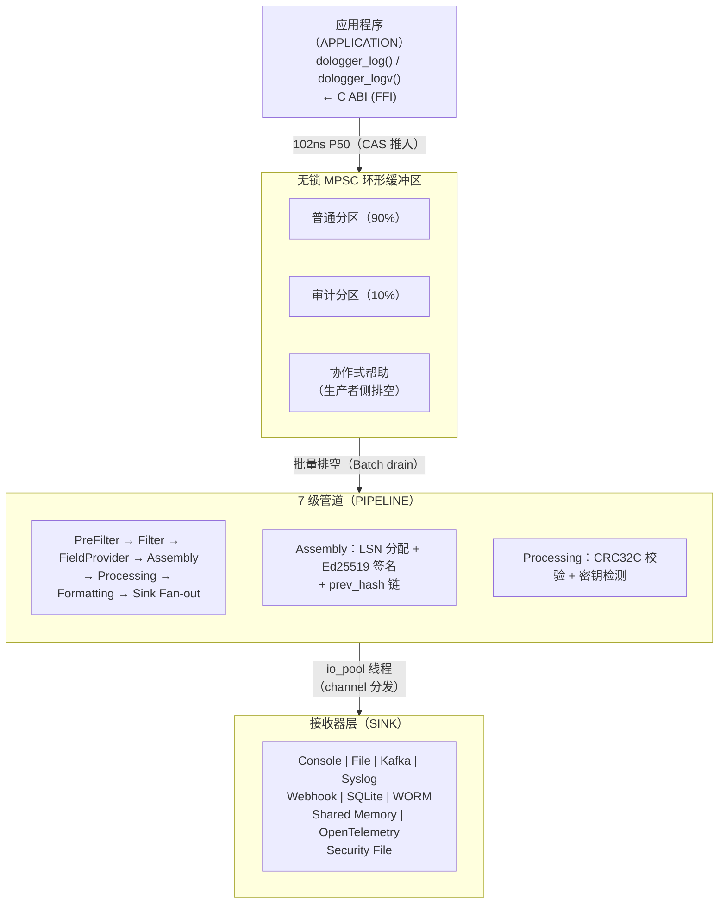

# 🔐 DoLogger

> *跨平台、高安全日志引擎 — Ed25519 审计链、无锁管道、插件沙箱隔离。*

[English](README.md) | [中文](README.zh_CN.md)

<p align="center">
  <a href="https://github.com/Nekolio/DoLogger/actions/workflows/ci.yml"></a>
  <a href="https://github.com/Nekolio/DoLogger/stargazers"></a>
  <a href="https://github.com/Nekolio/DoLogger/blob/main/LICENSE-APACHE"></a>
  
  
  <a href="https://github.com/Nekolio/DoLogger/commits/main"></a>
</p>

---

## 概述

DoLogger 是一个面向**高性能与高安全**双重需求的生产级日志引擎。它将纳秒级无锁记录提交与 Ed25519 签名审计链、插件沙箱隔离、以及 11 种内置输出接收器相结合——全部由 TOML 配置文件驱动，支持域继承与不可降级安全保障。

### 为什么选择 DoLogger？

| 特性 | DoLogger | 传统日志库 |
|:-:|:-:|:-:|
| **提交延迟（P50）** | 102 ns | 500–2000 ns |
| **批量吞吐量** | 13.3M rec/s | 1–5M rec/s |
| **审计链** | Ed25519 + LSN + prev_hash 区块链 | 少见 / 外挂 |
| **插件沙箱** | seccomp-bpf / AppContainer / Sandbox | 无 |
| **性能配置** | 4 种配置（Dev/Prod/ProdAudit/Balanced） | 手动调优 |
| **输出接收器** | 11 种内置（Console、File、Callback、Kafka、Syslog、Webhook、SQLite、WORM、Security、Shared Memory、OTel） | 通常 1–3 种 |
| **配置方式** | TOML + 域继承 + 7 级优先级 | 平铺式配置 |

---

## 快速开始

```bash
# 从源码安装（需要 Rust ≥ 1.70）
git clone https://github.com/Nekolio/DoLogger.git
cd dologger
cargo build --release

# 生成配置模板
./target/release/dologctl init --template dev

# 启动引擎
./target/release/dologctl run --config dologger.toml
```

> [!NOTE]
> 每个 [GitHub Release](https://github.com/Nekolio/DoLogger/releases) 都附带预编译二进制,命名规则为 `dologctl-<os>-<arch>`(Windows 上为 `.exe`)。请使用随附的 `checksums-sha256.txt` 校验下载文件。

### Shell 补全

```bash
source <(dologctl completions bash)                              # bash
source <(dologctl completions zsh)                               # zsh
dologctl completions fish | source                               # fish
dologctl completions powershell | Out-String | Invoke-Expression # PowerShell
```

> [!TIP]
> 将补全脚本写入 shell 配置文件,让每个新终端自动生效,例如 `dologctl completions bash > ~/.dologctl-complete.bash && echo 'source ~/.dologctl-complete.bash' >> ~/.bashrc`。

---

## 架构

> [!IMPORTANT]
> DoLogger 目前处于 **1.0 之前**阶段。MINOR 版本可能包含破坏性变更,ABI 也可能发生变化 —— 生产环境请锁定到确切版本。详见[版本管理与弃用策略](Docs/zh_CN/guides/VersioningAndDeprecation.md)。

<details open>
<summary>架构总览</summary>



</details>

### 关键设计决策

- **无锁热路径**：基于 CAS 的环形缓冲区 + Treiber 栈对象池 — 记录提交零堆分配
- **Ring 0–3 字段权限**：CPU 式特权环模型；Ring 2 修改自动追加审计追踪
- **AUDIT 铁律**：`block_timeout_ms=0`，`drop_strategy=Never` — 审计记录绝不丢弃
- **背压控制**：90% 告警 + 协作式帮助，95% 紧急模式 + 可选丢弃
- **6 项不可降级配置**：`enable_signature`、`escape_html`、`worm_enabled`、`fsync_on_write`、`require_tls`、`sign_ring2`
- **4 种性能配置**：Dev / ProdPerformance / ProdAudit / Balanced — 每种绑定具体超时与策略值

---

## dologctl CLI

```
dologctl init                    生成配置模板
dologctl run --trace             启动引擎并追踪每条记录的管道耗时
dologctl plugin list             列出已安装插件（含信任颜色）
dologctl plugin install <path>   安装插件
dologctl plugin verify [name]    验证插件签名与 ABI
dologctl plugin scan             安全扫描可疑符号
dologctl config validate         验证配置文件（--strict 严格模式）
dologctl verify-log <file>       离线审计日志验证
dologctl verify-anchor           外部锚定验证
dologctl recovery-report         崩溃恢复报告
dologctl record / replay         SIF 录制与回放
dologctl shm status              共享内存通道检查
dologctl perf                    性能基准测试
dologctl completions <shell>     Shell 补全脚本
dologctl version                 项目横幅与系统信息
dologctl version --licenses      第三方许可证归属
```

全局参数：`--output json|text`、`--color auto|always|never`、`--quiet`、`--config <path>`

---

## 插件系统（10 种 VTable 类型）

| 插件类型 | 管道阶段 | 说明 |
|:-:|:-:|:-:|
| **Filter** | 1 | 基于规则丢弃或放行记录 |
| **FieldProvider** | 2 | 注入字段（HostInfoProvider 为受限子类型） |
| **Processor** | 4 | 转换 / 增强 / 检测密钥 |
| **Formatter** | 5 | 将记录序列化为输出格式 |
| **IOSink** | 6 | 最终输出目标 |
| **ConfigProvider** | — | 外部配置源（远程配置中心） |
| **KeyProvider** | — | Ed25519 密钥服务（可外接 HSM） |
| **PolicyProvider** | 0 | 提交前策略（限流、级别过滤） |
| **HostInfoProvider** | 2 | 系统信息注入（ring1_only=true） |
| **SyscallBroker** | — | 沙箱插件的系统调用代理 |

### 信任级别

| 级别 | 颜色 | 签名要求 | 系统调用权限 | 可用插件类型 |
|:-:|:-:|:-:|:-:|:-:|
| **Blue** | 🔵 | Ed25519 签名 | 完整 | 全部 |
| **Yellow** | 🟡 | 自签名 | 受限 | 有限 |
| **Red** | 🔴 | 无（开发模式） | 最小白名单 | 仅 Filter、Formatter、Processor |

---

## 性能

测试环境：Windows 11 LTSC、Rust 1.97.1、Intel i5-12400F、release + LTO：

| 基准测试 | P50 | 吞吐量 |
|:-:|:-:|:-:|
| 单条记录提交 | **102 ns** | ~9.78M rec/s |
| 环形缓冲区推入（1K） | **121 μs** | ~8.26M rec/s |
| 批量推入（256） | **19.2 μs** | ~13.3M rec/s |
| 签名提交（Ed25519） | **16.96 μs** | ~59K rec/s |

CRC32C：SSE 4.2（`_mm_crc32_u64`）硬件加速 + Slicing-by-8 软件回退。

---

## 安全

- **Ed25519 审计链**：每条审计记录均被签名；LSN + prev_hash 形成类区块链防篡改链条
- **WORM 存储**：一次写入多次读取，fsync + 只读权限强制
- **插件沙箱**：seccomp-bpf（Linux）、AppContainer（Windows）、Sandbox（macOS），信任颜色能力矩阵
- **密钥检测**：14 条前缀匹配规则，覆盖 Critical/High/Medium 三个严重级别（AWS、GCP、GitHub Token、私钥等）
- **密钥轮换 + CRL**：多密钥并行验证、轮换生命周期、紧急吊销
- **外部锚定**：定期将根哈希锚定到不可变存储（S3/HTTP）
- **断路器**：3 状态（CLOSED→OPEN→HALF_OPEN→CLOSED），用于远程接收器故障隔离
- **紧急 mmap 缓冲区**：AES-256-GCM 加密溢出缓冲区，环形缓冲区溢出时启用

---

## 合规模板

针对常见监管框架预置 TOML 模板：

```bash
dologctl init --template gdpr    # 欧盟 GDPR
dologctl init --template hipaa   # 美国 HIPAA
dologctl init --template pci     # PCI-DSS
```

模板自动激活不可降级安全项并强制审计要求。

---

## 语言适配器

| 语言 | 位置 | 状态 |
|:-:|:-:|:-:|
| **Rust** | `adapters/rust/` | ✅ SDK crate（dologger-sdk） |
| **Python** | `adapters/python/` | ✅ ctypes 封装 |
| **Go** | `adapters/go/` | ✅ cgo 封装 |

---

## 项目结构

<details>
<summary>仓库目录布局</summary>

```
DoLogger/
├── core/                       # 核心引擎（Rust cdylib）
│   ├── src/                    # 40+ 模块
│   ├── include/                # C ABI 公共头文件
│   └── benches/                # Criterion 基准测试
├── cli/                        # dologctl CLI 工具
│   └── src/commands/           # 子命令实现
├── plugins/                    # 插件生态
│   ├── official/               # 官方插件（fmt_json、filter_level、fmt_text、field_container）
│   └── examples/               # 多语言示例（Rust、C、C++、Go）
├── adapters/                   # 语言 SDK（Rust、Python、Go）
├── compliance/                 # GDPR/HIPAA/PCI-DSS 合规模板
├── Docs/                       # 技术文档
│   ├── zh_CN/                  # 中文文档
│   └── en_US/                  # 英文文档（自动同步至 GitHub wiki）
├── tests/                      # 集成与安全测试
└── scripts/                    # 开发环境搭建脚本
```

</details>

---

## 编译

```bash
# 前置条件：Rust ≥ 1.70，CMake ≥ 3.20
cargo build --release

# 启用 Kafka 支持（需 librdkafka）
cargo build --release --features sink-kafka

# 跨平台目标检查
cargo check --target x86_64-unknown-linux-gnu
cargo check --target x86_64-apple-darwin
cargo check --target aarch64-apple-darwin
```

> [!WARNING]
> `sink-kafka` 需要 librdkafka(通过 Conan 或系统包管理器安装)。CI 与发布构建仅在 Linux x86_64 上包含该特性;macOS、Windows 和 Linux aarch64 构建不包含它。

---

## 参与贡献

C/C++/Go 插件开发请参阅 [插件开发快速入门](Docs/en_US/PluginDevelopmentQuickStart.md)，Rust 插件开发请参阅 [插件开发指南](Docs/zh_CN/guides/PluginDevelopmentGuide.md)，完整架构规范请参阅 核心设计企划书（`~/DoLogger/spec/DoLogger核心设计企划书.md`）。
---

## 许可证

基于 [Apache License 2.0](LICENSE-APACHE) 或 [MIT license](LICENSE-MIT) 二者选一进行许可。

---

## Star 曲线

<a href="https://star-history.com/#Nekolio/DoLogger&Date">
  <picture>
    <source media="(prefers-color-scheme: dark)" srcset="https://api.star-history.com/svg?repos=Nekolio/DoLogger&type=Date&theme=dark" />
    <source media="(prefers-color-scheme: light)" srcset="https://api.star-history.com/svg?repos=Nekolio/DoLogger&type=Date" />
    
  </picture>
</a>

---

*由 [@Nekolio](https://github.com/Nekolio) 用 ❤️ 构建 | nekoliowork+DoLogger@gmail.com*
