# DoLogger Architecture Reference

> **Version**: v0.0.1 | **Last Updated**: 2026-08-12 | **Target Audience**: Core Developers, Plugin Authors, Systems Engineers
>
> **Purpose**: Definitive reference for the DoLogger engine internals -- pipeline architecture, lock-free data structures, cryptographic audit chain, security model, sink fan-out, backpressure, and performance tuning. Assume familiarity with the [Integration Guide](IntegrationGuide.md).
>
> 🌐 **语言 / Language**: [English](ArchitectureReference.md) | [中文：架构参考手册](../zh_CN/ArchitectureReference.md)
>
> **Reading Path**: Start with the [Pipeline Architecture](#pipeline-architecture) diagram, then dive into your area of interest. Plugin developers should focus on [Plugin VTable Specification](#plugin-vtable-specification).

---

## Table of Contents

1. [Before You Start](#before-you-start)
2. [Pipeline Architecture](#pipeline-architecture)
3. [Ring Buffer Design and Lock-Free Guarantees](#ring-buffer-design-and-lock-free-guarantees)
4. [Audit Chain: Ed25519 + LSN + content_hash](#audit-chain-ed25519--lsn--content_hash)
5. [Security Model: Ring 0-3 Permissions and Three-Color Trust](#security-model-ring-0-3-permissions-and-three-color-trust)
6. [Sink Fan-Out and Fallback Chains](#sink-fan-out-and-fallback-chains)
7. [Backpressure System](#backpressure-system)
8. [Emergency Buffer and Recovery](#emergency-buffer-and-recovery)
9. [Thread Pool Architecture](#thread-pool-architecture)
10. [Plugin VTable Specification](#plugin-vtable-specification)
11. [SIF Binary Format Overview](#sif-binary-format-overview)
12. [Performance Benchmarks and Tuning](#performance-benchmarks-and-tuning)

---

## Before You Start

### Prerequisites

- Familiarity with lock-free concurrent programming (CAS, atomic ordering)
- Understanding of Rust's ownership model and FFI
- Knowledge of Ed25519 signatures and SHA-256 hash chains
- The [Integration Guide](IntegrationGuide.md) for application-level usage

### Key Terminology

| Term | Definition |
|:-:|:-:|
| **Record** | A single log entry flowing through the engine |
| **Ring buffer** | Lock-free MPSC queue for producer-to-consumer handoff |
| **Pipeline** | 7-stage processing chain: PreFilter -> Filter -> Field -> Assembly -> Process -> Format -> Sink |
| **Object pool** | Pre-allocated Record pool using a Treiber stack |
| **LSN** | Log Sequence Number -- monotonically increasing audit counter |
| **prev_hash** | SHA-256 hash linking each audit record to its predecessor |
| **WORM** | Write-Once-Read-Many -- immutable audit file storage |
| **VTable** | Virtual method table -- C ABI function pointer struct per plugin type |

---

## Pipeline Architecture

### System Overview

(illustrative diagram):

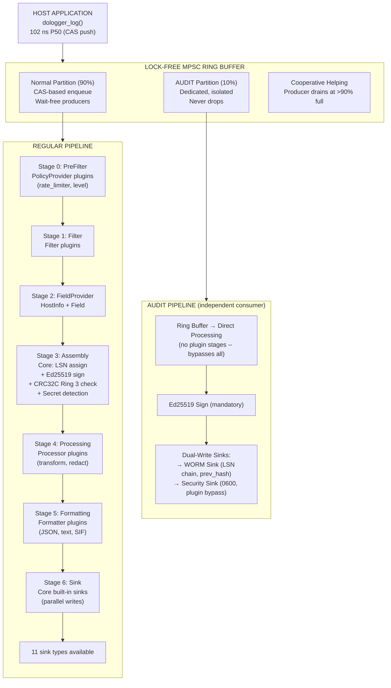

### Stage Details

| Stage | Index | Plugins | Can Drop? | Can Modify? | Core Operations |
|:-:|:-:|:-:|:-:|:-:|:-:|
| PreFilter | 0 | PolicyProvider | Yes | No | Rate limiting, level gating |
| Filter | 1 | Filter | Yes | No | Content-based filtering |
| FieldProvider | 2 | FieldProvider, HostInfoProvider | No | Ring 1 write | Host/container/cloud metadata injection |
| Assembly | 3 | Core only | No | Ring 0+1 write | LSN assign, Ed25519 sign, CRC32C verify, secret detection |
| Processing | 4 | Processor | Yes | Ring 2+3 write | Transform, redact, enrich |
| Formatting | 5 | Formatter | No | Read-only | Serialize to JSON/text/SIF |
| Sink | 6 | Core built-in | No | Read-only | Write to external destinations |

### Record Lifecycle

(illustrative diagram):

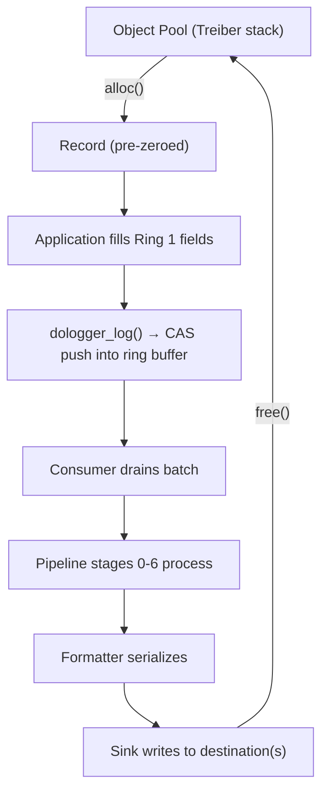

---

## Ring Buffer Design and Lock-Free Guarantees

### Architecture

(illustrative diagram):

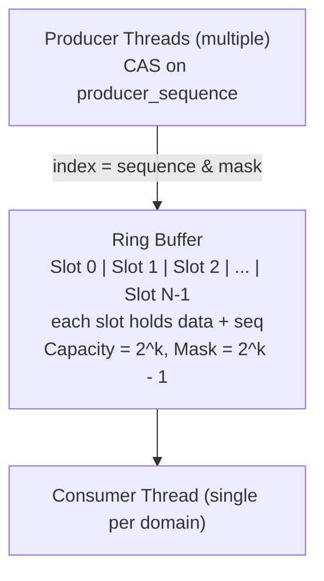

### Design Properties

| Property | Guarantee |
|:-:|:-:|
| **Producers** | Wait-free -- CAS slot claim, no mutex, no spin-loop |
| **Consumer** | Batch drain -- single thread per domain, never contends with producers |
| **Cache-line padding** | Each `RingSlot` is `#[repr(C, align(64))]` to prevent false sharing |
| **Power-of-two capacity** | Bitmask modulo (`index = seq & mask`) avoids division |
| **Sequence coordination** | Two atomic counters: `producer_sequence` and `consumer_sequence` |

### Enqueue Algorithm (Producer)

(pseudocode — illustrative, not compiled. The actual implementation is in `core/src/buffer/ring_buffer.rs`):

```
producer_push(record):
  loop:
    seq = producer_sequence.fetch_add(1, Relaxed)   // Claim next slot
    slot = &slots[seq & mask]
    while slot.sequence != seq:                      // Wait for slot to be free
      spin_loop()
    slot.data = record                                // Write
    slot.sequence.store(seq + 1, Release)            // Publish
    return OK
```

### Dequeue Algorithm (Consumer)

(pseudocode — illustrative, not compiled. The actual implementation is in `core/src/buffer/ring_buffer.rs`):

```
consumer_drain(batch_size):
  for i in 0..batch_size:
    consumer_seq = consumer_sequence.load(Relaxed)
    slot = &slots[consumer_seq & mask]
    if slot.sequence != consumer_seq + 1:             // Slot not ready yet
      break
    record = slot.data.take()
    slot.sequence.store(consumer_seq + capacity, Release)  // Free slot
    consumer_sequence.fetch_add(1, Release)
    process(record)
  return count
```

### Object Pool (Treiber Stack)

Records are pre-allocated in a `RecordPool` to avoid heap allocation on the hot path:

(pseudocode — illustrative, not compiled. The actual implementation is in `core/src/buffer/object_pool.rs`):

```
Allocation:
  CAS(pool.head, current_head, nodes[current_head].next)
  → return &mut nodes[current_head].record

Deallocation:
  loop:
    current_head = pool.head
    nodes[node].next = current_head
    if CAS(pool.head, current_head, node): break
```

### Concurrency Model Summary

| Component | Mechanism | Notes |
|:-:|:-:|:-:|
| Ring buffer (producer) | Lock-free CAS | Contention under >8 threads (single CAS cursor) |
| Ring buffer (consumer) | Single-threaded | One consumer per domain, no contention |
| Object pool | Lock-free Treiber stack | CAS on head pointer |
| Config store | `Arc<RwLock<Config>>` + CoW snapshot | Read-heavy, write-rare |
| Plugin registry | `Arc<RwLock<PluginRegistry>>` | Cold path only (load/unload) |
| Error state | Thread-local storage | `thread_local! { RefCell<DologgerError> }` |

### Known Limitation

The ring buffer uses a single CAS cursor for all producers. Under heavy multi-threaded submission (>8 concurrent producer threads), CAS contention can become a bottleneck. A sharded ring buffer with per-thread partitions is planned.

---

## Audit Chain: Ed25519 + LSN + content_hash

### Chain Structure

(pseudocode — illustrative, not compiled; the 64B Ed25519 signature lives in
the companion sidecar `audit.log.sig`, NOT in the Record):

```
Record(1):
  lsn          = 1
  content_hash = SHA-256(canonical_serialization(fixed_fields ‖ kv_fields))
  prev_hash    = SHA-256(0x00...00)       // Genesis block -- all zeros
  // sidecar: sig(1) = Ed25519_Sign(key, SHA-256(lsn ‖ content_hash ‖ prev_hash))

Record(2):
  lsn          = 2
  content_hash = SHA-256(canonical_serialization(fixed_fields ‖ kv_fields))
  prev_hash    = SHA-256(Record(1).content_hash ‖ Record(1).lsn)
  // sidecar: sig(2) = Ed25519_Sign(key, SHA-256(lsn ‖ content_hash ‖ prev_hash))

Record(3):
  lsn          = 3
  content_hash = SHA-256(canonical_serialization(fixed_fields ‖ kv_fields))
  prev_hash    = SHA-256(Record(2).content_hash ‖ Record(2).lsn)
  // sidecar: sig(3) = Ed25519_Sign(key, SHA-256(lsn ‖ content_hash ‖ prev_hash))
```

| Record | LSN | prev_hash | content_hash | sidecar signature |
|:-:|:-:|:-:|:-:|:-:|
| Record(1) | 1 | SHA-256(0x00...00) — Genesis block | SHA-256(canonical serialization) | Ed25519 over SHA-256(lsn‖content_hash‖prev_hash) |
| Record(2) | 2 | SHA-256(Record(1).content_hash \|\| Record(1).lsn) | SHA-256(canonical serialization) | Ed25519 over SHA-256(lsn‖content_hash‖prev_hash) |
| Record(3) | 3 | SHA-256(Record(2).content_hash \|\| Record(2).lsn) | SHA-256(canonical serialization) | Ed25519 over SHA-256(lsn‖content_hash‖prev_hash) |

Optional block mode (`audit_block_size > 1`): content_hashes of a block are
folded into a Merkle root; a single block signature is stored in the sidecar
instead of one per record. The signing key is provisioned in a TPM
(non-exportable, hardware signing; `enable_signature=true` without a TPM
refuses startup).

### Verification Algorithm

(pseudocode — illustrative, not compiled; the shipped verifier is `dologctl verify-log`, see the [Operations & Security Guide](OperationsAndSecurity.md#audit-verification)):

```
verify_chain(records, sidecar):
  for i = 0 to len(records)-1:
    1. Recompute content_hash[i] from canonical serialization:
       if records[i].content_hash != recomputed:
         return FAIL at i

    2. Verify prev_hash chain (if i > 0):
       expected = SHA-256(records[i-1].content_hash || records[i-1].lsn)
       if records[i].prev_hash != expected:
         return CHAIN_BREAK at i

    3. Verify LSN monotonicity:
       if records[i].lsn <= records[i-1].lsn:
         return LSN_ORDER_VIOLATION at i

    4. Verify Ed25519 signature from the sidecar:
       per-record: verify(sig[i], SHA-256(lsn ‖ content_hash ‖ prev_hash))
       block mode: rebuild the Merkle root, verify the block signature

    5. Detect gaps:
       if records[i].lsn > records[i-1].lsn + 1:
         mark GAP from (records[i-1].lsn+1) to (records[i].lsn-1)

  return OK with summary
```

### LSN Gap Handling

- **Reorder window (200 ms)**: Out-of-order records within 200 ms are filled in. No gap is marked.
- **Window exceeded**: A `GAP_MARKER` record is written to the WORM file, and a `LSN_GAP_DETECTED` sysmon event is emitted.
- **Non-AUDIT records**: Do not carry LSNs. Gaps are expected and non-malicious.

### Signature Coverage

| Fields | Integrity | Notes |
|:-:|:-:|:-:|
| Fixed hot fields (timestamp, level, message, pid, tid, LSN) | Ed25519 | Always signed |
| KV fields | Ed25519 | Always signed (canonical KV order) |
| Overflow spill state | CRC32C only | Hardware-accelerated, not cryptographic |

### Cryptographic Performance

Measured on AMD Ryzen 9 7950X, single core, ed25519-dalek 2.0 (software path;
TPM hardware latency is backend-dependent, measured on the target platform):

| Operation | Latency | Throughput |
|:-:|:-:|:-:|
| Ed25519 key generation | ~24 us | ~41,000 keys/s |
| Ed25519 signing | ~16.96 us | ~58,000 sigs/s |
| Ed25519 verification | ~48 us | ~20,800 verifs/s |
| SHA-256 (64 bytes) | ~120 ns | ~8.3M hashes/s |
| CRC32C (64 bytes) | ~3 ns | ~330M checks/s |

AUDIT records additionally pay the TPM signing cost: per-record mode is
bounded by TPM ops/s (discrete TPM2: tens of ms per op — measure on the
target backend); block mode amortizes it over the block size. The
content_hash chain costs ~120 ns–1 us per record and is the dominant
in-engine audit overhead.

### External Anchoring (planned)

Periodic Merkle root hashes are published to immutable external storage (S3, blockchain) to provide long-term tamper resistance:

(pseudocode — illustrative, not compiled):

```
// Every N records, compute a Merkle root over the content-hash chain
let merkle_root = compute_merkle_root(records[l..r]);
send_to_external_anchor(merkle_root, lsn_range = [l, r]);
```

---

## Security Model: Ring 0-3 Permissions and Three-Color Trust

### Field Permission Rings

(illustrative diagram):

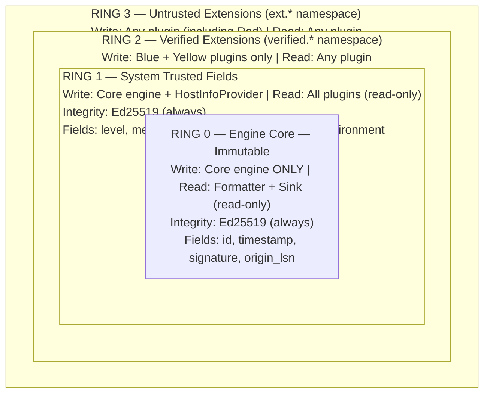

### Three-Color Plugin Trust Model

| Property | Blue (Full Trust) | Yellow (Partial Trust) | Red (Zero Trust) |
|:-:|:-:|:-:|:-:|
| Signing | Ed25519 required | Recommended | Not required |
| Sandbox | None | seccomp-bpf / AppContainer | Maximum isolation |
| File I/O | Full | Read + Write | Denied |
| Network | Full | Denied | Denied |
| Process spawn | Allowed | Denied | Denied |
| Field writes | Ring 2 (`verified.*`) | Ring 2 (`verified.*`) | Ring 3 (`ext.*`) |
| Field reads | Rings 0-3 | Rings 0-3 | Rings 0-3 |
| Dynamic load | Allowed | Allowed | Config-gated (`allow_red_plugins`) |

### seccomp-bpf Syscall Allowlist (Linux)

| Category | Blue | Yellow | Red |
|:-:|:-:|:-:|:-:|
| Memory | ALL | ALL | ALL |
| Threading | ALL | ALL | ALL |
| Time | ALL | ALL | ALL |
| Signal | ALL | ALL | DENIED |
| File I/O | ALL | ALL | DENIED |
| Network | ALL | DENIED | DENIED |
| Process | ALL | DENIED | DENIED |

Violation action: `SECCOMP_RET_KILL_PROCESS` -- the plugin thread is terminated by the kernel with SIGSYS. A `SANDBOX_VIOLATION` sysmon event is emitted.

---

## Sink Fan-Out and Fallback Chains

### Fan-Out Architecture

(illustrative diagram):

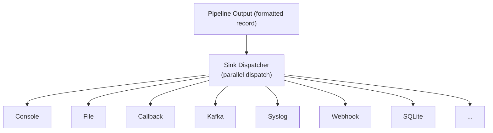

Each enabled sink receives a copy of every formatted record. Dispatch is parallel across the `io_pool` thread pool.

### Built-in Sinks (9 Total)

| Sink | Type | TLS | Use Case |
|:-:|:-:|:-:|:-:|
| Console | `console` | N/A | Development, debugging |
| File | `file` | N/A | Local file output with rotation |
| WORM | `worm` | N/A | Immutable audit log storage |
| Security File | `security` | N/A | Isolated audit output (0600, plugin bypass) |
| Syslog | `syslog` | TLS (RFC 5425) | Traditional syslog infrastructure |
| Kafka | `kafka` | TLS + SASL | Centralized log aggregation (feature-gated) |
| SQLite | `sqlite` | N/A | Local structured log storage (feature-gated) |
| Webhook | `webhook` | HTTPS | REST API log ingestion (feature-gated) |
| OpenTelemetry | `otel` | HTTPS | OTLP/HTTP observability pipelines (feature-gated) |

### Fallback Chains

When a primary sink fails, a fallback chain provides degraded-mode output:

```toml
[sinks.file]
type = "file"
path = "/var/log/dologger/app.log"
fallback = "emergency_file"

[sinks.kafka]
type = "kafka"
brokers = ["kafka1:9092"]
fallback = "file"            # If Kafka is down, write to file instead
```

(illustrative diagram):

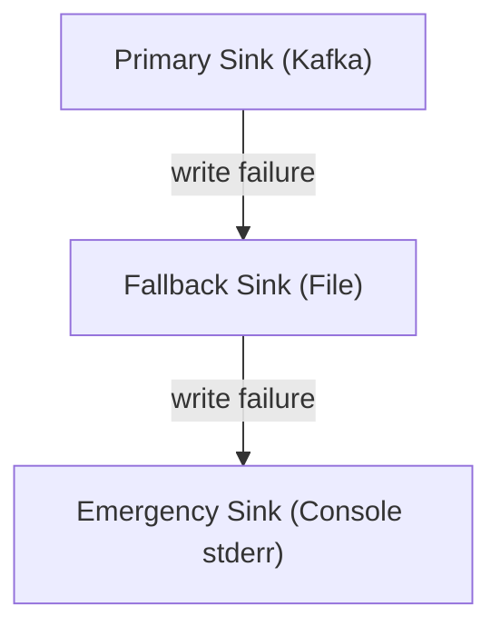

### Circuit Breaker Per Remote Sink

Each remote sink (Kafka, Syslog, Webhook) has an independent circuit breaker:

(illustrative diagram):

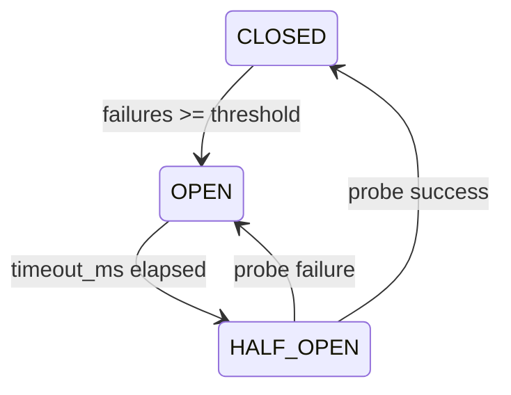

| Parameter | Default | AUDIT Override |
|:-:|:-:|:-:|
| `failure_threshold` | 5 consecutive failures | >= 3 |
| `timeout_ms` | 30,000 (30 seconds) | >= 60,000 |
| `half_open_max_requests` | 3 probes | 3 probes |

---

## Backpressure System

### Drop Strategies

When the ring buffer is full and the configured `block_timeout_ms` expires, records are dropped according to the strategy:

| Strategy | Behavior | Availability Impact |
|:-:|:-:|:-:|
| `drop_newest` | Discard the newly submitted record | Low -- producers never block |
| `oldest` | Discard the oldest unprocessed record | Low -- maintains freshness |
| `below_warn` | Drop only records below WARN level | Medium -- WARN+ always preserved |
| `below_error` | Drop only records below ERROR level | High -- ERROR+ always preserved |
| `never` | Block indefinitely (AUDIT domain only) | May stall the host |

### Backpressure Thresholds

(illustrative diagram):

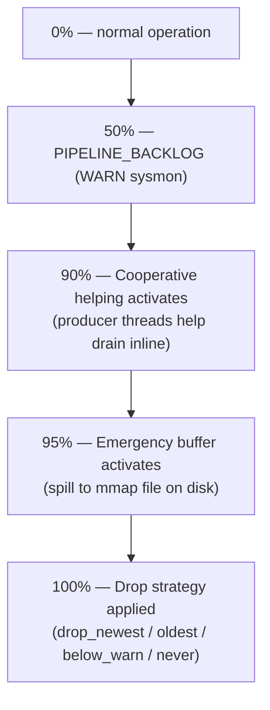

### Cooperative Helping

At 90% occupancy, producer threads help drain the ring buffer inline before pushing their own record. This trades a small increase in submission latency for the prevention of buffer overflow:

(pseudocode — illustrative, not compiled):

```
if occupancy >= 90%:
  producer drains a small batch (16 records)
  producer then pushes its own record
```

### Performance Profile Binding

| Profile | `block_timeout_ms` | `drop_strategy` | AUDIT Behavior |
|:-:|:-:|:-:|:-:|
| `dev` | 100 | `drop_newest` | AUDIT blocks indefinitely |
| `prod-performance` | 3000 | `below_warn` | AUDIT blocks indefinitely |
| `prod-audit` | 3000 | `below_warn` | AUDIT blocks indefinitely |
| `balanced` | 2000 | `oldest` | AUDIT blocks indefinitely |

The AUDIT iron law overrides all profiles: AUDIT records never drop.

---

## Emergency Buffer and Recovery

### Activation

- **Trigger**: Ring buffer occupancy >= 95% for >5 seconds
- **Threshold managed by**: `BackpressureController`
- **Storage**: Anonymous memory-mapped file in system temp directory
- **Format**: Length-prefixed framed records (8-byte length prefix + raw record bytes)
- **AUDIT encryption**: AES-256-GCM with per-session key

### Emergency Buffer Data Flow

(illustrative diagram):

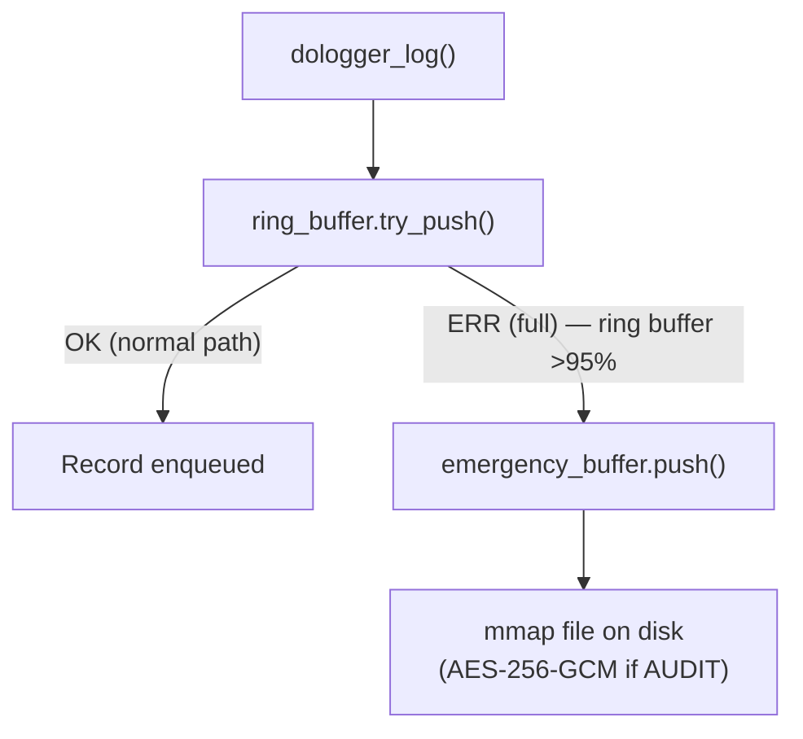

### Recovery

(pseudocode — illustrative, not compiled):

```
Engine Startup:
  1. Check for emergency buffer file: dologger_emergency_<pid>_<spill_id>.buf
     (in the `dologger/` subfolder of the system temp directory)
  2. If found:
     a. Read all spilled records
     b. LSN-based deduplication (skip records with already-seen LSNs)
     c. Replay into the main pipeline
     d. Delete the emergency file
  3. Emit EMERGENCY_RECOVERED sysmon event
```

### Emergency Buffer Limits

| Parameter | Default |
|:-:|:-:|
| Max file size | 512 MB |
| Max records | 1,000,000 |

If these limits are exceeded, the emergency buffer itself drops records and a `EMERGENCY_BUFFER_OVERFLOW` sysmon event is emitted.

---

## Thread Pool Architecture

### Pool Layout

(illustrative diagram):

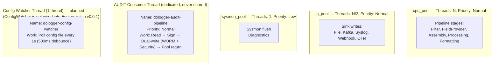

### Thread Naming Convention

All threads follow the naming pattern `dologger-<pool>-<id>`:

(illustrative listing):

```
dologger-cpu_pool-0
dologger-cpu_pool-1
dologger-io_pool-0
dologger-sysmon_pool-0
dologger-audit-pipeline
dologger-config-watcher
```

### Scheduler

The pipeline scheduler uses a work-stealing thread pool (`crossbeam_channel`):

- CPU pool: `num_cpus` threads for CPU-bound pipeline stages
- IO pool: `num_cpus / 2` threads for IO-bound sink writes
- Sysmon pool: 1 thread for diagnostic flushing (low priority)

---

## Plugin VTable Specification

### The 9 Plugin Types

| # | Type | Phase | VTable Functions |
|:-:|:-:|:-:|:-:|
| 1 | `Filter` | Filter (1) | `filter`, `filter_batch` |
| 2 | `PolicyProvider` | PreFilter (0) | `policy_evaluate`, `policy_update` |
| 3 | `FieldProvider` | Field (2) | `provide_fields`, `provide_fields_batch` |
| 4 | `HostInfoProvider` | Field (2) | `provide_host_info` (Ring 1 restricted) |
| 5 | `Processor` | Process (4) | `process`, `process_batch` |
| 6 | `Formatter` | Format (5) | `format`, `flush` |
| 7 | `ConfigProvider` | Config (load-time) | `load_config`, `watch_config` |
| 8 | `KeyProvider` | Key (load-time) | `sign`, `public_key`, `rotate` |
| 9 | `SyscallBroker` | Syscall (proxy) | `broker_dispatch` |

Sink is not a plugin type: it is a core built-in output executor (stage 6) with
no VTable. The 11 built-in sinks are executed directly by the core; see the
Built-in Sinks section below.

### VTable Pattern

All VTable functions follow this contract:

(pseudocode — illustrative contract template; the real v0.0.1 VTable functions return `int` and are defined per type in `core/include/dologger_core.h`):

```c
// (pseudocode — illustrative, not compiled)
// Required: Provide function pointer, or NULL if unsupported
// Return: DO_LOG_OK on success, error code on failure
// DO_LOG_ERR_FATAL causes the plugin to be unloaded

typedef dologger_error_t (*vtable_fn_t)(/* parameters */);
```

### Plugin Lifecycle

(illustrative diagram):

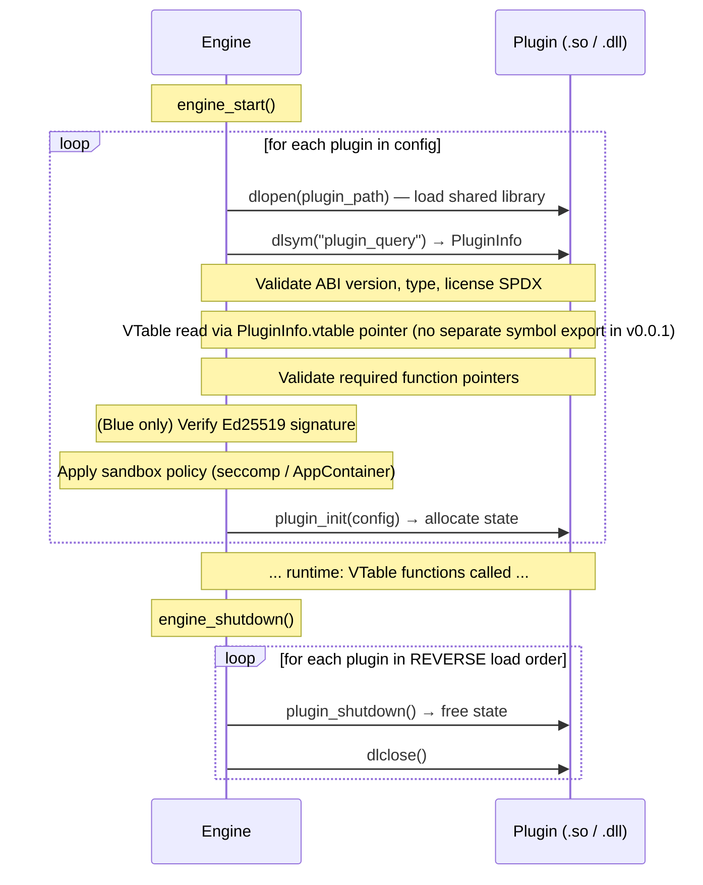

### Required C ABI Exports

Every plugin MUST export (v0.0.1 actual signatures, see `core/include/dologger_core.h`):

```c
/* 1. Identity + VTable — called once at load */
dologger_plugin_info_t *plugin_query(uint32_t core_abi_version);

/* 2. Configuration — called after plugin_query, before first use */
int plugin_init(const void *config);

/* 3. Cleanup — called before library unload */
int plugin_shutdown(void);
```

The VTable itself is reached through the `vtable` pointer of `dologger_plugin_info_t` — it is not exported as a separate symbol.

Every plugin MAY export (illustrative — planned state-serialization extension, not yet in the C ABI):

```c
// (illustrative — planned, not yet in dologger_core.h)
dologger_error_t plugin_state_serialize(dologger_state_buf_t *out);
dologger_error_t plugin_state_deserialize(const dologger_state_buf_t *in);
```

---

## SIF Binary Format Overview

### Format

SIF (**Standard Intermediate Format**) is the binary log-record wire format
used for WORM storage, shared-memory handoff, and the CLI's `record` /
`verify` commands. It is a FlatBuffer-encoded `Record` table framed by a
small header, giving schema evolution and zero-copy field access.

Every SIF message is framed as:

| Offset | Size | Field | Description |
|:-:|:-:|:-:|:-:|
| 0 | 4 | magic | `b"SIF1"` |
| 4 | 12 | SifHeader | version, total_length, record_count |
| 16 | var | FlatBuffer | `Record` table (root offset + vtable + data) |

### Header (`SifHeader`)

| Field | Size | Description |
|:-:|:-:|:-:|
| version | 4 | Packed schema version (`MAJOR << 24 \| MINOR << 16 \| PATCH`); 1.0.0 = `0x0100_0000` |
| total_length | 4 | Total frame length including magic + header |
| record_count | 4 | Number of `Record` tables (1 for single-record frames) |

### Encoding / Decoding

The `core::sif` module exposes the stable frame API:

- `encode_record(&Record) -> Vec<u8>` — serialise a record into a framed SIF buffer.
- `decode_record(&[u8]) -> Record` — parse a framed SIF buffer back into a record.
- `validate_frame(&[u8]) -> SifError` — check magic + header consistency.

The FlatBuffer schema lives at `core/sif/dologger_sif.fbs`; bindings are
generated by `core/build.rs` (`flatc --rust`) and committed as a fallback.
The schema supports evolution, so older consumers ignore unknown fields.

### Status — v0.0.1

The wire format and the `encode_record` / `decode_record` / `validate_frame`
API are delivered and already used by the shared-memory sink and the CLI. The
engine's Formatting→Sink SIF handoff is planned (the Formatting stage still
emits plain text internally).

---

## Performance Benchmarks and Tuning

### Hardware Reference

| Component | Specification |
|:-:|:-:|
| CPU | AMD Ryzen 9 7950X (16C/32T) |
| RAM | DDR5-6000 |
| Storage | Samsung 990 Pro NVMe |
| OS | Linux 6.x |
| Rust | stable, release + LTO |

### Benchmark Results

| Benchmark | Measurement |
|:-:|:-:|
| Single record submit (CAS push) | 102 ns P50 |
| Ring buffer push (1K records) | 121 us |
| Batch push (256 records) | 19.2 us |
| Console Sink, no signing | 1,200,000 rec/s |
| File Sink, no signing | 950,000 rec/s |
| File Sink, Ed25519 signing | 58,000 rec/s |
| WORM Sink, sign + fsync | 12,000 rec/s |
| CRC32C (64 bytes) | ~3 ns (SSE 4.2 hardware) |

### Tuning Parameters

| Parameter | Default | Tuning Guidance |
|:-:|:-:|:-:|
| `ring_buffer_size` | 262144 | Increase for bursty workloads. Must be power of two. |
| `batch_size` | 256 | 128-512. Larger = higher throughput, higher latency. |
| `enable_audit` | false | Opt-in isolated AUDIT/WORM pipeline. |
| `audit_worm_path` | `dologger_audit.worm` | WORM file used only by the isolated AUDIT pipeline. |
| `audit_security_path` | `dologger_security.log` | Security file used only by the isolated AUDIT pipeline. |
| `enable_signature` | false | Adds ~17 us per signed audit record. |
| `fsync_on_write` | false | Forces media durability. I/O latency bound. |
| `ring_buffer_coop_helping` | true | Prevents overflow at cost of ~1 us on hot path. |

### OS-Level Tuning

(illustrative — Linux host tuning with external tools, not DoLogger commands):

```bash
# Pin pipeline threads to isolated CPUs
sudo cset shield --cpu 2-3 --kthread=on

# Increase max locked memory for ring buffer (huge pages)
sudo sysctl -w vm.max_map_count=262144

# Disable transparent huge pages when measuring latency
echo never | sudo tee /sys/kernel/mm/transparent_hugepage/enabled
```

### Running Benchmarks

```bash
# Run the built-in benchmark suite (core/benches)
cargo bench

# Single-record submission latency
cargo bench --bench latency

# Throughput benchmark
cargo bench --bench throughput

# Latency percentile distribution
cargo bench --bench latency_percentiles
```

The CLI also ships a quick local benchmark: `dologctl perf` (single-thread push latency, default 100K records / 80-byte messages; use `dologctl perf --count 100000 -o json` for machine-readable output).

---

## Complete Specification

This document is the authoritative design reference for DoLogger architecture decisions, APIs, and security properties.
