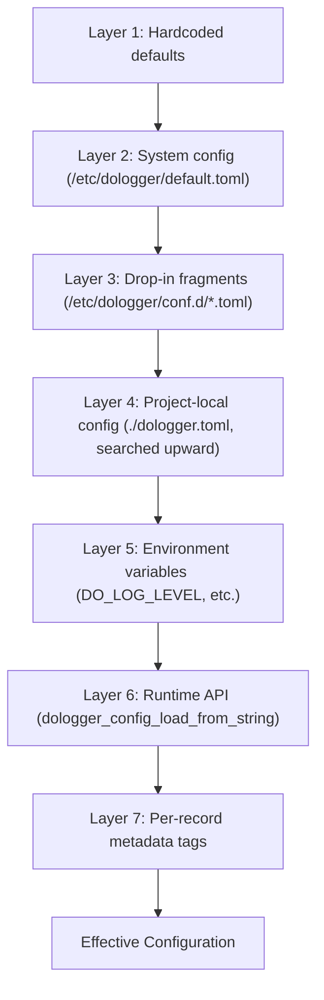
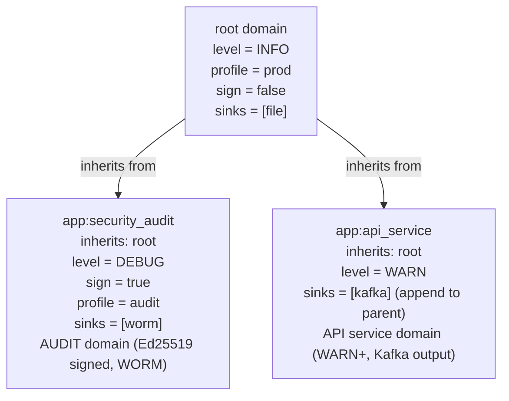
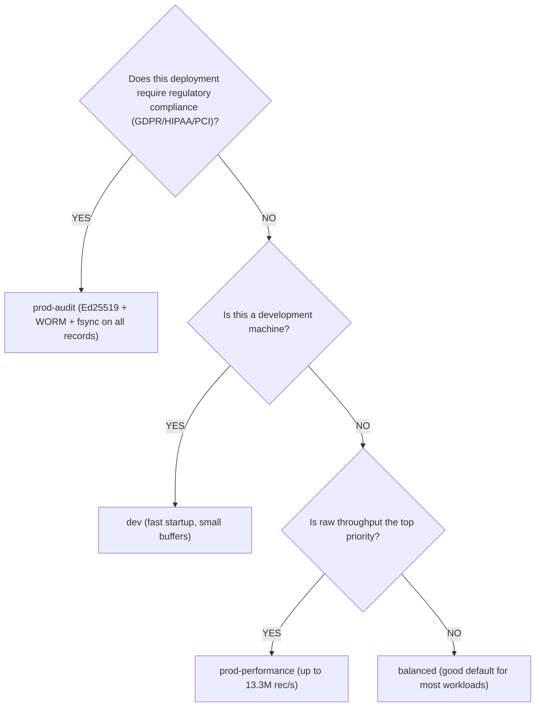
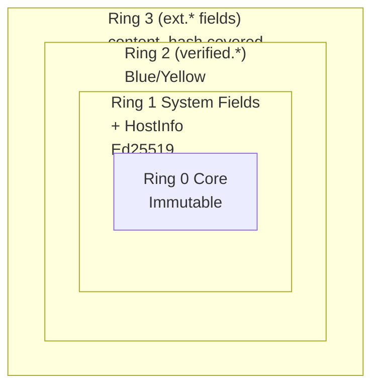
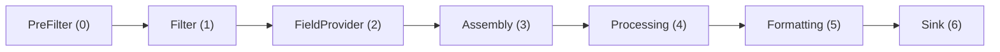

# DoLogger Integration Guide

> **Version**: v0.0.1 | **Last Updated**: 2026-08-12 | **Target Audience**: Application Developers
>
> **Purpose**: Learn how to embed DoLogger into your application. Covers the C API, configuration, domain inheritance, plugin selection, and language adapters. If you are brand new, start with the [Quick Start Guide](QuickStart.md) first.
>
> 🌐 **语言 / Language**: [English](IntegrationGuide.md) | [中文：DoLogger 集成指南](../zh_CN/IntegrationGuide.md)
>
> **Reading Path**: C developers should read [C API Basics](#c-api-basics) and [Configuration Deep-Dive](#configuration-deep-dive). Rust developers can skip to [Language Adapters](#language-adapters). For the complete C ABI reference with every function signature and error code, see the [Host Integration Guide](guides/HostIntegrationGuide.md).

---

## Table of Contents

1. [Before You Start](#before-you-start)
2. [C API Basics](#c-api-basics)
3. [Configuration Deep-Dive](#configuration-deep-dive)
4. [Domain Inheritance](#domain-inheritance)
5. [Performance Profile Selection Guide](#performance-profile-selection-guide)
6. [Record Field System](#record-field-system)
7. [Plugin Selection Guide](#plugin-selection-guide)
8. [Language Adapters](#language-adapters)
9. [Common Patterns and Recipes](#common-patterns-and-recipes)
10. [Troubleshooting FAQ](#troubleshooting-faq)

---

## Before You Start

### Prerequisites

- DoLogger engine library built and available on your system. See the [Quick Start Guide](QuickStart.md) for build instructions.
- A C compiler (GCC, Clang, or MSVC) for C API integration. Not required for Rust/Python/Go adapters.
- Basic understanding of TOML configuration syntax.

### What You Get

After integration, your application can:
- Submit log records with 102 ns median latency
- Output to 11 different sink types simultaneously
- Maintain a cryptographically verifiable audit trail (Ed25519 + LSN chain)
- Extend logging with sandboxed plugins that cannot compromise your application

### Integration Approaches

| Approach | When to Use | Latency | Isolation |
|:-:|:-:|:-:|:-:|
| **Embedded** (dynamic link) | You control the binary, need minimum latency | Lowest (102 ns P50) | Shared process |
| **Sidecar** (sink_shm) | Polyglot services, fault isolation | Low (~1 us) | Separate process |
| **Daemon** (local socket) | Legacy applications, system-wide logging | Moderate | Separate process |

---

## C API Basics

### Initialize, Log, Shutdown

The minimal integration is three function calls. For complete function signatures and error handling, see the [Host Integration Guide](guides/HostIntegrationGuide.md).

```c
#include "dologger_core.h"
#include <stdio.h>

int main(void) {
    dologger_error_t err = {0};
    dologger_handle_t *logger = NULL;

    // 1. Initialize with default configuration
    logger = dologger_init(NULL, &err);
    if (logger == NULL) {
        printf("DoLogger init failed: %s\n", err.message);
        return 1;
    }

    // 2. Submit a log record
    dologger_record_params_t params = {
        .level   = DO_LOG_INFO,
        .message = "Application started successfully",
    };
    if (dologger_log(logger, &params) != DO_LOG_OK) return 1;

    // 3. Shutdown (drains in-flight records)
    dologger_shutdown(logger);
    return 0;
}
```

### Convenience Macros

(pseudocode — illustrative, not compiled). These convenience macros are planned for the upcoming SDK header. The current C ABI uses `dologger_log()` with a `dologger_record_params_t` struct instead (see the example above); the `DO_LOG_*` symbols that exist today are level constants only:

```c
// (pseudocode — illustrative: macro wrappers are not in dologger_core.h yet)
DO_LOG_TRACE(h, "Frame-level detail: variable x = %d", x);
DO_LOG_DEBUG(h, "Diagnostic: connection pool size = %d", pool_size);
DO_LOG_INFO(h,  "User %s logged in from %s", username, ip);
DO_LOG_WARN(h,  "Retry %d/3 for upstream service %s", attempt, svc);
DO_LOG_ERROR(h, "Database query failed: %s", db_error);
DO_LOG_FATAL(h, "Unrecoverable error in module %s -- shutting down", module);
DO_LOG_AUDIT(h, "User %s deleted record id=%s -- non-repudiable", user, rec_id);
```

### Log Levels

| Level | Constant | Use For |
|:-:|:-:|:-:|
| TRACE | `DO_LOG_TRACE` | Frame-level detail. Use sparingly in production. |
| DEBUG | `DO_LOG_DEBUG` | Developer diagnostics. |
| INFO | `DO_LOG_INFO` | Normal operational events. |
| WARN | `DO_LOG_WARN` | Potentially harmful situations. |
| ERROR | `DO_LOG_ERROR` | Errors that do not halt the application. |
| FATAL | `DO_LOG_FATAL` | Severe errors causing termination. |
| AUDIT | `DO_LOG_AUDIT` | Non-repudiable audit records. May block under backpressure. |

### Linking

**Linux / macOS:**
```bash
cc -o myapp myapp.c -ldologger_core -L/usr/lib/dologger
```

**Windows (MSVC):**
```bash
cl /Fe:myapp.exe myapp.c dologger_core.dll.lib
```

### Verifying the ABI

```c
#include "dologger_core.h"
#include <stdio.h>

int main(void) {
    const char *version = dologger_version();
    printf("DoLogger core version: %s\n", version);
    return 0;
}
```

---

## Configuration Deep-Dive

### How Configuration is Resolved

DoLogger uses a 7-layer priority system. Lower-numbered layers have lower priority:

(illustrative diagram — describes the intended priority ladder):



Non-downgradable items: Layers can only tighten security, never loosen it.

### Core Configuration Keys

```toml
[dologger]
# ── Required ────────────────────────────────────────────────
level = "INFO"                          # Minimum log level
performance_profile = "prod-performance" # Performance preset

# ── Performance ─────────────────────────────────────────────
ring_buffer_size = 65536                # Default; power of two required
batch_size = 256                        # Records per pipeline batch
enable_audit = false                   # Opt-in isolated AUDIT pipeline
enable_signature = false                # Optional Ed25519 signing
ring_buffer_coop_helping = true         # Producer helps drain at 90% full

# ── Shutdown ────────────────────────────────────────────────
shutdown_policy = "graceful"            # "graceful" or "immediate"
shutdown_timeout_ms = 5000              # Max wait for drain

# ── Key Management ──────────────────────────────────────────
key_rotation_grace_period_days = 7      # Old keys valid after rotation
```

### Environment Variables

| Variable | Overrides | Example |
|:-:|:-:|:-:|
| `DO_LOG_LEVEL` | `level` | `DO_LOG_LEVEL=DEBUG` |
| `DO_LOG_BUF_SIZE` | `ring_buffer_size` | `DO_LOG_BUF_SIZE=524288` |
| `DO_LOG_PERF_PROFILE` | `performance_profile` | `DO_LOG_PERF_PROFILE=balanced` |
| `DO_LOG_CONFIG_FILE` | Config file path | `DO_LOG_CONFIG_FILE=/opt/app/dologger.toml` |
| `DO_LOG_PLUGIN_DIR` | Plugin directory | `DO_LOG_PLUGIN_DIR=/opt/app/plugins` |
| `DO_LOG_CONFIG_LOCK` | Prevent fallback config search (requires `DO_LOG_CONFIG_FILE`) | `DO_LOG_CONFIG_LOCK=1` |
| `DO_LOG_SIGN_KEY` | Signing key path *(planned)* | `DO_LOG_SIGN_KEY=/secure/signing.key` |
| `DO_LOG_VERIFY_KEY` | Verification key *(planned)* | `DO_LOG_VERIFY_KEY=/secure/verify.pub` |

### Sink Configuration

Enable any combination of sinks. All enabled sinks receive every record:

```toml
# (illustrative — v0.0.1 FileSinkConfig has: path, max_size (bytes),
# fsync_on_write, durability_level, buffer_size; time-based rotation,
# compression, and retention are planned)
# A sink is active iff its [sinks.*] table is defined; there is no "enabled" flag.
# Disabled sinks are simply not defined.
[sinks.file]
type = "file"
path = "/var/log/dologger/app.log"
max_size = 104857600
durability_level = "os_cache"
```

### Validation

Always validate configuration before deploying:

```bash
# Strict validation
dologctl config validate --config dologger.toml --strict

# pseudocode — planned features; v0.0.1 has no --compliance flag and no
# config show subcommand
# dologctl config validate --config dologger.toml --compliance gdpr
# dologctl config show --effective
```

---

## Domain Inheritance

### Concept

Domains let you define separate logging configurations for different subsystems of your application. Child domains inherit from parents and can only tighten security settings.

> **v0.0.1 note**: The `[domains]` TOML syntax below is the **planned** configuration surface. The v0.0.1 config loader parses `[dologger]` keys only — domains are registered programmatically via `DomainManager::add_domain` (see `core/src/config/domain.rs`). TOML-driven domains arrive in a later release. The runtime behavior described here (inheritance, non-downgradable tightening) applies to domains regardless of how they are registered.

### Diagram

(illustrative diagram):



### Configuration Example

```toml
# Root domain -- provides defaults for all children
[dologger]
level = "INFO"
performance_profile = "prod-performance"
ring_buffer_size = 65536

[domains]

# Security audit -- independent audit trail
[domains.security_audit]
inherits = "root"
level = "DEBUG"
enable_signature = true                 # Non-downgradable: cannot be loosened
performance_profile = "prod-audit"
sinks = ["worm", "security"]            # WORM + security selected via worm/security sinks
array_merge_policy = "replace"          # Replace parent's sinks entirely

# API service -- Kafka output
[domains.api_service]
inherits = "root"
level = "WARN"                          # Only WARN and above
sinks = ["kafka_prod"]
array_merge_policy = "unique_append"    # Add to parent's sinks (no duplicates)
```

### Array Merge Policies

| Policy | Behavior |
|:-:|:-:|
| `replace` | Child's array completely replaces parent's |
| `append` | Child's items are appended (may duplicate) |
| `unique_append` | Child's items added only if not already present (default) |

### Non-Downgradable Enforcement

Five security items can only be tightened by child domains. Attempting to loosen them triggers a `CONFIG_RELOAD_DENIED` event:

| Item | Tightening | Loosening (REJECTED) |
|:-:|:-:|:-:|
| `enable_signature` | `false` to `true` | `true` to `false` |
| `escape_html` | `false` to `true` | `true` to `false` |
| `fsync_on_write` | `false` to `true` | `true` to `false` |
| `require_tls` | `false` to `true` | `true` to `false` |
| `sign_ring2` | `false` to `true` | `true` to `false` |

---

## Performance Profile Selection Guide

### Profile Comparison

| Property | `dev` | `balanced` | `prod-performance` | `prod-audit` |
|:-:|:-:|:-:|:-:|:-:|
| Block timeout | 100 ms | 2000 ms | 3000 ms | 3000 ms |
| Drop strategy | `drop_newest` | `oldest` | `below_warn` | `below_warn` |
| Ed25519 signing | Off | Optional | Optional | **Required** |
| WORM | Off | Optional | Optional | **Required** |
| Batch size | 32 | 128 | 256 | 128 |
| Ring buffer size | 65536 | 131072 | 262144 | 262144 |
| `escape_html` | Optional | On | On | **On** |
| `fsync_on_write` | Off | Off | Optional | **On** |
| `require_tls` | Off | Warn-only | On | **On** |

### Decision Flowchart



### Performance Data

Measured on AMD Ryzen 9 7950X, DDR5-6000, Samsung 990 Pro NVMe:

| Scenario | Throughput | P50 Latency | P99 Latency |
|:-:|:-:|:-:|:-:|
| Console Sink, no signing | 1,200,000 rec/s | 82 ns | 210 ns |
| File Sink, no signing | 950,000 rec/s | 105 ns | 380 ns |
| File Sink, Ed25519 signing | 58,000 rec/s | 17.1 us | 22.3 us |
| WORM Sink, sign + fsync | 12,000 rec/s | 83.4 us | 140 us |

---

## Record Field System

### The Four Permission Rings

Every log record contains fields organized into four permission rings, modeled after CPU privilege levels:

(illustrative diagram):



### Ring 0 -- Immutable Core Fields

Set once by the engine. No plugin can modify them.

| Field | Type | Description |
|:-:|:-:|:-:|
| `record.id` | uint64 | Unique snowflake ID |
| `record.timestamp` | uint64 | Nanosecond-accurate UTC timestamp |
| `record.signature` | bytes[64] | Ed25519 signature over Ring 0+1 fields |
| `record.origin_lsn` | uint64 | Log Sequence Number |

### Ring 1 -- System Context

Written by the engine and `HostInfoProvider` plugin. Read-only for all other plugins.

| Field | Source |
|:-:|:-:|
| `level`, `message` | Application via C API |
| `source_file`, `source_function`, `source_line` | Application via macros |
| `thread_id`, `thread_name`, `process_id`, `process_name` | Engine |
| `host_name`, `container_id` | HostInfoProvider |
| `app_name`, `app_version` | Application via init params |
| `environment` | Config or env var (`production`/`staging`/`development`) |

### Ring 2 -- Verified Extensions

Blue and Yellow plugins write to the `verified.*` namespace. Every write appends an `audit_tags` entry recording `{plugin_id, plugin_version, timestamp, field}`. This creates a tamper-evident history of field modifications.

(illustrative example — Ring 2 field signing and audit_tags are not implemented yet):

```json
{
  "verified.user_id": "u-12345",
  "verified.session_id": "sess-abcdef",
  "audit_tags": [
    {
      "plugin_id": "auth-field-provider",
      "plugin_version": "2.1.0",
      "timestamp": "2026-08-12T14:30:00.123Z",
      "action": "write",
      "field": "verified.user_id"
    }
  ]
}
```

### Ring 3 -- Untrusted Extensions

Red plugins write to `ext.*`. These fields are covered by the record `content_hash` and are not covered by the optional Ed25519 audit signature. CRC32C remains an independent compatibility checksum, not the Ring 3 security boundary.

### Using Fields from Your Application

```c
// Write a Ring 1 field (via HostInfoProvider or env)
// Automatically populated -- no code needed

// Write a Ring 2 field (via a FieldProvider plugin)
// Load the field_container plugin in your config and configure its keys

// Write a Ring 3 field (via dologger_field_set)
dologger_error_t err = {0};
int rc = dologger_field_set(record, "ext.my_key", "my_value", &err);
```

---

## Plugin Selection Guide

### Plugin Types and Pipeline Position

(illustrative diagram):



### Which Plugins Do You Need?

| If you need to... | Use this plugin type | Official Plugin |
|:-:|:-:|:-:|
| Control which records are kept | `Filter` | `filter_level` |
| Add metadata to every record | `FieldProvider` | `field_container` |
| Transform or redact content | `Processor` | — (not implemented yet) |
| Change output format | `Formatter` | `formatter_json`, `formatter_text` |
| Write to a different destination | `Sink` (core built-in) | 11 built-in sinks |
| Use external signing keys | `KeyProvider` | — (not implemented yet) |
| Enforce rate limits | `PolicyProvider` | Built-in rate limiter |

### Recommended Plugin Set by Use Case

(illustrative plugin lists — of the plugins named below, `formatter_text`, `formatter_json`, `filter_level`, and `field_container` are the official ones implemented today):

**Development:**
```
formatter_text (human-readable colored output) + filter_level (drop DEBUG/TRACE in noisy modules)
```

**Production (throughput-first):**
```
formatter_json (machine-parseable) + field_container (container metadata)
```

**Production (compliance):**
```
formatter_json + field_container\n(PII auto-masking is not implemented yet)
```

**Audit/Compliance:**
```
formatter_json + field_container\n(the LSN-signed audit chain is built into the engine)
```

### Plugin Trust Colors

| Color | Signed | Syscall Access | File I/O | Network | Process Spawn |
|:-:|:-:|:-:|:-:|:-:|:-:|
| **Blue** | Ed25519 required | Full | Full | Full | Allowed |
| **Yellow** | Recommended | Restricted | Read+Write | Denied | Denied |
| **Red** | Not required | Maximum isolation | Denied | Denied | Denied |

Red plugins are disabled by default. Enable with `allow_red_plugins = true`.

---

## Language Adapters

### Rust

```toml
# Cargo.toml (in-tree; the crate is not published to crates.io yet)
[dependencies]
dologger-sdk = { path = "adapters/rust" }
```

```rust
use dologger_sdk::Logger;

fn main() -> Result<(), Box<dyn std::error::Error>> {
    let mut logger = Logger::init(Some("dologger.toml"))?;

    logger.info("Hello from Rust host");

    logger.shutdown();
    Ok(())
}
```

The Rust SDK (`adapters/rust`, crate `dologger-sdk`) wraps `dologger-core` with RAII handle management, `trace`/`debug`/`info`/`warn`/`error`/`fatal`/`audit` convenience methods, and cooperative-helping retry on a full ring buffer. You can also build a `dologger_core::config::DologgerConfig` yourself and pass it to `Logger::init_with_config()`.

### Python

```python
from dologger import DoLogger

logger = DoLogger(config_path="/etc/dologger/default.toml")
logger.info("Hello from Python")
logger.shutdown()
```

Uses `ctypes` to load `libdologger_core` (see `adapters/python/` and the C ABI smoke test at `tests/smoke/c_abi_smoke.py`). Works as a context manager too: `with DoLogger() as logger: ...`

### Go

```go
package main

import (
    "log"

    "github.com/dologger/adapters/go"
)

func main() {
    logger, err := dologger.NewLogger("/etc/dologger/default.toml")
    if err != nil {
        log.Fatal(err)
    }
    defer logger.Shutdown()

    logger.Info("Hello from Go")
}
```

Uses cgo to link against `libdologger_core` (see `adapters/go/`).

### C (Direct ABI)

For the complete C ABI reference including every function signature, error code, and callback type, see the [Host Integration Guide](guides/HostIntegrationGuide.md).

---

## Common Patterns and Recipes

### Pattern 1: Development vs Production Config

Use environment variable overrides for dev/prod switching:

```bash
# Development
DO_LOG_LEVEL=DEBUG DO_LOG_PERF_PROFILE=dev ./myapp

# Production
DO_LOG_LEVEL=INFO DO_LOG_PERF_PROFILE=prod-performance ./myapp
```

### Pattern 2: Correlation IDs

Pass request/trace IDs through the `request_id` field for distributed tracing:

```c
dologger_record_params_t params = {
    .level     = DO_LOG_INFO,
    .message   = "Order processed",
    .request_id = trace_id,   // from OpenTelemetry / W3C trace context
};
dologger_log(logger, &params);
```

(Note: the v0.0.1 FFI implementation does not yet propagate `request_id` and other extension fields into the output record.)

### Pattern 3: Conditional Logging

Filter out expensive debug computation when the level would drop it:

(pseudocode — illustrative, not compiled: `dologger_would_log()` and the `DO_LOG_DEBUG` macro are not in the current C ABI):

```c
// (pseudocode — illustrative, not compiled)
if (dologger_would_log(logger, DO_LOG_DEBUG)) {
    char *expensive = compute_diagnostic_state();
    DO_LOG_DEBUG(logger, "Diagnostic: %s", expensive);
    free(expensive);
}
```

### Pattern 4: Graceful Shutdown with Signal Handling

```c
#include <signal.h>
#include <stdlib.h>
#include "dologger_core.h"

static dologger_handle_t *g_logger = NULL;

static void handle_signal(int sig) {
    if (sig == SIGTERM || sig == SIGINT) {
        dologger_record_params_t params = {
            .level   = DO_LOG_INFO,
            .message = "Received signal, shutting down",
        };
        dologger_log(g_logger, &params);
        dologger_shutdown(g_logger);
        exit(0);
    }
}

int main(void) {
    dologger_error_t err = {0};
    g_logger = dologger_init(NULL, &err);
    signal(SIGTERM, handle_signal);
    signal(SIGINT, handle_signal);

    // ... application loop ...

    dologger_shutdown(g_logger);
    return 0;
}
```

### Pattern 5: Callback Sink for In-Process Processing

Register a callback to receive formatted log records directly in-process:

(pseudocode — illustrative, not compiled: `dologger_register_callback_sink()` is planned; the sink callback type will be published with the SDK header):

```c
// (pseudocode — illustrative, not compiled)
static void my_callback(const uint8_t *data, size_t len, void *user) {
    // data points to formatted output (JSON, text, etc.)
    // len is the byte count
    // user is your opaque pointer
    send_to_my_monitoring_system(data, len);
}

int main(void) {
    dologger_error_t err = {0};
    dologger_handle_t *logger = dologger_init(NULL, &err);

    dologger_register_callback_sink(logger, my_callback, NULL);

    // ... application logic ...
    dologger_shutdown(logger);
}
```

Keep callbacks fast -- they execute on the pipeline thread. No blocking I/O.

### Pattern 6: Hot Reload Without Restart

Change the log level at runtime to debug issues in production:

```bash
# pseudocode/illustrative — the control plane endpoint (POST /level) is not
# started with the engine in v0.0.1
# curl -X POST http://127.0.0.1:9090/level \
#   -H "Content-Type: application/json" \
#   -d '{"level": "DEBUG"}'
#
# curl -X POST http://127.0.0.1:9090/level \
#   -H "Content-Type: application/json" \
#   -d '{"level": "INFO"}'
```

---

## Troubleshooting FAQ

### Engine fails to initialize

**Symptom:** `dologger_init()` returns `NULL`.

**Checklist:**
1. Verify `dologger.toml` syntax: `dologctl config validate --config dologger.toml --strict`
2. Check `dologger_internal.log` for parse errors
3. Verify the plugin directory exists and contains valid `.so`/`.dylib`/`.dll` files
4. Ensure `ring_buffer_size` is a power of two

### Logs are not appearing in output

**Symptom:** The engine starts but no log output appears.

**Checklist:**
1. Verify at least one sink is defined in the `[sinks.*]` section
2. Check that the log level is not filtering everything: `DO_LOG_LEVEL=TRACE`
3. Look for `SINK_CIRCUIT_OPEN` or `SHM_DROP` in sysmon events
4. Verify file permissions on the output path
5. Check that no Filter plugin is dropping records silently

### Performance is below expectations

**Symptom:** Throughput is lower than benchmark numbers.

**Checklist:**
1. Verify `performance_profile` -- a `dev` profile uses small buffers and batches
2. Check if `enable_signature = true` -- Ed25519 signing adds ~17 us per record
3. Run `curl http://127.0.0.1:9090/status | jq .` to check engine status (pseudocode/illustrative — the control plane is not started in v0.0.1; richer metrics are planned)
4. Run `dologctl perf` to baseline the engine on your hardware
5. Check if `fsync_on_write = true` -- forces I/O flush on every record

### Ring buffer overflow

**Symptom:** Emergency spill files appearing (`dologger_emergency_*.buf`).

**Causes and Fixes:**
- Consumer thread is falling behind -- increase `ring_buffer_size`
- A slow downstream sink is causing backpressure -- check sink health
- Disk I/O is saturated -- move file sinks to a faster device
- Switch to `prod-performance` profile for larger buffers and better drop strategy

### Plugin fails to load

**Symptom:** Diagnostic log shows `[PLUGIN] load failed`.

**Checklist:**
1. ABI version mismatch: compare the plugin's `abi_version` field (from `plugin_query()`) with the core ABI version (v0.0.1 has no global `DO_LOG_ABI_VERSION` macro — the engine passes its `core_abi_version` to `plugin_query()`)
2. Missing dependency: check `manifest.toml` `[dependencies]` section
3. Blue plugin signature: verify the `.sig` file is present and valid
4. License incompatibility: the plugin's SPDX identifier may be in a denied category
5. Red plugin without `allow_red_plugins = true` in config

### Cannot delete log files on Windows

Windows holds file handles after rotation. Configure the file sink to use `FILE_SHARE_DELETE` and close handles before rotation. If files are locked, stop the engine briefly:

```bash
# (pseudocode — v0.0.1 dologctl has no stop/start subcommands)
# dologctl stop
# Delete or rotate files
# dologctl start
```

### Collecting a Debug Report

```bash
# (pseudocode — the diag command is a planned CLI feature, not yet available)
# dologctl diag collect --output diag-report.tar.gz
```

This creates an archive with the internal log, active configuration (redacted), plugin manifest, ring buffer statistics, and OS resource limits. Attach it when filing a bug report.

---

## Complete Specification

For the authoritative design document covering every architecture decision, API, and security property, see the [Architecture Reference](ArchitectureReference.md).

For the full C ABI reference with every function signature, struct definition, and error code: [Host Integration Guide](guides/HostIntegrationGuide.md).
