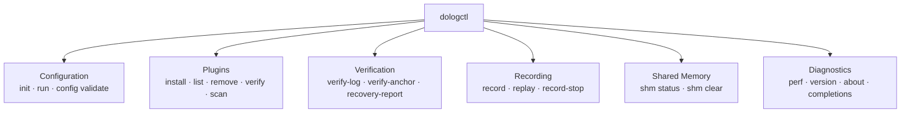

# DoLogger dologctl Command Reference

> 🌐 **语言 / Language**: [English](DologctlCommandReference.md) | [中文：dologctl 命令参考](../../zh_CN/guides/DologctlCommandReference.md)

> **Version**: v0.1.0 | **Last Updated**: 2026-08-13 | **Target Audience**: Operators, Integrators, Plugin Developers
>
> **Purpose**: The complete reference for the `dologctl` command-line tool. Every subcommand, option, exit code, and representative example, with output-format guidance for both human and machine consumers.

## Command Overview



## Invocation

```text
dologctl [GLOBAL OPTIONS] <COMMAND> [OPTIONS] [ARGUMENTS]
```

> [!NOTE]
> Usage synopses in `text` blocks throughout this document are **templates** (bracketed parts are placeholders), not literal commands. The `bash` blocks are literal examples verified against `dologctl <cmd> --help`.

Global options may appear **anywhere** on the command line (before or after the subcommand):

| Option | Values | Default | Description |
|:-:|:-:|:-:|:-:|
| `-o, --output` | `text`, `json` | `text` | Output format. `json` emits machine-readable JSON on stdout for every command that supports structured output. |
| `--color` | `auto`, `always`, `never` | `auto` | ANSI colour behaviour. `auto` enables colour on a TTY only. |
| `-q, --quiet` | — | off | Suppress non-error output. Verification commands exit silently on success. |
| `--licenses` | — | off | With `version` / `about`: print third-party license attributions instead of the banner. |

### Exit Codes

`dologctl` follows the ripgrep / git / cargo convention of a small, stable exit-code set:

| Code | Name | Meaning |
|:-:|:-:|:-:|
| `0` | `EXIT_SUCCESS` | Command completed successfully |
| `1` | `EXIT_ERR` | Generic error (I/O failure, invalid argument, plugin operation failed, missing or invalid config file passed to `config validate`) |
| `2` | `EXIT_VERIFY_FAILED` | Verification failed — the data did **not** pass integrity validation |
| `3` | `EXIT_CONFIG_ERR` | Configuration error — strict-mode invariant violation, or a missing/invalid config file reached through `run --dry-run` |

> [!NOTE]
> Scripts should treat exit code `2` as "the log is untrustworthy" rather than "the command crashed". It is a verification result, not an operational error.

---

## Configuration

### dologctl init

Generate a configuration file from a template in the current directory.

```text
dologctl init [--template dev|prod|audit]
```

| Option | Values | Default | Description |
|:-:|:-:|:-:|:-:|
| `-t, --template` | `dev`, `prod`, `audit` | `dev` | Template to generate |

| Template | Profile | Signature | Intended Use |
|:-:|:-:|:-:|:-:|
| `dev` | `dev` | off | Local development, maximum verbosity |
| `prod` | `prod-performance` | off | Production throughput, batch batching |
| `audit` | `prod-audit` | **on** | Compliance workloads with signed audit chain |

Examples:

```bash
dologctl init                        # dev template
dologctl init --template audit       # audit template with signing enabled
```

The command writes `dologger.toml` and **refuses to overwrite** an existing file (exit `1`).

### dologctl config validate

Validate a configuration file without starting the engine.

```text
dologctl config validate [--strict] [--config <path>]
```

| Option | Description |
|:-:|:-:|
| `-c, --config <path>` | Configuration file to validate (default lookup: `./dologger.toml`) |
| `--strict` | Enforce non-downgradable security invariants (signature, WORM, fsync, TLS, Ring 2 signing) — violations fail with exit `3` |

Examples:

```bash
dologctl config validate                        # default file, lenient
dologctl config validate --strict               # security invariants enforced
dologctl config validate -c /etc/dologger.toml --strict
```

### dologctl run

Run the DoLogger engine (v0.1.0 supports `--dry-run` validation and `--trace` timing modes only; the long-running foreground mode is not implemented yet).

```text
dologctl run [--dry-run] [--config <path>] [--trace]
```

| Option | Description |
|:-:|:-:|
| `-c, --config <path>` | Configuration file to load |
| `--dry-run` | Validate the configuration and exit without starting the engine |
| `--trace` | Enable per-record pipeline stage timing (diagnostic overhead — dev only) |

Examples:

```bash
dologctl run --dry-run --config dologger.toml   # validate config only
dologctl run --trace --config dologger.toml     # per-record pipeline timings (v0.1.0's actual run mode)
```

> [!NOTE]
> In v0.1.0 the long-running engine startup path is not yet wired up: plain `dologctl run` exits `1` with `Engine startup not yet implemented`. Use `--dry-run` for validation or `--trace` for a timed pipeline run.

---

## Plugins

### dologctl plugin install

Install a plugin from a local file path (`.dll`/`.so`/`.dylib`).

```text
dologctl plugin install <source>
```

```bash
dologctl plugin install ./target/release/formatter_json.dll
# pseudocode/illustrative — v0.1.0 install only accepts local file paths (fs::copy), not URLs
# dologctl plugin install https://plugins.example.com/formatter_json-v1.2.0.zip
```

Installed plugins are verified (ABI version, trust colour, symbol resolution) before they can be loaded. See [Plugin Development Guide](PluginDevelopmentGuide.md) for the trust model.

### dologctl plugin list

List installed plugins with trust colours and versions.

```text
dologctl plugin list [--trust-store <dir>]
```

```bash
dologctl plugin list
dologctl plugin list --output json        # machine-readable inventory
# A --trust-store applies the committed trust store and is authoritative over
# the DO_LOG_PLUGIN_TRUST_ANCHOR env var:
dologctl plugin list --trust-store plugins/official/trust-anchors
```

### dologctl plugin remove

Uninstall a plugin by name.

```text
dologctl plugin remove <name>
```

```bash
dologctl plugin remove formatter_json
```

### dologctl plugin verify

Verify plugin integrity: ABI version match, signature/trust colour, and symbol resolution.

```text
dologctl plugin verify [name] [--trust-store <dir>]
```

```bash
dologctl plugin verify                     # verify all installed plugins
dologctl plugin verify formatter_json            # verify one
# A --trust-store applies the committed trust store (active.pub + revoked.txt)
# and is authoritative over the DO_LOG_PLUGIN_TRUST_ANCHOR env var:
dologctl plugin verify --trust-store plugins/official/trust-anchors
```

Exit `0` = all verified; exit `2` = verification failed (tampered or incompatible plugin).

### dologctl plugin scan

Scan installed plugins for suspicious symbols (e.g. raw socket, `system()`, unbounded `memcpy`) and report a risk summary per plugin.

```text
dologctl plugin scan
```

### dologctl plugin keygen

Generate a new Ed25519 signing key pair (a 64-hex seed file) and print the
public key (the trust anchor). The seed is written with `0600` permissions on
POSIX systems.

```text
dologctl plugin keygen <path>
```

```bash
dologctl plugin keygen signing.key        # prints the public key (64 hex)
```

The printed public key is added to `plugins/official/trust-anchors/active.pub`;
the seed becomes the `DOLOGGER_PLUGIN_SIGNING_KEY` GitHub Actions secret (see
OperationsAndSecurity.md → Key Management).

### dologctl plugin sign

Sign a plugin library, writing a detached Ed25519 `<library>.sig` sidecar.
The seed is read from `--key <seed-file>`, `--wrapped-key <enc>` (prompts for
the AES-256-GCM passphrase), or `DO_LOG_PLUGIN_SIGNING_KEY`.

```text
dologctl plugin sign <library> [--key <seed> | --wrapped-key <enc>] [--require-2fa]
```

```bash
dologctl plugin sign libfoo.so signing.key
dologctl plugin sign libfoo.so --wrapped-key signing.key.enc
dologctl plugin sign libfoo.so --require-2fa      # force the TOTP gate
```

When `DO_LOG_PLUGIN_TOTP_SECRET` (base32) is set, every signature requires a
TOTP code from your authenticator app; `--require-2fa` forces the gate even
without the env var.

### dologctl plugin wrap-key / unwrap-key

Encrypt / decrypt a signing seed with AES-256-GCM under an SSH-style
passphrase. The passphrase comes from `DO_LOG_PLUGIN_KEY_PASSPHRASE` or an
interactive prompt; the wrapped file begins with the `DOLOGKEY1` magic.

```text
dologctl plugin wrap-key <seed> <out>
dologctl plugin unwrap-key <enc> <out>
```

```bash
dologctl plugin wrap-key signing.key signing.key.enc   # SSH-style passphrase
dologctl plugin unwrap-key signing.key.enc signing.key
```

### dologctl plugin totp

Show the current TOTP code for the plugin-signing 2FA secret, or print an
`otpauth://` URI to provision an authenticator app.

```text
dologctl plugin totp [secret] [--uri]
```

```bash
dologctl plugin totp --uri               # provisioning URI (from DO_LOG_PLUGIN_TOTP_SECRET)
dologctl plugin totp                     # current 6-digit code
```

---

## Verification

### dologctl verify-log

Verify a log file's audit chain offline: Ed25519 signatures, LSN continuity, and `prev_hash` linkage.

```text
dologctl verify-log <path> [--pubkey <hex>]
```

| Option | Description |
|:-:|:-:|
| `--pubkey <hex>` | Public key (64 hex chars) for signature verification. Omitted = structural verification only. |

```bash
dologctl verify-log audit.worm --pubkey "$(cat pubkey.hex)"
dologctl verify-log audit.worm --output json    # machine-readable verdict
```

Exit `0` = chain intact; exit `2` = tampering or discontinuity detected.

### dologctl verify-anchor

Verify an external anchoring JSON file (periodic root-hash anchors to immutable storage).

```text
dologctl verify-anchor <path> [--pubkey <hex>]
```

```bash
dologctl verify-anchor anchors/2026-08-13.json --pubkey "$(cat pubkey.hex)"
```

### dologctl recovery-report

Scan a directory of `*.worm` files and report LSN continuity across crash-restart boundaries.

```text
dologctl recovery-report [worm_dir]
```

```bash
dologctl recovery-report ./logs          # default: current directory
```

---

## Recording & Replay

### dologctl record

Generate synthetic SIF test records (pipeline integration testing).

```text
dologctl record <domain> --output-file <file> [--duration <secs>]
```

| Option | Description |
|:-:|:-:|
| `-f, --output-file <file>` | Output SIF file path |
| `-d, --duration <secs>` | Recording duration in seconds (default `10`) |

```bash
dologctl record smoke -f capture.sif -d 10
```

### dologctl replay

Replay records from a SIF file through the pipeline.

```text
dologctl replay <input> [--speed max|1]
```

| Option | Values | Default | Description |
|:-:|:-:|:-:|:-:|
| `-s, --speed` | `max`, `1` | `max` | `max` = full speed; `1` = real-time stall matching original timestamps |

```bash
dologctl replay capture.sif
dologctl replay capture.sif --speed 1
```

(Note: the input SIF file must be generated by `dologctl record`.)

### dologctl record-stop

Check the recording session status for a domain (the current implementation only checks status).

```text
dologctl record-stop <domain>
```

```bash
dologctl record-stop app
```

---

## Shared Memory

### dologctl shm status

Display metadata of a shared memory ring buffer region (header, slots, producer liveness flags).

```text
dologctl shm status <path>
```

```bash
dologctl shm status /dologger_test_full_5271.shm
dologctl shm status /dologger_test_full_5271.shm --output json
```

### dologctl shm clear

Clean up an orphaned shared memory region.

```text
dologctl shm clear <path> [--force]
```

| Option | Description |
|:-:|:-:|
| `--force` | Remove even if the producer is alive |

```bash
dologctl shm clear /dologger_test_full_5271.shm
dologctl shm clear /dologger_test_full_5271.shm --force   # dangerous — use with care
```

---

## Diagnostics

### dologctl perf

Run a local performance benchmark (single-thread push latency).

```text
dologctl perf [--count <n>] [--message-size <bytes>]
```

| Option | Default | Description |
|:-:|:-:|:-:|
| `--count <n>` | `100000` | Number of records to push |
| `--message-size <bytes>` | `80` | Message size in bytes (max `255` — inline record capacity) |

```bash
dologctl perf
dologctl perf --count 1000000 --message-size 255
```

### dologctl version / about

Print the project banner with version and system details.

```text
dologctl version
dologctl about
dologctl version --licenses          # third-party license attributions
```

### dologctl completions

Generate a shell completion script on stdout.

```text
dologctl completions <shell>
```

Supported shells: `bash`, `zsh`, `fish`, `powershell`, `elvish`.

```bash
source <(dologctl completions bash)
source <(dologctl completions zsh)
dologctl completions fish > ~/.config/fish/completions/dologctl.fish   # fish completions
dologctl completions powershell | Out-String | Invoke-Expression
```

> [!TIP]
> Persist completions in your shell profile so every new terminal has them:
> `dologctl completions bash > ~/.dologctl-complete.bash && echo 'source ~/.dologctl-complete.bash' >> ~/.bashrc`

---

## Scripting Guidance

- **JSON output**: pass `--output json` and parse with `jq` / `ConvertFrom-Json`. `--color never` avoids ANSI escapes in logs.
- **Verification in CI**: rely on exit code `2` semantics — `dologctl verify-log` + `if [ $? -eq 2 ]` gates deploys on chain integrity.
- **Config drift detection**: `dologctl config validate --strict` in a pre-commit or pre-deploy hook catches security-invariant regressions before they ship.

## Related Documents

- [Architecture Reference](../ArchitectureReference.md) — engine internals behind each command
- [Operations & Security](../OperationsAndSecurity.md) — operational playbooks using these commands
- [Integration Guide](../IntegrationGuide.md) — embedding the engine in applications
