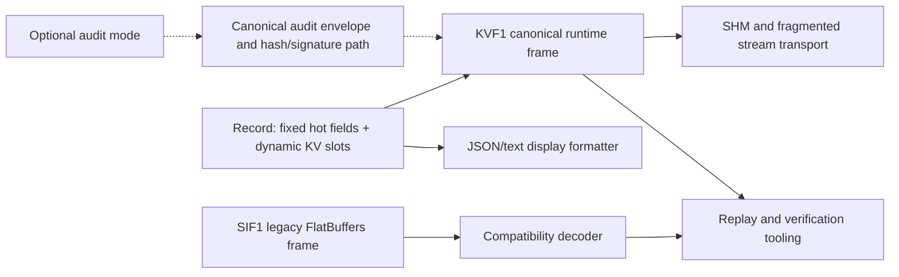

# KV Wire and SIF Compatibility Migration

> **Status**: Implemented runtime scaffold, not Record-milestone complete.
> **Audience**: core developers, sink authors, CLI and plugin maintainers.

## Executive decision

DoLogger uses two different concepts that should not be conflated:

- **KV** is the dynamic field organization inside `Record` and the versioned
  `KVF1` frame used by current runtime and shared-memory producers.
- **SIF** is the retained FlatBuffers compatibility format. It remains readable
  for older files, integrations, WORM archives, and migration tooling, but new
  runtime writers must not select it as their canonical frame.

KV does not delete SIF and SIF does not become a synonym for KV. The layering
is intentional: KV is the current hot-path contract; SIF is a compatibility
boundary; JSON and text remain display formats.

## Layered architecture

The codec layer owns framing, bounds, UTF-8 validation, code-page conversion at
text boundaries, and reusable buffers. Localization chooses messages and
fallback catalogs; it does not own persistence encoding. Audit is an explicit,
default-off scenario and must not be inferred from the presence of a KV frame.

## KVF1 runtime contract

`KVF1` is versioned and little-endian. It contains a fixed header, fixed record
metadata, a UTF-8 message, and tagged dynamic entries. The decoder validates
magic, version, declared lengths, field limits, names, UTF-8, closed value types,
duplicate tags, and optional content hashes before constructing a `Record`.

The current Rust entry points are:

- `record::wire::encode_record` — canonical producer encoding.
- `record::wire::decode_record_with` — bounded trusted or untrusted decoding.
- `record::wire::decode_any` — KV first, then explicit SIF compatibility path.
- `record::wire::FrameScanner` — length-prefixed fragmented stream input.
- `record::wire::ReusableEncoder` — one-producer reusable output storage.

The limits are defensive resource budgets, not a promise that every record may
consume the full budget. Callers handling untrusted shared memory must use the
untrusted decode options and must retain the returned validation errors.

## SIF compatibility rules

SIF remains in `core/sif/` because removing it would break old files and
external consumers. Its role is deliberately narrow:

1. Read old SIF frames during replay, verification, and migration.
2. Support integrations that have not yet adopted KVF1.
3. Preserve access to existing FlatBuffers/WORM data while a migration window
   is open.

New producers, including SHM runtime writers, use KVF1. A compatibility reader
must identify the decoded frame kind so callers cannot silently describe an SIF
input as a new KV frame. SIF removal requires a separate deprecation decision,
consumer inventory, and migration evidence; this round does not make that
claim.

## Plugin and sink guidance

Plugins may add dynamic fields through the Record field API, but no plugin may
replace canonical persistence framing, audit hashing, signing, or the FFI wire
contract. Formatters may produce JSON/text for presentation. Sinks that need a
binary Record transport should call the core KV encoder rather than duplicate
field ordering or length validation.

Text output uses the independent codec policy: explicit UTF-8, explicit Windows
code page, or automatic locale/platform detection with an observable UTF-8
fallback. Persisted KV and audit bytes are not passed through a display code
page conversion.

## Current acceptance state

Implemented in the current working tree:

- KVF1 encode/decode and strict validation.
- KV runtime path for SHM and CLI compatibility decoding.
- Fragmented frame scanner, reusable encoder, fuzz target, and integration
  coverage.
- Legacy SIF read path retained and explicitly identified.

Still open and therefore not a milestone claim:

- Full production call-graph evidence for every Record consumer.
- Final C ABI review and compatibility acceptance.
- Real TPM provider integration and hardware-backed audit evidence.
- Complete plugin integration tests for filter/processor dispatch.
- Full fuzz, benchmark, crash/restart, disk-full, and cross-platform gates.

See [Architecture Reference](../ArchitectureReference.md) for the public architecture. The DACS status, ADR-005, and acceptance evidence remain internal engineering records.