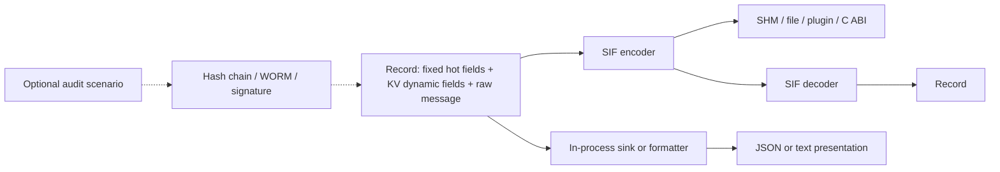

# KV and SIF Serialization Boundary

> **Status**: Foundational runtime contract; audit remains optional and
> default-off.
> **Audience**: core developers, sink authors, CLI and plugin maintainers.

## Decision

DoLogger uses two layers with different responsibilities:

- **KV** is the dynamic-field organization inside an in-memory `Record`.
- **SIF** is the neutral, bounded serialization and communication boundary.

The canonical path is:

```text
Record = fixed hot fields + KV dynamic fields + raw message bytes
Record --SIF encoder--> SIF bytes
```

SIF can be used for shared memory, files, plugins, C ABI calls, cross-process
transport, and conversion to other serialization formats. An in-process sink
may consume `Record` or a derived view directly and does not have to encode SIF.
JSON and text are presentation serializations, not canonical Record storage.

## Layered architecture



SIF framing validates magic, lengths, bounds, field names, closed value types,
duplicate tags, raw-message kind, and optional content hashes before building a
`Record`. The byte boundary is independent of locale, code pages, and display
encoding. Audit is an explicit scenario; the presence of SIF bytes never turns
audit on.

## Public Rust surface

The `dologger_core::sif` module owns the boundary:

- `encode_record` and `decode_record_with` serialize or restore one `Record`.
- `validate_frame_with` performs bounded structural validation.
- `FrameScanner` handles length-prefixed fragmented streams.
- `ReusableEncoder` reuses a producer buffer without changing ownership rules.
- `entries` exposes borrowed dynamic-entry views for inspection tooling.

The implementation is hand-written and KV-backed. The removed FlatBuffers
schema is not part of the current build or public contract.

## Sink and plugin guidance

Use SIF when bytes must cross a process, language, ABI, or durable-storage
boundary. Keep `Record` in process when that avoids needless serialization.
Plugins may add KV fields through the Record API, but they do not redefine SIF
framing, canonical hashing, signing, or the C ABI.

Display encoders may apply explicit UTF-8, explicit code-page, or automatic
platform/locale detection with observable UTF-8 fallback. They must not mutate
canonical SIF, raw messages, audit envelopes, hashes, or signatures.

## Open stubs

- Complete length-delimited raw-byte C ingestion ABI.
- Native locale and code-page adapters for every supported platform.
- Plugin-facing catalog provider ABI and catalog parser/reload limits.
- Cross-language SIF fixtures, fuzz coverage, and benchmark baselines.

These are tracked engineering stubs, not claims of completed localization,
plugin ABI, or cross-platform conversion support.
