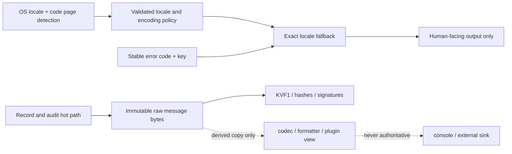

# DoLogger Localization and Log-Encoding Architecture

> **Status:** framework scaffold — catalog loading, OS-specific locale/code-page
> adapters, and full plugin catalog ABI remain staged work.

DoLogger separates **core encoding/decoding** from **localization**. Encoding is
a first-class core service used by byte ingestion, sinks, catalog files, and
display adapters. Localization only owns locale detection, catalog lookup, and
fallback. Error codes and message keys are the machine contract. A translated
message is a presentation-layer result and must never be used for branching,
signature input, WORM content, KVF1 canonical bytes, or audit verification.

## Design Source

The authoritative diagram source is
[`docs/assets/mmd/localization-architecture.mmd`](../../../assets/mmd/localization-architecture.mmd).
The generated SVG destination is reserved at
`docs/assets/svg/localization-architecture.svg`; generate it only through
`node peripheral/tools/mermaid-svg/render_architecture.mjs`.

## Contracts

### 1. Core encoding service

`dologger_core::codec` is independent of `dologger_core::localization` and is the
shared encoder/decoder boundary for future log and catalog formats:

- UTF-8 encode/decode is complete and platform-independent.
- Windows code-page encode/decode is explicit, validated, and rejects lossy
  conversion; non-Windows numeric code pages remain an explicit unsupported
  result until a safe codec backend is selected.
- `dologger_core::sys::io` consumes the core policy for console display, while
  file/WORM/SIF paths retain canonical bytes.

Localization calls this service only when reading catalog sources or producing
human-facing text. It does not own or redefine encoding policy.

### 2. Canonical internal representation

- `Record.message` is immutable-source raw bytes. Its payload kind is explicit:
  validated UTF-8, binary/unknown, or explicitly decoded text.
- KVF1, WORM envelopes, signatures, and content hashes use the raw bytes and
  payload kind. They never perform display transcoding.
- Codec, formatter, and plugin work creates bounded immutable derived views;
  it never mutates the authoritative Record in place.
- The legacy C string API remains strict UTF-8. Length-delimited byte APIs may
  use raw bytes without requiring a text encoding.

### 3. Locale detection precedence

The future runtime detector follows this order:

1. Explicit API/configuration locale.
2. `DOLOGGER_LOCALE`.
3. Platform locale APIs and standard locale environment (`LC_ALL`,
   `LC_MESSAGES`, `LANG`).
4. `en-US`.

Tags are normalized to a bounded BCP-47 subset. Invalid, non-ASCII, oversized,
or malformed tags are rejected rather than guessed.

### 4. Encoding detection and manual override

Input `AUTO` is opt-in, not an implicit fallback. Without an explicit caller
choice or `[encoding] input = "auto"`, byte ingestion must not guess. The
detector accepts only a uniquely validated result: BOM, strict UTF-8/UTF-16,
or exactly one caller-provided code-page candidate. Statistical “highest
confidence” guesses fail closed and preserve the raw bytes.

The encoding policy is independent from the language locale:

| Policy | Console | Pipe/file | Persisted log/audit |
|---|---|---|---|
| `auto` | Windows Unicode console API when available; otherwise detected native policy | UTF-8 | Canonical UTF-8/binary |
| `utf8` | UTF-8 bytes | UTF-8 | Canonical UTF-8/binary |
| `native` | Current OS/console encoding | UTF-8 | Canonical UTF-8/binary |
| explicit code page | Requested code page when supported | UTF-8 | Canonical UTF-8/binary |

Windows detection must read the console output code page and active ANSI code
page without changing global console state. POSIX/macOS detection reads the
locale/codeset environment first and may add platform-native adapters later.
Unknown code pages fail closed to UTF-8 display with a diagnostic; they never
silently reinterpret persisted bytes.

Encoding settings are restart-required configuration. Hot reload applies other
fields, retains the active encoding snapshot, and returns
`DO_LOG_ERR_CONFIG_RESTART_REQUIRED` so operators can see the partial result.

### 5. Fallback and catalogs

For a requested `zh-CN` locale, lookup order is `zh-CN → zh → en-US → stable
key`. A missing translation is therefore visible and deterministic. Catalogs
are validated before installation: UTF-8, no NUL bytes, bounded keys/messages,
safe key characters, and no duplicate keys.

The current Rust scaffold is `dologger_core::localization` plus
`dologger_core::codec`:

- `LocaleChain` normalizes and builds fallback chains.
- `MessageCatalog` stores validated immutable entries.
- `LocalizationRegistry` swaps catalogs outside the producer hot path.
- `dologger_error_key` exposes locale-independent keys to C callers.
- `encoding::detect` reads locale/codeset input and the platform console code
  page without changing global state.
- `sys::io::set_output_code_page` accepts a validated manual Windows console
  code page for `native` display mode; `dologctl --code-page 936` is the CLI
  entry point.

The parser format is intentionally not frozen in this scaffold. The planned
source format is Fluent-compatible for expressive plural/select messages, with
a compiled bounded catalog for runtime use. A gettext-compatible import path
may be added for plugin authors; it must compile into the same key/value
snapshot and cannot bypass validation.

### 6. Plugin boundary

Plugins receive stable keys and may provide catalog entries through a versioned
provider interface. Plugins do not translate audit records, change error
codes, or inject executable formatting logic. A plugin catalog is treated as
untrusted input and follows the same validation and size limits as a core
catalog.

### 7. Performance and security

- No locale lookup, lock, allocation, or transcoding occurs in `dologger_log`,
  record assembly, WORM writing, signing, or hash calculation.
- Human-facing translation is lazy and boundary-scoped. The current registry
  uses an immutable catalog snapshot behind a read/write lock; a later
  production optimization may replace this with an atomic snapshot after
  benchmarks prove the benefit.
- Catalog files are local and explicit; network fetching is out of scope.
- Formatting placeholders are data, not code. The future formatter must reject
  unknown fields and prevent path traversal, NUL injection, and unbounded
  expansion.
- On conversion failure, display output falls back to UTF-8 or a stable key;
  persisted bytes are never rewritten.

## Staged Work

| Stage | Scope | Status |
|---|---|---|
| E0 | Core UTF-8 codec, validation, and display code-page hook | scaffold landed |
| E1 | Canonical log/sink encoder and decoder integration | KVF1 raw-message path landed; new byte ABI TODO(author) |
| E2 | Windows/POSIX/macOS native codec adapters | Windows hook landed; full adapters TODO(author) |
| L0 | Error key catalog, locale chain, validated in-memory registry | scaffold landed |
| L1 | Wire locale policy and catalog selection into config/CLI | Encoding config landed; locale catalog selection TODO(author) |
| L2 | Compiled Fluent-compatible catalogs and reload-safe snapshots | TODO(author) |
| L3 | Versioned plugin catalog provider ABI | TODO(author) |
| L4 | Encoding/localization conversion benchmarks and fuzz suite | Raw KV and AUTO regression tests landed; broader suite TODO(author) |

## References

- Project Fluent specification: <https://projectfluent.org/fluent/>
- GNU gettext manual: <https://www.gnu.org/software/gettext/manual/>
- Unicode locale identifiers (BCP-47/CLDR): <https://unicode.org/reports/tr35/>
- ICU MessageFormat 2: <https://unicode-org.github.io/icu/userguide/format_parse/messages/>
