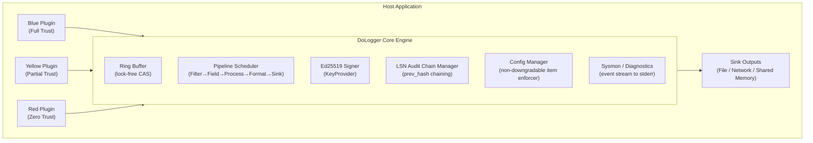

# DoLogger Security Whitepaper

> 🌐 **语言 / Language**: [English](SecurityWhitepaper.md) | [中文：安全白皮书](../../zh_CN/guides/SecurityWhitepaper.md)

> **Version**: v0.0.1 | **Last Updated**: 2026-08-12 | **Target Audience**: Security Engineers, Compliance Officers, Penetration Testers
>
> **Purpose**: This document provides a comprehensive security analysis of the DoLogger logging engine. It covers the threat model, cryptographic design, trust boundaries, sandbox architecture, supply chain security, data integrity protections, and compliance mapping for regulated environments.
>
> **Reading Path**: Security architects should read the entire document. Compliance officers may focus on [Compliance Mapping](#compliance-mapping) and [Configuration Security](#configuration-security-and-non-downgradable-items). Penetration testers should start with [Threat Model](#threat-model-stride) and [Known Limitations](#known-limitations-and-planned-improvements).

## Table of Contents

1. [Security Model Overview](#security-model-overview)
2. [Threat Model (STRIDE)](#threat-model-stride)
3. [Record Field Permission Rings](#record-field-permission-rings)
4. [Ed25519 Signatures and LSN Audit Chain](#ed25519-signatures-and-lsn-audit-chain)
5. [Plugin Trust Model and Sandbox Isolation](#plugin-trust-model-and-sandbox-isolation)
6. [Configuration Security and Non-Downgradable Items](#configuration-security-and-non-downgradable-items)
7. [Data Integrity Protection](#data-integrity-protection)
8. [Supply Chain Security](#supply-chain-security)
9. [Network Security](#network-security)
10. [Compliance Mapping](#compliance-mapping)
11. [Known Limitations and Planned Improvements](#known-limitations-and-planned-improvements)

---

## Security Model Overview

### Core Security Principles

DoLogger's security architecture is built on four principles, prioritized in order:

1. **Defense in Depth**: Multiple overlapping security mechanisms — field permission rings, cryptographic signatures, sandbox isolation, and non-downgradable configuration — ensure that a single control failure does not compromise the system.

2. **Least Privilege**: Plugins receive the minimum permissions necessary for their declared function. Access is gated by the three-color trust model, sandbox syscall filtering, and field permission rings.

3. **Non-Repudiation**: Audit-level log records are cryptographically signed with Ed25519 and linked via a hash chain (LSN audit chain), providing irrefutable evidence of what was logged, when, and by which engine instance.

4. **Integrity First**: The priority order for design decisions is: Security > Linux baseline performance > hot-path blue-plugin throughput > ecosystem safety. Security properties are never sacrificed for performance without an explicit, documented, and auditable decision.

### Trust Boundaries



### Security Design Decisions

| Decision | Rationale |
|:-:|:-:|
| Ed25519 over ECDSA | Faster signing (~17 us), smaller signatures (64 bytes), no RNG dependence, and well-reviewed constant-time implementation. |
| Ring 3 field integrity | Covered by the record `content_hash`; CRC32C remains an independent compatibility checksum. |
| seccomp-bpf over ptrace | Lower overhead, per-thread filtering, no TOCTOU races. `SECCOMP_RET_KILL_PROCESS` provides immediate termination on violation. |
| Lock-free ring buffer | Eliminates mutex contention on the hot path. CAS-based single-producer optimization for each calling thread. |
| SHA-256 for LSN chain | Well-understood preimage resistance. Second-preimage resistance binds each record to its predecessor. |

---

## Threat Model (STRIDE)

DoLogger's design has been analyzed against the STRIDE threat classification framework.

**Table 1: STRIDE Threat Analysis**

| Threat Category | Description | Mitigation | Implementation Status |
|:-:|:-:|:-:|:-:|
| **Spoofing**    | Forged log records or plugin identity | Ed25519 signature verification + plugin certificate validation | Implemented |
| **Tampering**   | Modification of committed log records | LSN hash chain + `prev_hash` linking + WORM file immutability | Implemented |
| **Repudiation** | Denial of log record authorship | Ed25519 non-repudiation signatures on every audit record | Implemented |
| **Information Disclosure** | Sensitive fields leaked to unauthorized plugins | Ring 0–3 permission control + field-level access gating | Implemented; auto-redaction Processor planned |
| **Denial of Service** | Log flooding overwhelming the system | Token-bucket rate limiter + backpressure control + circuit breaker pattern | Implemented |
| **Elevation of Privilege** | Red plugin escaping sandbox to gain system access | seccomp-bpf / AppContainer isolation + syscall allowlist | Implemented (basic framework) |

### Attack Vector Analysis

**Table 2: Attack Vector Risk Assessment**

| Attack Vector                      | Risk Level | Mitigation |
|:-:|:-:|:-:|
| Red plugin attempts `fork()`       | **CRITICAL** | seccomp-bpf intercepts, returns `SECCOMP_RET_KILL_PROCESS`. Plugin thread terminated. |
| Forged audit signature             | **CRITICAL** | Ed25519 with HSM-backed `KeyProvider`. Private key never in process memory accessible to plugins. |
| Log injection (CRLF / terminal escape) | **HIGH** | Automatic escaping of control characters and HTML entities. Configurable via `escape_html`. |
| Ring buffer overflow                | **MEDIUM**  | Emergency mmap spill buffer + configurable drop strategy (`drop_newest`, `below_warn`, etc.). |
| Configuration file tampering         | **HIGH**    | `config_lock` mode + non-downgradable items cannot be loosened at any configuration layer. |
| Sink man-in-the-middle (network)     | **HIGH**    | `require_tls` + certificate pinning for all network Sinks. |
| LSN chain break injection            | **MEDIUM**  | Gap detection marks missing LSNs; `dologctl verify-log` detects structural breaks. |
| Symlink attack on log file path       | **MEDIUM**  | `O_NOFOLLOW` on open; parent directory ownership verified before file creation. |
| Shared memory snooping (sink_shm)     | **LOW**     | SHM segments created with `0600` permissions; consumer must share UID. |

### Threat Actor Profiles

| Actor                    | Capability | Primary Targets |
|:-:|:-:|:-:|
| Malicious Red plugin     | Code execution within the engine process, sandbox escape attempts | Log tampering, data exfiltration, privilege escalation |
| Compromised host process | Reads/writes within the application's UID | Configuration tampering, log deletion, signature key theft |
| Network adversary        | Intercepts traffic between engine and remote Sinks | Log eavesdropping, injection, replay |
| Insider (privileged ops) | Root/sudo access on the log server | Mass log deletion, audit trail destruction |

---

## Record Field Permission Rings

DoLogger enforces a mandatory access control model on log record fields through four concentric permission rings. This is the first layer of defense in depth.

**Table 3: Record Field Permission Rings**

| Ring   | Name               | Write Permitted To                | Read Permitted To           | Integrity Protection |
|:-:|:-:|:-:|:-:|:-:|
| Ring 0 | Engine Core        | Core engine only                  | Formatter and Sink (read-only) | Ed25519 signature    |
| Ring 1 | System Trusted     | Core engine + `HostInfoProvider`  | All plugins (read-only)     | Ed25519 signature    |
| Ring 2 | Verified Plugins   | Blue and Yellow plugins           | All plugins                 | Ed25519 (configurable via `sign_ring2`) |
| Ring 3 | Untrusted Extensions| Any plugin (Red included)        | All plugins                 | `content_hash`       |

### Ring 0 — Immutable Engine Fields

These fields are set exactly once by the core engine at record creation time. **No plugin, regardless of trust color, may modify them.** Attempted writes are silently discarded and logged as a `RING0_WRITE_ATTEMPT` sysmon event.

| Field              | Type     | Description |
|:-:|:-:|:-:|
| `record.id`        | uint64   | Globally unique record identifier generated by a snowflake algorithm. |
| `record.timestamp` | uint64   | Monotonic wall-clock timestamp (nanoseconds since epoch) assigned at enqueue time. |
| `record.signature` | bytes[64]| Ed25519 signature over Ring 0 + Ring 1 fields (and Ring 2 if `sign_ring2=true`). |
| `record.origin_lsn`| uint64   | Log Sequence Number assigned at enqueue time. Monotonically increasing. |

### Ring 1 — System Context Fields

These fields provide the environmental context of the log record. They are written by the core engine and the `HostInfoProvider` plugin (a special Blue-tier plugin).

| Field               | Description |
|:-:|:-:|
| `host.name`         | Hostname of the machine. |
| `host.os`           | Operating system name and version. |
| `host.arch`         | CPU architecture (x86\_64, aarch64). |
| `process.id`        | PID of the host process. |
| `process.name`      | Executable name of the host process. |
| `process.thread_id` | TID of the calling thread. |
| `environment`       | Deployment environment tag: `production`, `staging`, `development`. |

### Ring 2 — Verified Extension Fields

Blue and Yellow plugins write to the `verified.*` namespace. Each write operation is audited (illustrative example of the audit_tags structure — the real field is a `RecordString` named `security.audit_tags`):

```json
{
  "verified.user_id": "u-12345",
  "verified.session_id": "sess-abcdef",
  "audit_tags": [
    {
      "plugin_id": "auth-field-provider",
      "plugin_version": "2.1.0",
      "timestamp": "2026-08-12T14:30:00.123Z",
      "action": "write",
      "field": "verified.user_id"
    }
  ]
}
```

The `audit_tags` array provides a tamper-evident record of which plugin modified which field and when. This is critical for forensic analysis.

### Ring 3 — Untrusted Extension Fields

Red plugins write to the `ext.*` namespace. These fields:

- Are covered by the record `content_hash`; CRC32C is not the security boundary.
- Are **excluded** from the Ed25519 signature coverage.
- May be silently dropped by a Filter plugin configured to distrust `ext.*` fields.
- Carry no `audit_tags` entries.

**Rationale**: Red plugins are zero-trust. Their output participates in the record content hash, but it is not included in the optional audit signature. Systems that require non-repudiation must enable the audit path and signature policy.

---

## Ed25519 Signatures and LSN Audit Chain

### Signature Coverage

Ed25519 signatures cover:

1. **Always**: All fixed hot fields (timestamp, level, message, pid, tid, LSN)
2. **Always**: All KV fields (deterministic serialization — same canonical
   order as the KV encoding spec, shared with the record encoding path)
3. **Never**: Heap addresses or other storage-layout details; only the overflow payload is canonicalized

The signing process (pseudocode — illustrative algorithm description):

```
1. Serialize covered fields in canonical KV order (tag+len+value).
2. Compute the content hash: content_hash = SHA-256(serialized_fields).
3. For per-record mode (default):
     sig = Ed25519_Sign(key, SHA-256(LSN ‖ content_hash ‖ prev_hash))
     store sig in the companion file audit.log.sig
   For block mode (optional, audit_block_size > 1):
     collect content_hash[i] for the block, build a Merkle root,
     sig_block = Ed25519_Sign(key, SHA-256(block_seq ‖ block_root))
```

### LSN Content-Hash Audit Chain

Each AUDIT record carries a 32B `content_hash` in-Record; the chain link is
derived from it (pseudocode — illustrative, not executable):

```
Record(N):
  lsn          = N
  content_hash = SHA-256(canonical_serialization(fixed_fields ‖ kv_fields))
  prev_hash    = SHA-256( Record(N-1).content_hash ‖ Record(N-1).lsn )

Record(N+1):
  lsn          = N+1
  content_hash = SHA-256(canonical_serialization(fixed_fields ‖ kv_fields))
  prev_hash    = SHA-256( Record(N).content_hash ‖ Record(N).lsn )
```

The 64B Ed25519 signature does **not** live in the Record — it is written
to the companion sidecar `audit.log.sig` (per-record mode: one 64B
signature per LSN; block mode: one signature per block). This keeps the
hot 256B structure free of cold-path crypto data while preserving
per-record non-repudiation.

**Threat coverage** (author ruling 2026-08-18):

| Threat | Layer | Mechanism |
|:-:|:-:|:-:|
| Memory tampering (runtime) | content_hash chain | Any mutation of a signed record breaks `prev_hash` continuity — detected on verify |
| Forgery (re-signing) | Ed25519 signature | Key is non-exportable inside the TPM; attacker cannot mint valid signatures |
| Disk tampering | WORM + chain | fsync + read-only permissions + chain re-verification |

**Verification algorithm** (pseudocode — illustrative, not executable):

```
verify_chain(records, sidecar):
  for i = 0 to len(records) - 1:
    1. Recompute content_hash[i] from canonical serialization;
       → FAIL if it does not match records[i].content_hash.

    2. If i > 0:
       expected_prev_hash = SHA-256(records[i-1].content_hash ‖ records[i-1].lsn)
       → FAIL if records[i].prev_hash != expected_prev_hash.

    3. Verify monotonic LSN:
       → FAIL if records[i].lsn <= records[i-1].lsn.

    4. Verify Ed25519 signature from the sidecar:
       per-record:  verify(sig[i], SHA-256(lsn ‖ content_hash ‖ prev_hash))
       block mode:  recompute Merkle root over block content_hashes,
                    verify the single block signature.

    5. If records[i].lsn > records[i-1].lsn + 1:
       → MARK as GAP (records[i-1].lsn+1 through records[i].lsn-1 are missing).
```

**Gap handling**: LSN gaps within a 200 ms reorder window are filled by the engine (out-of-order arrival). Gaps exceeding the window are marked with a `GAP_MARKER` record written into the WORM file. The `dologctl verify-log` tool reports all gaps.

Gaps are expected and non-malicious in two scenarios:
- Non-AUDIT records that do not carry an LSN.
- Emergency buffer spill events where a subset of records bypassed the normal LSN assignment.

### TPM-Backed Key (Phase 1)

The audit signing key is provisioned inside a hardware TPM:

| Platform | Backend | Status |
|:-:|:-:|:-:|
| Windows | CNG (TPM-based key, zero new dependencies) | Phase 1 |
| Linux | `tpm2-tss` | Phase 1 |
| macOS | Secure Enclave (equivalent hardware boundary) | Phase 1 |

Policy: `enable_signature = true` without an available TPM **refuses
startup with an explicit error** — no silent downgrade to a software key.
Phase 2+ (PCR measurement, attestation protocol, monotonic rollback
counter) is stubbed and deferred to a post-v1.0 review.

### Signature Granularity and Block-Size Gate

- **Default: per-record signing** — audit favors security over throughput.
- **Optional: block signing** — `audit_block_size > 1` enables Merkle-root
  block signatures for high-throughput audit deployments.
- **Gate**: a block size is only promoted to a documented default after an
  authoritative Criterion sweep (`sign_block_sweep`) on the real TPM
  backend. The theoretical curve (effective cost = TPM_time/N + SHA-256)
  suggests throughput saturates while latency/memory grow linearly, so the
  sweet spot must be measured, not assumed.

### WORM File Protection

Audit log files are protected with Write-Once-Read-Many (WORM) semantics (illustrative lifecycle):

```
File lifecycle:
1. Created:          /var/lib/dologger/audit/audit-000001.worm  (permissions 0600)
2. Active writing:   Engine appends records. fsync after each write.
3. Sealed:           chmod 0400 (Linux) / FILE_ATTRIBUTE_READONLY (Windows)
4. Archived:         Moved to cold storage. Read-only permissions persist.
```

The companion signature file `audit.log.sig` follows the same lifecycle and
must be archived alongside its WORM file — without it, offline
verification cannot check non-repudiation.

**Durability guarantee**: Each write is followed by `fsync()` (when `fsync_on_write = true`), providing MEDIA durability. A system crash after `fsync` returns will not lose the committed record.

**Immutability guarantee**: After sealing, the file permissions prevent modification by any process, including root (though root can `chmod` the file back — this is detectable via inode change time audit).

### Cryptographic Performance

Measured on AMD Ryzen 9 7950X, single core, Ed25519-dalek 2.0
(software path; TPM hardware latency is backend-dependent and measured on
the target platform):

| Operation              | Latency    | Throughput       |
|:-:|:-:|:-:|
| Ed25519 key generation | ~24 us     | ~41,000 keys/s   |
| Ed25519 signing        | ~16.96 us  | ~58,000 sigs/s   |
| Ed25519 verification   | ~48 us     | ~20,800 verifs/s |
| SHA-256 (64 bytes)     | ~120 ns    | ~8.3M hashes/s   |
| CRC32C (64 bytes)      | ~3 ns      | ~330M checks/s   |

AUDIT records additionally pay the TPM signing cost. Per-record mode is
bounded by TPM ops/s (discrete TPM2: tens of ms per op — measure on the
target backend); block mode amortizes this over the block size. The
content_hash chain itself costs ~120 ns–1 us per record (SHA-256), which
is the dominant in-engine overhead for audit records.

---

## Plugin Trust Model and Sandbox Isolation

### Three-Color Classification

**Table 4: Trust Tier Capability Matrix**

| Capability        | Blue (Full Trust)         | Yellow (Partial)          | Red (Zero Trust)          |
|:-:|:-:|:-:|:-:|
| **Identity**      | DoLogger team signed      | Third-party developer     | Community / unsigned      |
| **Sandbox**       | None                      | seccomp-bpf / AppContainer| Maximum isolation         |
| **Memory**        | Full access               | Allowed                   | Allowed                   |
| **File I/O**      | Full read/write           | Read + write allowed      | **Denied**                |
| **Network**       | Full access               | **Denied**                | **Denied**                |
| **Process spawn** | Allowed                   | **Denied**                | **Denied**                |
| **Signal**        | Allowed                   | Allowed                   | **Denied**                |
| **Field writes**  | Ring 2 (`verified.*`)     | Ring 2 (`verified.*`)     | Ring 3 (`ext.*`)          |
| **Signature req.**| Required (Ed25519)        | Recommended               | Not required              |

### seccomp-bpf Implementation (Linux)

The seccomp-bpf filter is installed per plugin load, before `plugin_init()` is called. The filter is thread-specific and applies to all threads the plugin creates.

**Table 5: Syscall Allowlist by Trust Color**

| Category        | Example Syscalls                                           | Blue | Yellow | Red  |
|:-:|:-:|:-:|:-:|:-:|
| Memory          | `mmap`, `munmap`, `mprotect`, `brk`, `madvise`             | Yes  | Yes    | Yes  |
| Threading       | `futex`, `clone`, `set_robust_list`, `get_robust_list`     | Yes  | Yes    | Yes  |
| Time            | `clock_gettime`, `gettimeofday`, `nanosleep`, `clock_nanosleep` | Yes | Yes | Yes |
| Synchronization | `futex`, `fadvise64`                                       | Yes  | Yes    | Yes  |
| Signal          | `rt_sigaction`, `rt_sigreturn`, `tgkill`, `rt_sigprocmask` | Yes  | Yes    | No   |
| System Info     | `uname`, `getpid`, `gettid`, `getrandom`, `getcpu`         | Yes  | Yes    | Yes  |
| File I/O        | `open`, `openat`, `read`, `write`, `close`, `lseek`, `fstat`, `fsync` | Yes | Yes | No |
| Network         | `socket`, `connect`, `bind`, `sendto`, `recvfrom`, `accept` | Yes  | No     | No   |
| Process         | `fork`, `vfork`, `execve`, `execveat`, `wait4`, `kill`     | Yes  | No     | No   |

**Violation behavior** (illustrative sequence):

```
1. Yellow/Red plugin thread calls fork()
2. seccomp-bpf filter matches: syscall number 57 (fork) is NOT in allowlist
3. Action: SECCOMP_RET_KILL_PROCESS
4. Thread is killed by the kernel with SIGSYS
5. Engine receives SIGSYS → maps to sandbox violation
6. sysmon emits: {"event":"SANDBOX_VIOLATION","plugin":"my-plugin","syscall":"fork","action":"KILL","tid":12345}
7. Plugin is marked as FAILED and unloaded
```

### Windows Sandbox (AppContainer)

Windows isolation uses LowBox Token with capability SID removal:

- **Yellow plugins**: Process token is converted to LowBox with `WIN://NO_NETWORK` and `WIN://NO_PROCESS_CREATION` capability SIDs withheld.
- **Red plugins**: Full AppContainer isolation. Only the `WIN://LOWBOX` base capability is present.

Full process-level isolation for Windows (spawning plugin code in a separate, contained child process) is not yet implemented.

### macOS Sandbox (App Sandbox)

Sandbox profiles applied via `sandbox_init(3)` with seatbelt/SBPL rules. Complete profile sets for each trust tier are planned.

### Implemented Security Tests (15 Items)

The following security test cases are implemented and run in CI:

| # | Test Case | Verifies |
|:-:|:-:|:-:|
| 1 | Ring 0 write attempted by Blue plugin | Write is silently discarded |
| 2 | Ring 1 write attempted by untrusted (Red) plugin | Write is silently discarded |
| 3 | Signature tampering detection | Modified signature fails Ed25519 verification |
| 4 | LSN field tampering detection | Modified LSN breaks prev\_hash chain |
| 5 | LSN chain break detection | Missing record creates detectable gap |
| 6 | Audit backpressure iron law | AUDIT records block under overflow per spec |
| 7 | Non-downgradable item bypass prevention | Loosening `enable_signature` via config reload is rejected |
| 8 | Backpressure drop strategy correctness | `below_warn` preserves WARN+ records |
| 9 | Rate limiter blocks excess | Token bucket correctly limits at configured rate |
| 10 | Ring buffer concurrent safety | Multi-threaded CAS enqueue produces no lost records |
| 11 | WORM gap detection and marking | LSN window exceeded → `GAP_MARKER` written |
| 12 | Gap marker timeout handling | Gaps older than timeout are permanently marked |
| 13 | Circular dependency attack prevention | Plugin load order DAG is verified acyclic |
| 14 | Ring 3 ext fields excluded from signature | Modifying `ext.*` does not invalidate Ed25519 sig |
| 15 | All non-downgradable items defined | Configuration validator rejects partial item lists |

---

## Configuration Security and Non-Downgradable Items

### Non-Downgradable Items

Six configuration items are designated as non-downgradable. They can only be **tightened** across configuration layers (e.g., `false` → `true`). Any attempt to loosen them (e.g., `true` → `false`) is rejected, and a `CONFIG_RELOAD_DENIED` sysmon event is emitted.

**Table 6: Non-Downgradable Security Items**

| Item              | Loosened State | Security Consequence |
|:-:|:-:|:-:|
| `enable_audit`   | `false`        | The isolated audit pipeline is disabled; AUDIT calls fail closed. |
| `enable_signature`| `false`       | Signed non-repudiation is disabled; unsigned hash-chain audit is not compliance output. |
| `escape_html`     | `false`        | Log injection attacks become possible. Terminal escape sequences and CRLF injection can hide or forge log output. |
| `durability`      | `os_cache`     | Audit log files become mutable. Historical records can be deleted or modified without cryptographic detection. |
| `fsync_on_write`  | `false`        | Crash durability is voided. In-flight audit records lost during a crash leave undetectable gaps. |
| `require_tls`     | `false`        | Network Sinks accept plaintext connections. Passive eavesdropping and active MITM attacks on log data in transit. |
| `sign_ring2`      | `false`        | Verified extension fields lose their cryptographic binding. `verified.*` fields can be modified undetectably. |

### Non-Downgradable Enforcement

Enforcement occurs at configuration merge time. The effective configuration is computed bottom-up (lower priority → higher priority). At each merge step, the non-downgradable items from the higher layer are compared against the lower layer (pseudocode — illustrative):

```
if lower.enable_signature == true AND higher.enable_signature == false:
    REJECT: CONFIG_RELOAD_DENIED
    effective.enable_signature = true  (lower layer wins)
```

This means a compliance template applied at the system level cannot be subverted by a project-local `dologger.toml` or by an environment variable.

### Compliance Templates

**Table 7: Compliance Template Activation**

| Template  | Path                         | Non-Downgradable Items Activated |
|:-:|:-:|:-:|
| GDPR      | `compliance/gdpr.toml`       | All 6 items (`true`)             |
| HIPAA     | `compliance/hipaa.toml`      | All 6 items (`true`)             |
| PCI DSS   | `compliance/pci-dss.toml`    | All 6 items (`true`)             |

Each compliance template sets all non-downgradable items to `true` with regulatory justification comments. Templates also enforce `level = "AUDIT"` and `performance_profile = "prod-audit"`.

**Applying a compliance template** (illustrative — the `config merge` subcommand and `--compliance` flag are planned, not shipped in v0.0.1; today you merge the TOML files yourself, e.g. keep the `[dologger]` section from `compliance/gdpr.toml`, and then run `dologctl config validate --strict`):

```bash
# Merge a compliance template into your base configuration
dologctl config merge \
    --base /etc/dologger/default.toml \
    --overlay compliance/gdpr.toml \
    --output /etc/dologger/gdpr-production.toml

# Verify the merged configuration
dologctl config validate \
    --config /etc/dologger/gdpr-production.toml \
    --compliance gdpr \
    --strict
```

---

## Data Integrity Protection

### Multi-Layer Integrity Architecture

**Table 8: Integrity Protection Layers**

| Layer             | Mechanism                                  | Performance Overhead | Protection Scope |
|:-:|:-:|:-:|:-:|
| KV overflow fields| `content_hash` canonical payload coverage           | Negligible           | Runtime tamper detection; CRC32C remains compatibility-only |
| Fixed + KV fields | content_hash chain (SHA-256, ~120 ns–1 us) | Low                 | Memory/runtime tamper detection |
| Non-repudiation   | Ed25519 signature (sidecar `audit.log.sig`; TPM-backed key) | Per-record: TPM ops/s bound; block mode: amortized | Forgery prevention |
| Audit chain       | SHA-256 prev_hash (~120 ns)                | Low (~120 ns)        | Chain-of-custody proof |
| WORM files        | `fsync` + read-only lock (I/O bound)       | Moderate             | Post-commit immutability |
| External anchor   | Periodic root hash publication (planned)        | N/A (offline)        | Long-term tamper resistance |

### Tamper Detection Workflow

```text
(illustrative example output — the summary numbers are fabricated;
verify-log takes a single file path plus the signature sidecar)
1. Operator runs: dologctl verify-log /var/lib/dologger/audit/audit-000001.worm \
                  --sidecar /var/lib/dologger/audit/audit-000001.sig

2. For each record in the WORM file:
   a. Parse the record binary format
   b. Recompute content_hash → FAIL if it does not match the stored value
   c. Verify prev_hash chain → PASS / FAIL / GAP
   d. Verify LSN monotonicity → PASS / FAIL
   e. Verify Ed25519 signature from the sidecar → PASS / FAIL

3. Summary report:
   Records: 100,000
   Content hashes valid:  99,998
   Signatures valid:      99,998
   Signatures INVALID:         2  ← SECURITY INCIDENT
   LSN gaps detected:           1  ← Missing records
   Chain intact:            99,997

4. External anchor verification (planned):
   - Fetch root hash from S3 anchor for the same LSN range
   - Compute local root hash (Merkle tree over all content hashes)
   - Compare → PASS / FAIL
```

### Log Injection Prevention

DoLogger automatically escapes control characters and HTML entities in log messages when `escape_html = true`:

| Input Character | Escaped Output |
|:-:|:-:|
| `<`             | `&lt;`         |
| `>`             | `&gt;`         |
| `\r` (CR)       | `\r` (literal backslash-r) |
| `\n` (LF)       | `\n` (literal backslash-n) |
| `\x1b` (ESC)    | `\e`           |

This prevents:
- **CRLF injection**: Attacker cannot inject fake log lines by embedding `\r\n` in a message field.
- **Terminal escape**: Attacker cannot inject ANSI escape sequences to hide or obscure log output.
- **Log-forging via HTML**: When logs are viewed in a web browser, injected HTML/JavaScript is neutered.

---

## Supply Chain Security

### Plugin Signature Verification

Blue plugins **MUST** be signed by the DoLogger team's Ed25519 key. The verification flow (illustrative sequence):

```
1. Engine discovers plugin at configured path
2. Loads shared library via dlopen
3. Calls plugin_query() → retrieves plugin_info (name, version, type)
4. Locates detached signature: <plugin_path>.sig
5. Verifies: Ed25519_Verify(doLogger_pubkey, plugin_library_bytes, signature)
6. If PASS: proceed to sandbox + plugin_init
7. If FAIL: dlclose + emit SIGNATURE_FAILURE sysmon event + skip plugin
```

**Public key distribution**: The DoLogger team Ed25519 public key is compiled into `libdologger_core`. It can be overridden via `KeyProvider` at startup.

### Dependency License Compliance

The project enforces SPDX-based license compliance via `cargo-deny`:

```bash
# CI enforcement
cargo deny check licenses
cargo deny check bans
cargo deny check advisories
cargo deny check sources
```

**Table 9: License Allow/Deny Policy**

| Category | SPDX Examples | Core Engine | Blue Plugin | Yellow Plugin | Red Plugin |
|:-:|:-:|:-:|:-:|:-:|:-:|
| A (Permissive) | MIT, Apache-2.0, BSD-2/3-Clause, ISC, Zlib | Allowed | Allowed | Allowed | Allowed |
| B (Weak Copyleft) | MPL-2.0, LGPL-3.0* | Allowed | Allowed | Allowed | Prohibited |
| C (Strong Copyleft) | GPL-2.0, GPL-3.0 | Prohibited | Prohibited | Prohibited | Prohibited |
| D (Network Copyleft) | BSL, SSPL, AGPL-3.0 | Prohibited | Prohibited | Prohibited | Prohibited |
| E (Proprietary) | Proprietary, no license | Prohibited | Prohibited | Prohibited | Prohibited |

\* LGPL-3.0 only when dynamically linked.

### Vulnerability Scanning

| Tool | Frequency | Scope |
|:-:|:-:|:-:|
| `cargo audit` | Every CI run | Known CVE in Rust dependency graph |
| `cargo deny check advisories` | Every CI run | RustSec advisory database |
| `cargo deny check bans` | Every CI run | Duplicate crate versions, wildcard deps |
| OSS-Fuzz (planned) | Continuous | Fuzz testing of record parsing, signature verification |

---

## Network Security

### Sink Transport Security

**Table 10: Sink Transport Security**

| Sink Type  | Transport       | Authentication              | Configuration |
|:-:|:-:|:-:|:-:|
| File       | Local FS        | Filesystem permissions (0600) | N/A |
| Syslog     | TCP/TLS (RFC 5425) | Optional mTLS | `require_tls = true` + client cert |
| Kafka      | TLS + SASL      | SASL/SCRAM-SHA-256 + broker cert | `sasl_mechanism = "SCRAM-SHA-256"` |
| Webhook    | HTTPS           | Bearer Token (`Authorization` header) | `bearer_token = "..."` |
| OTel       | HTTPS (OTLP/HTTP)| Bearer Token | `otel_headers = {"Authorization": "Bearer ..."}` |
| Shared Mem | Local only      | SHM permissions (0600), UID match | N/A |

### TLS Configuration

```toml
# (illustrative — not the shipped schema; the real Kafka sink config uses
# `brokers` as a comma-separated string plus `enable_tls` / `sasl_username` /
# `sasl_password` — see core/src/sink/kafka.rs)
[sinks.kafka]
type = "kafka"
brokers = ["kafka1.internal:9093"]
tls = true
tls_ca_file = "/etc/dologger/certs/ca.pem"
tls_cert_file = "/etc/dologger/certs/client.pem"
tls_key_file = "/etc/dologger/certs/client-key.pem"
tls_min_version = "1.2"
```

All TLS connections require TLS 1.2 or higher. TLS 1.0 and 1.1 are rejected at the protocol level.

### Control Plane Security

**Current:**
- HTTP listener bound to `127.0.0.1:9090`
- No authentication (localhost-only access)
- Recommended: host firewall restricts port 9090 to loopback

**Planned:**
- gRPC with mTLS for remote access
- JWT bearer token authentication
- Role-based access control (read-only observer vs. admin)

---

## Compliance Mapping

**Table 11: Regulatory Framework Mapping**

| Framework | Requirement | DoLogger Implementation | Status |
|:-:|:-:|:-:|:-:|
| **GDPR Art. 30** | Records of processing activities | WORM audit log + Ed25519 non-repudiation provides an immutable record of data processing events | Implemented |
| **GDPR Art. 32** | Security of processing | Encryption of data in transit (TLS), integrity protection (signatures + LSN chain), resilience (ring buffer + emergency spill) | Implemented |
| **GDPR Art. 5(1)(f)** | Integrity and confidentiality | Ed25519 signatures verify integrity; Ring permission model enforces confidentiality | Implemented |
| **HIPAA 164.312(b)** | Audit controls | Audit domain isolation + Ed25519 signatures + LSN chain provide a complete audit trail of ePHI access | Implemented |
| **HIPAA 164.312(c)(2)** | Integrity controls | Cryptographic mechanism (Ed25519) to corroborate that ePHI audit records have not been altered | Implemented |
| **HIPAA 164.312(e)(1)** | Transmission security | TLS 1.2+ enforced for all network Sinks when `require_tls = true` | Implemented |
| **PCI DSS 10.2** | Automated audit trails | LSN chain + WORM provides automated, immutable audit trail of all access to cardholder data | Implemented |
| **PCI DSS 10.5** | Secure audit trails | Cryptographic signatures (10.5.1-10.5.2), WORM immutability (10.5.5), centralized log server forwarding (10.5.3-10.5.4) | Implemented |
| **PCI DSS 4.1** | Strong cryptography for transmission | TLS 1.2+ required for all network Sinks | Implemented |
| **SOC 2 CC7.2** | Monitoring anomalous activity | sysmon event stream provides real-time visibility into pipeline health, sandbox violations, and signature failures | Implemented |
| **ISO 27001 A.12.4** | Logging and monitoring | Signed + encrypted + WORM-protected log records with LSN chain-of-custody | Implemented |

### Compliance Validation

```bash
# (illustrative — the `--compliance` flag and `compliance report` subcommand
# are planned, not shipped in v0.0.1; use `dologctl config validate --strict`
# with a config containing the template's [dologger] settings instead)
# Validate configuration against GDPR requirements
dologctl config validate --config /etc/dologger/default.toml --compliance gdpr

# Validate configuration against PCI DSS requirements
dologctl config validate --config /etc/dologger/default.toml --compliance pci-dss

# Export compliance report
dologctl compliance report \
    --config /etc/dologger/default.toml \
    --framework gdpr \
    --output gdpr-compliance-report.json
```

---

## Known Limitations and Planned Improvements

### Current Limitations

| Limitation | Impact | Mitigation | Target |
|:-:|:-:|:-:|:-:|
| **SIF format** | Uses a simplified binary frame format | Full FlatBuffers SIF with schema evolution is planned | Planned |
| **Process isolation** | Yellow/Red plugins run in-process with seccomp filter | Full child-process isolation with IPC is planned | Planned |
| **External anchoring** | No external root hash publication | S3/HTTP anchor proof for long-term tamper resistance | Planned |
| **Secret detection** | No automatic PII/password detection in log messages | Auto-redaction Processor with regex + ML patterns | Planned |
| **Key rotation** | No key rotation mechanism | CRL (Certificate Revocation List) + multi-key parallel verification | Planned |
| **Multi-producer ring buffer** | Single CAS cursor contended under >8 threads | Sharded ring buffer with per-thread partitions | Planned |
| **Plugin hot reload** | Plugins require engine restart to load/unload | Dynamic plugin load/unload without restart | Planned |
| **Metrics export** | Control plane `/status` only; no Prometheus endpoint | Prometheus `/metrics` endpoint with histograms | Planned |

### Security Audit Roadmap

| Task | Target |
|:-:|:-:|
| OSS-Fuzz integration — 24 hours crash-free | Next milestone |
| Sandbox escape test suite across all 3 platforms (Linux, Windows, macOS) | Next milestone |
| Penetration testing: signature bypass, LSN injection, ring buffer race conditions | Next milestone |
| Third-party security audit by an external firm | Next milestone |
| Formal verification of LSN chain cryptographic properties | Future |
| FIPS 140-3 validation for Ed25519 module (if required by customer base) | Future |

### Responsible Disclosure

Security vulnerabilities in DoLogger should be reported to `nekoliowork+DoLogger@gmail.com`. Please do not file public issues for security-sensitive bugs. The project follows a 90-day disclosure deadline. Critical vulnerabilities (RCE, sandbox escape, signature bypass) will be patched within 7 days of confirmation.

**Bug Bounty**: A bug bounty program covering the DoLogger core engine, official plugins, and `dologctl` CLI is planned.
