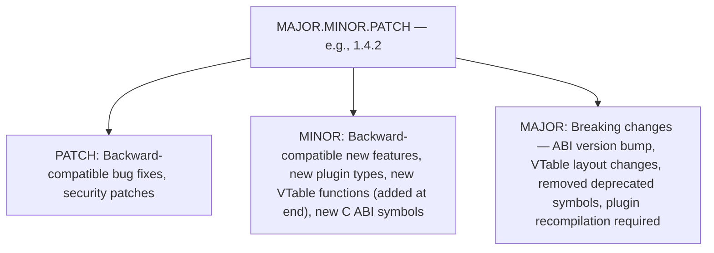
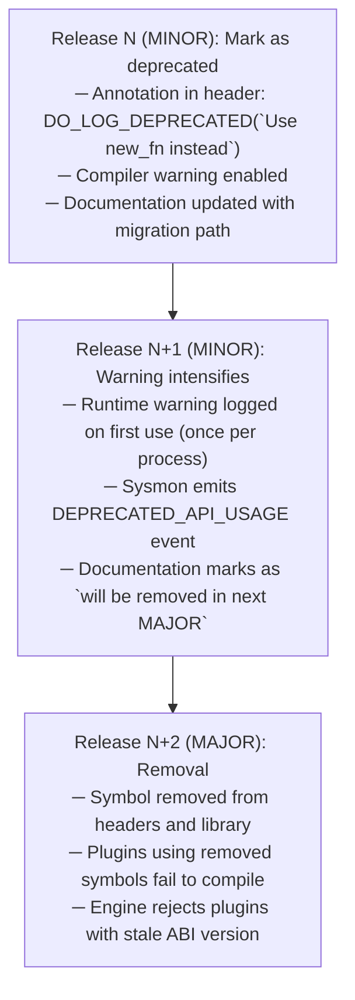
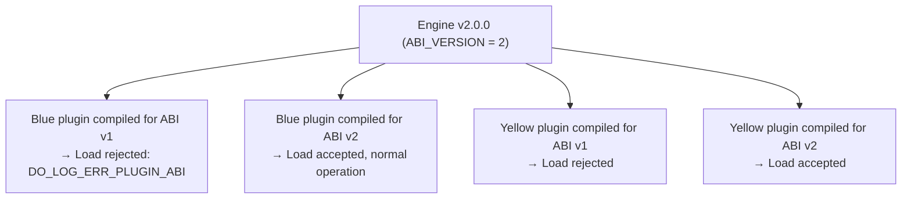
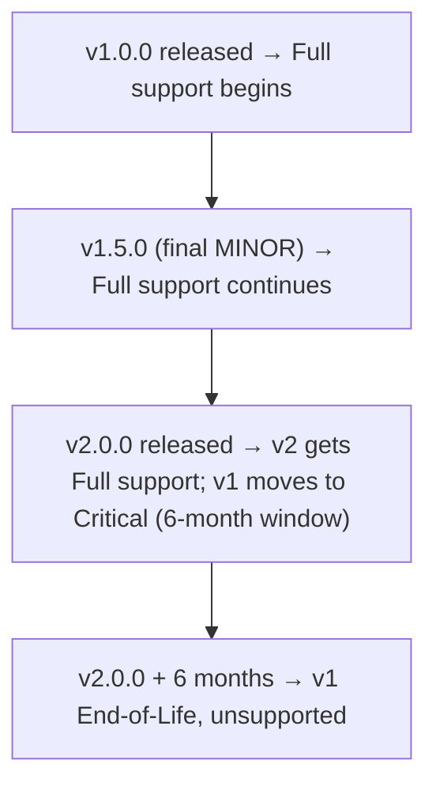

# DoLogger Versioning & Deprecation Policy

> 🌐 **语言 / Language**: [English](VersioningAndDeprecation.md) | [中文：版本管理与弃用策略](../../zh_CN/guides/VersioningAndDeprecation.md)

> **Version**: v0.1.0 | **Last Updated**: 2026-08-12 | **Target Audience**: Plugin Developers, Core Contributors, Integrators
>
> **Purpose**: This document defines the versioning scheme, ABI compatibility guarantees, deprecation process, and migration expectations for the DoLogger project. It is the authoritative reference for what changes are permitted in each release type and how users should plan upgrades.
>
> **Reading Path**: All plugin authors and integrators should read [Semantic Versioning](#semantic-versioning) and [Deprecation Process](#deprecation-process). Core contributors should also read [ABI Compatibility Guarantees](#abi-compatibility-guarantees) and [Release Procedures](#release-procedures). Operators managing plugin fleets should start with [Plugin Compatibility](#plugin-compatibility).

## Table of Contents

1. [Semantic Versioning](#semantic-versioning)
2. [ABI Compatibility Guarantees](#abi-compatibility-guarantees)
3. [Deprecation Process](#deprecation-process)
4. [Plugin Compatibility](#plugin-compatibility)
5. [Migration Guides](#migration-guides)
6. [Release Procedures](#release-procedures)
7. [Supported Versions and End-of-Life](#supported-versions-and-end-of-life)

---

## Semantic Versioning

DoLogger follows **Semantic Versioning 2.0.0** (`MAJOR.MINOR.PATCH`). The version number encodes the scope and impact of changes in each release.

### Version Number Format



### What Each Bump Means

**Table 1: Version Change Impact**

| Bump   | ABI Compatible? | Plugin Recompile? | Config Compatible? | Risk Level |
|:-:|:-:|:-:|:-:|:-:|
| PATCH  | Yes             | No                | Yes                | Minimal    |
| MINOR  | Yes             | No                | Yes                | Low        |
| MAJOR  | **No**          | **Required**      | May require changes| High       |

### Examples of Changes by Type

**PATCH (e.g., 1.4.1 to 1.4.2):**

- Fix a memory leak in the ring buffer consumer
- Correct a CRC32C computation edge case
- Security patch for a sandbox bypass in seccomp-bpf rules
- Documentation updates
- Internal refactoring that does not change any public symbol

**MINOR (e.g., 1.4.0 to 1.5.0):**

- Add a new VTable function pointer at the **end** of an existing VTable struct (backward compatible — existing plugins have `NULL` there)
- Add a new C ABI function (e.g., `dologger_record_set_tags()`)
- Introduce a new plugin type (e.g., plugin type #10)
- Add a new configuration key with a safe default
- Performance improvements that do not change public interfaces
- Deprecate a symbol with a warning (removal only in next MAJOR)

**MAJOR (e.g., 1.x to 2.0.0):**

- Remove deprecated C ABI functions or VTable function pointers
- Change the layout, size, or field order of any VTable struct
- Change the layout of `dologger_plugin_info_t`, `dologger_record_t`, or any public struct
- Alter the signature of any C ABI function or VTable callback
- Bump `DO_LOG_ABI_VERSION`
- Remove or rename configuration keys without backward-compatible aliasing

---

## ABI Compatibility Guarantees

### The ABI Contract

The ABI gate ensures plugins and hosts are compiled against a compatible ABI. The engine **refuses to load** a plugin whose `abi_version` does not match the running engine's version. In the current implementation this is the `abi_version` field of `dologger_plugin_info_t` (checked against `CORE_ABI_VERSION`, `0x000100` in v0.1.0); `plugin_query` receives `uint32_t core_abi_version` as its parameter.

```c
// (pseudocode — illustrative, not compiled; the real gate is the abi_version
// field of dologger_plugin_info_t, see dologger_core.h)
#define DO_LOG_ABI_VERSION 1   // conceptual macro — bumped on every MAJOR release

// Every plugin reports its compiled-against ABI version
const dologger_plugin_info_t *plugin_query(uint32_t core_abi_version) {
    static dologger_plugin_info_t info = {
        .abi_version = DO_LOG_ABI_VERSION,
        // ...
    };
    return &info;
}
```

### Guarantees Within a MAJOR Version

**Table 2: ABI Stability Guarantees**

| Guarantee | Description |
|:-:|:-:|
| **VTable layout stable** | Existing VTable fields retain their offset, size, and type. New optional function pointers may be **appended** (with `NULL` as the implicit default for un-updated plugins). |
| **C ABI symbols additive only** | New `dologger_*` functions may be added. Existing function signatures do not change. No existing symbol is removed. |
| **Struct field ordering preserved** | Public structs (`dologger_record_t`, `dologger_plugin_info_t`, `dologger_plugin_config_t`) do not change field order or remove fields. New fields may be added at the end. |
| **Error codes stable** | Existing `dologger_error_t` values retain their numeric code and semantic meaning. New codes may be added in new ranges. |
| **Configuration keys stable** | Existing TOML keys retain their meaning. New keys are added with safe defaults. Deprecated keys continue to work with a warning. |

### What Requires a MAJOR Bump

Any of the following triggers a MAJOR version increment:

1. **VTable struct layout change** — adding, removing, or reordering fields (except appending at the end for optional functions)
2. **Removal of any public C ABI symbol** — even a deprecated one
3. **Signature change** — altering parameter types, return types, or calling convention of any public function
4. **Struct layout change** — altering `dologger_plugin_info_t`, `dologger_record_t`, or any struct passed across the ABI boundary
5. **ABI version integer bump** — incrementing `DO_LOG_ABI_VERSION`
6. **Behavioral breaking change** — altering the documented semantics of an existing function in a way that could break correct callers

### The C ABI Stability Promise

The C ABI is the **universal interface** for DoLogger. It is designed for long-term stability:

- **Same-MAJOR**: Host binaries and plugins compiled against any MINOR.PATCH within the same MAJOR are guaranteed to interoperate. A plugin compiled for 1.2.0 works with a host running 1.5.3.
- **Cross-MAJOR**: Not supported. A plugin compiled for 1.x will be rejected by a 2.x engine with a clear `DO_LOG_ERR_PLUGIN_ABI` error.
- **Rust crate API**: The `dologger-core` Rust crate follows the same semver rules but may have additional source-level breakage in MINOR releases (the C ABI is the stability anchor).

---

## Deprecation Process

DoLogger follows a **3-release deprecation cycle** to give plugin authors and integrators time to adapt.

### Deprecation Timeline



### Deprecation Macros

```c
// (pseudocode — illustrative, not compiled: these macros and function names do
// not exist in dologger_core.h yet; the pattern will be adopted when the first
// symbol is deprecated. `__attribute__` is GCC/Clang syntax — MSVC requires
// `__declspec(deprecated(msg))` instead)
// Mark a function as deprecated in the C header
#define DO_LOG_DEPRECATED(msg)  __attribute__((deprecated(msg)))

// Usage in dologger_core.h:
DO_LOG_DEPRECATED("Use dologger_record_set_tags() instead — removed in v2.0")
int dologger_record_set_field(dologger_record_t *record,
                               const char *key,
                               const char *value);

// Companion function that replaces it:
int dologger_record_set_tags(dologger_record_t *record,
                              const dologger_tags_t *tags);
```

### Deprecated Configuration Keys

When a configuration key is deprecated:

1. **MINOR N**: The key continues to work. A `DEPRECATED_CONFIG_KEY` sysmon event is emitted at startup listing the deprecated key and its replacement.
2. **MINOR N+1**: The key continues to work but emits a **WARN**-level sysmon event.
3. **MAJOR**: The key is removed. The configuration validator rejects it with `DO_LOG_ERR_CFG_PARSE` and a clear error message naming the replacement key.

```toml
# (illustrative example — no keys are deprecated pre-1.0; syntax only, not a
# schema accepted by the current validator)
# Example: deprecated key migration
# Old (deprecated in 1.3, removed in 2.0):
sink_type = "console"

# New (since 1.3):
[sinks.console]
type = "console"
```

### Deprecation Table

**Table 3: Active Deprecations (as of v1.0)**

| Deprecated Symbol / Key | Introduced | Warning Since | Removal Target | Replacement |
|:-:|:-:|:-:|:-:|:-:|
| *(none yet — project is pre-1.0)* | — | — | — | — |

---

## Plugin Compatibility

### What Happens When the ABI Version Changes

When the engine's `DO_LOG_ABI_VERSION` is bumped (MAJOR release), all plugins **must** be recompiled:



The error message is explicit:

```text
(illustrative — planned error message format, not actual output)
[ERROR] Plugin 'json-formatter' (v1.2.0) compiled against ABI version 1,
        but engine requires ABI version 2.
        Recompile the plugin against dologger_core >= 2.0.0.
```

### Plugin Version vs Engine Version

Plugins have their **own** independent version (declared in `PluginManifest.toml`). The engine version and plugin version are separate:

```text
(illustrative example output)
Engine:     2.1.0        (version of libdologger_core)
Plugin A:   1.5.0        (version of json-formatter)
Plugin B:   3.2.1        (version of kafka-sink)
```

Compatibility is determined solely by `abi_version` matching — not by any comparison of version numbers.

### Compatibility in `PluginManifest.toml`

Plugins declare their ABI/version compatibility in the manifest. The schema shipped in v0.1.0 uses `[plugin]` keys (`abi_version`, `min_core_abi` — see `plugins/official/*/PluginManifest.toml`); a range-based `[compatibility]` section is the intended policy for later releases:

```toml
# (illustrative — proposed schema, not yet parsed by the current engine;
# v0.1.0 manifests declare `abi_version = 1` and `min_core_abi = "0.1.0"`
# under [plugin] instead)
[compatibility]
min_engine_version = "1.0.0"     # Minimum MAJOR.MINOR.PATCH required
max_engine_version = "2.0.0"     # Exclusive upper bound (this MAJOR series)
```

The engine validates at load time (v0.1.0 enforces `abi_version` equality; the range checks below are the intended policy):

| Condition | Result |
|:-:|:-:|
| `engine_version >= min_engine_version` AND `engine_version < max_engine_version` | Plugin loads |
| `engine_version < min_engine_version` | Rejected — engine too old |
| `engine_version >= max_engine_version` | Rejected — engine too new (ABI likely changed) |

### Plugin Dependency Versioning

Plugins that depend on other plugins (e.g., a `Sink` depending on a `Formatter`) will express this in `PluginManifest.toml`:

```toml
# (illustrative — proposed schema, not yet parsed by the current engine;
# v0.1.0 implements field-level dependencies via `requires_fields` instead)
[dependencies]
requires_plugins = [
    { name = "json-formatter", version = ">=1.0, <2.0" }
]
```

The version constraint uses Cargo-style semver ranges. The engine validates the dependency graph at startup and fails fast if constraints are unsatisfied.

---

## Migration Guides

### Policy for Migration Documentation

Every MAJOR release is accompanied by a migration guide published in this directory:

```text
(illustrative directory layout)
docs/en_US/guides/migration/
├── v1-to-v2.md     # Migration guide from 1.x to 2.0
└── v2-to-v3.md     # Migration guide from 2.x to 3.0
```

Each migration guide covers:

1. **ABI changes**: VTable layout changes, removed symbols, renamed functions
2. **Configuration migration**: Deprecated keys, renamed sections, new required fields
3. **Plugin changes**: What plugin authors must update (code examples for before/after)
4. **Behavioral changes**: Runtime semantics that differ (e.g., default drop strategy changed)
5. **Checklist**: Step-by-step upgrade procedure with verification commands

### Migration Pattern

A typical migration follows this pattern (illustrative pattern — not a literal script; replace the package line with your platform's install method):

```bash
# 1. Read the migration guide for the target version
# 2. Update the engine library
sudo apt install dologger-core=2.0.0

# 3. Recompile all plugins against the new headers
cargo build --release --manifest-path plugins/my-plugin/Cargo.toml

# 4. Validate the new configuration
dologctl config validate --config dologger.toml --strict

# 5. Run the test suite
cargo test

# 6. Deploy with a canary first, then roll out
```

### Backward Compatibility Commitment

DoLogger commits to the following backward compatibility windows:

**Table 4: Compatibility Windows**

| Component | Compatibility Window | Policy |
|:-:|:-:|:-:|
| C ABI | Until next MAJOR | No breaking changes within a MAJOR series |
| Configuration files | Until next MAJOR | Deprecated keys work until the next MAJOR |
| WORM file format | Indefinite | New engines can read old WORM files |
| SIF binary format | Indefinite | New engines can parse old SIF records |
| Plugin VTable (core types 1-7) | Until next MAJOR | VTable layout stable within MAJOR |
| Plugin VTable (support types 8-9) | Until next MAJOR | VTable layout stable within MAJOR |

---

## Release Procedures

### Release Cadence

| Release Type | Cadence | Example Version | Artifacts |
|:-:|:-:|:-:|:-:|
| PATCH | As needed (security: 7 days) | 1.4.1 → 1.4.2 | Shared libraries, headers, crates |
| MINOR | ~6-8 weeks | 1.4.0 → 1.5.0 | All PATCH artifacts + release notes |
| MAJOR | ~12-18 months | 1.x → 2.0.0 | All MINOR artifacts + migration guide |

### Pre-Release Tags

Pre-release versions follow the semver pre-release convention:

```text
(illustrative example versions)
2.0.0-alpha.1      ← First alpha of v2.0
2.0.0-beta.1       ← First beta of v2.0
2.0.0-rc.1         ← First release candidate
2.0.0              ← Stable release
```

Pre-releases are **not** covered by the ABI stability guarantee. The ABI may change between `2.0.0-alpha.1` and `2.0.0-alpha.2`.

### Release Checklist

Every release must pass:

- [ ] All unit tests pass on Linux (x86\_64, aarch64), macOS (x86\_64, aarch64), Windows (x86\_64)
- [ ] `cargo bench` shows no regression exceeding 5%
- [ ] `cargo deny check` passes (licenses, advisories, bans, sources)
- [ ] `cargo audit` reports zero unpatched vulnerabilities
- [ ] `cargo clippy` with `--deny warnings` passes
- [ ] All 15 security tests pass (see [Security Whitepaper](SecurityWhitepaper.md#implemented-security-tests-15-items))
- [ ] Plugin ABI compatibility test: engine loads plugins from previous MINOR
- [ ] Configuration backward compatibility test: previous version's config parses without error
- [ ] MAJOR only: Migration guide written and reviewed

### Git Tagging Convention

```bash
# (illustrative examples — do not run; the tag names are placeholders)
# Tags follow the pattern:
git tag -a v1.4.2 -m "Release v1.4.2 — security patch for CVE-2026-XXXXX"
git tag -a v1.5.0 -m "Release v1.5.0 — new built-in sink"
git tag -a v2.0.0 -m "Release v2.0.0 — ABI version 2, see migration guide"
```

---

## Supported Versions and End-of-Life

### Support Policy

**Table 5: Version Support Matrix**

| Version Track | Support Level | Security Patches | Bug Fixes | EOL |
|:-:|:-:|:-:|:-:|:-:|
| Latest MAJOR (N) | **Full** | Yes | Yes | — |
| Previous MAJOR (N-1) | **Critical** | Security only | No | 6 months after N release |
| N-2 and older | **None** | No | No | Immediately on N release |

### Example Support Timeline



### Pre-1.0 Policy

Before the 1.0.0 release, the project is in a **development phase**. The following modified rules apply:

- MINOR bumps (0.1.0 to 0.2.0) **may** include breaking changes — treat them like MAJOR bumps
- The ABI version may change on any MINOR
- Deprecation may be shortened or skipped
- All users should pin to an exact version in this phase

The first stable release (1.0.0) will mark the beginning of the full compatibility guarantee.

### Reporting Compatibility Issues

If you encounter a compatibility issue that violates this policy, file a bug report with the version and system details captured by:

```bash
dologctl version
dologctl about --output json > compatibility-info.json
```

Attach the diagnostic archive and describe:
1. Engine version (`dologger_version()` output)
2. Plugin version and ABI version
3. Expected behavior vs observed behavior
4. Any error messages from `dologger_internal.log`

Report compatibility issues through the project's issue tracker with the `compatibility` label.
