# DoLogger 架构参考手册

> **版本**：v0.1.0 | **最后更新**：2026-08-12 | **目标读者**：核心开发者、插件作者、系统工程师
>
> **用途**：DoLogger 引擎内部的权威参考——管道架构、无锁数据结构、加密审计链、安全模型、接收器扇出、背压机制与性能调优。阅读前请先熟悉[集成指南](IntegrationGuide.md)。
>
> 🌐 **语言 / Language**: [中文](ArchitectureReference.md) | [English: Architecture Reference](../en_US/ArchitectureReference.md)
>
> **阅读路径**：从[管道架构](#管道架构)图开始，然后深入你感兴趣的领域。插件开发者应重点关注[插件 VTable 规范](#插件-vtable-规范)。

---

## 目录

1. [开始之前](#开始之前)
2. [管道架构](#管道架构)
3. [环形缓冲区设计与无锁保证](#环形缓冲区设计与无锁保证)
4. [审计链：Ed25519 + LSN + prev_hash](#审计链ed25519--lsn--prev_hash)
5. [安全模型：Ring 0-3 权限与三色信任](#安全模型ring-0-3-权限与三色信任)
6. [接收器扇出与回退链](#接收器扇出与回退链)
7. [背压系统](#背压系统)
8. [紧急缓冲区与恢复](#紧急缓冲区与恢复)
9. [线程池架构](#线程池架构)
10. [插件 VTable 规范](#插件-vtable-规范)
11. [SIF 二进制格式概述](#sif-二进制格式概述)
12. [性能基准与调优](#性能基准与调优)

---

## 开始之前

### 前置知识

- 熟悉无锁并发编程（CAS、原子序）
- 理解 Rust 所有权模型与 FFI
- 了解 Ed25519 签名与 SHA-256 哈希链
- 阅读[集成指南](IntegrationGuide.md)了解应用层用法

### 关键术语

| 术语 | 定义 |
|:-:|:-:|
| **Record（记录）** | 流经引擎的单条日志条目 |
| **Ring buffer（环形缓冲区）** | 无锁 MPSC 队列，用于生产者到消费者的传递 |
| **Pipeline（管道）** | 7 级处理链：PreFilter -> Filter -> Field -> Assembly -> Process -> Format -> Sink |
| **Object pool（对象池）** | 使用 Treiber 栈预分配的 Record 池 |
| **LSN** | 日志序列号——单调递增的审计计数器 |
| **prev_hash** | SHA-256 哈希，将每条审计记录与其前身链接 |
| **WORM** | 一次写入多次读取——不可变审计文件存储 |
| **VTable（虚方法表）** | C ABI 函数指针结构体，每种插件类型各一个 |

---

## 管道架构

### 系统概览

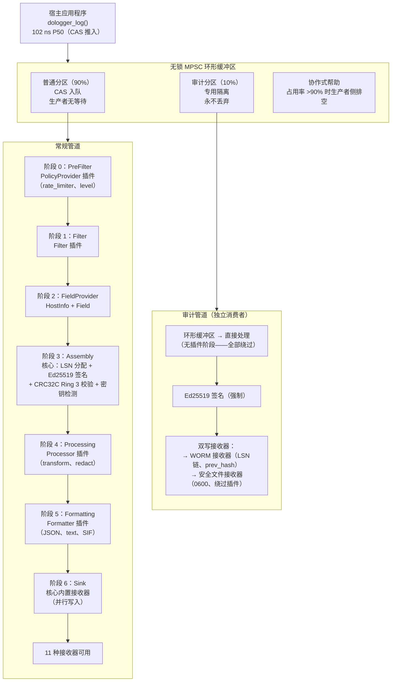

### 各阶段详情

| 阶段 | 索引 | 插件 | 可丢弃？ | 可修改？ | 核心操作 |
|:-:|:-:|:-:|:-:|:-:|:-:|
| PreFilter | 0 | PolicyProvider | 是 | 否 | 限流、级别门控 |
| Filter | 1 | Filter | 是 | 否 | 基于内容的过滤 |
| FieldProvider | 2 | FieldProvider, HostInfoProvider | 否 | Ring 1 写入 | 主机/容器/云元数据注入 |
| Assembly | 3 | 仅核心 | 否 | Ring 0+1 写入 | LSN 分配、Ed25519 签名、CRC32C 校验、密钥检测 |
| Processing | 4 | Processor | 是 | Ring 2+3 写入 | 转换、脱敏、增强 |
| Formatting | 5 | Formatter | 否 | 只读 | 序列化为 JSON/文本/SIF |
| Sink | 6 | 核心内置 | 否 | 只读 | 写入外部目标 |

### Record 生命周期

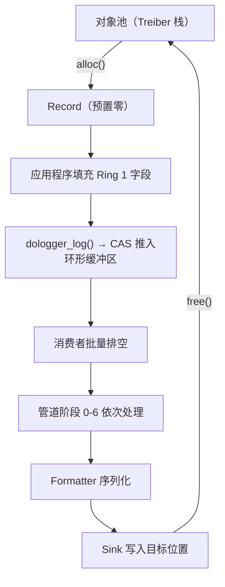

---

## 环形缓冲区设计与无锁保证

### 架构

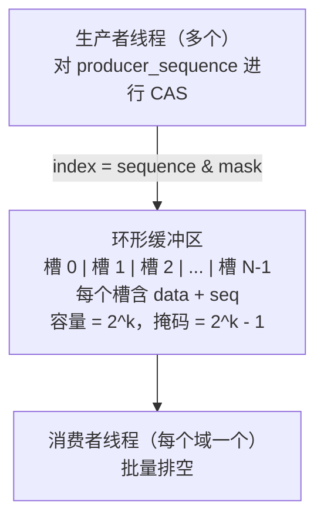

### 设计属性

| 属性 | 保证 |
|:-:|:-:|
| **生产者** | 无等待——CAS 槽位声明，无互斥锁，无自旋循环 |
| **消费者** | 批量排空——每个域单线程，从不与生产者竞争 |
| **缓存行填充** | 每个 `RingSlot` 为 `#[repr(C, align(64))]` 以防止伪共享 |
| **2 的幂容量** | 位掩码取模（`index = seq & mask`）避免除法运算 |
| **序列协调** | 两个原子计数器：`producer_sequence` 与 `consumer_sequence` |

### 入队算法（生产者）

（伪代码 — 仅示意，未编译。实际实现见 `core/src/buffer/ring_buffer.rs`）

```
producer_push(record):
  loop:
    seq = producer_sequence.fetch_add(1, Relaxed)   // 声明下一个槽位
    slot = &slots[seq & mask]
    while slot.sequence != seq:                      // 等待槽位释放
      spin_loop()
    slot.data = record                                // 写入
    slot.sequence.store(seq + 1, Release)            // 发布
    return OK
```

### 出队算法（消费者）

（伪代码 — 仅示意，未编译。实际实现见 `core/src/buffer/ring_buffer.rs`）

```
consumer_drain(batch_size):
  for i in 0..batch_size:
    consumer_seq = consumer_sequence.load(Relaxed)
    slot = &slots[consumer_seq & mask]
    if slot.sequence != consumer_seq + 1:             // 槽位尚未就绪
      break
    record = slot.data.take()
    slot.sequence.store(consumer_seq + capacity, Release)  // 释放槽位
    consumer_sequence.fetch_add(1, Release)
    process(record)
  return count
```

### 对象池（Treiber 栈）

Record 在 `RecordPool` 中预分配，避免热路径上的堆分配：

（伪代码 — 仅示意，未编译。实际实现见 `core/src/buffer/object_pool.rs`）

```
分配：
  CAS(pool.head, current_head, nodes[current_head].next)
  → return &mut nodes[current_head].record

释放：
  loop:
    current_head = pool.head
    nodes[node].next = current_head
    if CAS(pool.head, current_head, node): break
```

### 并发模型总结

| 组件 | 机制 | 备注 |
|:-:|:-:|:-:|
| 环形缓冲区（生产者） | 无锁 CAS | 超过 8 个线程时出现竞争（单一 CAS 游标） |
| 环形缓冲区（消费者） | 单线程 | 每个域一个消费者，无竞争 |
| 对象池 | 无锁 Treiber 栈 | CAS 操作头指针 |
| 配置存储 | `Arc<RwLock<Config>>` + CoW 快照 | 读多写少 |
| 插件注册表 | `Arc<RwLock<PluginRegistry>>` | 仅冷路径（加载/卸载） |
| 错误状态 | 线程本地存储 | `thread_local! { RefCell<DologgerError> }` |

### 已知限制

环形缓冲区对所有生产者使用单一 CAS 游标。在高并发提交（超过 8 个生产者线程）时，CAS 竞争可能成为瓶颈。计划引入按线程分区的分片环形缓冲区。

---

## 审计链：Ed25519 + LSN + prev_hash

### 链结构

（伪代码 — 仅示意，未编译）：

```
Record(1)：
  lsn       = 1
  prev_hash = SHA-256(0x00...00)       // 创世块——全零
  signature = Ed25519_Sign(secret_key, Ring0+Ring1 字段)

Record(2)：
  lsn       = 2
  prev_hash = SHA-256(Record(1).signature || Record(1).lsn)
  signature = Ed25519_Sign(secret_key, Ring0+Ring1 字段)

Record(3)：
  lsn       = 3
  prev_hash = SHA-256(Record(2).signature || Record(2).lsn)
  signature = Ed25519_Sign(secret_key, Ring0+Ring1 字段)
```

| 记录 | LSN | prev_hash | signature |
|:-:|:-:|:-:|:-:|
| Record(1) | 1 | SHA-256(0x00...00) — 创世块 | Ed25519_Sign(secret_key, Ring0+Ring1) |
| Record(2) | 2 | SHA-256(Record(1).signature \|\| Record(1).lsn) | Ed25519_Sign(secret_key, Ring0+Ring1) |
| Record(3) | 3 | SHA-256(Record(2).signature \|\| Record(2).lsn) | Ed25519_Sign(secret_key, Ring0+Ring1) |

### 验证算法

（伪代码 — 仅示意，未编译；已发布的验证器为 `dologctl verify-log`，参见[运维与安全指南](OperationsAndSecurity.md#审计验证)）：

```
verify_chain(records)：
  for i = 0 to len(records)-1:
    1. 验证 Ed25519 签名：
       if !pubkey.verify(records[i].signature, serialize(Ring0+Ring1)):
         return FAIL at i

    2. 验证 prev_hash 链（若 i > 0）：
       expected = SHA-256(records[i-1].signature || records[i-1].lsn)
       if records[i].prev_hash != expected:
         return CHAIN_BREAK at i

    3. 验证 LSN 单调性：
       if records[i].lsn <= records[i-1].lsn:
         return LSN_ORDER_VIOLATION at i

    4. 检测间隔（gap）：
       if records[i].lsn > records[i-1].lsn + 1:
         标记 GAP（从 records[i-1].lsn+1 到 records[i].lsn-1）

  return OK with summary
```

### LSN 间隔处理

- **重排窗口（200 ms）**：200 ms 内的乱序记录会自动补齐，不标记间隔。
- **窗口超时**：向 WORM 文件写入 `GAP_MARKER` 记录，并发出 `LSN_GAP_DETECTED` 系统监控事件。
- **非 AUDIT 记录**：不携带 LSN。间隔属于预期行为，非恶意。

### 签名覆盖范围

| 字段范围 | 完整性 | 备注 |
|:-:|:-:|:-:|
| Ring 0 | Ed25519 | 始终签名 |
| Ring 1 | Ed25519 | 始终签名 |
| Ring 2 | Ed25519（可选） | 当 `sign_ring2 = true` 时签名 |
| Ring 3 | 仅 CRC32C | 硬件加速，非加密级别 |

### 加密性能

测试环境：AMD Ryzen 9 7950X，单核，ed25519-dalek 2.0：

| 操作 | 延迟 | 吞吐量 |
|:-:|:-:|:-:|
| Ed25519 密钥生成 | ~24 us | ~41,000 密钥/s |
| Ed25519 签名 | ~16.96 us | ~58,000 签名/s |
| Ed25519 验证 | ~48 us | ~20,800 验证/s |
| SHA-256（64 字节） | ~120 ns | ~8.3M 哈希/s |
| CRC32C（64 字节） | ~3 ns | ~330M 校验/s |

### 外部锚定（规划中）

定期将 Merkle 根哈希发布到不可变外部存储（S3、区块链），以提供长期防篡改能力：

（伪代码 — 仅示意规划中的外部锚定，未编译）：

```
// 每隔 N 条记录，对签名链计算 Merkle 根
let merkle_root = compute_merkle_root(records[l..r]);
send_to_external_anchor(merkle_root, lsn_range = [l, r]);
```

---

## 安全模型：Ring 0-3 权限与三色信任

### 字段权限环

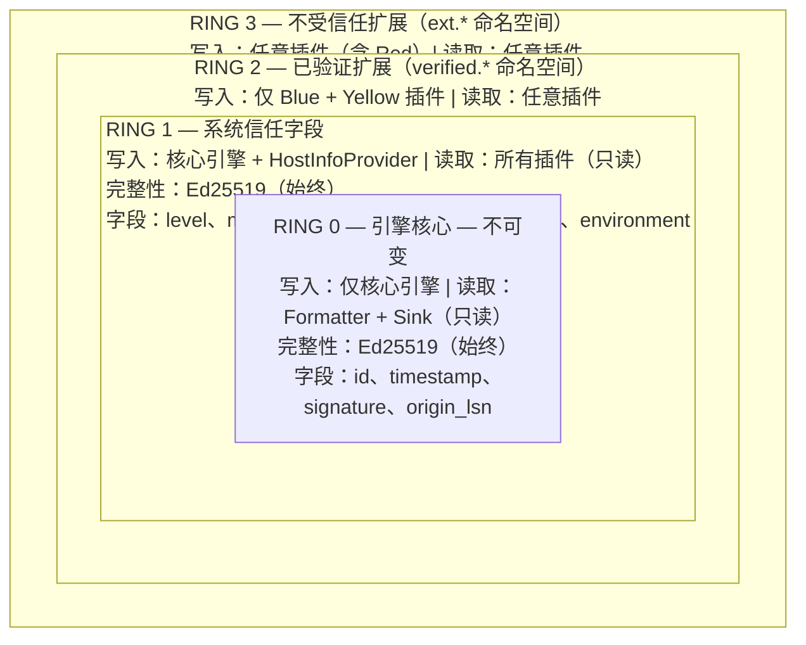

### 三色插件信任模型

| 属性 | Blue（完全信任） | Yellow（部分信任） | Red（零信任） |
|:-:|:-:|:-:|:-:|
| 签名 | Ed25519 强制 | 建议 | 不要求 |
| 沙箱 | 无 | seccomp-bpf / AppContainer | 最大隔离 |
| 文件 I/O | 完整 | 读 + 写 | 禁止 |
| 网络 | 完整 | 禁止 | 禁止 |
| 进程派生 | 允许 | 禁止 | 禁止 |
| 字段写入 | Ring 2 (`verified.*`) | Ring 2 (`verified.*`) | Ring 3 (`ext.*`) |
| 字段读取 | Rings 0-3 | Rings 0-3 | Rings 0-3 |
| 动态加载 | 允许 | 允许 | 配置控制（`allow_red_plugins`） |

### seccomp-bpf 系统调用白名单（Linux）

| 类别 | Blue | Yellow | Red |
|:-:|:-:|:-:|:-:|
| 内存 | 全部 | 全部 | 全部 |
| 线程 | 全部 | 全部 | 全部 |
| 时间 | 全部 | 全部 | 全部 |
| 信号 | 全部 | 全部 | 禁止 |
| 文件 I/O | 全部 | 全部 | 禁止 |
| 网络 | 全部 | 禁止 | 禁止 |
| 进程 | 全部 | 禁止 | 禁止 |

违规处理：`SECCOMP_RET_KILL_PROCESS`——内核以 SIGSYS 终止插件线程。发出 `SANDBOX_VIOLATION` 系统监控事件。

---

## 接收器扇出与回退链

### 扇出架构

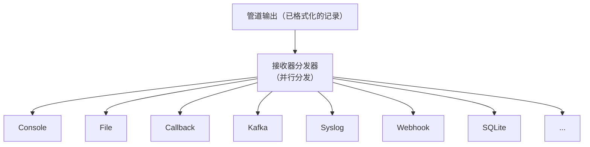

每个启用的接收器会收到每条已格式化记录的副本。分发通过 `io_pool` 线程池并行执行。

### 内置接收器（共 9 种）

| 接收器 | 类型 | TLS | 用途 |
|:-:|:-:|:-:|:-:|
| Console | `console` | 不适用 | 开发调试 |
| File | `file` | 不适用 | 本地文件输出（支持轮转） |
| WORM | `worm` | 不适用 | 不可变审计日志存储 |
| Security File | `security` | 不适用 | 隔离审计输出（0600、绕过插件） |
| Syslog | `syslog` | TLS（RFC 5425） | 传统 syslog 基础设施 |
| Kafka | `kafka` | TLS + SASL | 集中式日志聚合（按特性启用） |
| SQLite | `sqlite` | 不适用 | 本地结构化日志存储（按特性启用） |
| Webhook | `webhook` | HTTPS | REST API 日志采集（按特性启用） |
| OpenTelemetry | `otel` | HTTPS | OTLP/HTTP 可观测性管道（按特性启用） |

### 回退链

当主接收器故障时，回退链提供降级模式输出：

```toml
[sinks.file]
type = "file"
path = "/var/log/dologger/app.log"
fallback = "emergency_file"

[sinks.kafka]
type = "kafka"
brokers = ["kafka1:9092"]
fallback = "file"            # 若 Kafka 宕机，改写文件
```

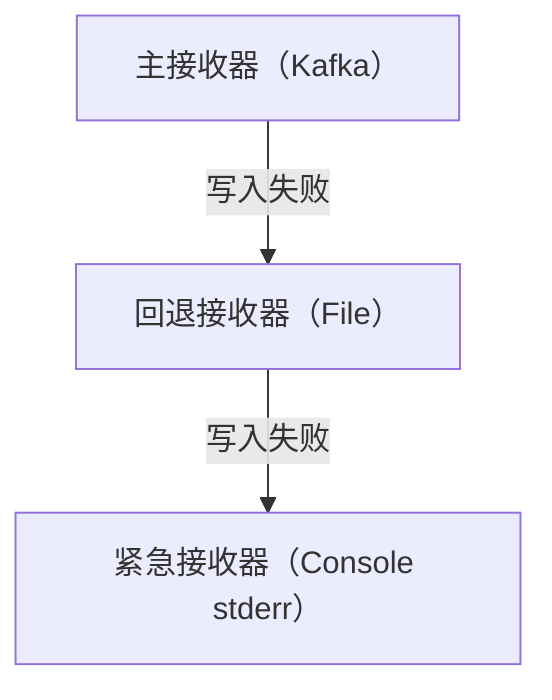

### 每个远程接收器的断路器

每个远程接收器（Kafka、Syslog、Webhook）均有独立的断路器：

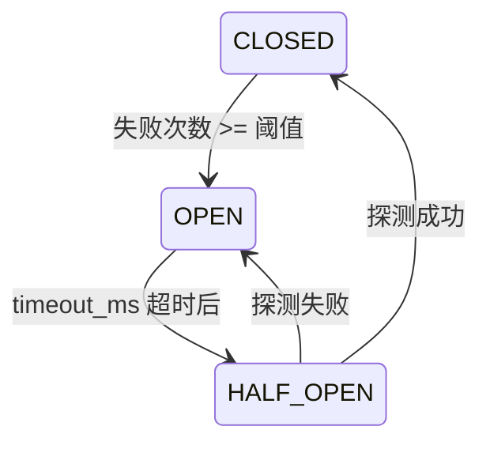

| 参数 | 默认值 | AUDIT 覆盖值 |
|:-:|:-:|:-:|
| `failure_threshold` | 连续 5 次失败 | >= 3 |
| `timeout_ms` | 30,000（30 秒） | >= 60,000 |
| `half_open_max_requests` | 3 次探测 | 3 次探测 |

---

## 背压系统

### 丢弃策略

当环形缓冲区已满且配置的 `block_timeout_ms` 到期时，根据策略丢弃记录：

| 策略 | 行为 | 可用性影响 |
|:-:|:-:|:-:|
| `drop_newest` | 丢弃最新提交的记录 | 低——生产者永不阻塞 |
| `oldest` | 丢弃最旧未处理的记录 | 低——保持时效性 |
| `below_warn` | 仅丢弃 WARN 级别以下的记录 | 中——WARN+ 始终保留 |
| `below_error` | 仅丢弃 ERROR 级别以下的记录 | 高——ERROR+ 始终保留 |
| `never` | 无限期阻塞（仅 AUDIT 域） | 可能阻塞宿主 |

### 背压阈值

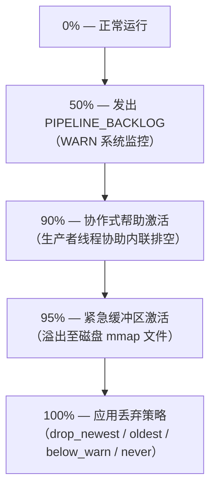

### 协作式帮助

当占用率达到 90% 时，生产者线程在推入自身记录之前，先行协助排空环形缓冲区。这种方式以小幅增加提交延迟为代价，换取缓冲区溢出预防：

（伪代码 — 仅示意，未编译）：

```
if occupancy >= 90%:
  生产者先排空一小批（16 条记录）
  生产者随后推入自身记录
```

### 性能配置绑定

| 配置 | `block_timeout_ms` | `drop_strategy` | AUDIT 行为 |
|:-:|:-:|:-:|:-:|
| `dev` | 100 | `drop_newest` | AUDIT 无限期阻塞 |
| `prod-performance` | 3000 | `below_warn` | AUDIT 无限期阻塞 |
| `prod-audit` | 3000 | `below_warn` | AUDIT 无限期阻塞 |
| `balanced` | 2000 | `oldest` | AUDIT 无限期阻塞 |

AUDIT 铁律覆盖所有配置：审计记录永不丢弃。

---

## 紧急缓冲区与恢复

### 激活条件

- **触发条件**：环形缓冲区占用率 >= 95% 持续超过 5 秒
- **阈值管理者**：`BackpressureController`
- **存储**：系统临时目录中的匿名内存映射文件
- **格式**：长度前缀帧记录（8 字节长度前缀 + 原始记录字节）
- **AUDIT 加密**：AES-256-GCM，使用每会话密钥

### 紧急缓冲区数据流

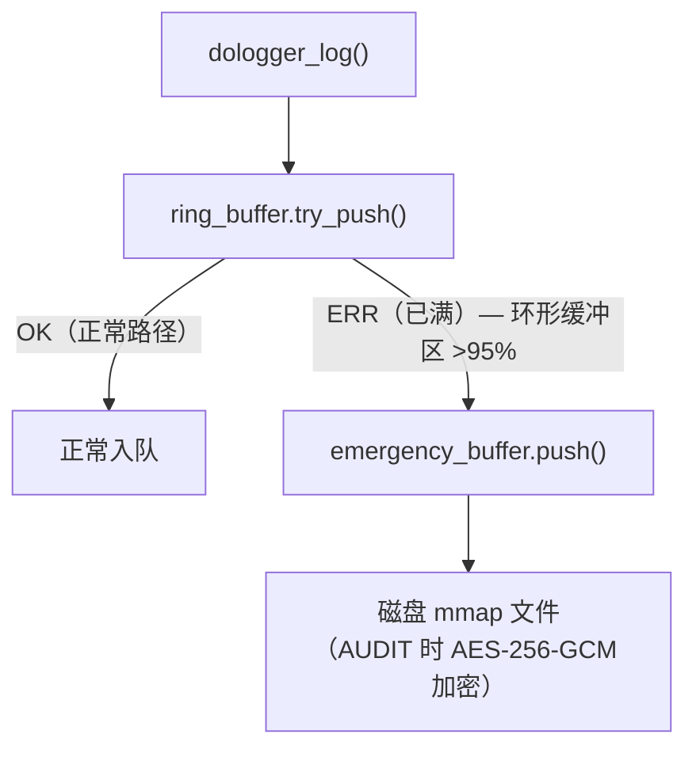

### 恢复流程

（伪代码 — 仅示意，未编译）：

```
引擎启动：
  1. 检查紧急缓冲区文件：dologger_emergency_<pid>_<spill_id>.buf
     （位于系统临时目录的 `dologger/` 子目录中）
  2. 若找到：
     a. 读取所有溢出的记录
     b. 基于 LSN 的去重（跳过已见过的 LSN 的记录）
     c. 重放到主管道
     d. 删除紧急文件
  3. 发出 EMERGENCY_RECOVERED 系统监控事件
```

### 紧急缓冲区限制

| 参数 | 默认值 |
|:-:|:-:|
| 最大文件大小 | 512 MB |
| 最大记录数 | 1,000,000 |

若超出这些限制，紧急缓冲区自身也会丢弃记录，并发出 `EMERGENCY_BUFFER_OVERFLOW` 系统监控事件。

---

## 线程池架构

### 池布局

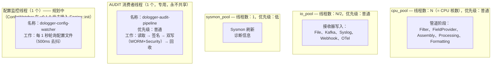

### 线程命名规范

所有线程遵循命名模式 `dologger-<pool>-<id>`：

（示意列表）：

```
dologger-cpu_pool-0
dologger-cpu_pool-1
dologger-io_pool-0
dologger-sysmon_pool-0
dologger-audit-pipeline
dologger-config-watcher
```

### 调度器

管道调度器使用工作窃取线程池（`crossbeam_channel`）：

- CPU 池：`num_cpus` 个线程，用于 CPU 密集型管道阶段
- IO 池：`num_cpus / 2` 个线程，用于 IO 密集型接收器写入
- Sysmon 池：1 个线程，用于诊断刷新（低优先级）

---

## 插件 VTable 规范

### 9 种插件类型

| # | 类型 | 阶段 | VTable 函数 |
|:-:|:-:|:-:|:-:|
| 1 | `Filter` | Filter (1) | `filter`, `filter_batch` |
| 2 | `PolicyProvider` | PreFilter (0) | `policy_evaluate`, `policy_update` |
| 3 | `FieldProvider` | Field (2) | `provide_fields`, `provide_fields_batch` |
| 4 | `HostInfoProvider` | Field (2) | `provide_host_info`（Ring 1 受限） |
| 5 | `Processor` | Process (4) | `process`, `process_batch` |
| 6 | `Formatter` | Format (5) | `format`, `flush` |
| 7 | `ConfigProvider` | Config（加载时） | `load_config`, `watch_config` |
| 8 | `KeyProvider` | Key（加载时） | `sign`, `public_key`, `rotate` |
| 9 | `SyscallBroker` | Syscall（代理） | `broker_dispatch` |

Sink 不是插件类型：它是核心内置的输出执行器（阶段 6），没有 VTable。
11 种内置接收器由核心直接驱动；参见下文「内置接收器」章节。

### VTable 模式

所有 VTable 函数遵循以下契约：

（伪代码 — 示意性契约模板；实际 VTable 函数签名为 `int` 返回值，逐一定义见 `core/include/dologger_core.h`）：

```c
// 必须：提供函数指针，若不支持则传 NULL
// 返回：成功返回 DO_LOG_OK，失败返回错误码
// DO_LOG_ERR_FATAL 将导致插件被卸载

typedef dologger_error_t (*vtable_fn_t)(/* parameters */);
```

### 插件生命周期

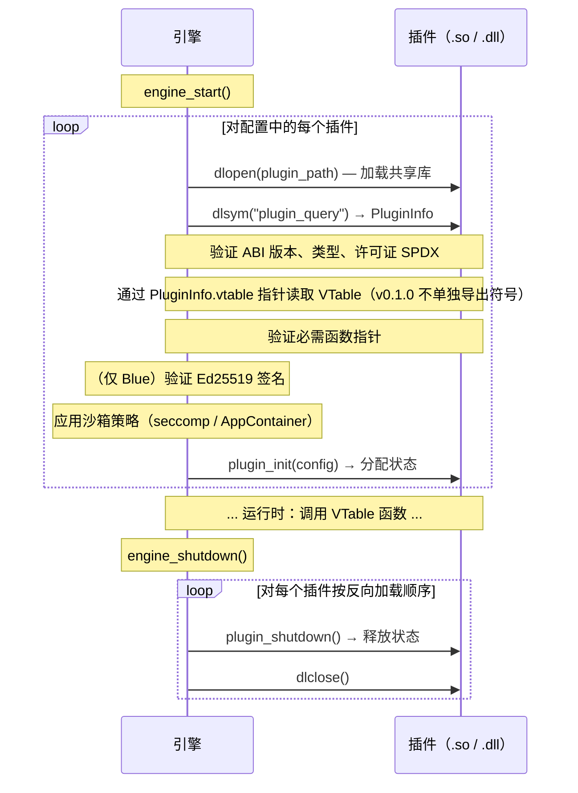

### 必需的 C ABI 导出

每个插件必须导出（v0.1.0 实际签名，见 `core/include/dologger_core.h`）：

```c
dologger_plugin_info_t *plugin_query(uint32_t core_abi_version);
int plugin_init(const void *config);
int plugin_shutdown(void);
// 类型特定的 VTable 通过 PluginInfo.vtable 指针暴露，无需单独导出符号
```

每个插件可以导出（伪代码 — 规划中的热重载状态序列化，v0.1.0 尚无 `dologger_state_buf_t`）：

```c
dologger_error_t plugin_state_serialize(dologger_state_buf_t *out);
dologger_error_t plugin_state_deserialize(const dologger_state_buf_t *in);
```

---

## SIF 二进制格式概述

### 格式

SIF（**Standard Intermediate Format**，标准中间格式）是二进制日志记录线格式，
用于 WORM 存储、共享内存交接，以及 CLI 的 `record` / `verify` 命令。它是由
FlatBuffer 编码的 `Record` 表，外加一个小的帧头，支持模式演化与零拷贝字段访问。

每个 SIF 消息按如下方式分帧：

| 偏移 | 大小 | 字段 | 描述 |
|:-:|:-:|:-:|:-:|
| 0 | 4 | magic | `b"SIF1"` |
| 4 | 12 | SifHeader | version、total_length、record_count |
| 16 | 可变 | FlatBuffer | `Record` 表（根偏移 + vtable + 数据） |

### 帧头（`SifHeader`）

| 字段 | 大小 | 描述 |
|:-:|:-:|:-:|
| version | 4 | 打包的模式版本（`MAJOR << 24 \| MINOR << 16 \| PATCH`）；1.0.0 = `0x0100_0000` |
| total_length | 4 | 帧总长度（含 magic + 帧头） |
| record_count | 4 | `Record` 表数量（单记录帧为 1） |

### 编码 / 解码

`core::sif` 模块提供稳定的帧 API：

- `encode_record(&Record) -> Vec<u8>` — 将记录序列化为分帧的 SIF 缓冲区。
- `decode_record(&[u8]) -> Record` — 将分帧的 SIF 缓冲区解析回记录。
- `validate_frame(&[u8]) -> SifError` — 校验 magic + 帧头一致性。

FlatBuffer 模式位于 `core/sif/dologger_sif.fbs`；绑定由 `core/build.rs`
（`flatc --rust`）生成并提交作为回退。模式支持演化，旧消费者会忽略未知字段。

### 状态 — v0.1.0

线格式与 `encode_record` / `decode_record` / `validate_frame` API 已交付，
并被共享内存 sink 与 CLI 使用。引擎的 Formatting→Sink SIF 交接处于规划中
（Formatting 阶段目前仍内部输出纯文本）。

---

## 性能基准与调优

### 硬件参考

| 组件 | 规格 |
|:-:|:-:|
| CPU | AMD Ryzen 9 7950X (16C/32T) |
| RAM | DDR5-6000 |
| 存储 | Samsung 990 Pro NVMe |
| OS | Linux 6.x |
| Rust | stable, release + LTO |

### 基准测试结果

| 基准测试 | 测量值 |
|:-:|:-:|
| 单条记录提交（CAS 推入） | 102 ns P50 |
| 环形缓冲区推入（1K 条） | 121 us |
| 批量推入（256 条） | 19.2 us |
| Console 接收器，无签名 | 1,200,000 rec/s |
| File 接收器，无签名 | 950,000 rec/s |
| File 接收器，Ed25519 签名 | 58,000 rec/s |
| WORM 接收器，签名 + fsync | 12,000 rec/s |
| CRC32C（64 字节） | ~3 ns（SSE 4.2 硬件） |

### 调优参数

| 参数 | 默认值 | 调优指导 |
|:-:|:-:|:-:|
| `ring_buffer_size` | 262144 | 突发性工作负载时可增大。必须是 2 的幂。 |
| `batch_size` | 256 | 128-512。越大吞吐量越高，延迟也越高。 |
| `enable_signature` | false | 每条记录增加约 17 us。仅用于 AUDIT/合规。 |
| `fsync_on_write` | false | 强制介质持久化。受 IO 延迟限制。 |
| `ring_buffer_coop_helping` | true | 防止溢出，代价是热路径增加约 1 us。 |

### 操作系统级调优

```bash
# 将管道线程绑定到隔离的 CPU
sudo cset shield --cpu 2-3 --kthread=on

# 增大环形缓冲区可锁定内存上限（大页）
sudo sysctl -w vm.max_map_count=262144

# 测量延迟时禁用透明大页
echo never | sudo tee /sys/kernel/mm/transparent_hugepage/enabled
```

### 运行基准测试

```bash
# 运行内置基准测试套件
cargo bench

# 单条记录提交延迟
cargo bench --bench latency

# 吞吐量基准测试
cargo bench --bench throughput

# 延迟百分位分布
cargo bench --bench latency_percentiles
```

---

## 完整设计规范

本文档即为 DoLogger 架构决策、API 与安全属性的权威设计参考。
