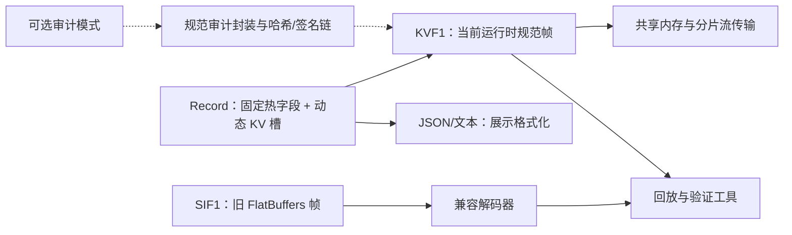

# KV 线格式与 SIF 兼容迁移

> **状态**：运行时桩与主要路径已实现，但 Record 里程碑尚未完成验收。
> **读者**：核心开发者、Sink 作者、CLI 与插件维护者。

## 结论先行

DoLogger 中的 KV 与 SIF 是两个不同层次的概念：

- **KV** 是 `Record` 内部的动态字段组织方式，也是当前运行时和共享内存
  生产者使用的版本化 `KVF1` 帧。
- **SIF** 是保留的 FlatBuffers 兼容格式。它继续用于读取旧文件、旧集成、
  WORM 归档和迁移工具，但新的运行时写入者不得再把它当作规范帧。

KV 不等于删除 SIF，SIF 也不是 KV 的别名。分层是有意设计：KV 负责当前
热路径契约，SIF 负责兼容边界，JSON/文本负责展示输出。

## 分层架构

编解码核心负责分帧、边界检查、UTF-8 校验、文本边界的代码页转换和可复用
缓冲区。本地化负责消息与目录 fallback，不拥有持久化编码策略。审计是
显式开启、默认关闭的使用场景，不能因为存在 KV 帧就推断审计已启用。

## KVF1 运行时契约

`KVF1` 使用版本化、小端序布局，包含固定头、固定记录元数据、UTF-8 消息和
带标签的动态字段。解码器在构造 `Record` 前会检查 magic、版本、声明长度、
字段预算、字段名、UTF-8、封闭类型集合、重复标签以及可选的内容哈希。

当前 Rust 入口包括：

- `record::wire::encode_record`：规范生产者编码。
- `record::wire::decode_record_with`：带边界的可信/不可信解码。
- `record::wire::decode_any`：优先 KV，再走显式 SIF 兼容路径。
- `record::wire::FrameScanner`：长度前缀分片流输入。
- `record::wire::ReusableEncoder`：单生产者可复用输出存储。

这些上限是防御性资源预算，并不表示每条记录都应消耗完整预算。处理不可信
共享内存时必须使用不可信解码选项并保留错误结果。

## SIF 兼容规则

SIF 继续保留在 `core/sif/`，因为直接删除会破坏旧文件和外部消费者。它的
职责被收窄为：

1. 回放、验证和迁移时读取旧 SIF 帧；
2. 支持尚未迁移到 KVF1 的集成方；
3. 在迁移窗口内保留已有 FlatBuffers/WORM 数据的访问能力。

新的生产者（包括 SHM 运行时写入者）使用 KVF1。兼容读取必须返回帧类型，调用
者不能把 SIF 输入静默描述成新的 KV 帧。删除 SIF 必须另行完成废弃决策、
消费者清单和迁移证据；本轮不作删除声明。

## 插件与 Sink 指南

插件可以通过 Record 字段 API 增加动态字段，但不能替换规范持久化分帧、审计
哈希、签名或 FFI 线协议。Formatter 可以产生 JSON/文本展示结果，需要二进制
Record 传输的 Sink 应调用核心 KV 编码器，不要复制字段顺序和长度校验。

文本输出使用独立的编码策略：显式 UTF-8、显式 Windows 代码页，或自动检测
locale/平台并记录可观察的 UTF-8 fallback。持久化 KV 和审计字节不会经过展示
代码页转换。

## 当前验收状态

当前工作树已实现：

- KVF1 编解码与严格校验；
- SHM KV 运行路径与 CLI 兼容解码；
- 分片帧扫描器、可复用编码器、fuzz 目标和集成覆盖；
- 保留并显式识别旧 SIF 读取路径。

仍未完成，不能当作里程碑完成：

- 所有 Record 消费者的生产调用图证据；
- C ABI 最终审查与兼容验收；
- 真实 TPM 提供者及硬件审计证据；
- Filter/Processor dispatch 的完整插件集成测试；
- 完整 fuzz、基准、崩溃恢复、磁盘满和跨平台门禁。

参见[架构参考](../ArchitectureReference.md)了解公开架构；DACS 状态、ADR-005 和验收证据保留在内部工程记录中。