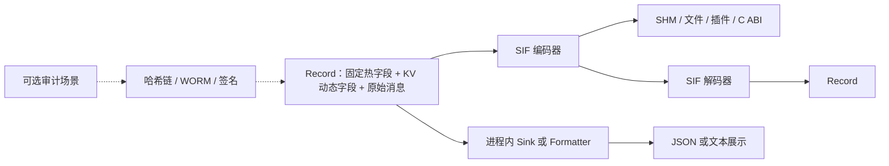

# KV 与 SIF 序列化边界

> **状态**：基础运行时契约已固定；审计仍是可选且默认关闭的使用场景。
> **读者**：核心开发者、Sink 作者、CLI 与插件维护者。

## 设计结论

DoLogger 使用两个职责不同的层次：

- **KV** 是内存中 `Record` 的动态字段组织形式；
- **SIF** 是中立、有边界的序列化与通信边界。

规范路径是：

```text
Record = 固定热字段 + KV 动态字段 + 原始消息字节
Record --SIF 编码器--> SIF 字节
```

SIF 可用于共享内存、文件、插件、C ABI、跨进程传输，以及转换成其他序列化
格式。进程内 Sink 可以直接消费 `Record` 或派生视图，不强制经过 SIF。JSON
和文本是展示序列化，不是 Record 的规范存储格式。

## 分层架构



SIF 在构造 `Record` 前校验 magic、长度、资源边界、字段名、封闭类型集合、
重复标签、原始消息类型和可选内容哈希。该字节边界与 locale、代码页和展示
编码解耦。SIF 的存在不会自动开启审计。

## Rust 公共接口

`dologger_core::sif` 模块负责该边界：

- `encode_record` 与 `decode_record_with` 编码或恢复一个 `Record`；
- `validate_frame_with` 执行有边界的结构校验；
- `FrameScanner` 处理带长度前缀的分片流；
- `ReusableEncoder` 复用生产者缓冲区，不改变所有权规则；
- `entries` 为检查工具提供借用的动态条目视图。

当前实现是手写且由 KV 构建。已删除的 FlatBuffers schema 不再属于当前构建
或公共契约。

## Sink 与插件指导

只有在跨进程、跨语言、跨 ABI 或进入持久化存储时才需要使用 SIF；进程内若直接
使用 `Record` 可以避免不必要的序列化。插件可以通过 Record API 增加 KV 字段，
但不能重新定义 SIF 帧、规范哈希、签名或 C ABI。

展示编码器可以使用显式 UTF-8、显式代码页，或带可观测 UTF-8 fallback 的平台/locale
自动检测，但不能修改规范 SIF、原始消息、审计封装、哈希或签名。

## 待开发桩子

- 完整的长度限定原始字节 C 摄入 ABI；
- 所有支持平台的原生 locale 与代码页适配器；
- 面向插件的 catalog provider ABI 及解析/重载边界；
- 跨语言 SIF fixtures、fuzz 覆盖和基准基线。

这些是已明确记录的工程桩子，不代表多语言、插件 ABI 或跨平台转换已经全部完成。
