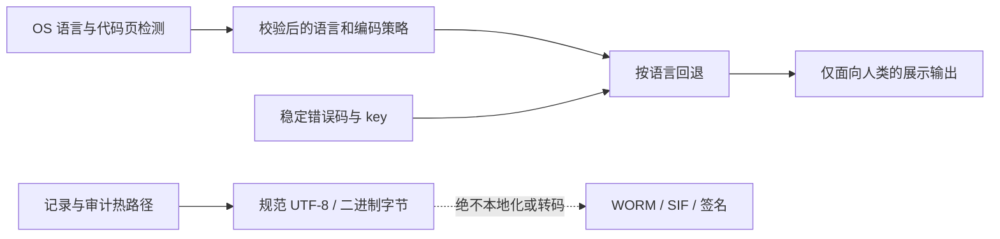

# DoLogger 多语言本地化与日志编码架构

> **状态：** 基础框架桩子已建立；目录加载、OS 语言/代码页适配器和完整插件目录 ABI
> 仍按阶段开发，不能宣称已完成。

DoLogger 将**核心编码/解码**与**多语言本地化**分离。编码是核心基础服务，供记录、
接收器、目录文件和展示适配器使用；本地化只负责 locale、目录查询和回退。错误码和
消息 key 是契约；翻译只是展示层结果，不能参与分支判断、签名输入、WORM 内容、SIF
规范字节或审计验证。

## 设计源文件

权威图源为
[`docs/assets/mmd/localization-architecture.mmd`](../../../assets/mmd/localization-architecture.mmd)。
预留的 SVG 生成目标是 `docs/assets/svg/localization-architecture.svg`；只能通过
`node peripheral/tools/mermaid-svg/render_architecture.mjs` 生成，不能手工编辑 SVG。

## 核心契约

### 1. 核心编码服务

`dologger_core::codec` 独立于 `dologger_core::localization`，是未来日志与目录格式共用的
编码器/解码器边界：UTF-8 已具备跨平台编码/解码基础实现；Windows 代码页显式、经过
校验并拒绝有损转换；非 Windows 数字代码页在选定安全 codec 后再实现，当前明确返回
不支持。`dologger_core::sys::io` 消费核心策略完成控制台展示，文件/WORM/SIF 保持规范
字节。本地化只能调用核心编码服务，不能重新定义编码策略。

### 2. 内部规范表示

- Rust 文本使用 UTF-8；C ABI 文本默认按 UTF-8 约定，明确声明原始字节的 API
  除外。
- 日志文件、WORM 信封、签名、SIF 帧和 content hash 使用规范字节。语言环境和
  控制台代码页不能改变它们。
- 只有记录离开持久化和签名路径后，面向展示的输出才允许转码。

### 3. 语言自动检测优先级

未来运行时检测顺序固定为：显式 API/配置 → `DOLOGGER_LOCALE` → OS 语言 API
及 `LC_ALL`、`LC_MESSAGES`、`LANG` → `en-US`。语言标签按受限 BCP-47 子集规范化；
非法、非 ASCII、过长或格式错误的值直接拒绝，不做猜测。

### 4. 编码检测与手动指定

语言和编码策略分离：`auto` 在 Windows 控制台优先使用 Unicode 控制台 API；
管道/文件始终输出 UTF-8；`native` 使用当前 OS/控制台编码；显式代码页只作用于
支持的展示控制台。Windows 检测控制台输出代码页和 ANSI 代码页，但不修改全局控制台
状态。POSIX/macOS 先读取 locale/codeset 环境，后续再增加平台原生适配器。

未知代码页安全回退到 UTF-8 展示并发出诊断；绝不静默重解释已经持久化的字节。

### 5. 回退与目录

请求 `zh-CN` 时按 `zh-CN → zh → en-US → 稳定 key` 查找。目录安装前检查 UTF-8、
NUL、key/消息长度、key 字符和重复 key。当前 Rust 桩子为
`dologger_core::localization` 和 `dologger_core::codec`：

- `LocaleChain`：规范化语言标签并构造回退链；
- `MessageCatalog`：保存经过校验的不可变条目；
- `LocalizationRegistry`：在生产者热路径外替换目录快照；
- `dologger_error_key`：向 C 调用者暴露与语言无关的 key。
- `encoding::detect`：读取 locale/codeset 和平台控制台代码页，不修改全局状态；
- `sys::io::set_output_code_page`：为 `native` 展示模式设置经过校验的 Windows 代码页，
  CLI 入口为 `dologctl --code-page 936`。

目录源格式尚未冻结。规划采用兼容 Fluent 的源格式，并编译成受限运行时目录；可为
插件作者提供 gettext 导入，但最终都必须进入相同的 key/value 快照，不能绕过校验。

### 6. 插件边界

插件只接收稳定 key，并通过版本化 provider 接口提供目录条目。插件不能翻译审计记录、
修改错误码或注入可执行格式化逻辑。插件目录按不可信输入处理，使用与核心目录相同的
校验和大小限制。

### 7. 性能与安全

- `dologger_log`、记录组装、WORM 写入、签名和 hash 计算不做语言查找、加锁、分配或转码。
- 翻译只在展示边界延迟解析；当前 registry 使用不可变目录快照和读写锁，未来只有在
  基准证明收益后才考虑原子快照优化。
- 目录只允许本地显式来源，暂不支持网络拉取。
- 占位符是数据而不是代码；未来格式化器必须拒绝未知字段，防止路径穿越、NUL 注入和
  无界扩展。
- 转换失败时展示回退 UTF-8 或稳定 key；持久化字节不被重写。

## 分阶段桩子

| 阶段 | 范围 | 状态 |
|---|---|---|
| E0 | 核心 UTF-8 codec、校验和展示代码页钩子 | 已建立桩子 |
| E1 | 日志/接收器规范编码器与解码器接线 | TODO(author) |
| E2 | Windows/POSIX/macOS 原生 codec 适配器 | Windows 钩子已建立；完整适配器 TODO(author) |
| L0 | 错误 key、语言回退链、校验后的内存目录 | 已建立桩子 |
| L1 | 将语言策略和目录选择接入配置与 CLI | TODO(author) |
| L2 | Fluent 兼容目录编译与可安全 reload 的快照 | TODO(author) |
| L3 | 版本化插件目录 provider ABI | TODO(author) |
| L4 | 编码/本地化转换基准与 fuzz 测试集 | TODO(author) |

## 参考

- Project Fluent：<https://projectfluent.org/fluent/>
- GNU gettext：<https://www.gnu.org/software/gettext/manual/>
- Unicode BCP-47/CLDR：<https://unicode.org/reports/tr35/>
- ICU MessageFormat 2：<https://unicode-org.github.io/icu/userguide/format_parse/messages/>
