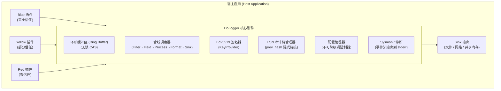

# DoLogger 安全白皮书 (Security Whitepaper)

> 🌐 **语言 / Language**: [中文](SecurityWhitepaper.md) | [English: Security Whitepaper](../../en_US/guides/SecurityWhitepaper.md)

> **版本**: v0.0.1 | **最后更新**: 2026-08-12 | **目标受众**: 安全/合规工程师

## 目录

1. [安全模型概述](#安全模型概述)
2. [威胁模型 (STRIDE)](#威胁模型-stride)
3. [Record 字段权限环](#record-字段权限环)
4. [Ed25519 签名与 LSN 审计链](#ed25519-签名与-lsn-审计链)
5. [插件信任模型与沙箱隔离](#插件信任模型与沙箱隔离)
6. [配置安全与不可降级项](#配置安全与不可降级项)
7. [数据完整性保护](#数据完整性保护)
8. [供应链安全](#供应链安全)
9. [网络安全](#网络安全)
10. [合规性映射](#合规性映射)
11. [已知限制与待改进项](#已知限制与待改进项)

---

## 安全模型概述

### 核心安全原则

DoLogger 的安全架构建立在四条原则上，按优先级排序：

1. **深度防御**：多层重叠的安全机制——字段权限环、密码学签名、沙箱隔离和不可降级配置——确保单一控制失效不会导致整个系统沦陷。

2. **最小权限**：插件仅获得其声明功能所需的最小权限。访问由三色信任模型、沙箱系统调用过滤和字段权限环共同控制。

3. **不可否认性**：审计级日志记录使用 Ed25519 密码学签名，并通过哈希链（LSN 审计链）串联，为"记录了什么、何时记录、由哪个引擎实例记录"提供不可辩驳的证据。

4. **完整性优先**：设计决策的优先级顺序为：安全 > Linux 基线性能 > 热路径 Blue 插件吞吐 > 生态安全。安全属性绝不因性能而牺牲，除非存在明确、有文档且可审计的决策。

### 信任边界



### 安全设计决策

| 决策 | 理由 |
|:-:|:-:|
| 采用 Ed25519 而非 ECDSA | 签名更快（约 17 us）、签名更小（64 字节）、不依赖 RNG，且常量时间实现经过充分评审。 |
| Ring 3 使用 CRC32C | 硬件加速（SSE 4.2：约 0.5 cycles/byte）。对于不需要密码学强度的不可信扩展数据，足以检测完整性。 |
| 采用 seccomp-bpf 而非 ptrace | 开销更低、按线程过滤、无 TOCTOU 竞态。`SECCOMP_RET_KILL_PROCESS` 在违规时立即终止。 |
| 无锁环形缓冲区 | 消除热路径上的互斥锁争用。基于 CAS 的每调用线程单生产者优化。 |
| LSN 链使用 SHA-256 | 原像抗性经过充分验证。第二原像抗性将每条记录与其前驱绑定。 |

---

## 威胁模型 (STRIDE)

DoLogger 的设计已依据 STRIDE 威胁分类框架进行分析。

**表 1：STRIDE 威胁分析**

| 威胁类别 | 描述 | 缓解措施 | 实现状态 |
|:-:|:-:|:-:|:-:|
| **Spoofing** | 伪造日志记录或插件身份 | Ed25519 签名验证 + 插件证书验证 | 已实现 |
| **Tampering** | 修改已提交的日志记录 | LSN 哈希链 + `prev_hash` 链接 + WORM 文件不可变性 | 已实现 |
| **Repudiation** | 否认日志记录的作者身份 | 每条审计记录上的 Ed25519 不可否认签名 | 已实现 |
| **Information Disclosure** | 敏感字段泄露给未授权插件 | Ring 0–3 权限控制 + 字段级访问门控 | 已实现；自动脱敏 Processor 为规划中 |
| **Denial of Service** | 日志洪泛压垮系统 | 令牌桶限速器 + 背压控制 + 断路器模式 | 已实现 |
| **Elevation of Privilege** | Red 插件逃逸沙箱以获取系统权限 | seccomp-bpf / AppContainer 隔离 + 系统调用白名单 | 已实现（基础框架） |

### 攻击向量分析

**表 2：攻击向量风险评估**

| 攻击向量 | 风险等级 | 缓解 |
|:-:|:-:|:-:|
| Red 插件尝试 `fork()` | **CRITICAL** | seccomp-bpf 拦截，返回 `SECCOMP_RET_KILL_PROCESS`。插件线程被终止。 |
| 伪造审计签名 | **CRITICAL** | Ed25519 + HSM 支持的 `KeyProvider`。私钥绝不进入插件可访问的进程内存。 |
| 日志注入（CRLF / 终端转义） | **HIGH** | 自动转义控制字符与 HTML 实体。可通过 `escape_html` 配置。 |
| 环形缓冲区溢出 | **MEDIUM** | 紧急 mmap 溢出缓冲区 + 可配置丢弃策略（`drop_newest`、`below_warn` 等）。 |
| 配置文件篡改 | **HIGH** | `config_lock` 模式 + 不可降级项在任何配置层均不可放宽。 |
| Sink 中间人攻击（网络） | **HIGH** | 所有网络 Sink 强制 `require_tls` + 证书固定。 |
| LSN 链断裂注入 | **MEDIUM** | 间隙检测标记缺失的 LSN；`dologctl verify-log` 检测结构性断裂。 |
| 日志文件路径符号链接攻击 | **MEDIUM** | 打开时使用 `O_NOFOLLOW`；文件创建前验证父目录所有权。 |
| 共享内存嗅探（sink_shm） | **LOW** | SHM 段以 `0600` 权限创建；消费者必须共享同一 UID。 |

### 威胁参与者画像

| 参与者 | 能力 | 主要目标 |
|:-:|:-:|:-:|
| 恶意 Red 插件 | 在引擎进程内执行代码，尝试沙箱逃逸 | 日志篡改、数据外泄、权限提升 |
| 失陷的宿主进程 | 在应用 UID 范围内读写 | 配置篡改、日志删除、签名密钥窃取 |
| 网络对手 | 拦截引擎与远程 Sink 之间的流量 | 日志窃听、注入、重放 |
| 内部人员（特权运维） | 日志服务器上的 root/sudo 权限 | 批量删除日志、销毁审计追踪 |

---

## Record 字段权限环

DoLogger 通过四个同心权限环对日志记录字段实施强制访问控制模型。这是纵深防御的第一层。

**表 3：Record 字段权限环**

| 环 | 名称 | 允许写入方 | 允许读取方 | 完整性保护 |
|:-:|:-:|:-:|:-:|:-:|
| Ring 0 | 引擎核心 | 仅核心引擎 | Formatter 与 Sink（只读） | Ed25519 签名 |
| Ring 1 | 系统可信 | 核心引擎 + `HostInfoProvider` | 所有插件（只读） | Ed25519 签名 |
| Ring 2 | 已验证插件 | Blue 与 Yellow 插件 | 所有插件 | Ed25519（可通过 `sign_ring2` 配置） |
| Ring 3 | 不可信扩展 | 任何插件（含 Red） | 所有插件 | 仅 CRC32C |

### Ring 0 — 不可变引擎字段

这些字段由核心引擎在记录创建时恰好写入一次。**任何插件，无论信任颜色，都不得修改。** 尝试写入会被静默丢弃，并记录为 `RING0_WRITE_ATTEMPT` sysmon 事件。

| 字段 | 类型 | 描述 |
|:-:|:-:|:-:|
| `record.id` | uint64 | 由雪花算法生成的全局唯一记录标识符。 |
| `record.timestamp` | uint64 | 入队时分配的单调递增墙上时钟时间戳（自纪元起的纳秒数）。 |
| `record.signature` | bytes[64] | 覆盖 Ring 0 + Ring 1 字段（若 `sign_ring2=true` 则含 Ring 2）的 Ed25519 签名。 |
| `record.origin_lsn` | uint64 | 入队时分配的日志序列号（LSN）。单调递增。 |

### Ring 1 — 系统上下文字段

这些字段提供日志记录的环境上下文。它们由核心引擎和 `HostInfoProvider` 插件（一个特殊的 Blue 级插件）写入。

| 字段 | 描述 |
|:-:|:-:|
| `host.name` | 机器主机名。 |
| `host.os` | 操作系统名称与版本。 |
| `host.arch` | CPU 架构（x86\_64、aarch64）。 |
| `process.id` | 宿主进程 PID。 |
| `process.name` | 宿主进程可执行文件名。 |
| `process.thread_id` | 调用线程 TID。 |
| `environment` | 部署环境标签：`production`、`staging`、`development`。 |

### Ring 2 — 已验证扩展字段

Blue 和 Yellow 插件写入 `verified.*` 命名空间。每次写操作均被审计（audit_tags 结构示意 — 实际字段是名为 `security.audit_tags` 的 `RecordString`）：

```json
{
  "verified.user_id": "u-12345",
  "verified.session_id": "sess-abcdef",
  "audit_tags": [
    {
      "plugin_id": "auth-field-provider",
      "plugin_version": "2.1.0",
      "timestamp": "2026-08-12T14:30:00.123Z",
      "action": "write",
      "field": "verified.user_id"
    }
  ]
}
```

`audit_tags` 数组提供了可验证防篡改的记录：哪个插件在何时修改了哪个字段。这对取证分析至关重要。

### Ring 3 — 不可信扩展字段

Red 插件写入 `ext.*` 命名空间。这些字段：

- 仅受 CRC32C 保护（硬件加速完整性校验，非密码学）。
- 被**排除**在 Ed25519 签名覆盖范围之外。
- 可能被配置为不信任 `ext.*` 字段的 Filter 插件静默丢弃。
- 不携带任何 `audit_tags` 条目。

**理由**：Red 插件是零信任的。其输出经过完整性校验（CRC32C 检测意外损坏）但未经密码学验证。需要强保证的系统不应依赖 Ring 3 字段。

---

## Ed25519 签名与 LSN 审计链

### 签名覆盖范围

Ed25519 签名覆盖：

1. **始终**：所有固定热字段（timestamp、level、message、pid、tid、LSN）
2. **始终**：所有 KV 字段（确定性序列化——与 KV 编码规范相同的规范顺序，与记录编码路径共用）
3. **从不**：溢出落堆状态（由 CRC32C 保护）

签名过程（伪代码/示意 — 算法描述说明）：

```
1. 按规范 KV 顺序序列化被覆盖字段（tag+len+value）。
2. 计算内容哈希：content_hash = SHA-256(serialized_fields)。
3. 逐条模式（默认）：
     sig = Ed25519_Sign(key, SHA-256(LSN ‖ content_hash ‖ prev_hash))
     将 sig 存入伴随文件 audit.log.sig
   块模式（可选，audit_block_size > 1）：
     收集块内 content_hash[i]，构建 Merkle 根，
     sig_block = Ed25519_Sign(key, SHA-256(block_seq ‖ block_root))
```

### LSN 内容哈希审计链

每条 AUDIT 记录在 Record 内携带 32B `content_hash`，链链接由它派生（伪代码/示意，非可执行代码）：

```
Record(N):
  lsn          = N
  content_hash = SHA-256(canonical_serialization(fixed_fields ‖ kv_fields))
  prev_hash    = SHA-256( Record(N-1).content_hash ‖ Record(N-1).lsn )

Record(N+1):
  lsn          = N+1
  content_hash = SHA-256(canonical_serialization(fixed_fields ‖ kv_fields))
  prev_hash    = SHA-256( Record(N).content_hash ‖ Record(N).lsn )
```

64B Ed25519 签名**不驻留** Record——写入伴随侧车文件 `audit.log.sig`
（逐条模式：每个 LSN 一条 64B 签名；块模式：每块一条签名）。这让热路径
256B 结构保持无冷路径密码学数据，同时保留逐条非否认。

**威胁覆盖**（作者裁决 2026-08-18）：

| 威胁 | 防护层 | 机制 |
|:-:|:-:|:-:|
| 内存篡改（运行时） | content_hash 链 | 对已签名记录的任何修改都会破坏 `prev_hash` 连续性——验证时检出 |
| 伪造（重新签名） | Ed25519 签名 | 密钥在 TPM 内不可导出；攻击者无法铸造有效签名 |
| 磁盘篡改 | WORM + 链 | fsync + 只读权限 + 链重验证 |

**验证算法**（伪代码/示意，非可执行代码）：

```
verify_chain(records, sidecar):
  for i = 0 to len(records) - 1:
    1. 从规范序列化重算 content_hash[i]；
       → 与 records[i].content_hash 不符则 FAIL。

    2. 若 i > 0：
       expected_prev_hash = SHA-256(records[i-1].content_hash ‖ records[i-1].lsn)
       → 若 records[i].prev_hash != expected_prev_hash 则 FAIL。

    3. 验证 LSN 单调性：
       → 若 records[i].lsn <= records[i-1].lsn 则 FAIL。

    4. 从侧车文件验证 Ed25519 签名：
       逐条模式：  verify(sig[i], SHA-256(lsn ‖ content_hash ‖ prev_hash))
       块模式：    重算块内 content_hash 的 Merkle 根，验证单条块签名。

    5. 若 records[i].lsn > records[i-1].lsn + 1：
       → 标记为 GAP（records[i-1].lsn+1 至 records[i].lsn-1 缺失）。
```

**间隙处理**：200 ms 重排窗口内的 LSN 间隙由引擎填充（乱序到达）。超出窗口的间隙会以写入 WORM 文件的 `GAP_MARKER` 记录标记。`dologctl verify-log` 工具报告所有间隙。

以下两种场景中的间隙是预期且非恶意的：
- 不携带 LSN 的非 AUDIT 记录。
- 紧急缓冲区溢出事件中，部分记录绕过了正常的 LSN 分配。

### TPM 后端密钥（阶段 1）

审计签名密钥在硬件 TPM 内供给：

| 平台 | 后端 | 状态 |
|:-:|:-:|:-:|
| Windows | CNG（TPM 密钥，零新增依赖） | 阶段 1 |
| Linux | `tpm2-tss` | 阶段 1 |
| macOS | Secure Enclave（等效硬件边界） | 阶段 1 |

策略：`enable_signature = true` 但无可用 TPM → **显式报错拒绝启动**——绝不静默降级为软件密钥。阶段 2+（PCR 度量、attestation 协议、单调回滚计数器）留桩，推迟至 v1.0 后评审。

### 签名粒度与块大小门禁

- **默认：逐条签名** —— audit 场景安全优先于吞吐。
- **可选：块签名** —— `audit_block_size > 1` 启用 Merkle 根块签名，面向高吞吐 audit 部署。
- **门禁**：块大小只有在真实 TPM 后端上通过权威 Criterion 扫描（`sign_block_sweep`）后，才可提升为文档化默认值。理论曲线（有效成本 = TPM_time/N + SHA-256）表明吞吐渐近饱和而延迟/内存线性上升，因此甜区必须实测而非假设。

### WORM 文件保护

审计日志文件以一次写入多次读取（WORM）语义保护（生命周期示意）：

```
文件生命周期：
1. 创建：            /var/lib/dologger/audit/audit-000001.worm  (权限 0600)
2. 活跃写入：        引擎追加记录。每次写入后 fsync。
3. 封存：            chmod 0400 (Linux) / FILE_ATTRIBUTE_READONLY (Windows)
4. 归档：            移至冷存储。只读权限持续保持。
```

伴随签名文件 `audit.log.sig` 遵循相同生命周期，必须与其 WORM 文件一同归档——缺少它，离线验证无法检查非否认。

**持久性保证**：每次写入后跟随 `fsync()`（当 `fsync_on_write = true`），提供 MEDIA 级持久性。`fsync` 返回后系统崩溃也不会丢失已提交的记录。

**不可变性保证**：封存后，文件权限阻止任何进程修改，包括 root（尽管 root 可以把文件再 `chmod` 回来——这可通过 inode 变更时间审计检测到）。

### 密码学性能

在 AMD Ryzen 9 7950X 单核、Ed25519-dalek 2.0 上测得（软件路径；TPM 硬件延迟随后端而异，须在目标平台实测）：

| 操作 | 延迟 | 吞吐量 |
|:-:|:-:|:-:|
| Ed25519 密钥生成 | ~24 us | ~41,000 密钥/s |
| Ed25519 签名 | ~16.96 us | ~58,000 签名/s |
| Ed25519 验签 | ~48 us | ~20,800 验签/s |
| SHA-256（64 字节） | ~120 ns | ~8.3M 哈希/s |
| CRC32C（64 字节） | ~3 ns | ~330M 校验/s |

AUDIT 记录额外支付 TPM 签名成本。逐条模式受 TPM ops/s 限制（离散 TPM2：每次数十 ms 量级——须在目标后端实测）；块模式将成本均摊到块大小。content_hash 链本身每条 ~120 ns–1 us（SHA-256），是 audit 记录在引擎内的主导开销。

---

## 插件信任模型与沙箱隔离

### 三色分级

**表 4：信任级别能力矩阵**

| 能力 | Blue（完全信任） | Yellow（部分信任） | Red（零信任） |
|:-:|:-:|:-:|:-:|
| **身份** | DoLogger 团队签名 | 第三方开发者 | 社区 / 未签名 |
| **沙箱** | 无 | seccomp-bpf / AppContainer | 最大隔离 |
| **内存** | 完全访问 | 允许 | 允许 |
| **文件 I/O** | 完全读写 | 允许读 + 写 | **拒绝** |
| **网络** | 完全访问 | **拒绝** | **拒绝** |
| **进程创建** | 允许 | **拒绝** | **拒绝** |
| **信号** | 允许 | 允许 | **拒绝** |
| **字段写入** | Ring 2（`verified.*`） | Ring 2（`verified.*`） | Ring 3（`ext.*`） |
| **签名要求** | 必需（Ed25519） | 推荐 | 不要求 |

### seccomp-bpf 实现 (Linux)

seccomp-bpf 过滤器在每次插件加载时、调用 `plugin_init()` 之前安装。过滤器按线程生效，并作用于插件创建的所有线程。

**表 5：按信任颜色的系统调用白名单**

| 类别 | 示例系统调用 | Blue | Yellow | Red |
|:-:|:-:|:-:|:-:|:-:|
| 内存 | `mmap`, `munmap`, `mprotect`, `brk`, `madvise` | 是 | 是 | 是 |
| 线程 | `futex`, `clone`, `set_robust_list`, `get_robust_list` | 是 | 是 | 是 |
| 时间 | `clock_gettime`, `gettimeofday`, `nanosleep`, `clock_nanosleep` | 是 | 是 | 是 |
| 同步 | `futex`, `fadvise64` | 是 | 是 | 是 |
| 信号 | `rt_sigaction`, `rt_sigreturn`, `tgkill`, `rt_sigprocmask` | 是 | 是 | 否 |
| 系统信息 | `uname`, `getpid`, `gettid`, `getrandom`, `getcpu` | 是 | 是 | 是 |
| 文件 I/O | `open`, `openat`, `read`, `write`, `close`, `lseek`, `fstat`, `fsync` | 是 | 是 | 否 |
| 网络 | `socket`, `connect`, `bind`, `sendto`, `recvfrom`, `accept` | 是 | 否 | 否 |
| 进程 | `fork`, `vfork`, `execve`, `execveat`, `wait4`, `kill` | 是 | 否 | 否 |

**违规行为**（示意序列）：

```
1. Yellow/Red 插件线程调用 fork()
2. seccomp-bpf 过滤器匹配：系统调用号 57 (fork) 不在白名单中
3. 动作：SECCOMP_RET_KILL_PROCESS
4. 线程被内核以 SIGSYS 杀死
5. 引擎收到 SIGSYS → 映射为沙箱违规
6. sysmon 发出：{"event":"SANDBOX_VIOLATION","plugin":"my-plugin","syscall":"fork","action":"KILL","tid":12345}
7. 插件被标记为 FAILED 并卸载
```

### Windows 沙箱 (AppContainer)

Windows 隔离使用 LowBox Token 并移除能力 SID：

- **Yellow 插件**：进程令牌转换为 LowBox，并收回 `WIN://NO_NETWORK` 和 `WIN://NO_PROCESS_CREATION` 能力 SID。
- **Red 插件**：完整 AppContainer 隔离。仅保留 `WIN://LOWBOX` 基础能力。

Windows 的完整进程级隔离（将插件代码运行在单独、受控的子进程中）尚未实现。

### macOS 沙箱 (App Sandbox)

沙箱配置文件通过 `sandbox_init(3)` 与 seatbelt/SBPL 规则应用。计划为每个信任级别实现完整的配置文件集。

### 已实现的安全测试 (15 项)

以下安全测试用例已实现并在 CI 中运行：

| # | 测试用例 | 验证内容 |
|:-:|:-:|:-:|
| 1 | Blue 插件尝试写入 Ring 0 | 写入被静默丢弃 |
| 2 | 不可信（Red）插件尝试写入 Ring 1 | 写入被静默丢弃 |
| 3 | 签名篡改检测 | 被修改的签名无法通过 Ed25519 验证 |
| 4 | LSN 字段篡改检测 | 被修改的 LSN 破坏 prev\_hash 链 |
| 5 | LSN 链断裂检测 | 缺失记录产生可检测间隙 |
| 6 | 审计背压铁律 | AUDIT 记录在溢出时按规范阻塞 |
| 7 | 不可降级项绕过阻止 | 通过配置重载放宽 `enable_signature` 被拒绝 |
| 8 | 背压丢弃策略正确性 | `below_warn` 保留 WARN+ 记录 |
| 9 | 速率限制器阻断超额 | 令牌桶按配置速率正确限流 |
| 10 | 环形缓冲区并发安全 | 多线程 CAS 入队无记录丢失 |
| 11 | WORM 间隙检测与标记 | LSN 窗口超限 → 写入 `GAP_MARKER` |
| 12 | 间隙标记超时处理 | 超过超时时间的间隙被永久标记 |
| 13 | 循环依赖攻击阻止 | 插件加载顺序 DAG 验证无环 |
| 14 | Ring 3 ext 字段排除在签名外 | 修改 `ext.*` 不会使 Ed25519 签名失效 |
| 15 | 所有不可降级项已定义 | 配置校验器拒绝不完整的项列表 |

---

## 配置安全与不可降级项

### 不可降级项

六个配置项被指定为不可降级。它们在各配置层之间只能**收紧**（如 `false` → `true`）。任何放宽它们的尝试（如 `true` → `false`）都会被拒绝，并发出 `CONFIG_RELOAD_DENIED` sysmon 事件。

**表 6：不可降级安全项**

| 配置项 | 放宽状态 | 安全后果 |
|:-:|:-:|:-:|
| `enable_audit` | `false` | 隔离审计管线关闭；AUDIT 调用失败关闭。 |
| `enable_signature` | `false` | 签名不可否认性关闭；无签名哈希链不属于合规输出。 |
| `escape_html` | `false` | 日志注入攻击成为可能。终端转义序列和 CRLF 注入可以隐藏或伪造日志输出。 |
| `durability` | `os_cache` | 审计日志文件变得可修改。历史记录可被删除或修改而无法被密码学检测。 |
| `fsync_on_write` | `false` | 崩溃持久性失效。崩溃期间丢失的在途审计记录留下不可检测的间隙。 |
| `require_tls` | `false` | 网络 Sink 接受明文连接。传输中的日志数据面临被动窃听和主动 MITM 攻击。 |
| `sign_ring2` | `false` | 已验证扩展字段失去密码学绑定。`verified.*` 字段可被无痕修改。 |

### 不可降级强制执行

强制执行发生在配置合并时。有效配置自下而上计算（低优先级 → 高优先级）。在每一步合并时，较高层的不可降级项与较低层比较（伪代码/示意）：

```
if lower.enable_signature == true AND higher.enable_signature == false:
    REJECT: CONFIG_RELOAD_DENIED
    effective.enable_signature = true  (较低层获胜)
```

这意味着系统层应用的合规模板无法被项目本地的 `dologger.toml` 或环境变量颠覆。

### 合规模板

**表 7：合规模板激活**

| 模板 | 路径 | 激活的不可降级项 |
|:-:|:-:|:-:|
| GDPR | `compliance/gdpr.toml` | 全部 6 项（`true`） |
| HIPAA | `compliance/hipaa.toml` | 全部 6 项（`true`） |
| PCI DSS | `compliance/pci-dss.toml` | 全部 6 项（`true`） |

每个合规模板将全部不可降级项设置为 `true`，并附带监管依据注释。模板还强制 `level = "AUDIT"` 与 `performance_profile = "prod-audit"`。

**应用合规模板**（示意 — `config merge` 子命令与 `--compliance` 选项为规划中，v0.0.1 未提供；今天需手动合并 TOML 文件，例如保留 `compliance/gdpr.toml` 中的 `[dologger]` 节，然后运行 `dologctl config validate --strict`）：

```bash
# 将合规模板合并到基础配置中
dologctl config merge \
    --base /etc/dologger/default.toml \
    --overlay compliance/gdpr.toml \
    --output /etc/dologger/gdpr-production.toml

# 验证合并后的配置
dologctl config validate \
    --config /etc/dologger/gdpr-production.toml \
    --compliance gdpr \
    --strict
```

---

## 数据完整性保护

### 多层完整性架构

**表 8：完整性保护层**

| 层 | 机制 | 性能开销 | 保护范围 |
|:-:|:-:|:-:|:-:|
| KV 溢出字段 | CRC32C（SSE 4.2 硬件：约 0.5 cycles/B） | 可忽略 | 意外损坏检测 |
| 固定 + KV 字段 | content_hash 链（SHA-256，约 120 ns–1 us） | 低 | 内存/运行时篡改检测 |
| 非否认 | Ed25519 签名（侧车 `audit.log.sig`；TPM 密钥） | 逐条：受 TPM ops/s 限制；块模式：均摊 | 防伪造 |
| 审计链 | SHA-256 prev_hash（约 120 ns） | 低（约 120 ns） | 保管链证明 |
| WORM 文件 | `fsync` + 只读锁（I/O 绑定） | 中等 | 提交后不可变性 |
| 外部锚定 | 定期根哈希发布（规划中） | N/A（离线） | 长期防篡改 |

### 篡改检测工作流

```text
（示例输出示意 — 汇总数字为虚构；verify-log 接受单个文件路径加签名侧车）
1. 运维执行：dologctl verify-log /var/lib/dologger/audit/audit-000001.worm \
              --sidecar /var/lib/dologger/audit/audit-000001.sig

2. 对 WORM 文件中的每条记录：
   a. 解析记录二进制格式
   b. 重算 content_hash → 与存储值不符则 FAIL
   c. 验证 prev_hash 链 → PASS / FAIL / GAP
   d. 验证 LSN 单调性 → PASS / FAIL
   e. 从侧车验证 Ed25519 签名 → PASS / FAIL

3. 汇总报告：
   Records: 100,000
   Content hashes valid:  99,998
   Signatures valid:      99,998
   Signatures INVALID:         2  ← 安全事件
   LSN gaps detected:           1  ← 缺失记录
   Chain intact:            99,997

4. 外部锚定验证（规划中）：
   - 从 S3 锚点获取同一 LSN 范围的根哈希
   - 计算本地根哈希（基于所有内容哈希的 Merkle 树）
   - 比较 → PASS / FAIL
```

### 日志注入防护

当 `escape_html = true` 时，DoLogger 自动转义日志消息中的控制字符和 HTML 实体：

| 输入字符 | 转义输出 |
|:-:|:-:|
| `<` | `&lt;` |
| `>` | `&gt;` |
| `\r`（CR） | `\r`（字面反斜杠-r） |
| `\n`（LF） | `\n`（字面反斜杠-n） |
| `\x1b`（ESC） | `\e` |

这可防止：
- **CRLF 注入**：攻击者无法通过在消息字段中嵌入 `\r\n` 来注入伪造日志行。
- **终端转义**：攻击者无法注入 ANSI 转义序列来隐藏或模糊日志输出。
- **基于 HTML 的日志伪造**：在 Web 浏览器中查看日志时，注入的 HTML/JavaScript 被中和。

---

## 供应链安全

### 插件签名验证

Blue 插件**必须**由 DoLogger 团队的 Ed25519 密钥签名。验证流程（示意序列）：

```
1. 引擎在配置的路径发现插件
2. 通过 dlopen 加载共享库
3. 调用 plugin_query() → 获取 plugin_info（名称、版本、类型）
4. 定位分离签名文件：<plugin_path>.sig
5. 验证：Ed25519_Verify(doLogger_pubkey, plugin_library_bytes, signature)
6. 若 PASS：进入沙箱 + plugin_init
7. 若 FAIL：dlclose + 发出 SIGNATURE_FAILURE sysmon 事件 + 跳过插件
```

**公钥分发**：DoLogger 团队 Ed25519 公钥编译进 `libdologger_core`。可在启动时通过 `KeyProvider` 覆盖。

### 依赖许可证合规

项目通过 `cargo-deny` 强制执行基于 SPDX 的许可证合规：

```bash
# CI 强制执行
cargo deny check licenses
cargo deny check bans
cargo deny check advisories
cargo deny check sources
```

**表 9：许可证允许/拒绝策略**

| 类别 | SPDX 示例 | 核心引擎 | Blue 插件 | Yellow 插件 | Red 插件 |
|:-:|:-:|:-:|:-:|:-:|:-:|
| A（宽松） | MIT, Apache-2.0, BSD-2/3-Clause, ISC, Zlib | 允许 | 允许 | 允许 | 允许 |
| B（弱 Copyleft） | MPL-2.0, LGPL-3.0* | 允许 | 允许 | 允许 | 禁止 |
| C（强 Copyleft） | GPL-2.0, GPL-3.0 | 禁止 | 禁止 | 禁止 | 禁止 |
| D（网络 Copyleft） | BSL, SSPL, AGPL-3.0 | 禁止 | 禁止 | 禁止 | 禁止 |
| E（专有） | Proprietary, 无许可证 | 禁止 | 禁止 | 禁止 | 禁止 |

\* LGPL-3.0 仅限动态链接。

### 漏洞扫描

| 工具 | 频率 | 范围 |
|:-:|:-:|:-:|
| `cargo audit` | 每次 CI 运行 | Rust 依赖图中的已知 CVE |
| `cargo deny check advisories` | 每次 CI 运行 | RustSec 公告数据库 |
| `cargo deny check bans` | 每次 CI 运行 | 重复 crate 版本、通配符依赖 |
| OSS-Fuzz（规划中） | 持续 | 记录解析、签名验证的模糊测试 |

---

## 网络安全

### Sink 传输安全

**表 10：Sink 传输安全**

| Sink 类型 | 传输 | 认证 | 配置 |
|:-:|:-:|:-:|:-:|
| File | 本地文件系统 | 文件系统权限（0600） | N/A |
| Syslog | TCP/TLS（RFC 5425） | 可选 mTLS | `require_tls = true` + 客户端证书 |
| Kafka | TLS + SASL | SASL/SCRAM-SHA-256 + broker 证书 | `sasl_mechanism = "SCRAM-SHA-256"` |
| Webhook | HTTPS | Bearer Token（`Authorization` 头） | `bearer_token = "..."` |
| OTel | HTTPS（OTLP/HTTP） | Bearer Token | `otel_headers = {"Authorization": "Bearer ..."}` |
| Shared Mem | 仅本地 | SHM 权限（0600）、UID 匹配 | N/A |

### TLS 配置

```toml
# （示意 — 非发布的 schema；真实的 Kafka sink 配置使用
# 逗号分隔的 `brokers` 字符串，外加 `enable_tls` / `sasl_username` /
# `sasl_password` — 见 core/src/sink/kafka.rs）
[sinks.kafka]
type = "kafka"
brokers = ["kafka1.internal:9093"]
tls = true
tls_ca_file = "/etc/dologger/certs/ca.pem"
tls_cert_file = "/etc/dologger/certs/client.pem"
tls_key_file = "/etc/dologger/certs/client-key.pem"
tls_min_version = "1.2"
```

所有 TLS 连接要求 TLS 1.2 或更高版本。TLS 1.0 和 1.1 在协议层被拒绝。

### 控制面安全

**当前：**
- HTTP 监听器绑定于 `127.0.0.1:9090`
- 无认证（仅限本机访问）
- 建议：宿主机防火墙将 9090 端口限制在回环接口

**规划中：**
- 支持远程访问的 gRPC + mTLS
- JWT Bearer Token 认证
- 基于角色的访问控制（只读观察者 vs. 管理员）

---

## 合规性映射

**表 11：监管框架映射**

| 框架 | 要求 | DoLogger 实现 | 状态 |
|:-:|:-:|:-:|:-:|
| **GDPR Art. 30** | 处理活动记录 | WORM 审计日志 + Ed25519 不可否认性提供数据处理事件的不可变记录 | 已实现 |
| **GDPR Art. 32** | 处理安全性 | 传输中数据加密（TLS）、完整性保护（签名 + LSN 链）、韧性（环形缓冲区 + 紧急溢出） | 已实现 |
| **GDPR Art. 5(1)(f)** | 完整性与保密性 | Ed25519 签名验证完整性；Ring 权限模型强制保密性 | 已实现 |
| **HIPAA 164.312(b)** | 审计控制 | 审计域隔离 + Ed25519 签名 + LSN 链提供 ePHI 访问的完整审计追踪 | 已实现 |
| **HIPAA 164.312(c)(2)** | 完整性控制 | 密码学机制（Ed25519）证实 ePHI 审计记录未被篡改 | 已实现 |
| **HIPAA 164.312(e)(1)** | 传输安全 | `require_tls = true` 时所有网络 Sink 强制 TLS 1.2+ | 已实现 |
| **PCI DSS 10.2** | 自动化审计追踪 | LSN 链 + WORM 提供对所有持卡人数据访问的自动化、不可变审计追踪 | 已实现 |
| **PCI DSS 10.5** | 审计追踪安全 | 密码学签名（10.5.1-10.5.2）、WORM 不可变性（10.5.5）、集中日志服务器转发（10.5.3-10.5.4） | 已实现 |
| **PCI DSS 4.1** | 传输强密码学 | 所有网络 Sink 要求 TLS 1.2+ | 已实现 |
| **SOC 2 CC7.2** | 监控异常活动 | sysmon 事件流提供对管线健康、沙箱违规与签名失败的实时可见性 | 已实现 |
| **ISO 27001 A.12.4** | 日志记录与监控 | 签名 + 加密 + WORM 保护的日志记录及 LSN 保管链 | 已实现 |

### 合规性验证

```bash
# （示意 — `--compliance` 选项与 `compliance report` 子命令为
# 规划中，v0.0.1 未提供；请改为使用包含模板 [dologger] 设置的配置
# 运行 `dologctl config validate --strict`）
# 依据 GDPR 要求验证配置
dologctl config validate --config /etc/dologger/default.toml --compliance gdpr

# 依据 PCI DSS 要求验证配置
dologctl config validate --config /etc/dologger/default.toml --compliance pci-dss

# 导出合规报告
dologctl compliance report \
    --config /etc/dologger/default.toml \
    --framework gdpr \
    --output gdpr-compliance-report.json
```

---

## 已知限制与待改进项

### 当前限制

| 限制 | 影响 | 缓解 | 目标 |
|:-:|:-:|:-:|:-:|
| **SIF 格式** | 使用简化的二进制帧格式 | 规划完整的带模式演进的 FlatBuffers SIF | 规划中 |
| **进程隔离** | Yellow/Red 插件与 seccomp 过滤器进程内运行 | 规划带 IPC 的完整子进程隔离 | 规划中 |
| **外部锚定** | 无外部根哈希发布 | S3/HTTP 锚定证明用于长期防篡改 | 规划中 |
| **秘密检测** | 日志消息中无自动 PII/密码检测 | 带正则 + ML 模式的自动脱敏 Processor | 规划中 |
| **密钥轮换** | 无密钥轮换机制 | CRL（证书吊销列表）+ 多密钥并行验证 | 规划中 |
| **多生产者环形缓冲区** | 单一 CAS 游标在 >8 线程下争用 | 按线程分区的分片环形缓冲区 | 规划中 |
| **插件热重载** | 插件加载/卸载需要引擎重启 | 无需重启的动态插件加载/卸载 | 规划中 |
| **指标导出** | 控制面仅 `/status`；无 Prometheus 端点 | 带直方图的 Prometheus `/metrics` 端点 | 规划中 |

### 安全审计路线图

| 任务 | 目标 |
|:-:|:-:|
| OSS-Fuzz 集成 — 连续 24 小时无崩溃 | 下一个里程碑 |
| 覆盖全部 3 个平台（Linux、Windows、macOS）的沙箱逃逸测试套件 | 下一个里程碑 |
| 渗透测试：签名绕过、LSN 注入、环形缓冲区竞态条件 | 下一个里程碑 |
| 由外部公司进行的第三方安全审计 | 下一个里程碑 |
| LSN 链密码学属性的形式化验证 | 未来 |
| Ed25519 模块的 FIPS 140-3 验证（若客户群需要） | 未来 |

### 负责任披露

DoLogger 的安全漏洞请报告至 `nekoliowork+DoLogger@gmail.com`。请勿为安全敏感缺陷提交公开 issue。项目遵循 90 天披露期限。关键漏洞（RCE、沙箱逃逸、签名绕过）将在确认后 7 天内修复。

**漏洞赏金**：覆盖 DoLogger 核心引擎、官方插件与 `dologctl` CLI 的漏洞赏金计划为规划中。
