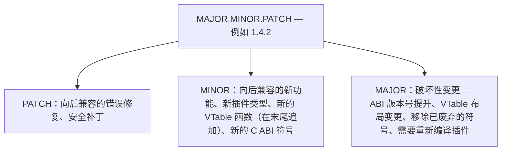
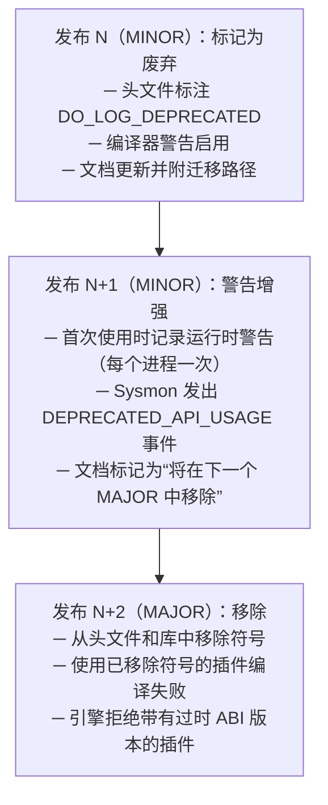
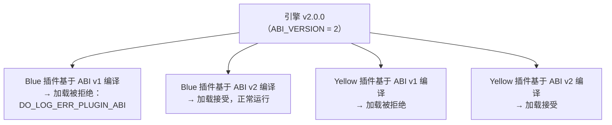
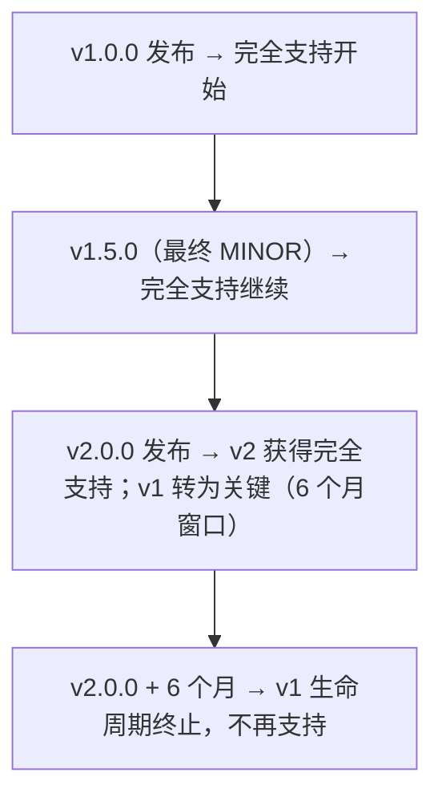

# DoLogger 版本与废弃策略

> 🌐 **语言 / Language**: [中文](VersioningAndDeprecation.md) | [English: DoLogger Versioning & Deprecation Policy](../../en_US/guides/VersioningAndDeprecation.md)

> **版本**: v0.1.0 | **最后更新**: 2026-08-12 | **目标受众**: 插件开发者、核心贡献者、集成者
>
> **用途**: 本文档定义 DoLogger 项目的版本方案、ABI 兼容性保证、废弃流程及迁移预期。本文档是确定每个发布类型允许哪些变更以及用户应如何规划升级的权威参考。
>
> **阅读路径**: 所有插件作者和集成者应阅读[语义化版本](#语义化版本)和[废弃流程](#废弃流程)。核心贡献者还应阅读 [ABI 兼容性保证](#abi-兼容性保证)和[发布流程](#发布流程)。管理插件集群的运维人员应从[插件兼容性](#插件兼容性)开始。

## 目录

1. [语义化版本](#语义化版本)
2. [ABI 兼容性保证](#abi-兼容性保证)
3. [废弃流程](#废弃流程)
4. [插件兼容性](#插件兼容性)
5. [迁移指南](#迁移指南)
6. [发布流程](#发布流程)
7. [支持的版本与生命周期终止](#支持的版本与生命周期终止)

---

## 语义化版本

DoLogger 遵循**语义化版本 2.0.0**（`MAJOR.MINOR.PATCH`）。版本号编码了每个发布中变更的范围和影响。

### 版本号格式



### 各级别版本号的含义

**表 1：版本变更影响**

| 级别 | ABI 兼容？ | 插件需重新编译？ | 配置兼容？ | 风险等级 |
|:-:|:-:|:-:|:-:|:-:|
| PATCH | 是 | 否 | 是 | 最低 |
| MINOR | 是 | 否 | 是 | 低 |
| MAJOR | **否** | **必须** | 可能需要更改 | 高 |

### 按类型划分的变更示例

**PATCH（例如 1.4.1 → 1.4.2）：**

- 修复环形缓冲区消费者中的内存泄漏
- 纠正 CRC32C 计算边缘情况
- seccomp-bpf 规则中沙箱绕过的安全补丁
- 文档更新
- 不改变任何公共符号的内部重构

**MINOR（例如 1.4.0 → 1.5.0）：**

- 在现有 VTable 结构体的**末尾**添加新的 VTable 函数指针（向后兼容——现有插件该位置为 `NULL`）
- 添加新的 C ABI 函数（例如 `dologger_record_set_tags()`）
- 引入新的插件类型（例如插件类型 #10）
- 添加具有安全默认值的新配置键
- 不改变公共接口的性能改进
- 标记某个符号为废弃并附警告（仅在下一个 MAJOR 中移除）

**MAJOR（例如 1.x → 2.0.0）：**

- 移除已废弃的 C ABI 函数或 VTable 函数指针
- 更改任何 VTable 结构体的布局、大小或字段顺序
- 更改 `dologger_plugin_info_t`、`dologger_record_t` 或任何公共结构体的布局
- 更改任何 C ABI 函数或 VTable 回调的签名
- 提升 `DO_LOG_ABI_VERSION`
- 移除或重命名配置键，且不提供向后兼容别名

---

## ABI 兼容性保证

### ABI 契约

ABI 门禁确保插件和宿主基于兼容的 ABI 编译。引擎**拒绝加载**其 `abi_version` 与运行中引擎版本不匹配的插件。在 v0.1.0 的当前实现中，这是 `dologger_plugin_info_t` 的 `abi_version` 字段（对照 `CORE_ABI_VERSION`，v0.1.0 为 `0x000100`）；`plugin_query` 接收 `uint32_t core_abi_version` 作为参数。

```c
// 注：v0.1.0 的 dologger_core.h 中没有全局 DO_LOG_ABI_VERSION 宏；
// 每个插件在 PluginInfo.abi_version 字段声明其编译所基于的 ABI 版本
//（packed uint32，如 0x000100 = 0.1.0），并在 plugin_query() 中校验核心传入的版本。

dologger_plugin_info_t *plugin_query(uint32_t core_abi_version) {
    static dologger_plugin_info_t info = {
        .abi_version = 0x000100,   // 本插件面向的 ABI 版本
        // ...
    };
    // 生产插件应校验：if (core_abi_version > info.abi_version) return NULL;
    (void)core_abi_version;
    return &info;
}
```

### 同一 MAJOR 版本内的保证

**表 2：ABI 稳定性保证**

| 保证 | 描述 |
|:-:|:-:|
| **VTable 布局稳定** | 现有 VTable 字段保留其偏移量、大小和类型。新的可选函数指针可被**追加**（未更新插件的隐式默认值为 `NULL`）。 |
| **C ABI 符号仅可增加** | 可添加新的 `dologger_*` 函数。现有函数签名不变。不移除任何现有符号。 |
| **结构体字段顺序保留** | 公共结构体（`dologger_record_t`、`dologger_plugin_info_t`、`dologger_plugin_config_t`）不改变字段顺序或移除字段。新字段可在末尾添加。 |
| **错误码稳定** | 现有 `dologger_error_t` 值保留其数字码和语义含义。可在新范围内添加新码。 |
| **配置键稳定** | 现有 TOML 键保留其含义。以安全默认值添加新键。已废弃的键继续工作并附警告。 |

### 需要 MAJOR 版本提升的情况

以下任何情况触发 MAJOR 版本递增：

1. **VTable 结构体布局变更**——添加、移除或重新排序字段（在末尾追加可选函数除外）
2. **移除任何公共 C ABI 符号**——即使是已废弃的符号
3. **签名变更**——更改任何公共函数的参数类型、返回类型或调用约定
4. **结构体布局变更**——更改 `dologger_plugin_info_t`、`dologger_record_t` 或任何跨越 ABI 边界传递的结构体
5. **ABI 版本整数提升**——递增 `DO_LOG_ABI_VERSION`
6. **行为破坏性变更**——以可能破坏正确调用方的方式更改现有函数的文档化语义

### C ABI 稳定性承诺

C ABI 是 DoLogger 的**通用接口**。它被设计用于长期稳定性：

- **同一 MAJOR**：在同一 MAJOR 内的任何 MINOR.PATCH 上编译的宿主二进制文件和插件保证互操作。为 1.2.0 编译的插件可与运行 1.5.3 的宿主一起工作。
- **跨 MAJOR**：不支持。为 1.x 编译的插件将被 2.x 引擎以清晰的 `DO_LOG_ERR_PLUGIN_ABI` 错误拒绝。
- **Rust crate API**：`dologger-core` Rust crate 遵循相同的语义化版本规则，但可能在 MINOR 发布中有额外的源码级破坏（C ABI 是稳定性的锚点）。

---

## 废弃流程

DoLogger 遵循**三发布废弃周期**，给予插件作者和集成者足够的适应时间。

### 废弃时间线



### 废弃宏

（伪代码 — 示意废弃标注的写法；v0.1.0 头文件尚无 `DO_LOG_DEPRECATED` 宏，`dologger_record_set_field`/`dologger_tags_t` 也不存在。`__attribute__` 为 GCC/Clang 语法，MSVC 需 `__declspec(deprecated(msg))`）：

```c
// 在 C 头文件中将函数标记为废弃
#define DO_LOG_DEPRECATED(msg)  __attribute__((deprecated(msg)))

// 在 dologger_core.h 中的用法：
DO_LOG_DEPRECATED("请使用 dologger_record_set_tags() 替代——将在 v2.0 中移除")
int dologger_record_set_field(dologger_record_t *record,
                               const char *key,
                               const char *value);

// 替代它的配套函数：
int dologger_record_set_tags(dologger_record_t *record,
                              const dologger_tags_t *tags);
```

### 已废弃的配置键

当配置键被废弃时：

1. **MINOR N**：该键继续工作。启动时发出 `DEPRECATED_CONFIG_KEY` sysmon 事件，列出已废弃的键及其替代。
2. **MINOR N+1**：该键继续工作但发出 **WARN** 级别的 sysmon 事件。
3. **MAJOR**：该键被移除。配置验证器以 `DO_LOG_ERR_CONFIG_PARSE` 拒绝并附清晰的错误消息，指明替代键。

```toml
# 示例：已废弃键的迁移
# 旧（在 1.3 中废弃，在 2.0 中移除）：
sink_type = "console"

# 新（自 1.3 起）：
[sinks.console]
type = "console"
```

### 废弃表

**表 3：当前生效的废弃项（截至 v1.0）**

| 已废弃的符号/键 | 引入版本 | 开始警告版本 | 计划移除版本 | 替代 |
|:-:|:-:|:-:|:-:|:-:|
| *（暂无——项目尚未达到 1.0）* | — | — | — | — |

---

## 插件兼容性

### ABI 版本变更时会发生什么

当引擎的 `DO_LOG_ABI_VERSION` 被提升时（MAJOR 发布），所有插件**必须**重新编译：



错误消息是明确的：

（示意 — 规划中的错误消息格式，非实际输出）：

```text
[ERROR] 插件 'json-formatter'（v1.2.0）基于 ABI 版本 1 编译，
        但引擎要求 ABI 版本 2。
        请基于 dologger_core >= 2.0.0 重新编译插件。
```

### 插件版本 vs 引擎版本

插件有**自己**的独立版本（在 `manifest.toml` 中声明）。引擎版本和插件版本是分开的：

（示意 — 版本对照示例，非命令输出）：

```text
引擎：     2.1.0        （libdologger_core 的版本）
插件 A：   1.5.0        （json-formatter 的版本）
插件 B：   3.2.1        （kafka-sink 的版本）
```

兼容性仅由 `abi_version` 匹配决定——而非通过任何版本号的比较。

### `manifest.toml` 中的兼容性

插件在 manifest 中声明其引擎版本范围：

```toml
[compatibility]
min_engine_version = "1.0.0"     # 所需的最低 MAJOR.MINOR.PATCH
max_engine_version = "2.0.0"     # 排他上界（此 MAJOR 系列）
```

引擎在加载时验证：

| 条件 | 结果 |
|:-:|:-:|
| `engine_version >= min_engine_version` AND `engine_version < max_engine_version` | 插件加载 |
| `engine_version < min_engine_version` | 拒绝——引擎过旧 |
| `engine_version >= max_engine_version` | 拒绝——引擎过新（ABI 可能已变更） |

### 插件依赖版本管理

依赖其他插件的插件（例如依赖 `Formatter` 的 `Sink`）在 `manifest.toml` 中表达：

```toml
[dependencies]
requires_plugins = [
    { name = "json-formatter", version = ">=1.0, <2.0" }
]
```

版本约束使用 Cargo 风格的语义化版本范围。引擎在启动时验证依赖图，若约束不满足则快速失败。

---

## 迁移指南

### 迁移文档策略

每个 MAJOR 发布都附有一份迁移指南，发布在此目录中：

```text
docs/en_US/guides/migration/
├── v1-to-v2.md     # 从 1.x 到 2.0 的迁移指南
└── v2-to-v3.md     # 从 2.x 到 3.0 的迁移指南
```

每份迁移指南涵盖：

1. **ABI 变更**：VTable 布局变更、已移除的符号、重命名的函数
2. **配置迁移**：已废弃的键、重命名的段、新的必填字段
3. **插件变更**：插件作者必须更新什么（提供修改前后的代码示例）
4. **行为变更**：不同的运行时语义（例如默认丢弃策略变更）
5. **检查清单**：带验证命令的逐步升级流程

### 迁移模式

典型的迁移遵循以下模式：

```bash
# 1. 阅读目标版本的迁移指南
# 2. 更新引擎库
sudo apt install dologger-core=2.0.0

# 3. 基于新头文件重新编译所有插件
cargo build --release --manifest-path plugins/my-plugin/Cargo.toml

# 4. 验证新配置
dologctl config validate --config dologger.toml --strict

# 5. 运行测试套件
cargo test

# 6. 先灰度部署，然后全量上线
```
### 向后兼容性承诺

DoLogger 承诺以下向后兼容性窗口：

**表 4：兼容性窗口**

| 组件 | 兼容性窗口 | 策略 |
|:-:|:-:|:-:|
| C ABI | 直到下一个 MAJOR | 在同一 MAJOR 系列内无破坏性变更 |
| 配置文件 | 直到下一个 MAJOR | 已废弃的键在下一个 MAJOR 之前继续工作 |
| WORM 文件格式 | 无限期 | 新引擎能够读取旧的 WORM 文件 |
| SIF 二进制格式 | 无限期 | 新引擎能够解析旧的 SIF 记录 |
| 插件 VTable（核心类型 1-7） | 直到下一个 MAJOR | VTable 布局在同一 MAJOR 内稳定 |
| 插件 VTable（支持类型 8-9） | 直到下一个 MAJOR | VTable 布局在同一 MAJOR 内稳定 |

---

## 发布流程

### 发布节奏

| 发布类型 | 节奏 | 版本示例 | 产出物 |
|:-:|:-:|:-:|:-:|
| PATCH | 按需（安全：7 天） | 1.4.1 → 1.4.2 | 共享库、头文件、crates |
| MINOR | ~6-8 周 | 1.4.0 → 1.5.0 | 所有 PATCH 产出物 + 发布说明 |
| MAJOR | ~12-18 个月 | 1.x → 2.0.0 | 所有 MINOR 产出物 + 迁移指南 |

### 预发布标签

预发布版本遵循语义化版本预发布约定：

（示意 — 预发布标签示例，非命令输出）：

```text
2.0.0-alpha.1      ← v2.0 的第一个 alpha
2.0.0-beta.1       ← v2.0 的第一个 beta
2.0.0-rc.1         ← 第一个候选发布版
2.0.0              ← 稳定发布
```

预发布版本**不受** ABI 稳定性保证覆盖。ABI 可能在 `2.0.0-alpha.1` 和 `2.0.0-alpha.2` 之间变更。

### 发布检查清单

每个发布必须通过：

- [ ] 所有单元测试在 Linux（x86\_64、aarch64）、macOS（x86\_64、aarch64）、Windows（x86\_64）上通过
- [ ] `cargo bench` 无超过 5% 的回归
- [ ] `cargo deny check` 通过（许可证、安全通告、禁用、源）
- [ ] `cargo audit` 报告零未修补漏洞
- [ ] `cargo clippy` 带 `--deny warnings` 通过
- [ ] 所有 15 项安全测试通过（参见[安全白皮书](SecurityWhitepaper.md#已实现的安全测试共15项)）
- [ ] 插件 ABI 兼容性测试：引擎加载来自上一个 MINOR 的插件
- [ ] 配置向后兼容性测试：上一版本的配置无错误解析
- [ ] 仅 MAJOR：迁移指南已编写并审查

### Git 标签约定

```bash
# 标签遵循以下模式：
git tag -a v1.4.2 -m "Release v1.4.2 — CVE-2026-XXXXX 安全补丁"
git tag -a v1.5.0 -m "Release v1.5.0 — 新增内置 sink"
git tag -a v2.0.0 -m "Release v2.0.0 — ABI 版本 2，请参阅迁移指南"
```

---

## 支持的版本与生命周期终止

### 支持策略

**表 5：版本支持矩阵**

| 版本轨道 | 支持级别 | 安全补丁 | Bug 修复 | 生命周期终止 |
|:-:|:-:|:-:|:-:|:-:|
| 最新 MAJOR（N） | **完全** | 是 | 是 | — |
| 上一个 MAJOR（N-1） | **关键** | 仅安全 | 否 | N 发布后 6 个月 |
| N-2 及更早 | **无** | 否 | 否 | N 发布时立即 |

### 支持时间线示例



### 1.0 之前策略

在 1.0.0 发布之前，项目处于**开发阶段**。适用以下修改后的规则：

- MINOR 版本提升（0.1.0 到 0.2.0）**可能**包含破坏性变更——将其视为 MAJOR 提升
- ABI 版本可能在任一 MINOR 发布中变更
- 废弃流程可能缩短或跳过
- 在此阶段所有用户应锁定到确切的版本

第一个稳定发布（1.0.0）将标志着完全兼容性保证的开始。

### 报告兼容性问题

如果您遇到违反此策略的兼容性问题，请提交 Bug 报告并附：

```bash
dologctl version
dologctl about --output json > compatibility-info.json
```

附加诊断存档并描述：
1. 引擎版本（`dologger_version()` 输出）
2. 插件版本和 ABI 版本
3. 预期行为 vs 观察到的行为
4. `dologger_internal.log` 中的任何错误消息

通过项目的问题追踪器以 `compatibility` 标签报告兼容性问题。
